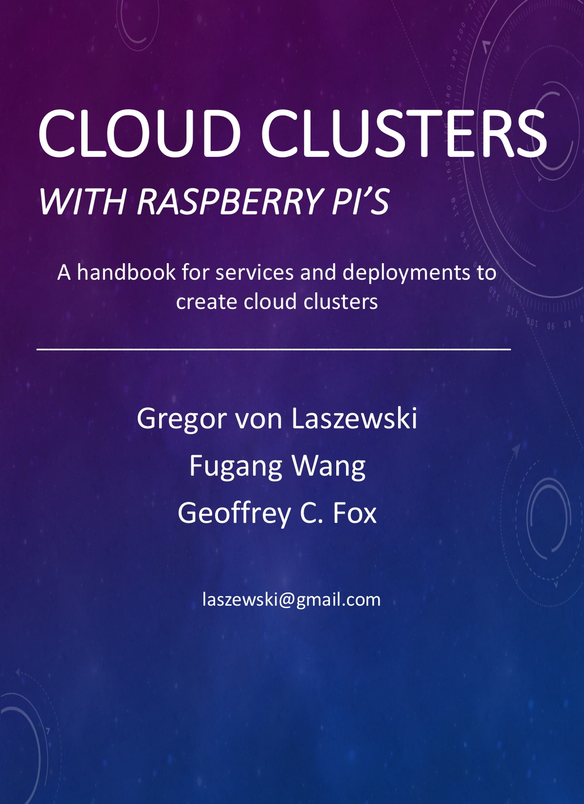
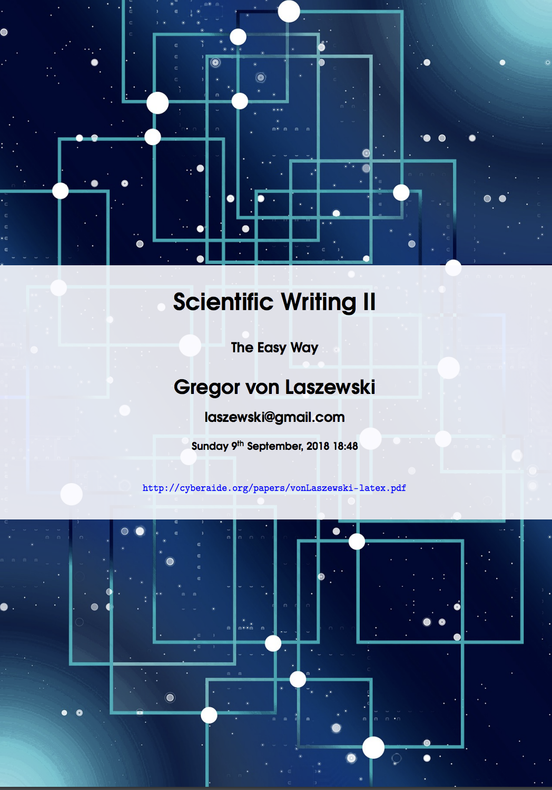

# Publications for classes

:information_source: ePubs are best read on MacOS with ibooks, on Windows with Microsoft Edge, on Linux with Calibre

Link |  Class | Description
|------ | --- | -------------
[](vonLaszewski-cloud.epub?raw=true)| E516, E416, B649 | Evolving Lecture notes for class E516, E416, B649
[](vonLaszewski-pi.epub?raw=true)| E516, E416, B649 | Evolving Lecture notes for Raspberry PI Clusters for class E516, E416, B649
[](vonLaszewski-bigdata-application.epub?raw=true)| e534, I523, I423 | Evolving Lecture notes for class e534, I523, I423
[](https://github.com/cloudmesh/technologies/blob/master/vonLaszewski-cloud-technologies.epub?raw=true)| e534, I523, I423 | Cloud Technologies
[](vonLaszewski-writing-1.epub?raw=true)| all | Scientific Writing I for all classes
[](http://cyberaide.org/papers/vonLaszewski-latex.pdf)| all | Scientific Writing II for all classes
[](vonLaszewski-communicate.epub?raw=true)| all | Class Communication Services (update version can be found in the Lecture notes for the class)
[:books: Bibliographies I](bib) | all | BibTeX files directory I as used in all but the Cloud Technologies ePub
[:books: Bibliographies II - Cloud Technologies](https://github.com/cloudmesh/technologies/tree/master/bib) | all | BibTeX files directory II  as used in the Cloud Technologies ePub


# Cloudmesh community ePup Publication Framework

:warning: This section is only for those that like to generate their own ePubs based on our framework

ePubs can be easily created as they are build on a template. E good template is provided in the directory `cloud`

You simply copy that directory to your own directory. let us assume we call it `mybook`. Note that we use all loer case letters to avoid complications while misspelling the directory

You will have to edit now the file called Makefile and chamge the value `BOOK_516` to `BOOK_MYBOOK`. Let us assume you use emacs

```bash
$ emacs mybook/Makefile
```

Now you have to edit the file `chapters.yml` in the book directory and add chapters you like to include in your ePub.
See some of the examples we provided for other ebooks. It is now important that you use the same name we used before, e.g. `BOOK_MYBOOK`. Thus create in the yaml file a list of chapters for it.

```bash
$ emacs chapters.yml
$ yamllint chapters.yaml
```

To avoid any yaml errors, just use `yamllint` to check your file and correct all errors and warnings.

An example would be

```yaml
- BOOK_MYBOOK:
     - chapters/linux/refcards.md
```

To compile the book, you first have to generate an initial Makefile, which you can do with the command

 ../bin/manifest-parser.py dep BOOK_MYBOOK > Makefile.BOOK_MYBOOK

Now the framework is all set up and you can add your new chapters in `./chapters` while refering to them in the `chapters.yaml` file for your book

To create the book simply do the following

```bash
$ cd mybook
$ make
```

To view it say

```bash
$ make view
```

## Installation Instructions

This document is for the ebooks only

The documentation is very easy to create as it relies on pandoc. To
install it you can do the following:

Windows 10, Debian, Ubuntu, and derivatives use package published at

* <https://github.com/jgm/pandoc/releases/latest>

Mac OSX use homebrew and node

```bash
$ brew install node.
$ brew install graphviz
$ npm install --global mermaid-filter
$ brew install pandoc
$ brew install pandoc-citeproc
$ npm install --global pandoc-index
```

Once you have installed pandoc you can create the book with our simple
`Makefile` contained in the source directory. Simply clone the source
and call make in the source dir

```bash
$ mkdir -p ~/github/cloudmesh-community
$ cd ~/github/cloudmesh-community
$ git clone https://github.com/cloudmesh-community/book.git
$ cd book
$ pip install -r requirements
```

Then chose the book you like to compile. Let us assume the book is in
the cloud directory. Than you can create it with

```
$ cd cloud
$ make images
$ make
```

In case you like to compile another book just replace the `cloud` we used in the previous step with the book you like. This includes at this time

* `big-data-applications`
* `cloud`
* `communicate`
* `writing-1`

Draft bpooks include

* `cluster`
* `pi`


## LaTeX

The directory `latex` is different and it requires latex to be installed as a PDF is created that showcases you how to efficeintly use LaTeX

In case you need to use latex you need to download the full
version. For OSX this is

* <http://www.tug.org/mactex/mactex-download.html>


## Cabal

notes only at this time

mkdir pandoc
cabal update
cd pandoc
cabal sandbox init
cabal install pandoc-crossref
cabal install pandoc-citeproc
