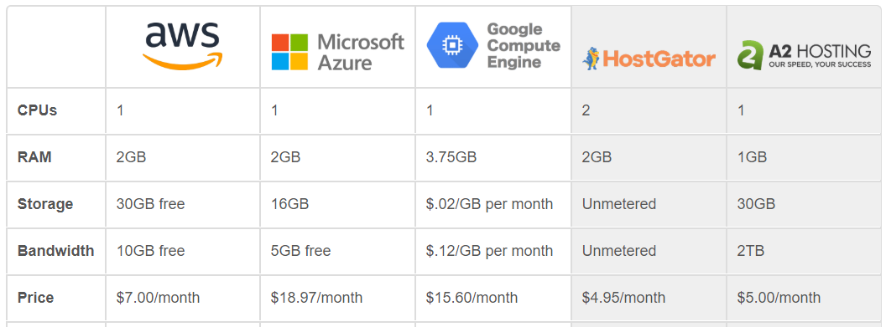
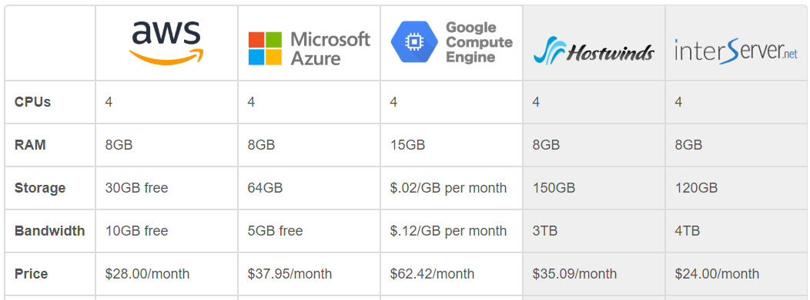
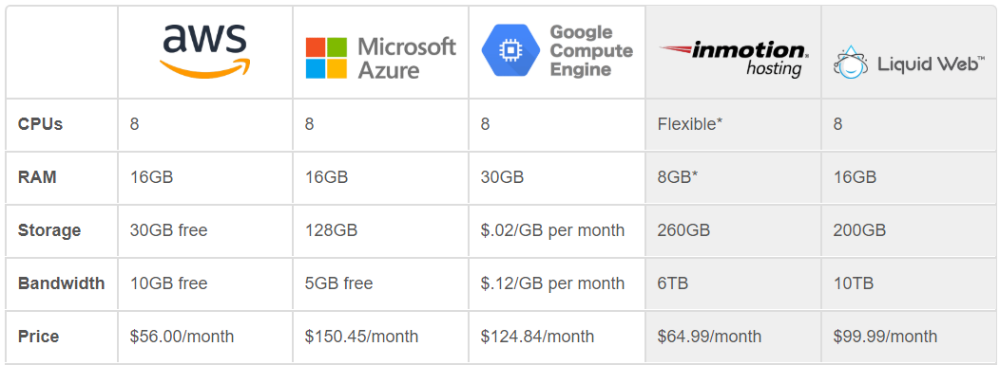
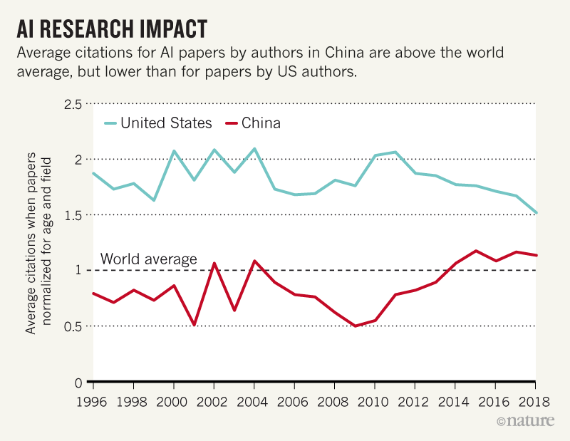

# AI Cloud Overview sp20-516-246 Rhonda Fischer and Sara Lam

## Why AI in the cloud
A cloud provider is not necessary for building a machine learning solution
.  There are open source machine learning frameworks, such as TensorFlow, MXNet, and CNTK that companies can run on their own hardware. However, companies may run into issues as they scale their workloads.  Also, there are barriers to entry for bringing machine learning capabilities to enterprise applications. The specialized skills required to build, train, and deploy machine learning models and the computational and special-purpose hardware requirements add up to higher costs for labor, development, and infrastructure.

Cloud computing can solve both startup and scaling issues and the leading public
 cloud platforms are on a mission to make it easier for companies to leverage
  machine learning capabilities to solve business problems without the full tech
   burden [@sp20-516-246-AIServ].

Apart from offering the APIs and infrastructure, cloud providers are
competing to build tools for data scientists and developers. These tools are
tightly integrated with the data platform and compute platform, which
indirectly drives the consumption of VMs, containers, storage, and
databases [@sp20-516-246-AIRise].

While enterprises are enthusiastic about the potential of AI, they also
recognize that successful deployment of the technology poses significant
challenges. In a recent survey, 91 percent of respondents anticipated
barriers to AI adoption. More specifically, 40 percent didn't believe they
had the right infrastructure to support AI [@sp20-516-246-AICloudBoost]. 

According to Datamation, utilizing cloud AI services offers a number of
 benefits [@sp20-516-246-AICloudBoost]:
1. **Access to Advanced Compute Infrastructure** — Machine learning and neural networks require massive amounts of parallel processing power. To meet that need, AI applications must run on systems with advanced graphic processing units (GPUs). However, those systems can be very expensive — making them somewhat impractical for pilot projects. Using a cloud service allows enterprises to get the compute resources they need for AI initiatives while paying only for what they use. And if a pilot project doesn't pan out, they can easily shut it down without being saddled with expensive hardware they no longer need.

2. **Scalability** — When enterprises experience success with their initial AI efforts, they often want to expand those projects. The cloud makes it easy to scale those projects up or down as demand warrants. And the cloud model makes it easy for companies to broaden the use of the technology to additional departments and business units within the organization.

3. **Ease of Use** — Competition is fierce for developers and data scientists who understand artificial intelligence technology. As a result, salaries are very high for these professionals. Many organizations find that they can't find or can't afford AI talent, and developing AI skills among their existing workforce takes time. However, the major cloud vendors are meeting this need by rolling out AI services that simplify both the process of creating and training machine learning models and the process of adding speech, image recognition or natural language processing to applications. That, in turn, helps companies overcome any lack of internal AI talent.

4. **Access to the Latest Technology** — The Teradata survey respondents rightly pointed out that AI technology is still young and changing every day. Because of their AI research and development investments, the major cloud vendors are rolling out new AI capabilities on a regular basis. If an enterprise were to invest in AI hardware and software for its own data centers, they may find that their technology quickly becomes obsolete. But using the AI cloud services allows organizations to stay at the cutting-edge of advancements.

5. **Low Costs**— This article has already mentioned the financial advantages of cloud-based AI several times, but it bears repeating. The cloud computing model allows organizations to pay only for the computing resources that they are using for their AI application deployments. That eliminates the need for costly upfront capital expenses, allows organizations to convert their infrastructure costs to operational expenses, and often reduces the overall price tag for artificial intelligence projects.

## Types of Cloud AI services and how they are grouped
Cloud AI services are growing; as a result the industry
separates Cloud AI services into subcategories.  Following are several grouping
approaches.

AI as a service makes one or more of these types of artificial
intelligence technologies available as a cloud service. According to
Datamation, AI as service products generally fall into
the following categories within the market [@sp20-516-246-AICloudBoost
], summarized in @fig:sp20-512-246-AICloudBoost.

* **Bots and digital assistants**:For many people, the first thing that comes to
 mind when they hear the phrase "artificial intelligence" is a digital assistant like Apple's Siri, Microsoft's Cortana or Amazon's Alexa. These tools use natural language processing technology to carry on conversations with users, and many also use machine learning to improve their skills over time. Many enterprises want to add similar functionality to their products and websites. In fact, according to IDC, the AI use case that saw the most spending in 2017 was automated customer service agents. But creating your own bot from scratch is a monumental undertaking. As an alternative, several vendors offer bot platforms as a service. Organizations train the bots with their own data and then use them to answer simple questions, freeing up human customer service agents for more complicated tasks.
* **Cognitive computing APIs**:An application programming interface (API
) makes it easy for developers to incorporate a technology or service into the application or products they are building. The leading cloud vendors all offer an assortment of APIs for that allow developers to add a particular type of AI to their applications. For example, a developer that wants to make a photo-sharing app might use a facial recognition API to give the app the ability to identify individuals in pictures. Thanks to the API, the developer doesn't have to write the facial recognition code from scratch or even thoroughly understand how it works. He or she uses the API to allow the app to access that functionality in the cloud. APIs are available for a wide variety of different purposes, including computer vision, computer speech, natural language processing, search, knowledge mapping, translation and emotion detection.
* **Machine learning frameworks**: These tools allow developers to create
 applications that can improve over time. Generally, they require developers or data scientists to build a model and then train that model using existing data. Machine learning frameworks are particularly popular in applications related to big data analytics, but they can be used to create many other types of applications as well. Accessing these frameworks in the cloud can be easier and less expensive than setting up your own hardware and software for machine learning tasks.
* **Fully managed machine learning services**: Sometimes organizations want to
 add machine learning capabilities to an application, but their developers or data scientists lack some of the skills or experience necessary. Fully managed machine learning services use templates, pre-built models and/or drag-and-drop development tools to simplify and expedite the process of using a machine learning framework.
 
The "holy grail" of AI as a service would be to create a general artificial intelligence that could be accessed as a cloud service. A general artificial intelligence is a computer system that can think and communicate in all the same ways that humans can. Most experts believe that researchers are still many years away from creating general AI, if they will ever be able to do so at all.

![Figure AI Service Vendors [@sp20-512-246-AICloudBoost]](images/aiservicevendors.PNG){#fig:sp20-512-246-AICloudBoost width=5in}

Cloud Academy groups a little differently as shown in @fig:sp20-516-246-AIServ
 [@sp20-516-246-AIServ].

![Figure AI Services Groupings [@sp20-516-246-AIServ]](images/aiservicevendors2.PNG){#fig:sp20-516-246-AIServ width=5in}

## Choosing cloud based AI services and providers
### Datamation groups by the service provider and what they do best [@sp20-516-246-TopCloud].  
1. **IBM** Watson:	Largest and most diverse set of AI services; established and mature program in Watson; IBM Global Services is unmatched in consulting.
2. **Amazon** Web Services:	Rapidly maturing set of services based around its popular consumer products; runs on AWS, the top cloud service provider
3. **Microsoft** Azure:	Built on Microsoft legacy software; Microsoft’s strong history supporting developers
4. **Google** Cloud AI:	Top performance thanks to custom chips to accelerate AI and ML; specializing in machine learning.
5. **Oracle** AI:	Built on Oracle’s legacy line of business apps, so you can add AI to your Oracle environment.
6. **Salesforce**:	Easy and rapid development of apps; adds AI to Salesforce’s comprehensive CRM offerings.
7. **Baidu**:	Mirrors Google in terms of features and specialized accelerator chips.

### Appanion also compares the platform and strategy of AI services providers, and lists their strengths based on what is needed [@sp20-516-246-AI-cloud-vendors].

1. **Google** Cloud Services: A flexible solution to start off with, with the opportunity to scale and use a vast number of highly mature machine learning tools.
2. **Microsoft** Azure: Using Microsoft technology stack, integrate analytics solutions but still provide extensive AI and machine learning possibilities.
3. **Amazon** Web Services: When voice integration or natural language processing is your focus or performance and API connectivity are central issues.
4. **IBM** Watson: Provides a user-friendly interface with full control over the data flows and still cutting-edge capabilities in the fields of artificial intelligence.
5. **Salesforce** AWS integrations: For companies that already use Salesforce already for enterprise apps or CRM and want to build applications around customer data.
6. **SAP** Cloud Platform: For companies using SAP as the ERP system, Business Objects, etc. 

### Cloud price comparison

HostingAdvice.com provides a simple comparion pricing of the top 3 cloud providers for small, medium and large enterprises [@sp20-516-246-pricing]. 

#### AWS vs. Azure vs. Google Cloud — For Beginners & Startups

@fig:sp20-516-246-pricing-small.PNG shows cloud pricing for beginners & startups

{#fig:sp20-516-246-pricing-small.PNG}

#### AWS vs. Azure vs. Google Cloud — For Mid-Size Companies

@fig:sp20-516-246-pricing-midsize.PNG shows cloud pricing for mid-size companies

{#fig:sp20-516-246-pricing-midsize.PNG}

#### AWS vs. Azure vs. Google Cloud — For Enterprises

@fig:sp20-516-246-pricing-large.PNG shows cloud pricing for enterprise

{#fig:sp20-516-246-pricing-large.PNG}

AWS is generally is the provider of lowest costs based on this simple comparison.  The actual costs on cloud instances will depend on the instance types you choose, the regions you run in, whether you need local disk for your instances, and your use of discounts.  Cloud providers have calculators on their sites to calculate pricing based on your scenario and AI services you choose.

## Challenges to overcome when adopting AI in the cloud

Companies face numerous challenges when adopting AI in the cloud [@sp20-516-246-challenges].

* Focus on business needs - when CIOs only focus on getting the latest technology, but lack the understanding of business needs and strategy, they acquire AI and cloud but do not know what business questions they can answer [@sp20-516-246-challenges2].

* Integration - with early success of pilot programs and proof-of-concept use cases, it is often challenging to deploy AI services in the enterprise workflow, and integrate with systems and processes to benefit users.  

* Privacy and security concerns - with so much personal and sensitive data in the cloud, there is a risk that everything about a person or entity can be known and misused.  AI can be manipulated to create false information and misguide decisions. 

* Data quality - AI in the cloud operates best when data quality is abundant and quality is high.  However, data is often siloed, incomplete, with poor quality.  Such data could cause incorrect insight.  Companies need to first have a data strategy and infrastructure before adopting AI in the cloud.

* Talent gap - while packaged AI services on the cloud reduce the need for specialized development skills, these solutions are available to everyone so they do not help a company gain a competitive advantage.  To differentiate from competitors, companies need to use AI development services to develop customized solutions.  This will require at least some experts in the company.

## Future of AI and Cloud

### Cloud & AI fueling each other's growth [@sp20-516-246-fuel]

The global IaaS market is forecast to reach USD 56.05 billion by 2020 at a CAGR of 29 percent, with the largest market share retained by North America. The Asia-Pacific (APAC) market is expected to see the highest annual growth rate of 35.8 percent by virtue of the rapidly-rising technology adoption in Australia, India and China.

The Middle East market, which presently stands at USD 2.66 billion, is expected to see a three-fold rise to reach a market size of USD 8.79 billion in the next five years. While Qatar will be at the forefront in market adoption, other countries such as Bahrain, Egypt, Iran, Israel, Kuwait, Oman and Turkey are expected to expand their market reach rapidly buoyed by the growth of cloud and analytics, IoT, Bring Your Own Device (BYOD) and other cloud-dependent technologies.

As the technologies rapidly evolve, AI and cloud will not just be indispensable but also mutually interdependent, with the development of cloud technology having a direct bearing on the developments in AI capabilities.

### Every industry is vulnerable for disruption by AI and cloud

Companies who will be successful are those who adopt data and analytics and apply them into workflows, modernize architecture and applications to improve productivity, and are able to measure the result on investment.  Companies need to use data across enterprise applications and across clouds.  Connectors are being built to have virtual access to multi-cloud environment.  Companies will have to consider what platforms to engage with [@sp20-516-246-cloud2020].

### China is becoming the leader

China set an ambitious goal to become the world leader in AI by 2030.  China invests heavily in exploratory projects, start-ups and academic research in AI.  The plan covers industries from homeland security, surveillance, military, to medicine, agriculture and manufacturing.  Several drivers will help this plan become successful.  First, the large amount of data.  China has the world's largest population.  Data is generated by devices, commercial transactions, industrial productions, surveillance cameras, etc.  Recently, the government required all mobile phone users registering new SIM cards to submit facial recognition scans [@sp20-516-246-facialrecognition].  Many social media sites also require users to sign up with real name identify via phone numbers.  These practices raise security concerns but accumulate large amount of data to feed AI.  

China is attracting bright talents to go back to the homeland after studying abroad.  It is making significant improvements in fundamental research.  The authorship in the world's top 10 publications increased to 26.5% in 2018, very close to the 29% by the U.S.  Average citations are above the world average and increasing, while these numbers by the U.S. have been decreasing.  

@fig:sp20-516-246-AI_resesarch_impact.png shows AI research impact by China and the U.S.

{#fig:sp20-516-246-AI_resesarch_impact.png}

China also has world-leading companies in computer vision, speech recognition and natural language processing.  But it is lagging behind the U.S. in core techonologies such as open-source platforms, e.g. Tensorflow and Caffe, made by U.S. industry and academia.  It is also behind in AI hardware such as semiconductor chips.  It can take China 5 to 10 years to catch up with the U.S. in fundamental research and technologies.  With its ambitions, strategy and investments, it will reach the goals [@sp20-516-246-china].

### Multicloud and hybrid cloud are the trend

Multicloud is subscription to multiple cloud services such as AWS, Azure.  It is a strategy to avoid dependency on a single provider, allowing you to switch provider later more easily due to changes in services and pricing.  By using multiple providers, you also can choose each provider's services based on your use case, applications and workloads.  Multinational organizations can find optimal choice for each region.  Each business unit can meet their different demands.  Multicloud also has disadvantages, including complexity in securing data and prevent leakage, losing discount perks from a single provider, and complexity in managing the multicloud environment.  Companies will need the resources and skills to manage cost, performance, security and plan capacity across multiple providers [@sp20-516-246-multicloud]. 

Hybrid cloud is a computing environment that combines a public cloud and a private cloud by allowing data and applications to be shared between them.  As the cloud computing era matures, many companies find public cloud or private cloud alone does not meet their needs. Hybrid cloud has the many advantages.  Companies can maintain their workload in private cloud but has the ability to spontaneously handle spike in demand, pay for public cloud only when needed.  You get a centralized private infrastructure on premise, and latency is reduced to improve computational efficiency.  Hybrid cloud also has disadvantages, such as a high initial setup cost, the need for expert IT resources for deployment and ensure data security, risk of cloud compatability across on-premise and public clouds.  These concerns will need to be addressed in a hybrid cloud strategy [@sp20-516-246-hybridcloud].

### Growth of the edge

Edge computing brings computation and data storage closer to the location where it is needed, to improve response time and save bandwidth [@sp20-516-246-edge].  The benefit of edge computing is speed and cost savings.  Take voice assistant as an example, when you speak to the VA, if it has to send data thousands of miles away to a data center, process the request, and send response back, the latency is high [@sp20-516-246-edge2].  Edge computing relies on the edge computing hardware, or even your device for processing and give you the answer much faster.  An edge computing gateway can process data from an edge device, send on relevant data through the cloud, reducing bandwidth needs.  Real-time AI applications, e.g. self-driving cars, smart cities, facial recognition, will benefit from the fast processing and response from edge computing [@sp20-516-246-edge3]. 

Forrester predicts that the edge cloud market will grow by at least 50% in 2020.  Industry players including major cloud providers, 5G providers, platform software providers are working to provide infrastructure-as-a-service (IaaS) on distributed edge computing infrastructure.  The expansion of edge computing is driven by growing maturity of edge platforms, the supporting technologies such as 5G and Wi-Fi 6 connectivity, and increasing use cases of analytics and machine learning [@sp20-516-246-edge4].

### Culture will make a difference in successful adoption of AI and cloud

Future of work is a holistic human-machine relationship.  Companies move the fastest when they create strong culture.  Too many companies just focus on technology but not leading people.  This creates an atmosphere of distrust and fear especially when the technology is intrusive.  It is important for employees to understand the roles of AI and people, what the impacts are, and how they can upskill, reskill and contribute.  A culture that embraces change and drives change is essential for the success of digital transformation [@sp20-516-246-cloud2020].

