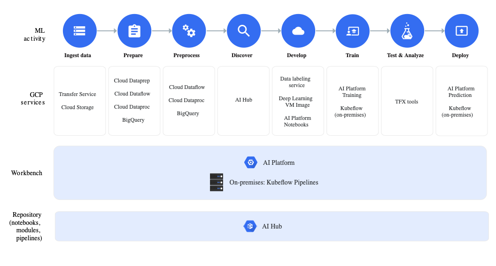

# Google Cloud AI Platform Pipelines

Often AI is being taught to users while using jupyter notebooks.
However, they do not take into consideration the needs to bring the AI
services into a production environment that deals with scalable services
exposed in the cloud.

One of the other issuse using notebooks in for example data science
education is that studnets no longer use or understand a full progarm
design with classes and software engeneeiring methods outside the
definition of functions, leading to solutions that do not go beyond
simple experiments. (need to verify if google pipeline will help here).

The google cloud AI platform pipeline will address ome of these issues.

According to Google, "Cloud AI Platform Pipelines provides a way to
deploy robust, repeatable machine learning pipelines along with
monitoring, auditing, version tracking, and reproducibility, and
delivers an enterprise-ready, easy to install, secure execution
environment for your ML workflow" [1].

It is integrated in Googles Cloud Console allowing for easy instalation,
and integration with google services such as BigQuery [?], Dataflow [?], AI
Platform Training and services [?], cloud functions [?] and more [?] [1]. 

Benefits include ease of instalation through the Google cloud console.
THis is an important feature as many data scientists no longer posess
the ability to download and install classical computer programs on their
computers (at least not at IU). The services are installed in a Google
Kubernetes Engine [?] that is automatically created if not available.
Furthermore access can be enabled through authentication to team members.

Veriy important is the multitude in access to it thorugh 

* REST 
* [Pipeline SDK](https://cloud.google.com/ai-platform/pipelines/docs/connecting-with-sdk)
* [Notebooks](https://cloud.google.com/ai-platform-notebooks)

The Architecture image released by Google explains best how thes
components fit together as part of the google ecosystem (see @fig:google-ai-pipeline-ecosystem).

{#fig:google-ai-pipeline-ecosystem}

## Kubeflow

The Google AI Pipeline is tightly integrated with Kubeflow [2].

The important part to note is that kubeflow provides a convenient
mechanism to create from python functions pipelined objects that can be
weaved together in python. As they are available in python, they can
naturally be integrated in jupyter notebooks. Kubeflow does assume the
availability of a kuberneters cluster which allows the use of kubeflow
an onay cloud provider, oncluding AWS, Azure and others. What Google AI
Platform provides is the ability to leverrage Google as provider witch
easy to generate backend infrastructure. The other point to make here is
that as we do run in the Google invraestructure other google services
can easily be integrated.

Kubeflow, via google has also started to put together an AI Hub, in
which pipeline templates can be stored, downloaded and reused by others.

* <https://aihub.cloud.google.com/u/0/s?category=pipeline>

At time of writing there were 640 AI pipelines available in the AI Hub.
We have not analyzed these pipelines on usability or applicability. The publishers include

Statsu March 15, 2020

Number | Publisher
------ | ---------
3 | Intel
60 | Google
1 | Pluto 7
0 | NVIDIA
0 | DeepMind

One of the convenient features in Kubeflow is that in addition to be
able to set up the workflows in Jupyter notebooks allowing aprogramming
style promoting literate programming, It includes a runtime flow visualization which comes in handy for time consuming jobs.

A screenshot copied from [3] is includes in @fig:kubeflow-graph.

## Refernces

[1] <https://cloud.google.com/blog/products/ai-machine-learning/introducing-cloud-ai-platform-pipelines>

[2] <https://www.kubeflow.org/>

[3] <https://www.kubeflow.org/docs/pipelines/pipelines-quickstart/>