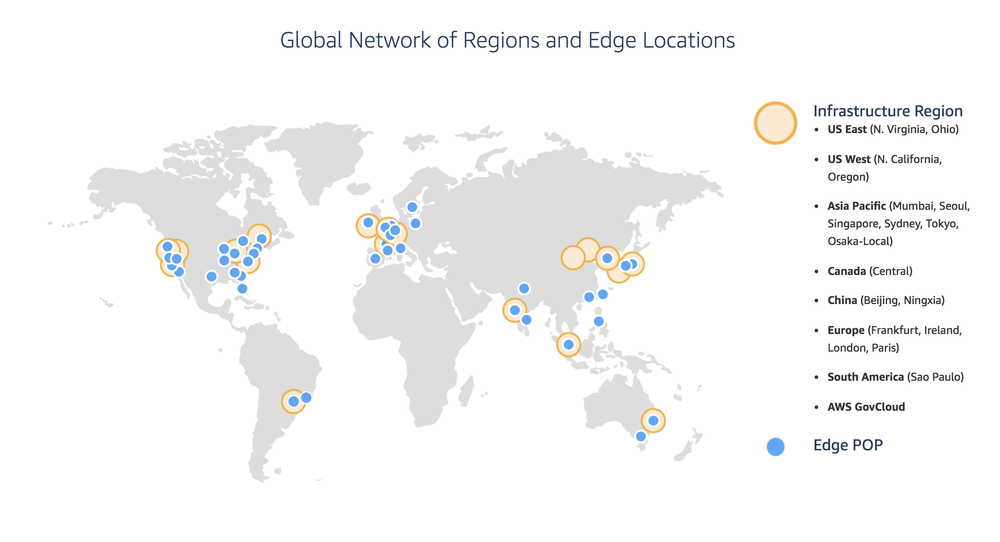
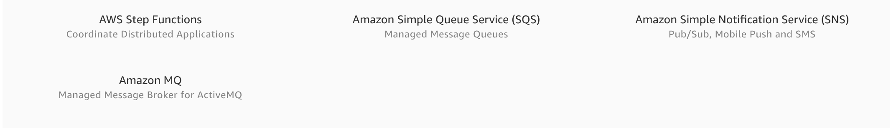

# Draft: Amazon Web Services
\label{s:aws}
\index{AWS}

## AWS Products

Amazon Web Services offers a large number of prodicst that are centered around their cloud services. These services have grown considerably over the years from the core 
offering realted to virtual machine (EC2) and datastorage (S3). An overview of them is provided by Amazon in the following document:

* <https://d0.awsstatic.com/whitepapers/aws-overview.pdf>

We list the product in screenshots from their Product Web page panel in Figure \label{F:aws-products}

\begin{figure}

\caption{AWS Products}
\label{F:aws-products}
\end{figure}

Service offerings are grouped by categories:

* Compute
* Storage
* Database
* Migration
* Networking and Content Delivery
* Developer Tools
* Management Tools
* Media Services
* Machine Learning
* Analytics
* Security and Identity Compliance
* Mobile Services
* AR and VR
* Application Integration
* Customer Engagement
* Business Productivity
* Desktop and App Streaming
* Internet of Things
* Game Development
* Software
* Aws Core Management

Within each category you have several products. When choosing products form AWS it is best to start with the overview paper and identify products that can be of benefit to you. For our 
purpose we focus on the traditional Compute and Storage offerings.

## Locations

## Compute

AWS offers a number of compute related services. 

## Serverless Computing with AWS Lambda

<https://aws.amazon.com/lambda/>

## Storage

### NoSQL with DynamoDB

* <https://aws.amazon.com/dynamodb/>

## App Integration

## Access from the Command Line

	aws s3 <Command> [<Arg> ...]
	aws ec2 <Command> [<Arg> ...]

* <https://aws.amazon.com/cli/>
* <https://docs.aws.amazon.com/cli/latest/reference/>

* EC2: <https://docs.aws.amazon.com/cli/latest/reference/ec2/index.html>
* S3: <https://docs.aws.amazon.com/cli/latest/reference/s3/index.html>

### S3

commands: cp, ls, mb, mv, presign, rb, rm, sync, website

## Access from python

### libcloud

* <https://libcloud.apache.org/>

### Boto

* <https://github.com/boto/boto3>