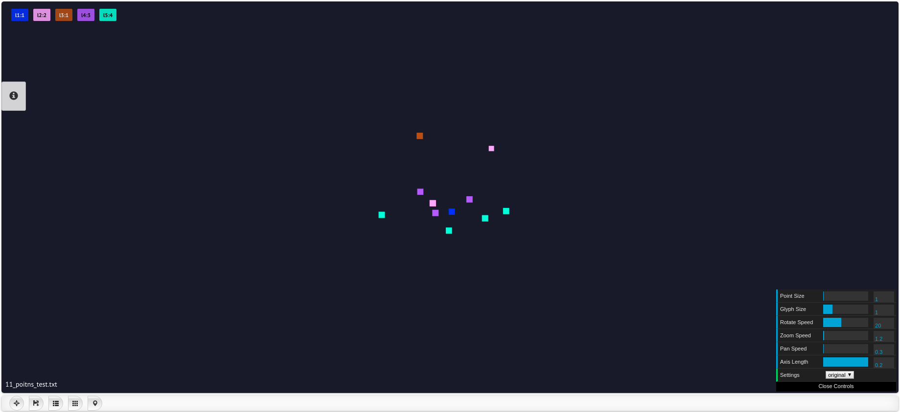
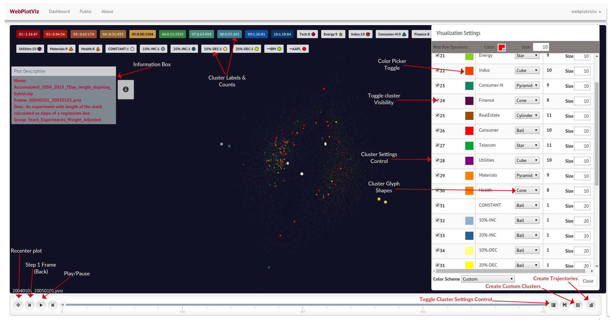
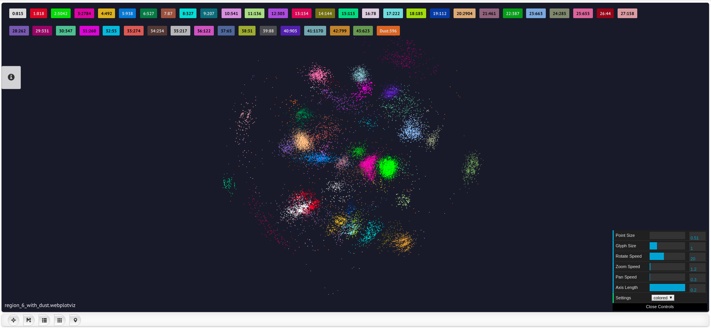
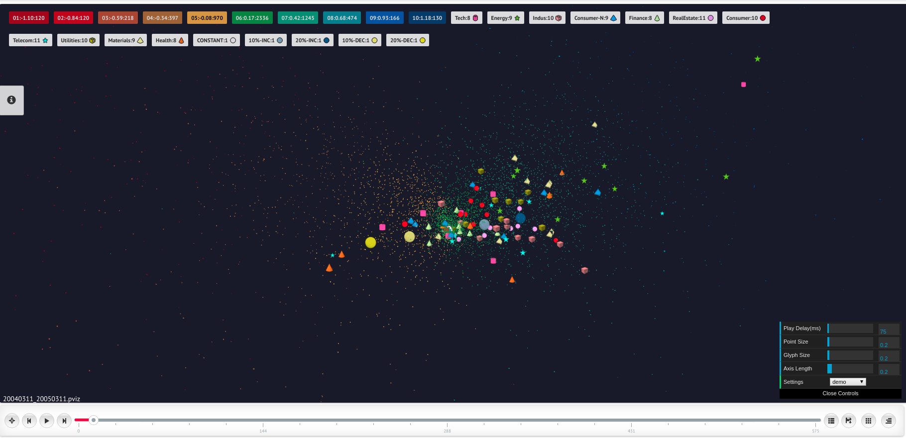

# WebPlotViz

WebPlotViz is a browser based visualization tool developed at Indiana University.
This tool allows user to visualize 2D and 3D data points in the web browser.
WebPlotViz was developed as a succesor to the previous visualization tool PlotViz
which was a application which needed to be installed on your machine to be used.
You can find more information about PlotViz at the [PlotViz Section](plotviz.md)

## Motivation

The motivation of WebPlotViz is similar to PlotViz which is that the human eye 
is very good at pattern recognition and can see structure in data. Although 
most Big data is higher dimensional than 3, all data can be transformed by 
dimension reduction techniques to 3D and one can check analysis like clustering 
and/or see structure missed in a computer analysis.

## How to use

In order to use WebPlotViz you need to host the application as a server, this
can be done on you local machine or a application server. The source code for 
WebPlotViz can be found at the git hub repo [WebPlotViz git Repo](https://github.com/DSC-SPIDAL/WebPViz). 

However there is a online version that is hosted on Indiana university servers
that you can access and use. The online version is available at [WebPlotViz](https://spidal-gw.dsc.soic.indiana.edu/)

In order to use the services of WebPlotViz you would need to first create a 
simple account by providing your email and a password. Once the account is 
created you can login and upload files to WebPlotViz to be visualized. 

## Uploading files to WebPlotViz

While WebPlotViz does accept several file formats as inputs, we will look at the
most simple and easy to use format that users can use. Files are uploaded as 
".txt" files with the following structure. Each value is separated by a space.

Index x_val y_val z_val cluster_id label

Example file: 

0  0.155117377  0.011486086  -0.078151964  1  l1\
1  0.148366394  0.010782429  -0.076370584  2  l2\
2  0.170597667  -0.025115137  -0.082946074  2  l2\
3  0.136063907  -0.006670781  -0.082583441  3  l3\
4  0.158259943  0.015187686  -0.073592601  5  l5\
5  0.162483279  0.014387166  -0.085987414  5  l5\
6  0.138651632  0.013358333  -0.062633719  5  l5\
7  0.168020213  0.010742307  -0.090281011  5  l5\
8  0.15810229  0.007551404  -0.083311109  4  l4\
9  0.146878082  0.003858649  -0.071298345  4  l4\
10  0.151487542  0.011896318  -0.074281645  4  l4

Once you have the data file properly formatted you can upload the file through
the WebPlotViz GUI. Once you login to your account you should see a Green
"Upload" button on the top left corner. Once you press it you would see a 
form that would allow you to choose the file, provide a description and select a 
group to which the file needs to be categorized into. If you do not want to
assign a group you can simply use the default group which is picked by default

Once you have uploaded the file the file should appear in the list of plots 
under the heading "Artifacts". Then you can click on the name or the "View" 
link to view the plot. Clicking on "View" will directly take you to the full
view of the plot while clicking on the name will show and summary of the plot 
with a smaller view of the plot (Plot controls are not available in the smaller
view). You can view how the sample dataset looks like after uploading at the
following link. @fig:webpviz-11 shows a screen shot of the plot.

[11 Points WebPlotViz plot](https://spidal-gw.dsc.soic.indiana.edu/public/resultsets/2083856374)

{#fig:webpviz-11}

Users can apply colors to clusters manually or choose one of the color schemes
that are provided. All the controls for the clusters are made available once
your clock on the "Cluster List" button that is located on the bottom left
corner of the plot (Third button from the left). This will pop up a window that
will allow you to control all the settings of the clusters.

## Features

WebPlotViz has many features that allows the users to control and customize 
the plots, Other than simple 2D/3D plots, WebPlotViz also supports time series
plots and Tree structures. The examples section will show case examples for each
of these. The data formats required for these plots are not covered here.

{#fig:webpviz-labled}

Some of the features are labeled in @fig:webpviz-labled. Please note that @fig:webpviz-labled 
shows an time series plot so the controls for playback shown in the figure are not
available in single plots.

Some of the features are descibed in the short video that is linked in the home
page of the hosted WebPlotViz site [WebPlotViz](https://spidal-gw.dsc.soic.indiana.edu/)

## Examples

Now we will take a look at a couple of examples that were visualized using 
WebPlotViz. 

### Fungi gene sequence clustering example

The following example is a plot from clustering done on a set on fungi gene 
sequence data. 

[Fungi Gene Sequence Plot](https://spidal-gw.dsc.soic.indiana.edu/public/resultsets/703979151)

{#fig:webpviz-fungi}

### Stock market time series data

This example shows a time series plot, the plot were created from stock market
data so certain patterns can be followed with companies with passing years.

[Stock market data](https://spidal-gw.dsc.soic.indiana.edu/public/timeseriesview/685408334)

{#fig:webpviz-stock}

