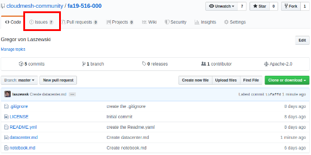
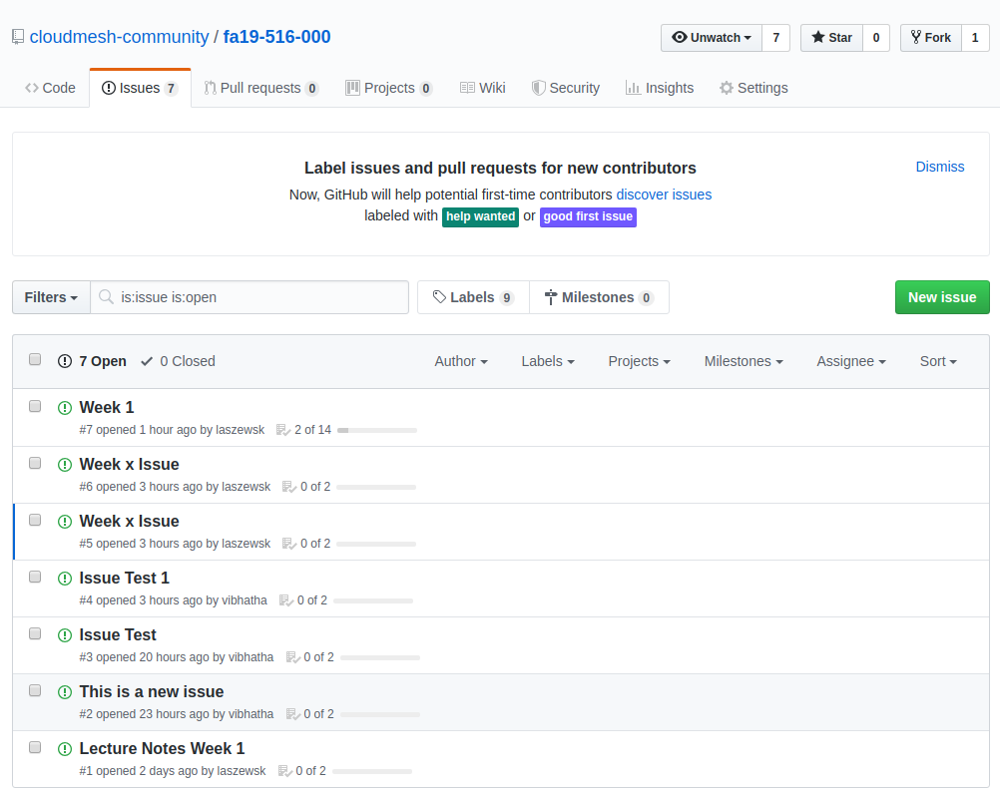
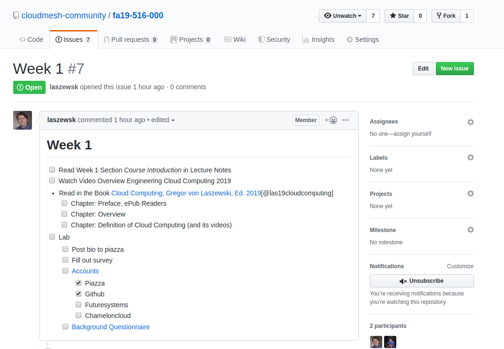
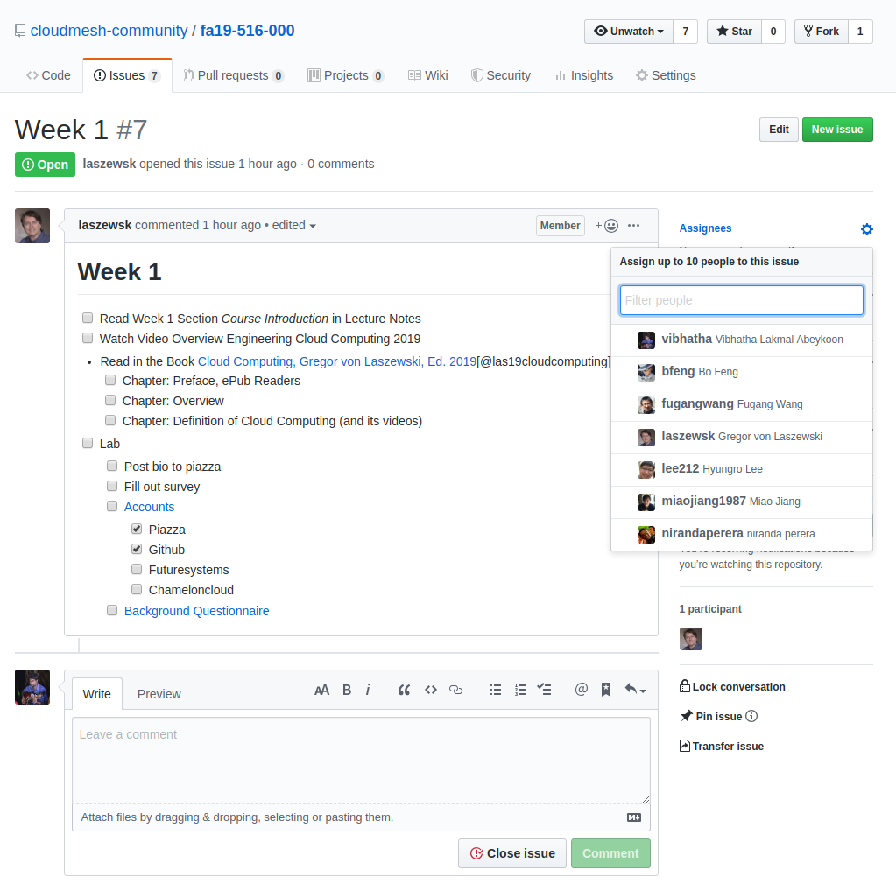
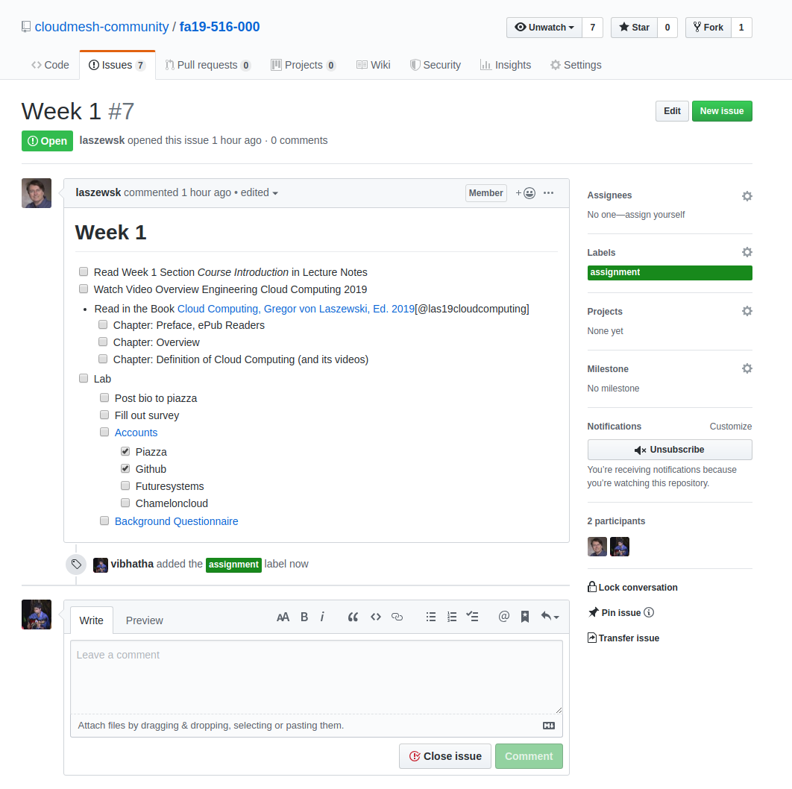

# Track Progress with Github

We will be adding git issues for all the assignments provided in the class. 
This way you can also keep a track on the items need to be completed. 
It is like a todo list. You can check things once you complete it. This way
you can easily track what you need to do and you can comment on the issue 
to report the questions you have. This is an experimental idea we are trying 
in the class. Hope this helps to manage your work load efficiently. 

## How to check this?

All you have to do is go to your git repository.

Here are the steps to use this tool effectively. 

### Step 1 

Go to the repo. Here we use a sample repo. 

[Sample Repo](https://github.com/cloudmesh-community/fa19-516-000)

Link to your repo will be https://github.com/cloudmesh-community/fa19-{class-id}-{hid}

class-id is your class number for instance 534. 
hid is your homework id assigned.

### Step 2

The red colored box shows where you need to navigate next. Click on issues. 

### Step 3

Git issue list looks like this. The inputs in this are dummy values we used to test
the module. In your repo, things will be readable and identified based on week. 
This way you know what you need to do this week. 

### Step 4

This is how a git issue looks like this. 

 

In here you will see the things that you need to do with main task and subtasks. 
This looks like a tood list. No pressure you can customize the way you want it. 
We'll put in the basic skeleton for this one. 

### Step 5 (Optional)

Assign a TA, once you have completed the issues, you can assign a TA to resolve if you have
issues. In all issues you can make a comment and you can use @ sign to add the specific TA. 
For E534 Fall 2019 you can add @vibhatha as an assignee for your issue and we will communicate
to solve the issues. This is an optional thing, you can use canvas or meeting hours to mention
your concerns.  

### Step 6 (Optional)

You can add a label to your issue by clicking labels option in the right hand size within a
given issue. 

