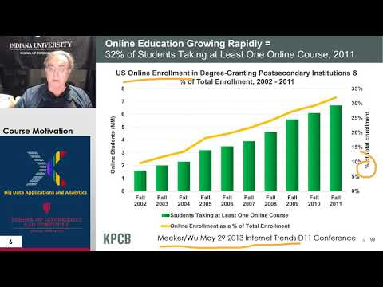

# Week 3

## 2018 BDAA Motivation-1A) Technology Hypecycle I 

General Remarks including Hype curves

[{width=20%}](https://www.youtube.com/watch?v=sAbYkZHD81U&list=PLy0VLh_GFyz-SuEkfPdRkEsimVPK39V_K&index=2&t=0s)

## 2018 BDAA Motivation-1B) Technology Hypecycle II 

General Remarks including Hype curves

[{width=20%}](https://www.youtube.com/watch?v=fEcQl7jhwu0&list=PLy0VLh_GFyz-SuEkfPdRkEsimVPK39V_K&index=3&t=0s)

## 2018 BDAA Motivation-2B) Cloud/Big Data Applications II 

Clouds in science where area called cyberinfrastructure; the usage
pattern from NIST Artificial Intelligence from Gartner and Meeker

[{width=20%}](https://www.youtube.com/watch?v=_y0Efn_iakY&list=PLy0VLh_GFyz-SuEkfPdRkEsimVPK39V_K&index=4&t=0s)

## 2018 BDAA Motivation-4A) Industry Trends I 

Lesson 4A Many Technology trends through end of 2014

[{width=20%}](https://www.youtube.com/watch?v=s_T5IBP05x4&list=PLy0VLh_GFyz-SuEkfPdRkEsimVPK39V_K&index=6&t=0s)

## 2018 BDAA Motivation-4B) Industry Trends II 

Lesson 4B 2015 onwards Many Technology Adoption trends

[{width=20%}](https://www.youtube.com/watch?v=1ocZBhIGwlk&list=PLy0VLh_GFyz-SuEkfPdRkEsimVPK39V_K&index=7&t=0s)

## 2017 BDAA Motivation-4C)Industry Trends III 

(note 2017 not 2018) Lesson 4C 2015
onwards 3 Technology trends Voice as HCI Cars Deep Learning

[{width=20%}](https://www.youtube.com/watch?v=d6SUm0Mb0LY&list=PLy0VLh_GFyz-SuEkfPdRkEsimVPK39V_K&index=8&t=0s)

## 2018 BDAA Motivation-6B) Computing Model II 

Lesson 6B with 3 subsections 
Developments after 2014 mainly from Gartner Cloud Market share Blockchain

[{width=20%}](https://www.youtube.com/watch?v=_F8-LaQ5Oso&list=PLy0VLh_GFyz-SuEkfPdRkEsimVPK39V_K&index=9&t=0s)

## 2017 BDAA Motivation-8) Data Science Pipeline DIKW 

Data, Information, Knowledge, Wisdom, Decisions.  Data Science Platforms

[{width=20%}](https://www.youtube.com/watch?v=3bpOQge-fPA&list=PLy0VLh_GFyz-SuEkfPdRkEsimVPK39V_K&index=10&t=0s)

## 2017 BDAA Motivation-13) Cloud Applications in Research Science Clouds Internet of Things

[{width=20%}](https://www.youtube.com/watch?v=_6aQn5daW4Y&list=PLy0VLh_GFyz-SuEkfPdRkEsimVPK39V_K&index=11&t=0s)

## 2017 BDAA Motivation-15) Data Science Education Opportunities at Universities

2019Cloud-I) Cloud Applications I: Clouds in science where area called
cyberinfrastructure; the science usage pattern from NIST Artificial
Intelligence from Gartner

[{width=20%}](https://www.youtube.com/watch?v=SWCiCbwmWjA&list=PLy0VLh_GFyz-SuEkfPdRkEsimVPK39V_K&index=12&t=0s)