# Part I Motivation I {#sec:534-week1}

## Motivation

Big Data Applications & Analytics: Motivation/Overview; Machine (actually Deep)
Learning, Big Data, and the Cloud; Centerpieces of the Current and Future
Economy,

## 00) Mechanics of Course, Summary, and overall remarks on course

In this section we discuss the summary of the motivation section. 

[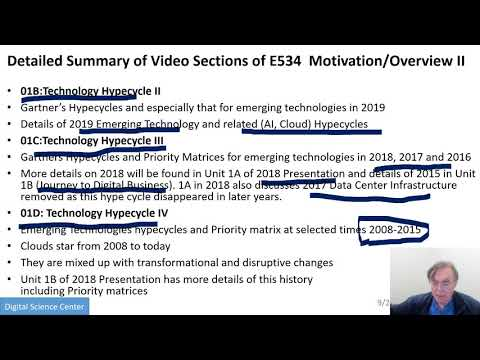{width=20%}](https://www.youtube.com/watch?v=3NVooE9EtqY&list=PLy0VLh_GFyz_TQhQjKnx-Ef7i2Bfhi15L&index=2&t=0s)

### 01A) Technology Hypecycle I 

Today clouds and big data have got through the hype cycle (they have emerged)
but features like blockchain, serverless and machine learning are on recent hype
cycles while areas like deep learning have several entries (as in fact do
clouds) Gartner’s Hypecycles and especially that for emerging technologies in
2019 The phases of hypecycles Priority Matrix with benefits and adoption time
Initial discussion of 2019 Hypecycle for Emerging Technologies

[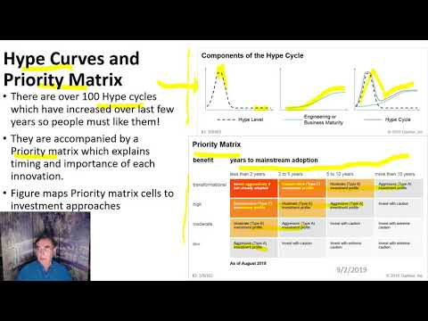{width=20%}](https://www.youtube.com/watch?v=25mXsHAiSeU&list=PLy0VLh_GFyz_TQhQjKnx-Ef7i2Bfhi15L&index=2)

### 01B) Technology Hypecycle II 

Today clouds and big data have got through the hype cycle (they have emerged)
but features like blockchain, serverless and machine learning are on recent hype
cycles while areas like deep learning have several entries (as in fact do
clouds) Gartner’s Hypecycles and especially that for emerging technologies in
2019 Details of 2019 Emerging Technology and related (AI, Cloud) Hypecycles

[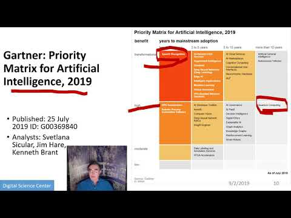{width=20%}](https://youtu.be/-QLxzyB1tvQ?list=PLy0VLh_GFyz_TQhQjKnx-Ef7i2Bfhi15L)

### 01C) Technology Hypecycle III 

Today clouds and big data have got through the hype cycle (they have emerged)
but features like blockchain, serverless and machine learning are on recent hype
cycles while areas like deep learning have several entries (as in fact do
clouds) Gartners Hypecycles and Priority Matrices for emerging technologies in
2018, 2017 and 2016 More details on 2018 will be found in Unit 1A of 2018
Presentation and details of 2015 in Unit 1B (Journey to Digital Business). 1A in
2018 also discusses 2017 Data Center Infrastructure removed as this hype cycle
disappeared in later years.

[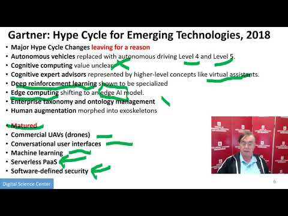{width=20%}](https://youtu.be/TIb9eUrQAtk?list=PLy0VLh_GFyz_TQhQjKnx-Ef7i2Bfhi15L)

### 01D) Technology Hypecycle IV 

Today clouds and big data have got through the hype cycle (they have emerged)
but features like blockchain, serverless and machine learning are on recent hype
cycles while areas like deep learning have several entries (as in fact do
clouds) Emerging Technologies hypecycles and Priority matrix at selected times
2008-2015 Clouds star from 2008 to today They are mixed up with transformational
and disruptive changes Unit 1B of 2018 Presentation has more details of this
history including Priority matrices

[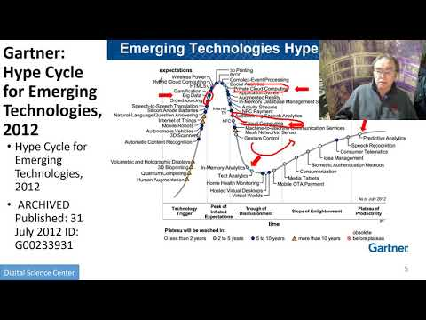{width=20%}](https://www.youtube.com/watch?v=N5m3ElvTS84&list=PLy0VLh_GFyz_TQhQjKnx-Ef7i2Bfhi15L&index=6&t=0s)

## 02)

### 02A) Clouds/Big Data Applications I

The Data Deluge Big Data; a lot of the best examples have NOT been updated (as I
can’t find updates) so some slides old but still make the correct points Big
Data Deluge has become the Deep Learning Deluge Big Data is an agreed fact; Deep
Learning still evolving fast but has stream of successes!

[{width=20%}](https://www.youtube.com/watch?v=BC5fsZmPJKI&list=PLy0VLh_GFyz_TQhQjKnx-Ef7i2Bfhi15L&index=7&t=0s)

### 02B) Cloud/Big Data Applications II 

Clouds in science where area called cyberinfrastructure; The usage pattern from
NIST is removed. See 2018 lectures 2B of the motivation for this discussion

[{width=20%}](https://www.youtube.com/watch?v=7dXz3_o0ln0&list=PLy0VLh_GFyz_TQhQjKnx-Ef7i2Bfhi15L&index=8&t=0s)

### 02C) Cloud/Big Data 

Usage Trends Google and related Trends Artificial Intelligence from Microsoft,
Gartner and Meeker

[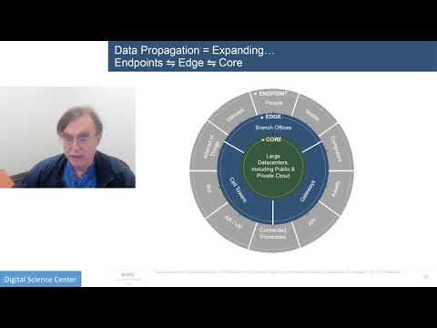{width=20%}](https://www.youtube.com/watch?v=by96dQsKjjo&list=PLy0VLh_GFyz_TQhQjKnx-Ef7i2Bfhi15L&index=9&t=0s)

## 03) Jobs In areas like Data Science, Clouds and Computer Science and Computer
Engineering

[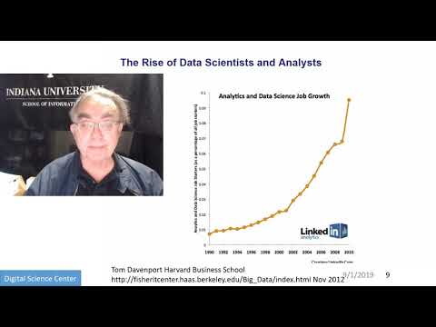{width=20%}](https://www.youtube.com/watch?v=JznXEENYks8&list=PLy0VLh_GFyz_TQhQjKnx-Ef7i2Bfhi15L&index=10&t=0s)

## 04) Industry, Technology, Consumer Trends Basic trends 2018 Lectures 4A 4B have
more details removed as dated but still valid See 2018 Lesson 4C for 3
Technology trends for 2016: Voice as HCI, Cars, Deep Learning

[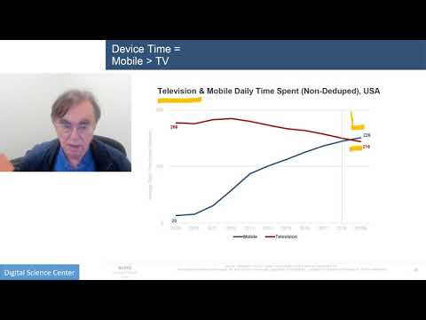{width=20%}](https://www.youtube.com/watch?v=7jutdpNquFU&list=PLy0VLh_GFyz_TQhQjKnx-Ef7i2Bfhi15L&index=11&t=0s)

## 05) Digital Disruption and Transformation The Past displaced by Digital
Disruption; some more details are in 2018 Presentation Lesson 5

[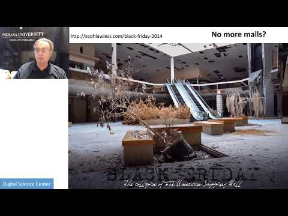{width=20%}](https://www.youtube.com/watch?v=jgRSQVEJnXU&list=PLy0VLh_GFyz_TQhQjKnx-Ef7i2Bfhi15L&index=12&t=0s)

## 06)

## 06A) Computing Model I Industry adopted clouds which are attractive for data
analytics.  Clouds are a dominant force in Industry. Examples are given

### 06B) Computing Model II with 3 subsections is removed; please see 2018
Presentation for this Developments after 2014 mainly from Gartner Cloud Market
share Blockchain

[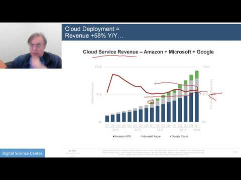{width=20%}](https://www.youtube.com/watch?v=3yyNa6e7J_c&list=PLy0VLh_GFyz_TQhQjKnx-Ef7i2Bfhi15L&index=14&t=0s)

## 07) Research Model 4th Paradigm; From Theory to Data driven science?

[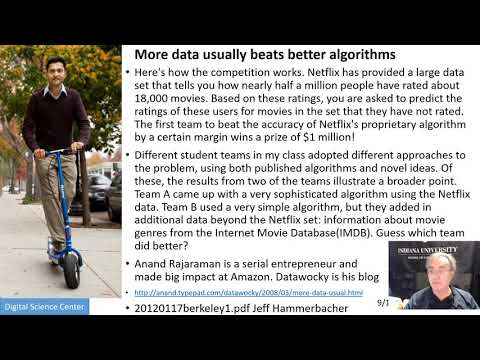{width=20%}](https://www.youtube.com/watch?v=YyBjbiprC2Q&list=PLy0VLh_GFyz_TQhQjKnx-Ef7i2Bfhi15L&index=13&t=0s)

## 08) Data Science Pipeline DIKW: Data, Information, Knowledge, Wisdom, Decisions.

More details on Data Science Platforms are in 2018 Lesson 8 presentation

[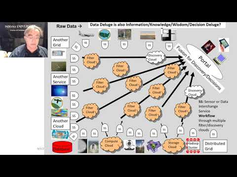{width=20%}](https://www.youtube.com/watch?v=WKGB_dPLato&list=PLy0VLh_GFyz_TQhQjKnx-Ef7i2Bfhi15L&index=15&t=0s)

## 09) Physics: Looking for Higgs Particle with Large Hadron Collider LHC Physics as a big data example

[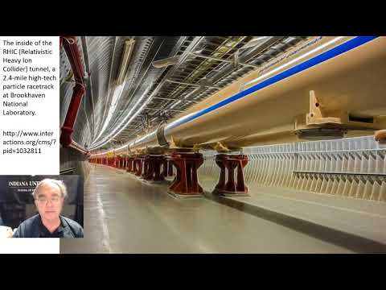{width=20%}](https://www.youtube.com/watch?v=h6WPSmE2cIg&list=PLy0VLh_GFyz_TQhQjKnx-Ef7i2Bfhi15L&index=16&t=0s)

## 10) Recommender Systems I General remarks and Netflix example

[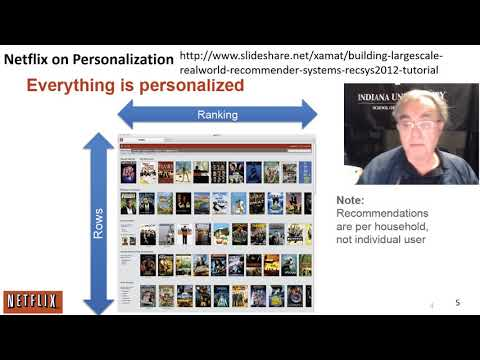{width=20%}](https://www.youtube.com/watch?v=1xRUspH4EMM&list=PLy0VLh_GFyz_TQhQjKnx-Ef7i2Bfhi15L&index=17&t=0s)

## 11) Recommender Systems II Exploring Data Bags and Spaces

[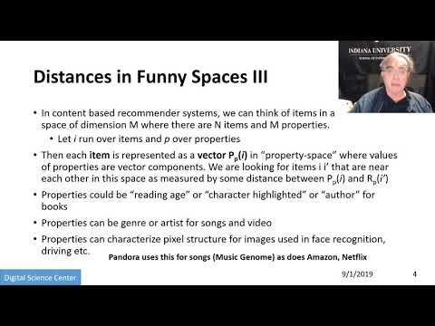{width=20%}](https://www.youtube.com/watch?v=1kCDLo-w378&list=PLy0VLh_GFyz_TQhQjKnx-Ef7i2Bfhi15L&index=18&t=0s)

## 12) Web Search and Information Retrieval Another Big Data Example

[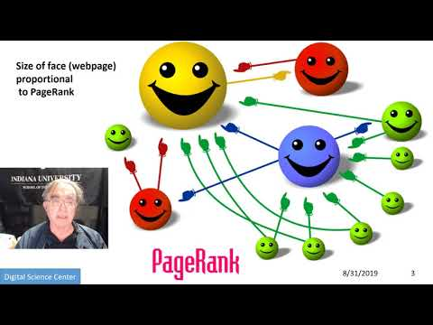{width=20%}](https://www.youtube.com/watch?v=yBiqwPLb-8w&list=PLy0VLh_GFyz_TQhQjKnx-Ef7i2Bfhi15L&index=19&t=0s)

## 13) Cloud Applications in Research Removed Science Clouds, Internet of Things

Part 12 continuation. 
See 2018 Presentation (same as 2017 for lesson 13) and Cloud Unit 2019-I) this year

[{width=20%}](https://www.youtube.com/watch?v=yBiqwPLb-8w&list=PLy0VLh_GFyz_TQhQjKnx-Ef7i2Bfhi15L&index=19&t=0s)

## 14) Parallel Computing and MapReduce Software Ecosystems

[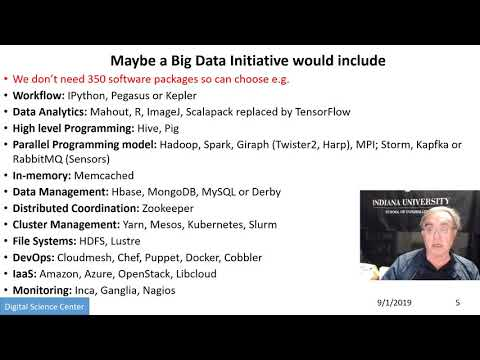{width=20%}](https://youtu.be/QMnjgR8NihY?list=PLy0VLh_GFyz_TQhQjKnx-Ef7i2Bfhi15L)

## 15) Online education and data science education Removed.

You can find it in the 2017 version. In @sec:534-week2 you can see more about this. 

[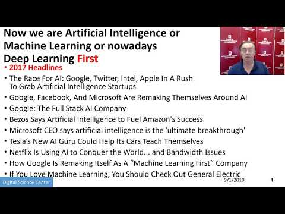{width=20%}](https://www.youtube.com/watch?v=QMnjgR8NihY&list=PLy0VLh_GFyz_TQhQjKnx-Ef7i2Bfhi15L&index=20&t=0s)

## 16) Conclusions

Conclusion contain in the latter part of the part 15. 

Motivation Archive Big Data Applications & Analytics:
Motivation/Overview; Machine (actually Deep) Learning, Big Data, and the
Cloud; Centerpieces of the Current and Future Economy.  Backup Lectures
from previous years referenced in 2019 class

[{width=20%}](https://www.youtube.com/watch?v=iMwnPg6SW_Y&list=PLy0VLh_GFyz_TQhQjKnx-Ef7i2Bfhi15L&index=21&t=0s)

