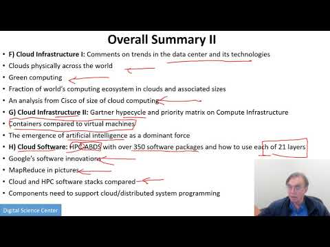
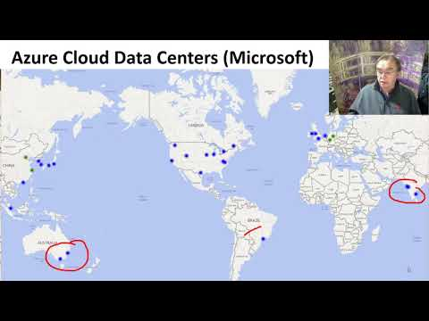
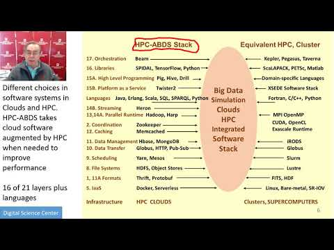
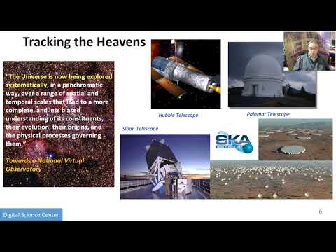
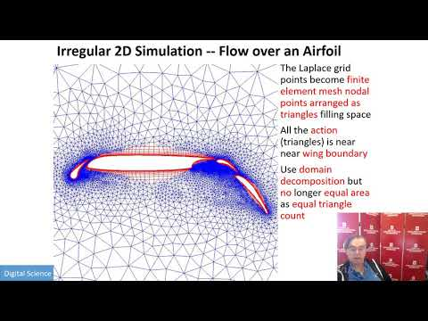
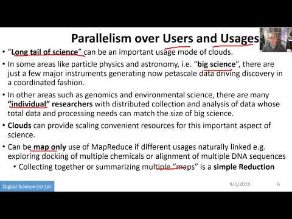
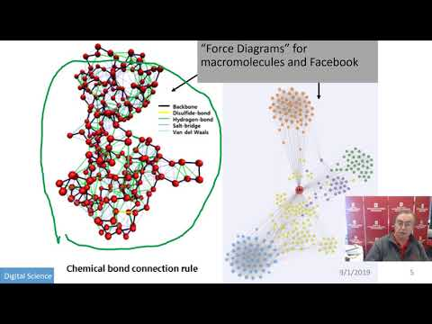
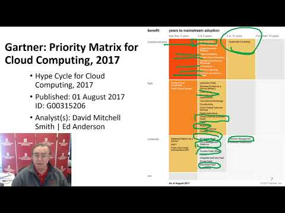
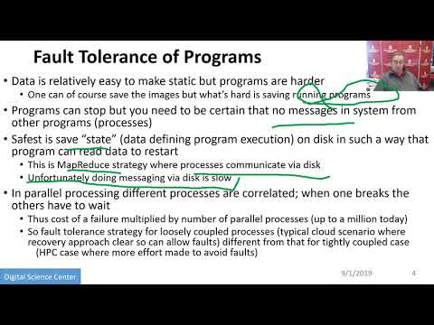

# Week 1

## Bigdata Applications and Analytics

### Cloud Computing Unit for BDAA Course 

#### A). Summary of Course 

{width=20%}

#### B). Defining Clouds I: Basic definition of cloud and two very simple examples of why virtualization is important. 

{width=20%}

How clouds are situated wrt HPC and supercomputers
Why multicore chips are important
Typical data center

#### C). Defining Clouds II: Service-oriented architectures: Software services as Message-linked computing capabilities

{width=20%}

The different aaS’s: Network, Infrastructure, Platform, Software
The amazing services that Amazon AWS and Microsoft Azure have
Initial Gartner comments on clouds (they are now the norm) and evolution of servers; serverless and microservices
Gartner hypecycle and priority matrix on Infrastructure Strategies

#### D) Defining Clouds III: Cloud Market Share

{width=20%}

How important are they?
How much money do they make?  

#### E) Virtualization: Virtualization Technologies,

{width=20%}

Hypervisors and the different approaches KVM, Xen, Docker and Openstack 

#### F) Cloud Infrastructure I: 

{width=20%}

Comments on trends in the data center and its technologies
Clouds physically across the world Green computing Fraction of world’s computing
ecosystem in clouds and associated sizes An analysis from Cisco of size of cloud
computing 

#### G) Cloud Infrastructure II: 

{width=20%}

Gartner hypecycle and priority matrix on Compute Infrastructure Containers
compared to virtual machines The emergence of artificial intelligence as a
dominant force

#### H) Cloud Software: 

{width=20%}

HPC-ABDS with over 350 software packages and how to use each of 21 layers
Google’s software innovations MapReduce in pictures Cloud and HPC software
stacks compared Components need to support cloud/distributed system programming

#### I) Cloud Applications I: Clouds in science where area called

{width=20%}

cyberinfrastructure; the science usage pattern from NIST Artificial Intelligence
from Gartner 

#### J) Cloud Applications II: Characterize Applications using NIST

{width=20%}

approach Internet of Things Different types of MapReduce 

#### K) Parallel Computing

{width=20%}

Analogies: Parallel Computing in pictures Some useful analogies and principles

#### L) Real Parallel Computing: Single Program/Instruction Multiple Data SIMD SPMD

{width=20%}

Big Data and Simulations Compared What is hard to do?  

#### M) Storage: Cloud data

{width=20%}

approaches Repositories, File Systems, Data lakes 

#### N) HPC and Clouds: The

{width=20%}

Branscomb Pyramid Supercomputers versus clouds Science Computing Environments 

#### O) Comparison of Data Analytics with Simulation: 

{width=20%}

Structure of different applications for simulations and Big Data Software
implications Languages 

#### P) The Future I: 

{width=20%}

Gartner cloud computing hypecycle and priority matrix 2017 and 2019 Hyperscale
computing Serverless and FaaS Cloud Native Microservices Update to 2019
Hypecycle 

#### Q) other Issues II: 

{width=20%}

Security Blockchain 

#### R) The Future and other Issues III:

{width=20%}

Fault Tolerance

#### Motivation

Big Data Applications & Analytics: Motivation/Overview; Machine (actually Deep)
Learning, Big Data, and the Cloud; Centerpieces of the Current and Future
Economy,

#### 00) Mechanics of Course, Summary, and overall remarks on course

##### 01A) Technology Hypecycle I 

Today clouds and big data have got through the hype cycle (they have emerged)
but features like blockchain, serverless and machine learning are on recent hype
cycles while areas like deep learning have several entries (as in fact do
clouds) Gartner’s Hypecycles and especially that for emerging technologies in
2019 The phases of hypecycles Priority Matrix with benefits and adoption time
Initial discussion of 2019 Hypecycle for Emerging Technologies

##### 01B) Technology Hypecycle II 

Today clouds and big data have got through the hype cycle (they have emerged)
but features like blockchain, serverless and machine learning are on recent hype
cycles while areas like deep learning have several entries (as in fact do
clouds) Gartner’s Hypecycles and especially that for emerging technologies in
2019 Details of 2019 Emerging Technology and related (AI, Cloud) Hypecycles

##### 01C) Technology Hypecycle III 

Today clouds and big data have got through the hype cycle (they have emerged)
but features like blockchain, serverless and machine learning are on recent hype
cycles while areas like deep learning have several entries (as in fact do
clouds) Gartners Hypecycles and Priority Matrices for emerging technologies in
2018, 2017 and 2016 More details on 2018 will be found in Unit 1A of 2018
Presentation and details of 2015 in Unit 1B (Journey to Digital Business). 1A in
2018 also discusses 2017 Data Center Infrastructure removed as this hype cycle
disappeared in later years.

#### 01D) Technology Hypecycle IV 

Today clouds and big data have got through the hype cycle (they have emerged)
but features like blockchain, serverless and machine learning are on recent hype
cycles while areas like deep learning have several entries (as in fact do
clouds) Emerging Technologies hypecycles and Priority matrix at selected times
2008-2015 Clouds star from 2008 to today They are mixed up with transformational
and disruptive changes Unit 1B of 2018 Presentation has more details of this
history including Priority matrices

#### 02)

##### 02A) Clouds/Big Data Applications I

The Data Deluge Big Data; a lot of the best examples have NOT been updated (as I
can’t find updates) so some slides old but still make the correct points Big
Data Deluge has become the Deep Learning Deluge Big Data is an agreed fact; Deep
Learning still evolving fast but has stream of successes!

##### 02B) Cloud/Big Data Applications II 

Clouds in science where area called cyberinfrastructure; The usage pattern from
NIST is removed. See 2018 lectures 2B of the motivation for this discussion

##### 02C) Cloud/Big Data 

Usage Trends Google and related Trends Artificial Intelligence from Microsoft,
Gartner and Meeker

#### 03) Jobs In areas like Data Science, Clouds and Computer Science and Computer
Engineering

#### 04) Industry, Technology, Consumer Trends Basic trends 2018 Lectures 4A 4B have
more details removed as dated but still valid See 2018 Lesson 4C for 3
Technology trends for 2016: Voice as HCI, Cars, Deep Learning

#### 05) Digital Disruption and Transformation The Past displaced by Digital
Disruption; some more details are in 2018 Presentation Lesson 5

#### 06)

##### 06A) Computing Model I Industry adopted clouds which are attractive for data
analytics.  Clouds are a dominant force in Industry. Examples are given

##### 06B) Computing Model II with 3 subsections is removed; please see 2018
Presentation for this Developments after 2014 mainly from Gartner Cloud Market
share Blockchain

#### 07) Research Model 4th Paradigm; From Theory to Data driven science?

#### 08) Data Science Pipeline DIKW: Data, Information, Knowledge, Wisdom, Decisions.
More details on Data Science Platforms are in 2018 Lesson 8 presentation

#### 09) Physics: Looking for Higgs Particle with Large Hadron Collider LHC Physics
as a big data example

#### 10) Recommender Systems I General remarks and Netflix example

#### 11) Recommender Systems II Exploring Data Bags and Spaces

#### 12) Web Search and Information Retrieval Another Big Data Example

#### 13) Cloud Applications in Research Removed Science Clouds, Internet of Things
See 2018 Presentation (same as 2017 for lesson 13) and Cloud Unit 2019-I) this
year

#### 14) Parallel Computing and MapReduce Software Ecosystems

#### 15) Online education and data science education Removed.
You can find it in the 2017 version

#### 16) Conclusions

Motivation Archive Big Data Applications & Analytics: Motivation/Overview;
Machine (actually Deep) Learning, Big Data, and the Cloud; Centerpieces of the
Current and Future Economy.  Backup Lectures from previous years referenced in
2019 class

#### 2018BDAAMotivation-1A) Technology Hypecycle I 

General Remarks including Hype curves

#### 2018BDAAMotivation-1B) Technology Hypecycle II 

General Remarks including Hype curves

#### 2018BDAAMotivation-2B) Cloud/Big Data Applications II 

Clouds in science where area called cyberinfrastructure; the usage pattern from
NIST Artificial Intelligence from Gartner and Meeker

#### 2018BDAAMotivation-4A) Industry Trends I 

Lesson 4A Many Technology trends through end of 2014

#### 2018BDAAMotivation-4B) Industry Trends II 

Lesson 4B 2015 onwards Many Technology Adoption trends

#### 2017BDAAMotivation-4C)Industry Trends III 

(note 2017 not 2018) Lesson 4C 2015
onwards 3 Technology trends Voice as HCI Cars Deep Learning

#### 2018BDAAMotivation-6B) Computing Model II 

Lesson 6B with 3 subsections 
Developments after 2014 mainly from Gartner Cloud Market share Blockchain

#### 2017BDAAMotivation-8) Data Science Pipeline DIKW 

Data, Information, Knowledge, Wisdom, Decisions.  Data Science Platforms

#### 2017BDAAMotivation-13) Cloud Applications in Research Science Clouds Internet of Things

#### 2017BDAAMotivation-15) Data Science Education Opportunities at Universities

2019Cloud-I) Cloud Applications I: Clouds in science where area called
cyberinfrastructure; the science usage pattern from NIST Artificial Intelligence
from Gartner
