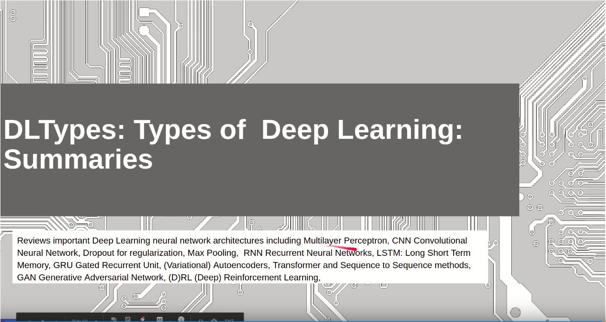
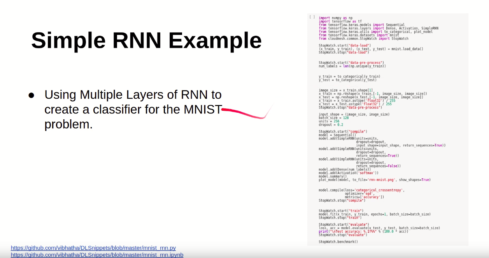
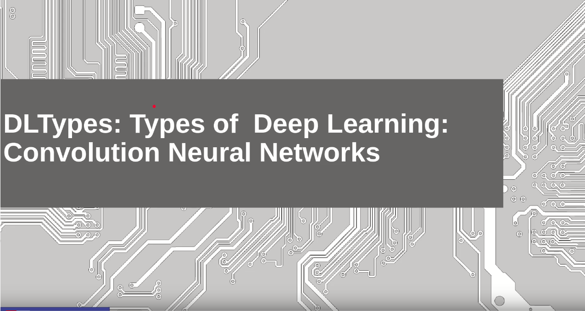
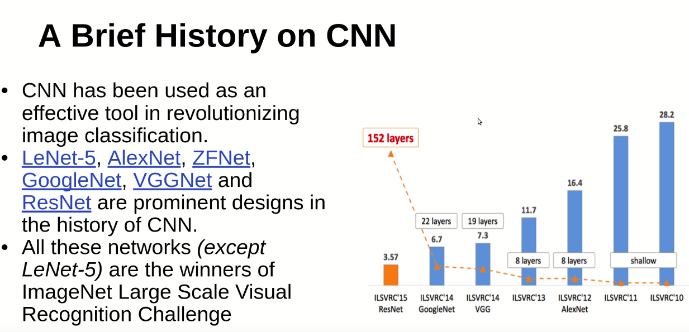
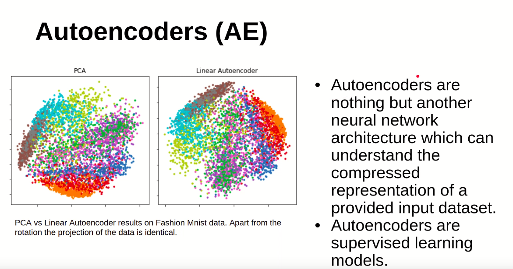
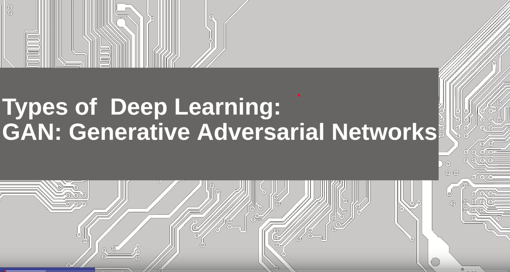

# Introduction to Deep Learning Part III: Deep Learning Algorithms and Usage

Usage of deep learning algorithm is one of the demanding skills needed
in this decade and the coming decade. Providing a hands on experience in
using deep learning applications is one of the main goals of this
lecture series. Let's get started. 

## Deep Learning Algorithm Part 1

In this part of the lecture series, the idea is to provide an
understanding on the usage of various deep learning algorithms. In this
lesson, we talk about different algorithms in Deep Learning world. In
this lesson we discuss a multi-layer perceptron and convolutional neural
networks. Here we use MNIST classification problem and solve it using
MLP and CNN. 

[{width=20%}](https://youtu.be/OLq0s-r4IDo?list=PLy0VLh_GFyz-5vdhC2NyDf5v2rfeh-cSa)

[Slides](https://drive.google.com/open?id=1sYRkiXhYU-qrXRlBW3ZQXwnNfmYuMHRlpRtfwZkiFTc)

## Deep Learning Algorithms Part 2

In this lesson, we continue our study on a deep learning algorithms. We
use Recurrent Neural Network related examples to show case how it can be
applied to do MNIST classfication. We showcase how RNN can be applied to
solve this problem. 

[{width=20%}](https://youtu.be/0A4dnEMKuYU?list=PLy0VLh_GFyz-5vdhC2NyDf5v2rfeh-cSa)

[Slides](https://drive.google.com/open?id=1MMUErmadF8RTWPQY6xxuXhpchh6gczuYr6Z7znCQkbM)

## Deep Learning Algorithms Part 3

CNN is one of the most prominent algorithms that has been used in the
deep learning world in the last decade. A lots of applications has been
done using CNN. Most of these applications deal with images, videos,
etc. In this lesson we continue the lesson on convolution neural
networks. Here we discuss a brief history on CNN.

[{width=20%}](https://youtu.be/KXFfKyDNhBE?list=PLy0VLh_GFyz-5vdhC2NyDf5v2rfeh-cSa)

[Slides](https://drive.google.com/open?id=1oedasSs6tBFLYyaskes0gZEhTz2Sva57Qb2Kv2ruiXU)

## Deep Learning Algorithms Part 4
 
In this lesson we continue our study on CNN by understanding how
historical findings supported the upliftment of the Convolutional Neural
Networks. And also we discuss why CNN has been used for various
applications in various fields. 

[{width=20%}](https://youtu.be/hinOsG7eLRk?list=PLy0VLh_GFyz-5vdhC2NyDf5v2rfeh-cSa)

[Slides](https://drive.google.com/open?id=1N9V7ehwKuA2fZN-bGX6m-DLkeTBpNiYpZAGQu6IqkeU)

## Deep Learning Algorithms Part 5

In this lesson we discuss about auto-encoders. This is one of the highly
used deep learning based models in signal denoising, image denoising.
Here we portray how an auto-encoder can be used to do such tasks. 

[{width=20%}](https://youtu.be/Q9Bl3QM5Img?list=PLy0VLh_GFyz-5vdhC2NyDf5v2rfeh-cSa)

[Slides](https://drive.google.com/open?id=1MoQQOb5a8ptUSLrBCm2dT8P0yrZat6beKv1CDjJn44I)

## Deep Learning Algorithms Part 6

In this lesson we discuss one of the most famous deep neural network
architecture, Generative Adversarial Networks. This deep learning model
has the capability of generating new outputs from existing knowledge. A
GAN model is more like a counter-fitter who is trying to improve itself
to generate best counterfits. 

[{width=20%}](https://youtu.be/KwVpYp19fe8?list=PLy0VLh_GFyz-5vdhC2NyDf5v2rfeh-cSa)

[Slides](https://drive.google.com/open?id=1dHvLXgdjZLE-W-Ic0AdK-nYO9pvij4jcruHxTmNJx74)

# Additional Material 

We have included more information on different types of deep neural
networks and their usage. A summary of all the topics discussed under
deep learning can be found in the following slide deck. Please refer it
to get more information. Some of these information can help for writing
term papers and projects. 

[Slides](https://docs.google.com/presentation/d/192NZBZNR4VVOIE8GdoJNm01o5AvY9tP1lWCdEA-Qy8Q/edit?usp=sharing)
