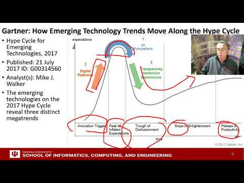
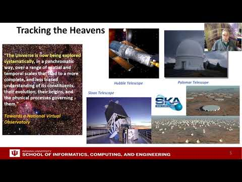
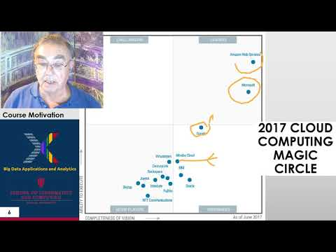

# Part II Motivation Archive {#sec:534-week2}

## 2018 BDAA Motivation-1A) Technology Hypecycle I 

In this section we discuss on general remarks including Hype curves.

[{width=20%}](https://youtu.be/fEcQl7jhwu0?list=PLy0VLh_GFyz-SuEkfPdRkEsimVPK39V_K)

## 2018 BDAA Motivation-1B) Technology Hypecycle II 

In this section we continue our discussion on general remarks including Hype curves.

[{width=20%}](https://youtu.be/_y0Efn_iakY?list=PLy0VLh_GFyz-SuEkfPdRkEsimVPK39V_K)

## 2018 BDAA Motivation-2B) Cloud/Big Data Applications II 

In this section we discuss clouds in science where area called cyberinfrastructure; the usage
pattern from NIST Artificial Intelligence from Gartner and Meeker.

[{width=20%}](https://youtu.be/wcALTC38yWI?list=PLy0VLh_GFyz-SuEkfPdRkEsimVPK39V_K)

## 2018 BDAA Motivation-4A) Industry Trends I 

In this section we discuss on Lesson 4A many technology trends through end of 2014.

[{width=20%}](https://youtu.be/s_T5IBP05x4?list=PLy0VLh_GFyz-SuEkfPdRkEsimVPK39V_K)

## 2018 BDAA Motivation-4B) Industry Trends II 

In this section we continue our discussion on industry trends. 
This section includes Lesson 4B 2015 onwards many technology adoption trends.

[{width=20%}](https://youtu.be/1ocZBhIGwlk?list=PLy0VLh_GFyz-SuEkfPdRkEsimVPK39V_K)

## 2017 BDAA Motivation-4C)Industry Trends III 

In this section we continue our discussion on industry trends. This section contains lesson 4C 2015
onwards 3 technology trends voice as HCI cars deep learning.

[{width=20%}](https://youtu.be/d6SUm0Mb0LY?list=PLy0VLh_GFyz-SuEkfPdRkEsimVPK39V_K)

## 2018 BDAA Motivation-6B) Computing Model II 

In this section we discuss computing models. This section contains lesson 6B with 3 subsections 
developments after 2014 mainly from Gartner cloud market share blockchain

[{width=20%}](https://youtu.be/_F8-LaQ5Oso?list=PLy0VLh_GFyz-SuEkfPdRkEsimVPK39V_K)

## 2017 BDAA Motivation-8) Data Science Pipeline DIKW 

In this section, we discuss data science pipelines. This section also contains about
data, information, knowledge, wisdom forming DIKW term. 
And also it contains some discussion on data science platforms.

[{width=20%}](https://youtu.be/3bpOQge-fPA?list=PLy0VLh_GFyz-SuEkfPdRkEsimVPK39V_K)

## 2017 BDAA Motivation-13) Cloud Applications in Research Science Clouds Internet of Things

In this section we discuss about internet of things and related cloud applications. 

[{width=20%}](https://youtu.be/_6aQn5daW4Y?list=PLy0VLh_GFyz-SuEkfPdRkEsimVPK39V_K)

## 2017 BDAA Motivation-15) Data Science Education Opportunities at Universities

In this section we discuss more on data science education opportunities.  

[{width=20%}](https://youtu.be/SWCiCbwmWjA?list=PLy0VLh_GFyz-SuEkfPdRkEsimVPK39V_K)