# Part III Cloud

## A. Summary of Course 

[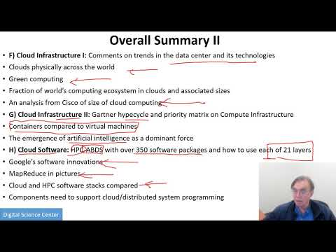{width=20%}](https://www.youtube.com/watch?v=bd9KXMUsQGM&list=PLy0VLh_GFyz-dNRQYeX0OMnq7AeB_CeN0&index=2&t=0s)

## B. Defining Clouds I

In this lecture we discuss the basic definition of cloud and two very
simple examples of why virtualization is important.

[{width=20%}](https://www.youtube.com/watch?v=8OE3oOVDmlQ&list=PLy0VLh_GFyz-dNRQYeX0OMnq7AeB_CeN0&index=3&t=0s)

In this lecture we discuss how clouds are situated wrt HPC and supercomputers, why multicore chips are important
in a typical data center.

## C. Defining Clouds II

In this lecture we discuss service-oriented architectures, Software services as Message-linked computing capabilities.

[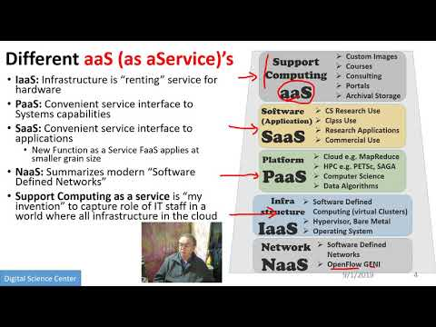{width=20%}](https://www.youtube.com/watch?v=LnYbJYzmJ0I&list=PLy0VLh_GFyz-dNRQYeX0OMnq7AeB_CeN0&index=4&t=0s)

In this lecture we discuss different aaS’s: Network, Infrastructure, Platform, Software.
The amazing services that Amazon AWS and Microsoft Azure have Initial Gartner comments on clouds (they are now the norm) and evolution of servers; serverless and microservices
Gartner hypecycle and priority matrix on Infrastructure Strategies.

## D. Defining Clouds III: Cloud Market Share

[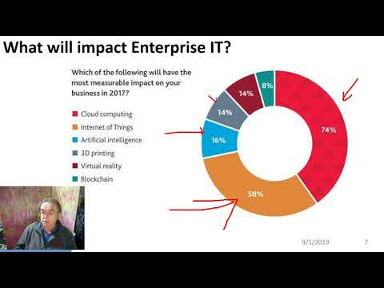{width=20%}](https://www.youtube.com/watch?v=X1HwKJ7yBEk&list=PLy0VLh_GFyz-dNRQYeX0OMnq7AeB_CeN0&index=5&t=0s)

In this lecture we discuss on how important the cloud market shares are and how much money do they make.  

## E. Virtualization: Virtualization Technologies,

[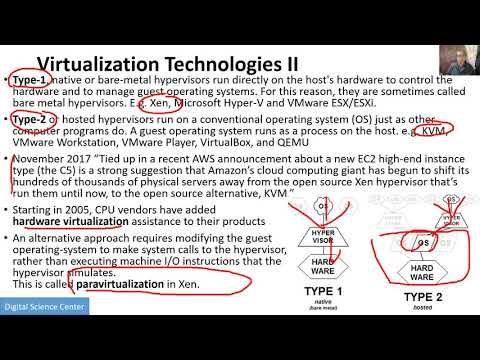{width=20%}](https://www.youtube.com/watch?v=Tqsx-sEPY6M&list=PLy0VLh_GFyz-dNRQYeX0OMnq7AeB_CeN0&index=6&t=0s)

In this lecture we discuss hypervisors and the different approaches KVM, Xen, Docker and Openstack. 

## F. Cloud Infrastructure I

[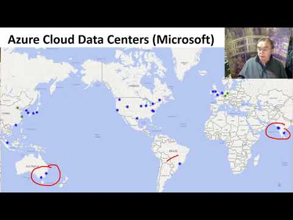{width=20%}](https://www.youtube.com/watch?v=KTNx2SEe2Jo&list=PLy0VLh_GFyz-dNRQYeX0OMnq7AeB_CeN0&index=7&t=0s)

In this lecture we comment on trends in the data center and its technologies.
Clouds physically spread across the world Green computing Fraction of world’s computing
ecosystem. In clouds and associated sizes an analysis from Cisco of size of cloud
computing is discussed in this lecture. 

## G. Cloud Infrastructure II

[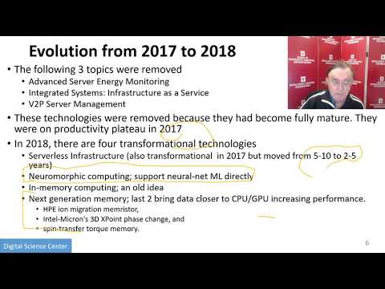{width=20%}](https://www.youtube.com/watch?v=R0Sk1rAS20M&list=PLy0VLh_GFyz-dNRQYeX0OMnq7AeB_CeN0&index=8&t=0s)

In this lecture, we discuss Gartner hypecycle and priority matrix on Compute Infrastructure Containers
compared to virtual machines The emergence of artificial intelligence as a dominant force.

## H. Cloud Software: 

[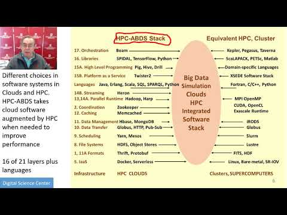{width=20%}](https://www.youtube.com/watch?v=MZrlX8fj48o&list=PLy0VLh_GFyz-dNRQYeX0OMnq7AeB_CeN0&index=9&t=0s)

In this lecture we discuss, HPC-ABDS with over 350 software packages and how to use each of 21
layers Google’s software innovations MapReduce in pictures Cloud and HPC software stacks compared Components need to support cloud/distributed system programming.

## I. Cloud Applications I: Clouds in science where area called

[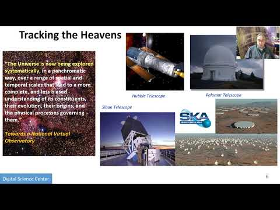{width=20%}](https://www.youtube.com/watch?v=sAbYkZHD81U&list=PLy0VLh_GFyz-dNRQYeX0OMnq7AeB_CeN0&index=10&t=0s)

In this lecture we discuss cyberinfrastructure; the science usage pattern from NIST Artificial Intelligence
from Gartner. 

## J. Cloud Applications II: Characterize Applications using NIST

[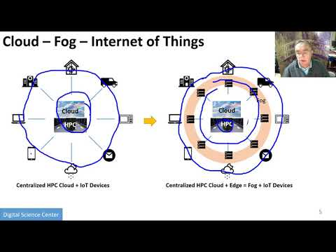{width=20%}](https://www.youtube.com/watch?v=YaPg-OOlkdw&list=PLy0VLh_GFyz-dNRQYeX0OMnq7AeB_CeN0&index=11&t=0s)

In this lecture we discuss the approach Internet of Things with different types of MapReduce. 

## K. Parallel Computing

[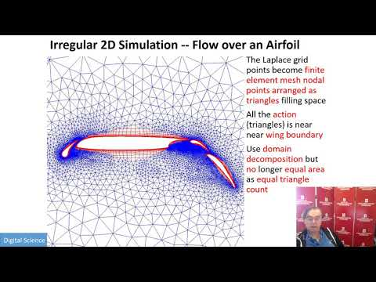{width=20%}](https://www.youtube.com/watch?v=C7OBEfyDE8c&list=PLy0VLh_GFyz-dNRQYeX0OMnq7AeB_CeN0&index=13&t=0s)

In this lecture we discuss analogies, parallel computing in pictures and some useful analogies and principles.

## L. Real Parallel Computing: Single Program/Instruction Multiple Data SIMD SPMD

[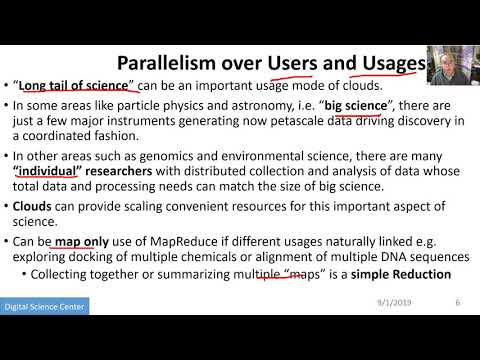{width=20%}](https://www.youtube.com/watch?v=C7OBEfyDE8c&list=PLy0VLh_GFyz-dNRQYeX0OMnq7AeB_CeN0&index=13&t=0s)

In this lecture, we discuss Big Data and Simulations compared and we furthermore discusses what is hard to do.   

## M. Storage: Cloud data

[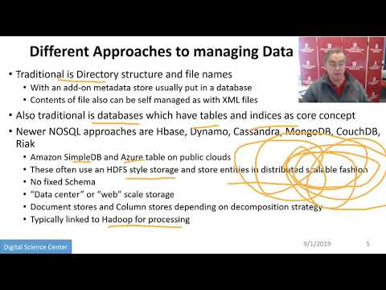{width=20%}](https://www.youtube.com/watch?v=NcIbKQ-AChA&list=PLy0VLh_GFyz-dNRQYeX0OMnq7AeB_CeN0&index=14&t=0s)

In this lecture we discuss about the approaches, repositories, file systems, data lakes. 

## N. HPC and Clouds

[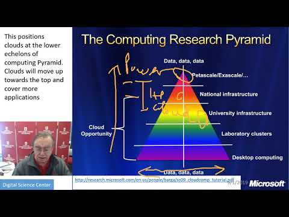{width=20%}](https://www.youtube.com/watch?v=QTxYKhpVtDw&list=PLy0VLh_GFyz-dNRQYeX0OMnq7AeB_CeN0&index=15&t=0s)

In this lecture we discuss the Branscomb Pyramid Supercomputers versus clouds Science Computing Environments. 

## O. Comparison of Data Analytics with Simulation: 

[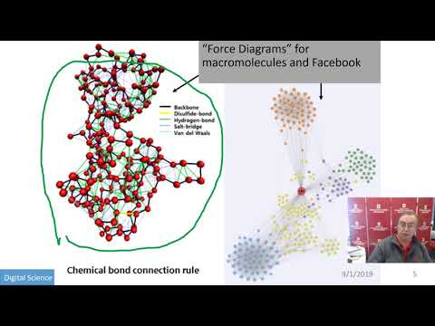{width=20%}](https://www.youtube.com/watch?v=6WmWE_7iB3w&list=PLy0VLh_GFyz-dNRQYeX0OMnq7AeB_CeN0&index=16&t=0s)

In this lecture we discuss the structure of different applications for simulations and Big Data Software
implications Languages. 

## P. The Future I

[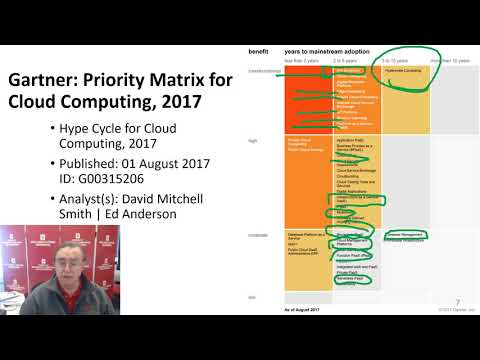{width=20%}](https://www.youtube.com/watch?v=1xH5ow5kOhc&list=PLy0VLh_GFyz-dNRQYeX0OMnq7AeB_CeN0&index=17&t=0s)

In this lecture we discuss Gartner cloud computing hypecycle and priority matrix 2017 and 2019 Hyperscale
computing Serverless and FaaS Cloud Native Microservices Update to 2019 Hypecycle. 

## Q. other Issues II

[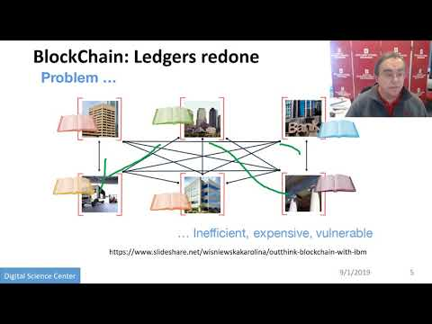{width=20%}](https://www.youtube.com/watch?v=9AmVHEXv7gY&list=PLy0VLh_GFyz-dNRQYeX0OMnq7AeB_CeN0&index=18&t=0s)

In this lecture we discuss on Security Blockchain. 

## R. The Future and other Issues III

[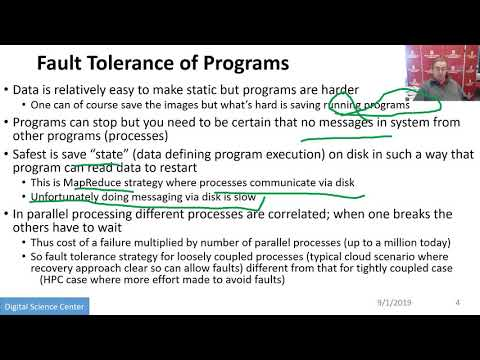{width=20%}](https://www.youtube.com/watch?v=VnkkCix3yEE&list=PLy0VLh_GFyz-dNRQYeX0OMnq7AeB_CeN0&index=19&t=0s)

In this lecture we discuss on Fault Tolerance.

