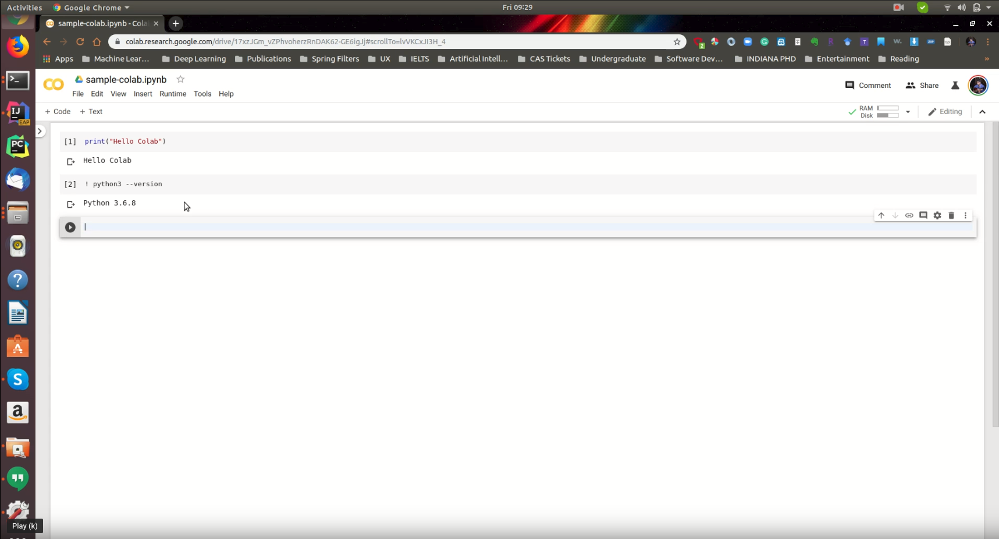
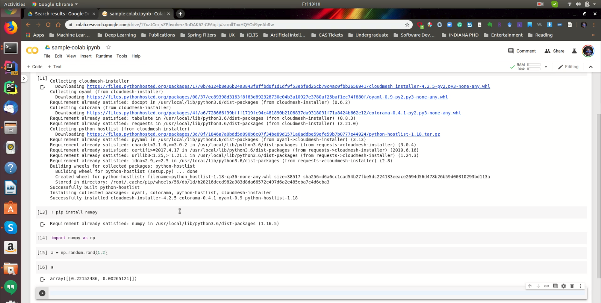
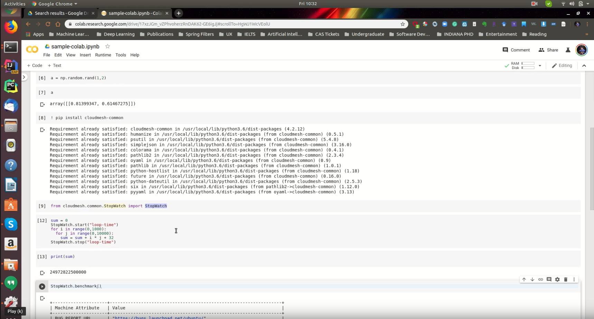

# Google Colab {#sec:534-week4}

In this section we are going to introduce you, how to use Google Colab to run deep learning models.

## How to create a Google Colab Notebook?

[{width=20%}](https://drive.google.com/file/d/1vz2_VaXCAae-9luzcrIuP_ugMmKJIy7w/view?usp=sharing)

## How to create a simple programme with Colab?

[{width=20%}](https://drive.google.com/file/d/18mGVxgydx1TDdb4AYD8qb1To8rkSLS-H/view?usp=sharing)

## How to do a benchmark with Cloudmesh Tools using Colab?

[{width=20%}](https://drive.google.com/file/d/1Ujs0XjzCTwZgmx-ADM5zx9cS5iplXfIu/view?usp=sharing)

