# Physics with Big Data Applications {#sec:534-week5}

E534 2019 Big Data Applications and Analytics Discovery of Higgs Boson Part I (Unit 8)
Section Units 9-11 Summary: This section starts by describing the LHC accelerator at CERN and evidence found by the
experiments suggesting existence of a Higgs Boson. The huge number of authors on a paper, remarks on histograms and
Feynman diagrams is followed by an accelerator picture gallery. The next unit is devoted to Python experiments looking
at histograms of Higgs Boson production with various forms of shape of signal and various background and with various
event totals. Then random variables and some simple principles of statistics are introduced with explanation as to why
they are relevant to Physics counting experiments. The unit introduces Gaussian (normal) distributions and explains why
they seen so often in natural phenomena. Several Python illustrations are given. Random Numbers with their Generators
and Seeds lead to a discussion of Binomial and Poisson Distribution. Monte-Carlo and accept-reject methods.
The Central Limit Theorem concludes discussion.

## Unit 8:

### 8.1 - Looking for Higgs: 1. Particle and Counting Introduction 1

We return to particle case with slides used in introduction and stress that particles often manifested as bumps in histograms and those bumps need to be large enough to stand out from background in a statistically significant fashion.

[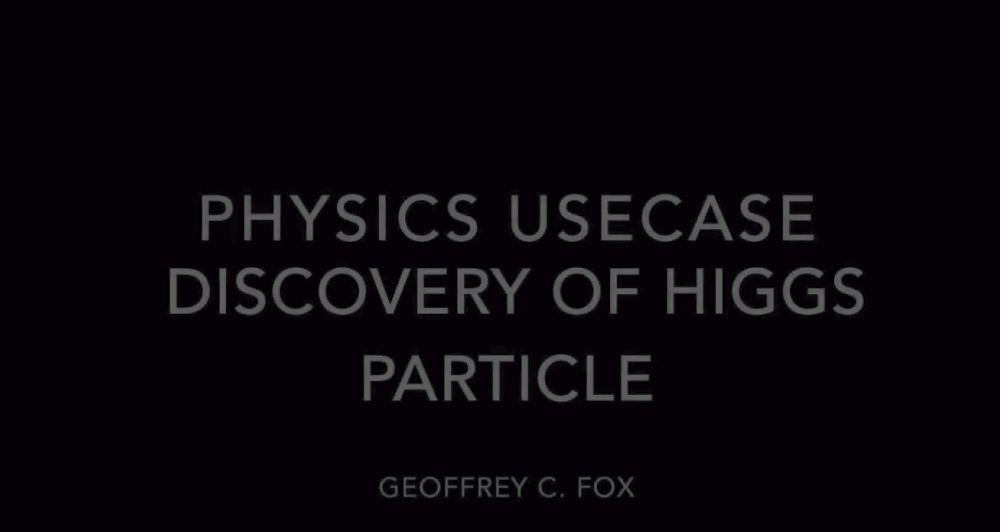{width=20%}](https://youtu.be/L0wIh0Z-ZwI?list=PLy0VLh_GFyz9xQWimvDcKEx_crcYy-B5O)

### 8.2 - Looking for Higgs: 2. Particle and Counting Introduction 2

We give a few details on one LHC experiment ATLAS. Experimental physics papers have a staggering number of authors and quite big budgets. Feynman diagrams describe processes in a fundamental fashion.

[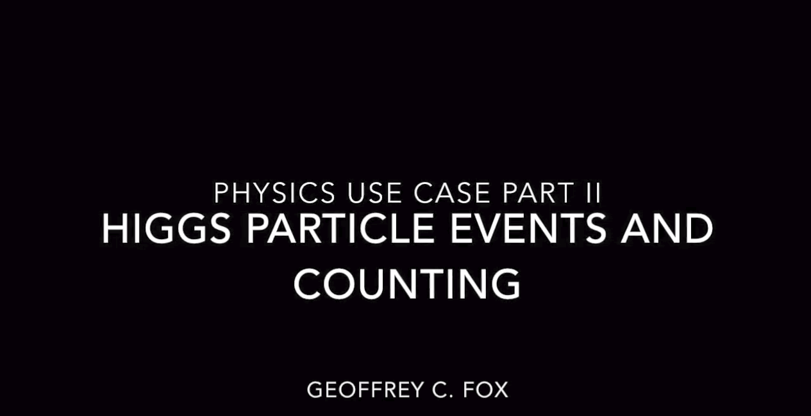{width=20%}](https://youtu.be/ulX3oIiAusI?list=PLy0VLh_GFyz9xQWimvDcKEx_crcYy-B5O)

### 8.3 - Looking for Higgs: 3. Particle Experiments

We give a few details on one LHC experiment ATLAS. Experimental physics papers have a staggering number of authors and quite big budgets. Feynman diagrams describe processes in a fundamental fashion

[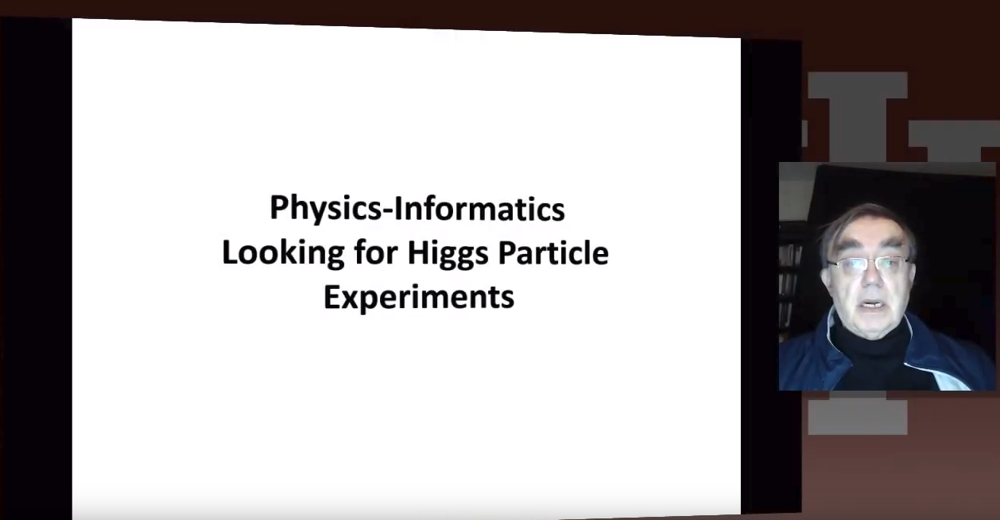{width=20%}](https://youtu.be/BW12d780qT8?list=PLy0VLh_GFyz9xQWimvDcKEx_crcYy-B5O)

### 8.4 - Looking for Higgs:  4. Accelerator Picture Gallery of Big Science

This lesson gives a small picture gallery of accelerators. Accelerators, detection chambers and magnets in tunnels and a large underground laboratory used fpr experiments where you need to be shielded from background like cosmic rays.

[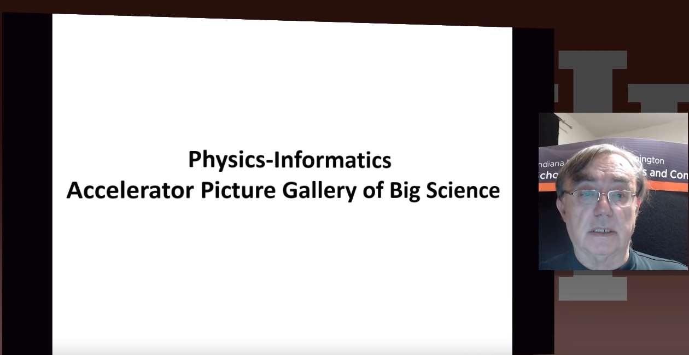{width=20%}](https://youtu.be/WLJIxWWMYi8?list=PLy0VLh_GFyz9xQWimvDcKEx_crcYy-B5O)

## Unit 9

This unit is devoted to Python experiments with Geoffrey looking at 
histograms of Higgs Boson production with various forms of shape of 
signal and various background and with various event totals

### 9.1 - Looking for Higgs II: 1: Class Software 

We discuss how this unit uses Java (deprecated) and Python on both a backend server
(FutureGrid - closed!) or a local client. We point out useful book on
Python for data analysis. This lesson is deprecated. Follow current
technology for class

[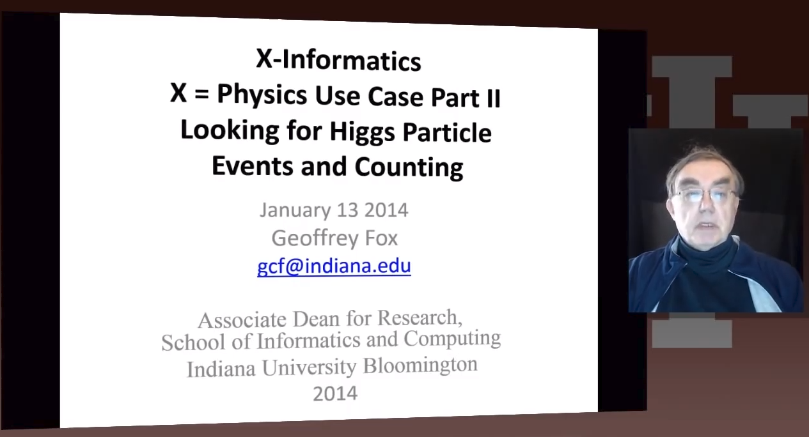{width=20%}](https://youtu.be/tOFJEUM-Vww?list=PLy0VLh_GFyz-3jA9KSt9N1fcuZoGfpZnR)

### 9.2 - Looking for Higgs II: 2: Event Counting 

We define ''event counting'' data collection environments. We discuss the python and Java
code to generate events according to a particular scenario (the
important idea of Monte Carlo data). Here a sloping background plus
either a Higgs particle generated similarly to LHC observation or one
observed with better resolution (smaller measurement error).

[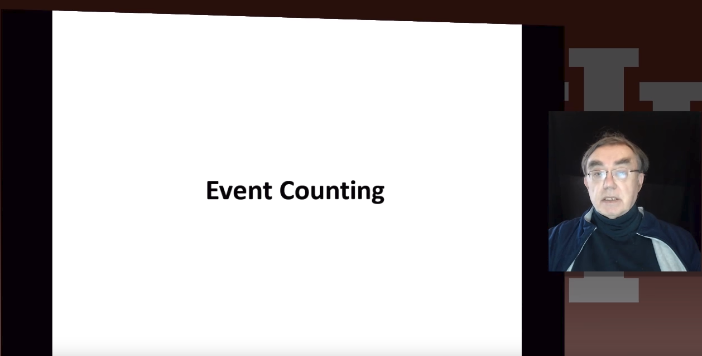{width=20%}](https://youtu.be/h8-szCeFugQ?list=PLy0VLh_GFyz-3jA9KSt9N1fcuZoGfpZnR)

### 9.3 - Looking for Higgs II: 3: With Python examples of Signal plus Background 

This uses Monte Carlo data both to generate data like the
experimental observations and explore effect of changing amount of data
and changing measurement resolution for Higgs.

[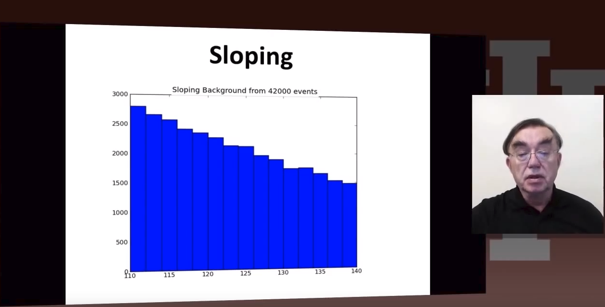{width=20%}](https://youtu.be/bl2f0tAzLj4?list=PLy0VLh_GFyz-3jA9KSt9N1fcuZoGfpZnR)

### 9.4 - Looking for Higgs II: 4: Change shape of background & number of Higgs Particles 

This lesson continues the examination of Monte Carlo
data looking at effect of change in number of Higgs particles produced
and in change in shape of background

[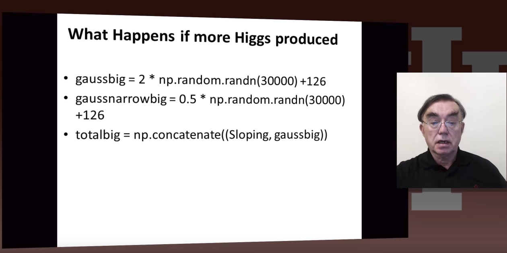{width=20%}](https://youtu.be/bw3fd5cfQhk?list=PLy0VLh_GFyz-3jA9KSt9N1fcuZoGfpZnR)

## Unit 10 

https://www.youtube.com/playlist?list=PLy0VLh_GFyz-Er5TNFj1I8ihPOXnhicj0
In this unit we discuss;

E534 2019 Big Data Applications and Analytics Discovery of Higgs Boson:
Big Data Higgs Unit 10: Looking for Higgs Particles Part III: Random
Variables, Physics and Normal Distributions Section Units 9-11 Summary:
This section starts by describing the LHC accelerator at CERN and
evidence found by the experiments suggesting existence of a Higgs Boson.
The huge number of authors on a paper, remarks on histograms and Feynman
diagrams is followed by an accelerator picture gallery. The next unit is
devoted to Python experiments looking at histograms of Higgs Boson
production with various forms of shape of signal and various background
and with various event totals. Then random variables and some simple
principles of statistics are introduced with explanation as to why they
are relevant to Physics counting experiments. The unit introduces
Gaussian (normal) distributions and explains why they seen so often in
natural phenomena. Several Python illustrations are given. Random
Numbers with their Generators and Seeds lead to a discussion of Binomial
and Poisson Distribution. Monte-Carlo and accept-reject methods. The
Central Limit Theorem concludes discussion. Big Data Higgs Unit 10:
Looking for Higgs Particles Part III: Random Variables, Physics and
Normal Distributions Overview: Geoffrey introduces random variables and
some simple principles of statistics and explains why they are relevant
to Physics counting experiments. The unit introduces Gaussian (normal)
distributions and explains why they seen so often in natural phenomena.
Several Python illustrations are given. Java is currently not available
in this unit.

### 10.1 - Statistics Overview and Fundamental Idea: Random Variables 

We go through the many different areas of statistics covered in the Physics
unit. We define the statistics concept of a random variable.

[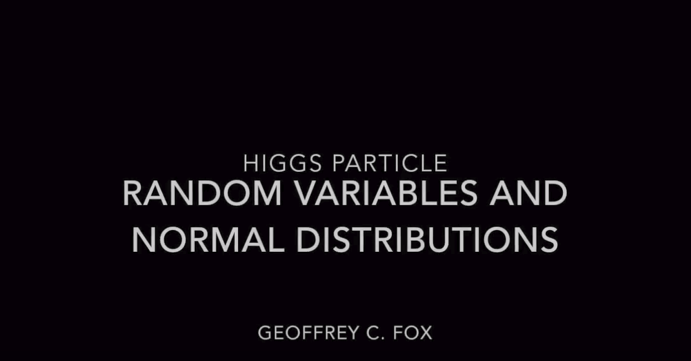{width=20%}](https://youtu.be/jCgY6MEfLWI?list=PLy0VLh_GFyz-Er5TNFj1I8ihPOXnhicj0)

### 10.2 - Physics and Random Variables I

We describe the DIKW pipeline for the analysis of this type of physics experiment 
and go through details of analysis pipeline for the LHC ATLAS experiment. 
We give examples of event displays showing the final state particles 
seen in a few events. We illustrate how physicists decide whats going 
on with a plot of expected Higgs production experimental cross sections 
(probabilities) for signal and background.

[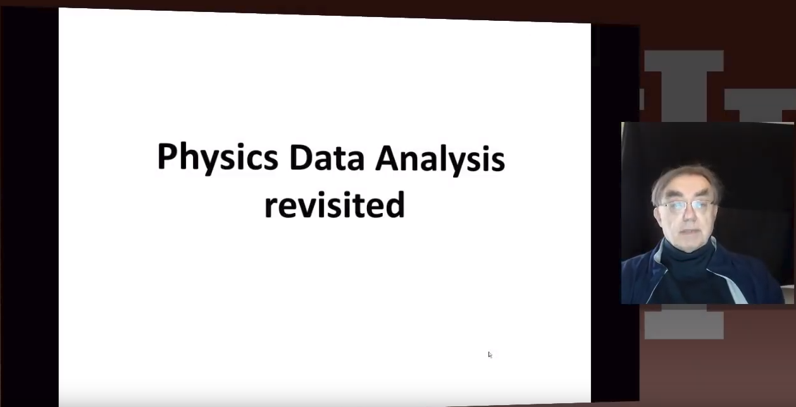{width=20%}](https://youtu.be/Tn3GBxgplxg?list=PLy0VLh_GFyz-Er5TNFj1I8ihPOXnhicj0)

### 10.3 - Physics and Random Variables II

We describe the DIKW pipeline for the analysis of this type of physics
experiment and go through details of analysis pipeline for the LHC ATLAS
experiment. We give examples of event displays showing the final state
particles seen in a few events. We illustrate how physicists decide
whats  going on with a plot of expected Higgs production experimental
cross sections (probabilities) for signal and background.

[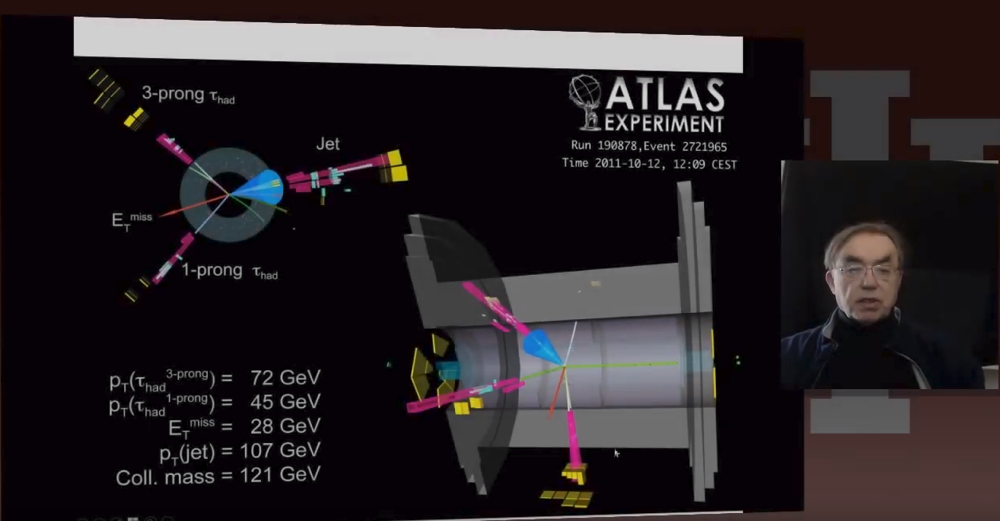{width=20%}](https://youtu.be/qWEjp0OtvdA?list=PLy0VLh_GFyz-Er5TNFj1I8ihPOXnhicj0)

### 10.4 - Statistics of Events with Normal Distributions

We introduce Poisson and Binomial distributions and define independent 
identically distributed (IID) random variables. We give the law of 
large numbers defining the errors in counting and leading to Gaussian 
distributions for many things. We demonstrate this in Python experiments.

[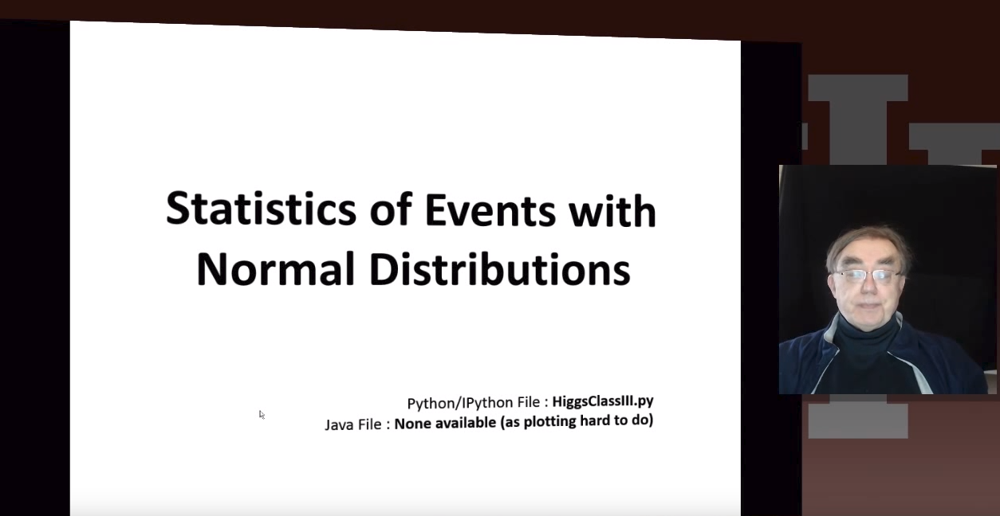{width=20%}](https://youtu.be/LMBtpWOOQLo?list=PLy0VLh_GFyz-Er5TNFj1I8ihPOXnhicj0)

### 10.5 - Gaussian Distributions

We introduce the Gaussian distribution and give Python examples of the 
fluctuations in counting Gaussian distributions.

[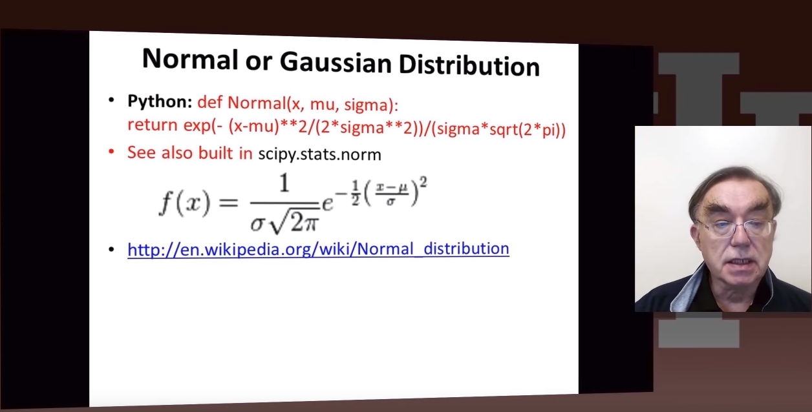{width=20%}](https://youtu.be/LWIbPa-P5W0?list=PLy0VLh_GFyz-Er5TNFj1I8ihPOXnhicj0)

### 10.6 - Using Statistics

We discuss the significance of a standard deviation and role of biases 
and insufficient statistics with a Python example in getting incorrect answers.

[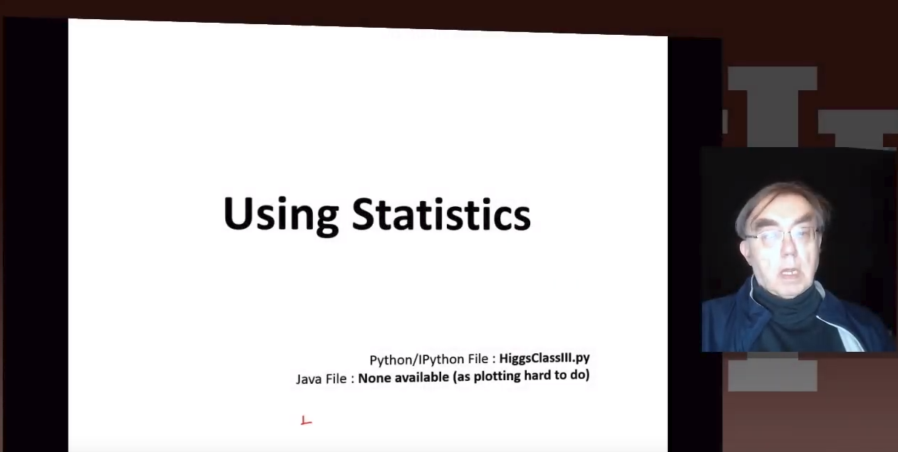{width=20%}](https://youtu.be/n4jlUrGwgic?list=PLy0VLh_GFyz-Er5TNFj1I8ihPOXnhicj0)

## Unit 11

https://www.youtube.com/playlist?list=PLy0VLh_GFyz_I7ILsaGab-NNhLuiqVpIs

In this section we discuss;

E534 2019 Big Data Applications and Analytics Discovery of Higgs Boson: 
Big Data Higgs Unit 11: Looking for Higgs Particles Part IV: Random Numbers, 
Distributions and Central Limit Theorem
Section Units 9-11 Summary: This section starts by describing the 
LHC accelerator at CERN and evidence found by the experiments suggesting 
existence of a Higgs Boson. The huge number of authors on a paper, 
remarks on histograms and Feynman diagrams is followed by an accelerator 
picture gallery. The next unit is devoted to Python experiments looking 
at histograms of Higgs Boson production with various forms of shape of 
signal and various background and with various event totals. Then random 
variables and some simple principles of statistics are introduced with 
explanation as to why they are relevant to Physics counting experiments. 
The unit introduces Gaussian (normal) distributions and explains why they 
seen so often in natural phenomena. Several Python illustrations are given. 
Random Numbers with their Generators and Seeds lead to a discussion of 
Binomial and Poisson Distribution. Monte-Carlo and accept-reject methods. 
The Central Limit Theorem concludes discussion.
Big Data Higgs Unit 11: Looking for Higgs Particles Part IV: Random Numbers, 
Distributions and Central Limit Theorem
Unit Overview: Geoffrey discusses Random Numbers with their Generators 
and Seeds. It introduces Binomial and Poisson Distribution. Monte-Carlo 
and accept-reject methods are discussed. The Central Limit Theorem and 
Bayes law concludes discussion. Python and Java (for student - not 
reviewed in class) examples and Physics applications are given.

### 11.1 - Generators and Seeds I

We define random numbers and describe how to generate them on the computer 
giving Python examples. We define the seed used to define to specify how to start generation.

[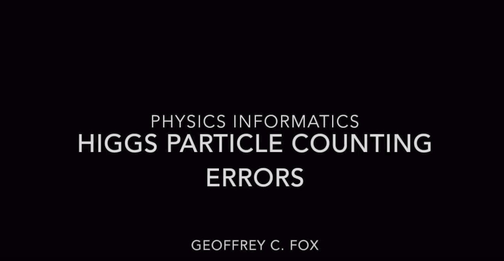{width=20%}](https://youtu.be/r80Sk_KVG2s?list=PLy0VLh_GFyz_I7ILsaGab-NNhLuiqVpIs)

### 11.2 - Generators and Seeds II

We define random numbers and describe how to generate them on the computer 
giving Python examples. We define the seed used to define to specify how to start generation.

[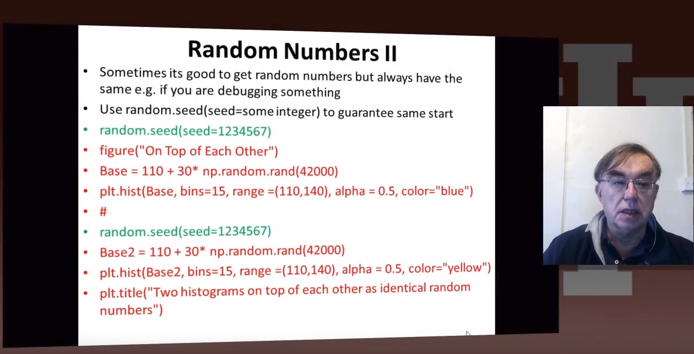{width=20%}](https://youtu.be/9QY5qkQj2Ag?list=PLy0VLh_GFyz_I7ILsaGab-NNhLuiqVpIs)

### 11.3 - Binomial Distribution

We define binomial distribution and give LHC data as an eaxmple of where this distribution valid.

[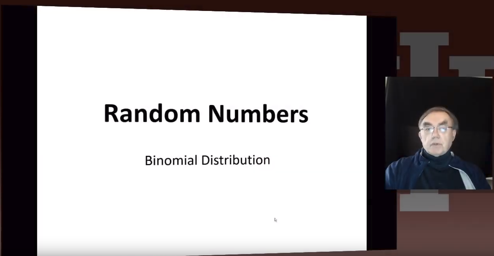{width=20%}](https://youtu.be/DPd-eVI_twQ?list=PLy0VLh_GFyz_I7ILsaGab-NNhLuiqVpIs)

### 11.4 - Accept-Reject

We introduce an advanced method -- accept/reject -- for generating random variables with arbitrary distrubitions.

[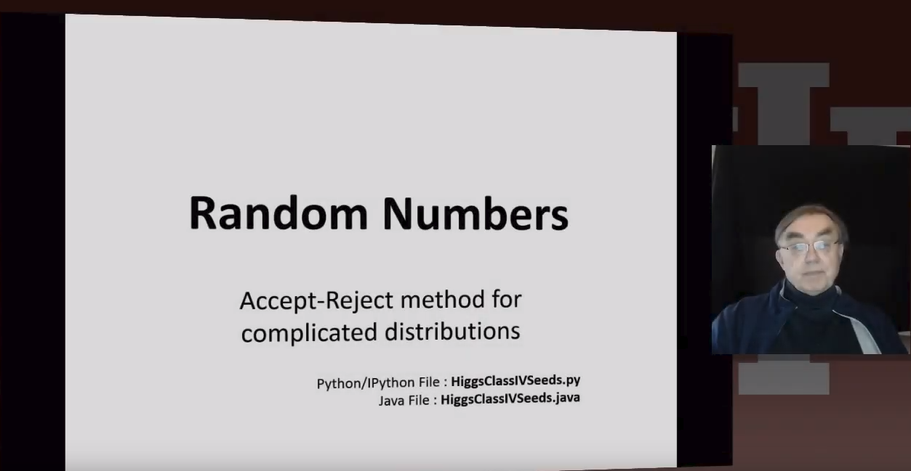{width=20%}](https://youtu.be/GfshkKMKCj8?list=PLy0VLh_GFyz_I7ILsaGab-NNhLuiqVpIs)

### 11.5 - Monte Carlo Method

We define Monte Carlo method which usually uses accept/reject method in typical case for distribution.

[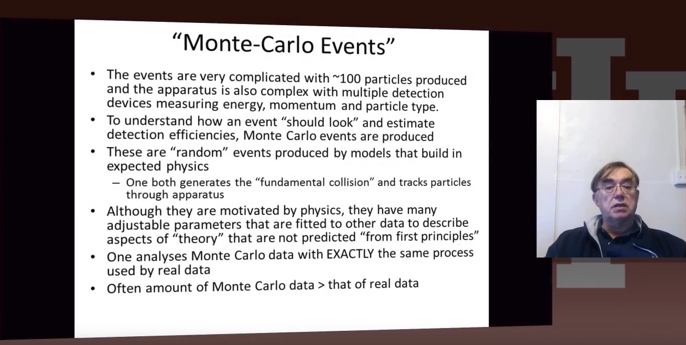{width=20%}](https://youtu.be/kIQ-BTyDfOQ?list=PLy0VLh_GFyz_I7ILsaGab-NNhLuiqVpIs)

### 11.6 - Poisson Distribution

We extend the Binomial to the Poisson distribution and give a set of amusing examples from Wikipedia.

[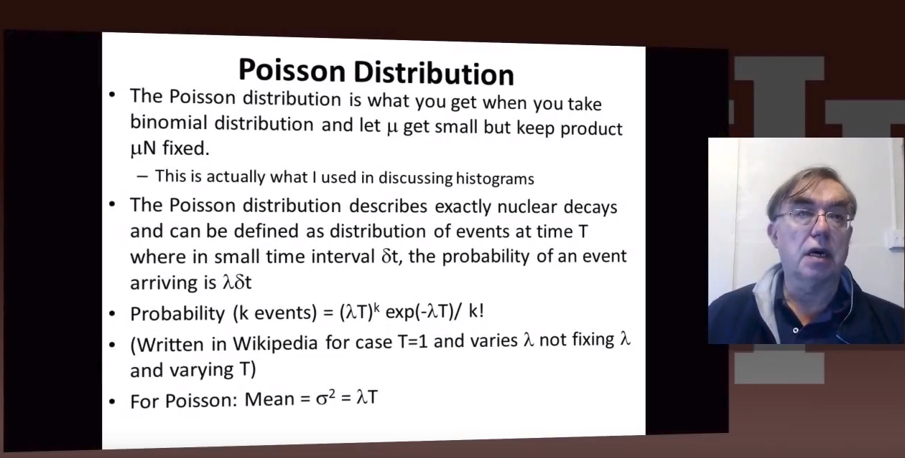{width=20%}](https://youtu.be/WFvgsVo-k4s?list=PLy0VLh_GFyz_I7ILsaGab-NNhLuiqVpIs)

### 11.7 - Central Limit Theorem

We introduce Central Limit Theorem and give examples from Wikipedia.

[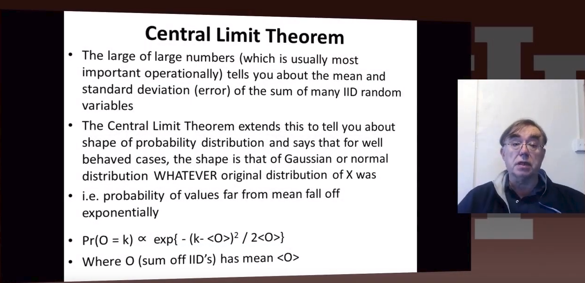{width=20%}](https://youtu.be/ZO53iKlPn7c?list=PLy0VLh_GFyz_I7ILsaGab-NNhLuiqVpIs)

### 11.8 - Interpretation of Probability: Bayes v. Frequency

This lesson describes difference between Bayes and frequency views of 
probability. Bayes's law of conditional probability is derived and applied 
to Higgs example to enable information about Higgs from multiple channels 
and multiple experiments to be accumulated.

[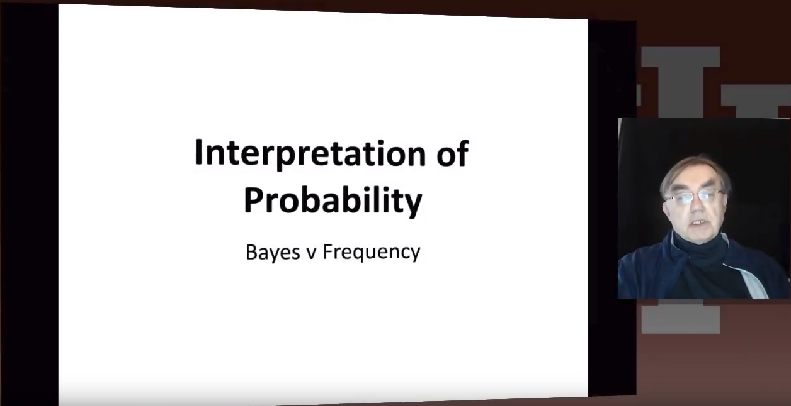{width=20%}](https://youtu.be/jzDkExAQI9M?list=PLy0VLh_GFyz_I7ILsaGab-NNhLuiqVpIs)