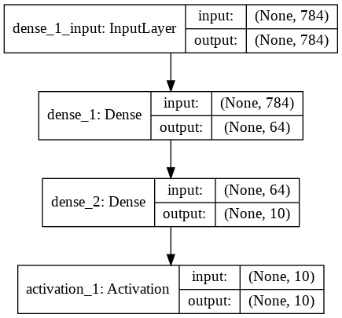

# Week 5 {#sec:534-week5}

## Deep Learning Lesson 1: MNIST Classification Version 1

## Using Cloudmesh Common

Here we do a simple benchmark. We calculate compile time, train time, test time and data loading time for this example.
Installing cloudmesh-common library is the first step.


```python
!pip install cloudmesh-common
```

    Collecting cloudmesh-common
    [?25l  Downloading https://files.pythonhosted.org/packages/42/72/3c4aabce294273db9819be4a0a350f506d2b50c19b7177fb6cfe1cbbfe63/cloudmesh_common-4.2.13-py2.py3-none-any.whl (55kB)
         |████████████████████████████████| 61kB 4.1MB/s
    [?25hRequirement already satisfied: future in /usr/local/lib/python3.6/dist-packages (from cloudmesh-common) (0.16.0)
    Collecting pathlib2 (from cloudmesh-common)
      Downloading https://files.pythonhosted.org/packages/e9/45/9c82d3666af4ef9f221cbb954e1d77ddbb513faf552aea6df5f37f1a4859/pathlib2-2.3.5-py2.py3-none-any.whl
    Requirement already satisfied: python-dateutil in /usr/local/lib/python3.6/dist-packages (from cloudmesh-common) (2.5.3)
    Collecting simplejson (from cloudmesh-common)
    [?25l  Downloading https://files.pythonhosted.org/packages/e3/24/c35fb1c1c315fc0fffe61ea00d3f88e85469004713dab488dee4f35b0aff/simplejson-3.16.0.tar.gz (81kB)
         |████████████████████████████████| 81kB 10.6MB/s
    [?25hCollecting python-hostlist (from cloudmesh-common)
      Downloading https://files.pythonhosted.org/packages/3d/0f/1846a7a0bdd5d890b6c07f34be89d1571a6addbe59efe59b7b0777e44924/python-hostlist-1.18.tar.gz
    Requirement already satisfied: pathlib in /usr/local/lib/python3.6/dist-packages (from cloudmesh-common) (1.0.1)
    Collecting colorama (from cloudmesh-common)
      Downloading https://files.pythonhosted.org/packages/4f/a6/728666f39bfff1719fc94c481890b2106837da9318031f71a8424b662e12/colorama-0.4.1-py2.py3-none-any.whl
    Collecting oyaml (from cloudmesh-common)
      Downloading https://files.pythonhosted.org/packages/00/37/ec89398d3163f8f63d892328730e04b3a10927e3780af25baf1ec74f880f/oyaml-0.9-py2.py3-none-any.whl
    Requirement already satisfied: humanize in /usr/local/lib/python3.6/dist-packages (from cloudmesh-common) (0.5.1)
    Requirement already satisfied: psutil in /usr/local/lib/python3.6/dist-packages (from cloudmesh-common) (5.4.8)
    Requirement already satisfied: six in /usr/local/lib/python3.6/dist-packages (from pathlib2->cloudmesh-common) (1.12.0)
    Requirement already satisfied: pyyaml in /usr/local/lib/python3.6/dist-packages (from oyaml->cloudmesh-common) (3.13)
    Building wheels for collected packages: simplejson, python-hostlist
      Building wheel for simplejson (setup.py) ... [?25l[?25hdone
      Created wheel for simplejson: filename=simplejson-3.16.0-cp36-cp36m-linux_x86_64.whl size=114018 sha256=a6f35adb86819ff3de6c0afe475229029305b1c55c5a32b442fe94cda9500464
      Stored in directory: /root/.cache/pip/wheels/5d/1a/1e/0350bb3df3e74215cd91325344cc86c2c691f5306eb4d22c77
      Building wheel for python-hostlist (setup.py) ... [?25l[?25hdone
      Created wheel for python-hostlist: filename=python_hostlist-1.18-cp36-none-any.whl size=38517 sha256=71fbb29433b52fab625e17ef2038476b910bc80b29a822ed00a783d3b1fb73e4
      Stored in directory: /root/.cache/pip/wheels/56/db/1d/b28216dccd982a983d8da66572c497d6a2e485eba7c4d6cba3
    Successfully built simplejson python-hostlist
    Installing collected packages: pathlib2, simplejson, python-hostlist, colorama, oyaml, cloudmesh-common
    Successfully installed cloudmesh-common-4.2.13 colorama-0.4.1 oyaml-0.9 pathlib2-2.3.5 python-hostlist-1.18 simplejson-3.16.0


In this lesson we discuss in how to create a simple IPython Notebook to solve
an image classification problem. MNIST contains a set of pictures


```python
! python3 --version
```

    Python 3.6.8


```python
! pip install tensorflow-gpu==1.14.0
```

    Collecting tensorflow-gpu==1.14.0
    [?25l  Downloading https://files.pythonhosted.org/packages/76/04/43153bfdfcf6c9a4c38ecdb971ca9a75b9a791bb69a764d652c359aca504/tensorflow_gpu-1.14.0-cp36-cp36m-manylinux1_x86_64.whl (377.0MB)
         |████████████████████████████████| 377.0MB 77kB/s
    [?25hRequirement already satisfied: six>=1.10.0 in /usr/local/lib/python3.6/dist-packages (from tensorflow-gpu==1.14.0) (1.12.0)
    Requirement already satisfied: grpcio>=1.8.6 in /usr/local/lib/python3.6/dist-packages (from tensorflow-gpu==1.14.0) (1.15.0)
    Requirement already satisfied: protobuf>=3.6.1 in /usr/local/lib/python3.6/dist-packages (from tensorflow-gpu==1.14.0) (3.7.1)
    Requirement already satisfied: keras-applications>=1.0.6 in /usr/local/lib/python3.6/dist-packages (from tensorflow-gpu==1.14.0) (1.0.8)
    Requirement already satisfied: gast>=0.2.0 in /usr/local/lib/python3.6/dist-packages (from tensorflow-gpu==1.14.0) (0.2.2)
    Requirement already satisfied: astor>=0.6.0 in /usr/local/lib/python3.6/dist-packages (from tensorflow-gpu==1.14.0) (0.8.0)
    Requirement already satisfied: absl-py>=0.7.0 in /usr/local/lib/python3.6/dist-packages (from tensorflow-gpu==1.14.0) (0.8.0)
    Requirement already satisfied: wrapt>=1.11.1 in /usr/local/lib/python3.6/dist-packages (from tensorflow-gpu==1.14.0) (1.11.2)
    Requirement already satisfied: wheel>=0.26 in /usr/local/lib/python3.6/dist-packages (from tensorflow-gpu==1.14.0) (0.33.6)
    Requirement already satisfied: tensorflow-estimator<1.15.0rc0,>=1.14.0rc0 in /usr/local/lib/python3.6/dist-packages (from tensorflow-gpu==1.14.0) (1.14.0)
    Requirement already satisfied: tensorboard<1.15.0,>=1.14.0 in /usr/local/lib/python3.6/dist-packages (from tensorflow-gpu==1.14.0) (1.14.0)
    Requirement already satisfied: numpy<2.0,>=1.14.5 in /usr/local/lib/python3.6/dist-packages (from tensorflow-gpu==1.14.0) (1.16.5)
    Requirement already satisfied: termcolor>=1.1.0 in /usr/local/lib/python3.6/dist-packages (from tensorflow-gpu==1.14.0) (1.1.0)
    Requirement already satisfied: keras-preprocessing>=1.0.5 in /usr/local/lib/python3.6/dist-packages (from tensorflow-gpu==1.14.0) (1.1.0)
    Requirement already satisfied: google-pasta>=0.1.6 in /usr/local/lib/python3.6/dist-packages (from tensorflow-gpu==1.14.0) (0.1.7)
    Requirement already satisfied: setuptools in /usr/local/lib/python3.6/dist-packages (from protobuf>=3.6.1->tensorflow-gpu==1.14.0) (41.2.0)
    Requirement already satisfied: h5py in /usr/local/lib/python3.6/dist-packages (from keras-applications>=1.0.6->tensorflow-gpu==1.14.0) (2.8.0)
    Requirement already satisfied: markdown>=2.6.8 in /usr/local/lib/python3.6/dist-packages (from tensorboard<1.15.0,>=1.14.0->tensorflow-gpu==1.14.0) (3.1.1)
    Requirement already satisfied: werkzeug>=0.11.15 in /usr/local/lib/python3.6/dist-packages (from tensorboard<1.15.0,>=1.14.0->tensorflow-gpu==1.14.0) (0.15.6)
    Installing collected packages: tensorflow-gpu
    Successfully installed tensorflow-gpu-1.14.0


## Import Libraries

Note: https://python-future.org/quickstart.html


```python
from __future__ import absolute_import
from __future__ import division
from __future__ import print_function

import time

import numpy as np
from keras.models import Sequential
from keras.layers import Dense, Activation, Dropout
from keras.utils import to_categorical, plot_model
from keras.datasets import mnist

from cloudmesh.common.StopWatch import StopWatch

```

    Using TensorFlow backend.


## Pre-process data

### Load data

First we load the data from the inbuilt mnist dataset from Keras


```python
StopWatch.start("data-load")
(x_train, y_train), (x_test, y_test) = mnist.load_data()
StopWatch.stop("data-load")
```

    Downloading data from https://s3.amazonaws.com/img-datasets/mnist.npz
    11493376/11490434 [==============================] - 1s 0us/step


### Identify Number of Classes

As this is a number classification problem. We need to know how many classes are there.
So we'll count the number of unique labels.


```python
num_labels = len(np.unique(y_train))
```

### Convert Labels To One-Hot Vector

**|Exercise:** Understand what is an one-hot vector?


```python
y_train = to_categorical(y_train)
y_test = to_categorical(y_test)
```

## Image Reshaping

The training model is designed by considering the data as a vector.
This is a model dependent modification. Here we assume the image is
a squared shape image.


```python
image_size = x_train.shape[1]
input_size = image_size * image_size
```

## Resize and Normalize

The next step is to continue the reshaping to a fit into a vector
and normalize the data. Image values are from 0 - 255, so an
easy way to normalize is to divide by the maximum value.

**|Execrcise: Suggest another way to normalize the data preserving the accuracy or improving the accuracy.**


```python
x_train = np.reshape(x_train, [-1, input_size])
x_train = x_train.astype('float32') / 255
x_test = np.reshape(x_test, [-1, input_size])
x_test = x_test.astype('float32') / 255
```

## Create a Keras Model

Keras is a neural network library. Most important thing with Keras is the way we design the neural network.

In this model we have a couple of ideas to understand.

**|Exercise MNIST_V1.1: Find out what is a dense layer?**

A simple model can be initiated by using an **Sequential** instance in Keras.
For this instance we add a single layer.

1. Dense Layer
2. Activation Layer (Softmax is the activation function)

Dense layer and the layer followed by it is fully connected.
For instance the number of hidden units used here is 64
and the following layer is a dense layer followed by an activation
layer.

**|Execrcise MNIST_V1.2: Find out what is the use of an activation function. Find out why, softmax was used as the last layer.**


```python
batch_size = 4
hidden_units = 64

model = Sequential()
model.add(Dense(hidden_units, input_dim=input_size))
model.add(Dense(num_labels))
model.add(Activation('softmax'))
model.summary()
plot_model(model, to_file='mnist_v1.png', show_shapes=True)
```

    WARNING:tensorflow:From /usr/local/lib/python3.6/dist-packages/keras/backend/tensorflow_backend.py:66: The name tf.get_default_graph is deprecated. Please use tf.compat.v1.get_default_graph instead.

    WARNING:tensorflow:From /usr/local/lib/python3.6/dist-packages/keras/backend/tensorflow_backend.py:541: The name tf.placeholder is deprecated. Please use tf.compat.v1.placeholder instead.

    WARNING:tensorflow:From /usr/local/lib/python3.6/dist-packages/keras/backend/tensorflow_backend.py:4432: The name tf.random_uniform is deprecated. Please use tf.random.uniform instead.

    Model: "sequential_1"
    _________________________________________________________________
    Layer (type)                 Output Shape              Param #
    =================================================================
    dense_1 (Dense)              (None, 64)                50240
    _________________________________________________________________
    dense_2 (Dense)              (None, 10)                650
    _________________________________________________________________
    activation_1 (Activation)    (None, 10)                0
    =================================================================
    Total params: 50,890
    Trainable params: 50,890
    Non-trainable params: 0
    _________________________________________________________________





## Compile and Train

A keras model need to be compiled before it can be used to train
the model. In the compile function, you can provide the optimization
that you want to add, metrics you expect and the type of loss function
you need to use.

Here we use the adam optimizer, a famous optimizer used in neural networks.

**Exercise: Find 3 other optimizers used on neural networks.**

The loss funtion we have used is the categorical_crossentropy.

**Exercise: Find other loss functions provided in keras. Your answer can limit to 1 or more.**

Once the model is compiled, then the fit function is called upon passing the number of epochs,
traing data and batch size.

The batch size determines the number of elements used per minibatch in optimizing the function.

**Note: Change the number of epochs, batch size and see what happens.**

**Exercise: Figure out a way to plot the loss function value. You can use any method you like.**


```python
StopWatch.start("compile")
model.compile(loss='categorical_crossentropy',
              optimizer='adam',
              metrics=['accuracy'])
StopWatch.stop("compile")
StopWatch.start("train")
model.fit(x_train, y_train, epochs=1, batch_size=batch_size)
StopWatch.stop("train")
```

    WARNING:tensorflow:From /usr/local/lib/python3.6/dist-packages/keras/optimizers.py:793: The name tf.train.Optimizer is deprecated. Please use tf.compat.v1.train.Optimizer instead.

    WARNING:tensorflow:From /usr/local/lib/python3.6/dist-packages/keras/backend/tensorflow_backend.py:3576: The name tf.log is deprecated. Please use tf.math.log instead.

    WARNING:tensorflow:From /usr/local/lib/python3.6/dist-packages/tensorflow/python/ops/math_grad.py:1250: add_dispatch_support.<locals>.wrapper (from tensorflow.python.ops.array_ops) is deprecated and will be removed in a future version.
    Instructions for updating:
    Use tf.where in 2.0, which has the same broadcast rule as np.where
    WARNING:tensorflow:From /usr/local/lib/python3.6/dist-packages/keras/backend/tensorflow_backend.py:1033: The name tf.assign_add is deprecated. Please use tf.compat.v1.assign_add instead.

    Epoch 1/1
    60000/60000 [==============================] - 20s 336us/step - loss: 0.3717 - acc: 0.8934


## Testing

Now we can test the trained model. Use the evaluate function by passing
test data and batch size and the accuracy and the loss value can be retrieved.

**Exercise: Try to optimize the network by changing the number of epochs, batch size and record the best accuracy that you can gain**


```python
StopWatch.start("test")
loss, acc = model.evaluate(x_test, y_test, batch_size=batch_size)
print("\nTest accuracy: %.1f%%" % (100.0 * acc))
StopWatch.stop("test")
```

    10000/10000 [==============================] - 1s 138us/step

    Test accuracy: 91.0%


```python
StopWatch.benchmark()
```


    +---------------------+------------------------------------------------------------------+
    | Machine Attribute   | Value                                                            |
    +---------------------+------------------------------------------------------------------+
    | BUG_REPORT_URL      | "https://bugs.launchpad.net/ubuntu/"                             |
    | DISTRIB_CODENAME    | bionic                                                           |
    | DISTRIB_DESCRIPTION | "Ubuntu 18.04.3 LTS"                                             |
    | DISTRIB_ID          | Ubuntu                                                           |
    | DISTRIB_RELEASE     | 18.04                                                            |
    | HOME_URL            | "https://www.ubuntu.com/"                                        |
    | ID                  | ubuntu                                                           |
    | ID_LIKE             | debian                                                           |
    | NAME                | "Ubuntu"                                                         |
    | PRETTY_NAME         | "Ubuntu 18.04.3 LTS"                                             |
    | PRIVACY_POLICY_URL  | "https://www.ubuntu.com/legal/terms-and-policies/privacy-policy" |
    | SUPPORT_URL         | "https://help.ubuntu.com/"                                       |
    | UBUNTU_CODENAME     | bionic                                                           |
    | VERSION             | "18.04.3 LTS (Bionic Beaver)"                                    |
    | VERSION_CODENAME    | bionic                                                           |
    | VERSION_ID          | "18.04"                                                          |
    | cpu_count           | 2                                                                |
    | mac_version         |                                                                  |
    | machine             | ('x86_64',)                                                      |
    | mem_active          | 973.8 MiB                                                        |
    | mem_available       | 11.7 GiB                                                         |
    | mem_free            | 5.1 GiB                                                          |
    | mem_inactive        | 6.3 GiB                                                          |
    | mem_percent         | 8.3%                                                             |
    | mem_total           | 12.7 GiB                                                         |
    | mem_used            | 877.3 MiB                                                        |
    | node                | ('8281485b0a16',)                                                |
    | platform            | Linux-4.14.137+-x86_64-with-Ubuntu-18.04-bionic                  |
    | processor           | ('x86_64',)                                                      |
    | processors          | Linux                                                            |
    | python              | 3.6.8 (default, Jan 14 2019, 11:02:34)                           |
    |                     | [GCC 8.0.1 20180414 (experimental) [trunk revision 259383]]      |
    | release             | ('4.14.137+',)                                                   |
    | sys                 | linux                                                            |
    | system              | Linux                                                            |
    | user                |                                                                  |
    | version             | #1 SMP Thu Aug 8 02:47:02 PDT 2019                               |
    | win_version         |                                                                  |
    +---------------------+------------------------------------------------------------------+
    +-----------+-------+---------------------+-----+-------------------+------+--------+-------------+-------------+
    | timer     | time  | start               | tag | node              | user | system | mac_version | win_version |
    +-----------+-------+---------------------+-----+-------------------+------+--------+-------------+-------------+
    | data-load | 1.335 | 2019-09-27 13:37:41 |     | ('8281485b0a16',) |      | Linux  |             |             |
    | compile   | 0.047 | 2019-09-27 13:37:43 |     | ('8281485b0a16',) |      | Linux  |             |             |
    | train     | 20.58 | 2019-09-27 13:37:43 |     | ('8281485b0a16',) |      | Linux  |             |             |
    | test      | 1.393 | 2019-09-27 13:38:03 |     | ('8281485b0a16',) |      | Linux  |             |             |
    +-----------+-------+---------------------+-----+-------------------+------+--------+-------------+-------------+

    timer,time,starttag,node,user,system,mac_version,win_version
    data-load,1.335,None,('8281485b0a16',),,Linux,,
    compile,0.047,None,('8281485b0a16',),,Linux,,
    train,20.58,None,('8281485b0a16',),,Linux,,
    test,1.393,None,('8281485b0a16',),,Linux,,


## Final Note

This programme can be defined as a hello world programme in deep learning.
Objective of this exercise is not to teach you the depths of deep learning.
But to teach you basic concepts that may need to design a simple network to
solve a problem. Before running the whole code, read all the instructions
before a code section. Solve all the problems noted in bold text with Exercise keyword.
Write your answers and submit a PDF by following the **Assignment 4**.
Include codes or observations you made on those sections.


### Reference:

[Mnist Database](https://en.wikipedia.org/wiki/MNIST_database)

[Advanced Deep Learning Models](https://github.com/PacktPublishing/Advanced-Deep-Learning-with-Keras)

[Minist Deep Learning](http://deeplearning.net/tutorial/gettingstarted.html)
