# Sports with Big Data Applications {#sec:534-week7}

E534 2019 Big Data Applications and Analytics Sports Informatics Part I
(Unit 32) Section Summary (Parts I, II, III): Sports sees significant
growth in analytics with pervasive statistics shifting to more
sophisticated measures. We start with baseball as game is built around
segments dominated by individuals where detailed (video/image)
achievement measures including PITCHf/x and FIELDf/x are moving field
into big data arena. There are interesting relationships between the
economics of sports and big data analytics. We look at Wearables and
consumer sports/recreation. The importance of spatial visualization is
discussed. We look at other Sports: Soccer, Olympics, NFL Football,
Basketball, Tennis and Horse Racing. 

## Unit 32

Unit Summary (PartI, Unit 32): This unit discusses baseball starting
with the movie Moneyball and the 2002-2003 Oakland Athletics. Unlike
sports like basketball and soccer, most baseball action is built around
individuals often interacting in pairs. This is much easier to quantify
than many player phenomena in other sports. We discuss
Performance-Dollar relationship including new stadiums and
media/advertising. We look at classic baseball averages and
sophisticated measures like Wins Above Replacement.

### Lesson Summaries

## BDAA 32.1 - E534 Sports - Introduction and Sabermetrics (Baseball Informatics) Lesson

Introduction to all Sports Informatics, Moneyball The 2002-2003 Oakland
Athletics, Diamond Dollars economic model of baseball, Performance -
Dollar relationship, Value of a Win.

[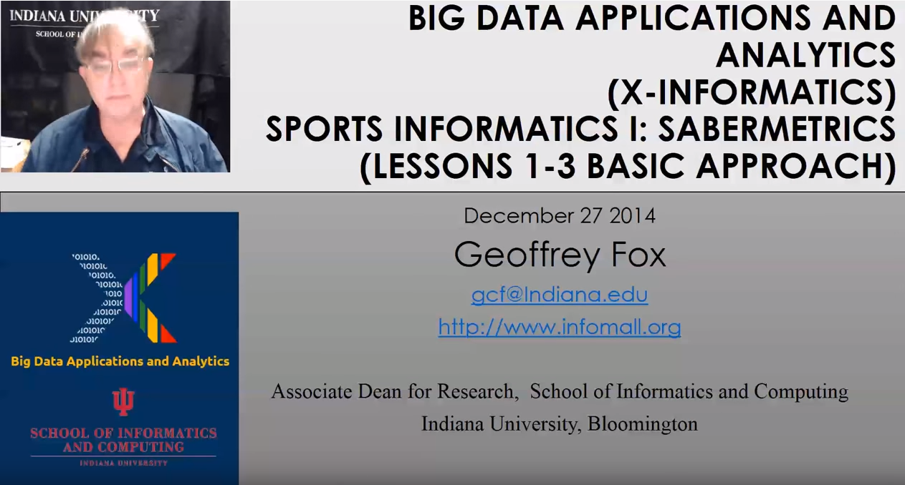{width=20%}](https://youtu.be/oviNJ-_fLto?list=PLy0VLh_GFyz9fOyeKFJZ11y7VrUULv9_r)

### BDAA 32.2 - E534 Sports - Basic Sabermetrics

Different Types of Baseball Data, Sabermetrics, Overview of all data, 
Details of some statistics based on basic data, OPS, wOBA, ERA, ERC, FIP, UZR.

[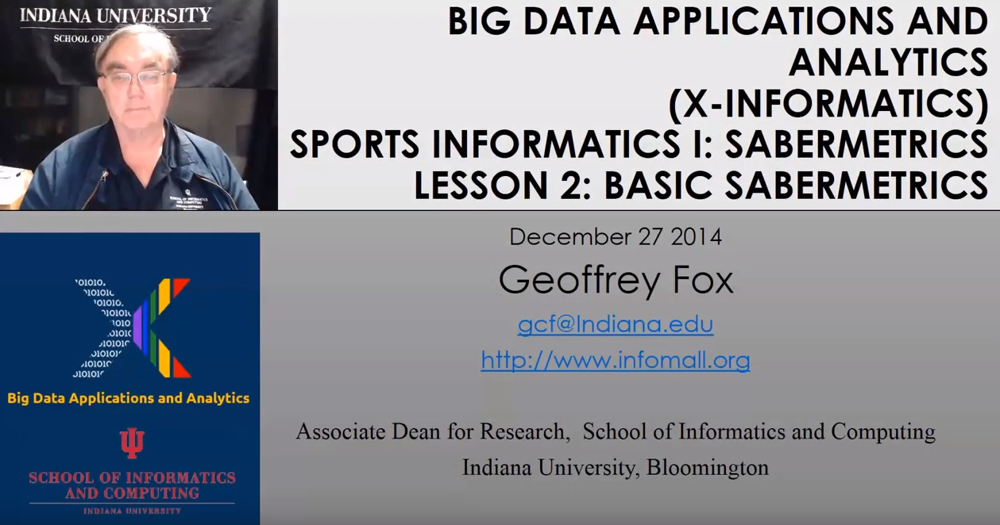{width=20%}](https://youtu.be/-5JYfQXC2ew?list=PLy0VLh_GFyz9fOyeKFJZ11y7VrUULv9_r)

### BDAA 32.3 - E534 Sports - Wins Above Replacement

Wins above Replacement WAR, Discussion of Calculation, Examples,
Comparisons of different methods, Coefficient of Determination, Another,
Sabermetrics Example, Summary of Sabermetrics.

[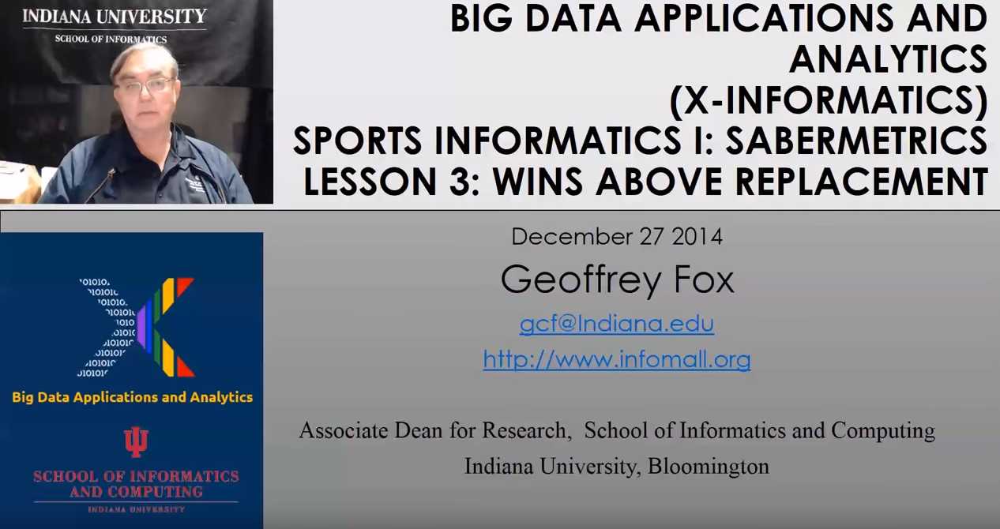{width=20%}](https://youtu.be/V5uzUS6jdHw?list=PLy0VLh_GFyz9fOyeKFJZ11y7VrUULv9_r)

## Unit 33

E534 2019 Big Data Applications and Analytics Sports Informatics Part II
(Unit 33) Section Summary (Parts I, II, III): Sports sees significant
growth in analytics with pervasive statistics shifting to more
sophisticated measures. We start with baseball as game is built around
segments dominated by individuals where detailed (video/image)
achievement measures including PITCHf/x and FIELDf/x are moving field
into big data arena. There are interesting relationships between the
economics of sports and big data analytics. We look at Wearables and
consumer sports/recreation. The importance of spatial visualization is
discussed. We look at other Sports: Soccer, Olympics, NFL Football,
Basketball, Tennis and Horse Racing.

Unit Summary (Part II, Unit 33): 
This unit discusses 'advanced sabermetrics' covering advances possible 
from using video from PITCHf/X, FIELDf/X, HITf/X, COMMANDf/X and MLBAM.

### BDAA 33.1 - E534 Sports - Pitching Clustering

A Big Data Pitcher Clustering method introduced by Vince Gennaro, Data 
from Blog and video at 2013 SABR conference

[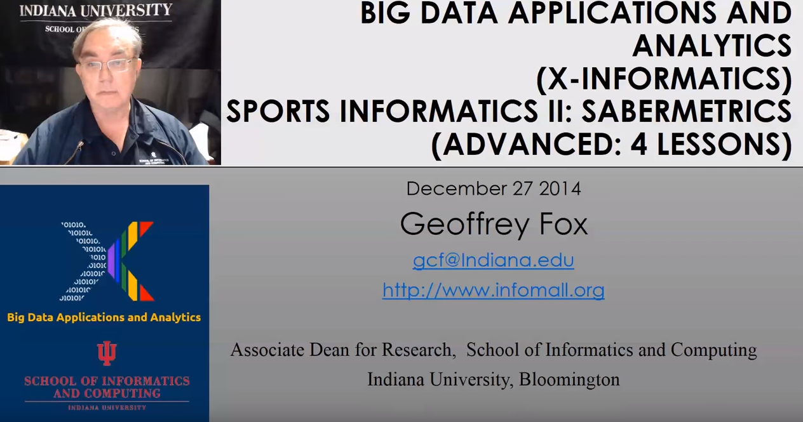{width=20%}](https://youtu.be/I06_AOKyB20?list=PLy0VLh_GFyz-zMiTL3T39NjxbWkmU9F_a)

### BDAA 33.2 - E534 Sports - Pitcher Quality

Results of optimizing match ups, Data from video at 2013 SABR conference.

[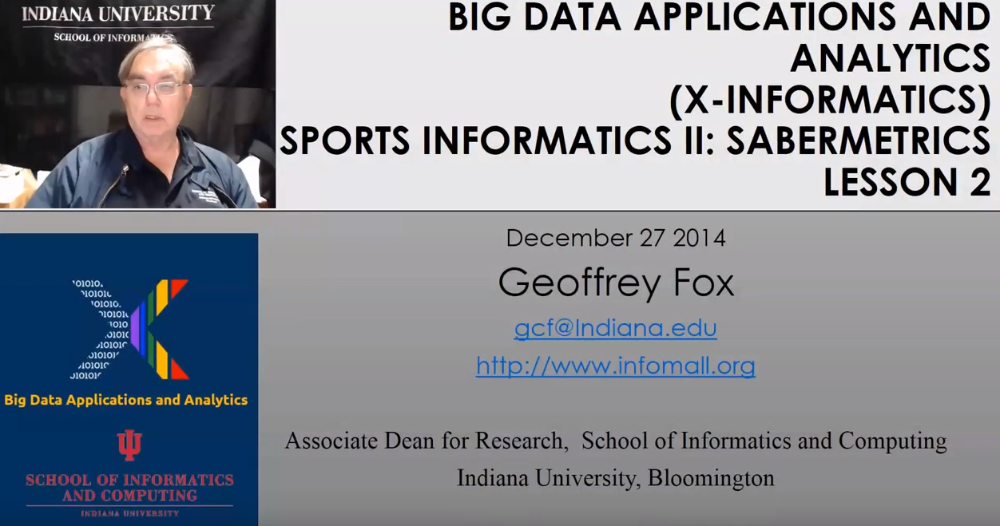{width=20%}](https://youtu.be/vAPJx8as4_0?list=PLy0VLh_GFyz-zMiTL3T39NjxbWkmU9F_a)

### BDAA 33.3 - E534 Sports - PITCHf/X

Examples of use of PITCHf/X.

[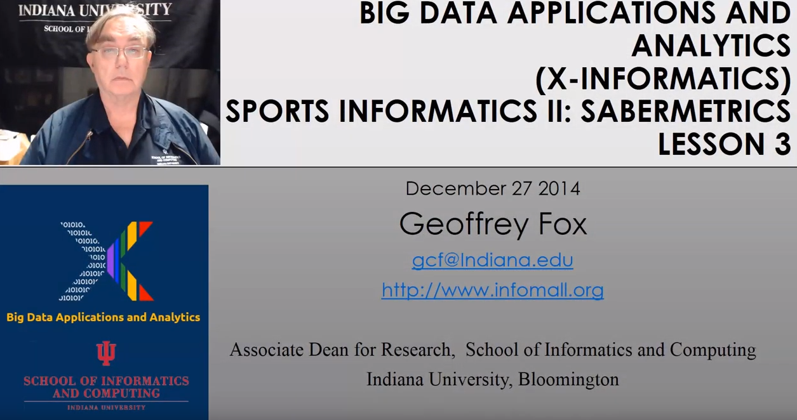{width=20%}](https://youtu.be/JN1-sCa9Bjs?list=PLy0VLh_GFyz-zMiTL3T39NjxbWkmU9F_a)

### BDAA 33.4 - E534 Sports - Other Video Data Gathering in Baseball

FIELDf/X, MLBAM, HITf/X, COMMANDf/X.

[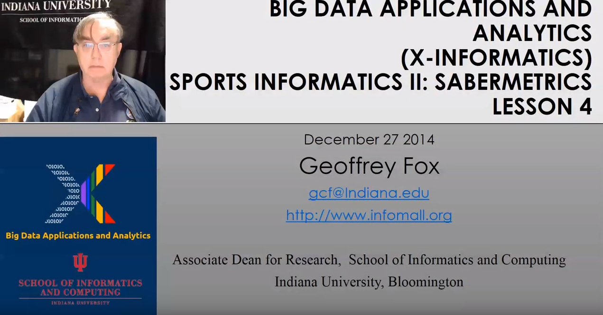{width=20%}](https://youtu.be/zGGThkkIJg8?list=PLy0VLh_GFyz-zMiTL3T39NjxbWkmU9F_a)

## Unit 34

E534 2019 Big Data Applications and Analytics Sports Informatics Part
III (Unit 34). Section Summary (Parts I, II, III): Sports sees
significant growth in analytics with pervasive statistics shifting to
more sophisticated measures. We start with baseball as game is built
around segments dominated by individuals where detailed (video/image)
achievement measures including PITCHf/x and FIELDf/x are moving field
into big data arena. There are interesting relationships between the
economics of sports and big data analytics. We look at Wearables and
consumer sports/recreation. The importance of spatial visualization is
discussed. We look at other Sports: Soccer, Olympics, NFL Football,
Basketball, Tennis and Horse Racing.

Unit Summary (Part III, Unit 34): We look at Wearables and consumer
sports/recreation. The importance of spatial visualization is discussed.
We look at other Sports: Soccer, Olympics, NFL Football, Basketball,
Tennis and Horse Racing.

Lesson Summaries

### BDAA 34.1 - E534 Sports - Wearables

Consumer Sports, Stake Holders, and Multiple Factors.

[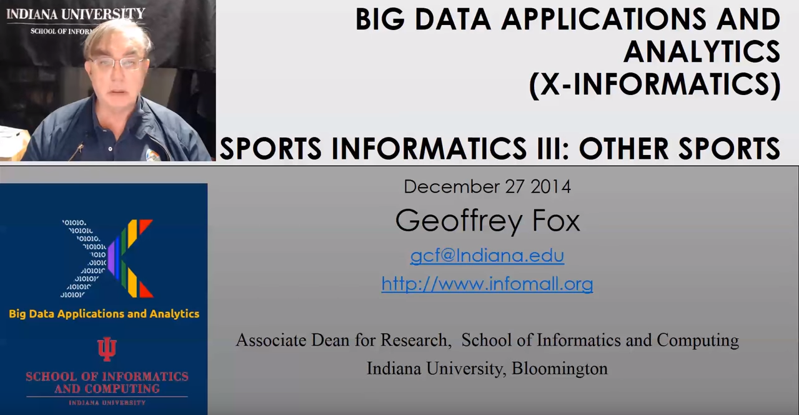{width=20%}](https://youtu.be/1UzvNHzFCFQ?list=PLy0VLh_GFyz8NyO31rq28TLvabZ8ZSewD)

### BDAA 34.2 - E534 Sports - Soccer and the Olympics

Soccer, Tracking Players and Balls, Olympics.

[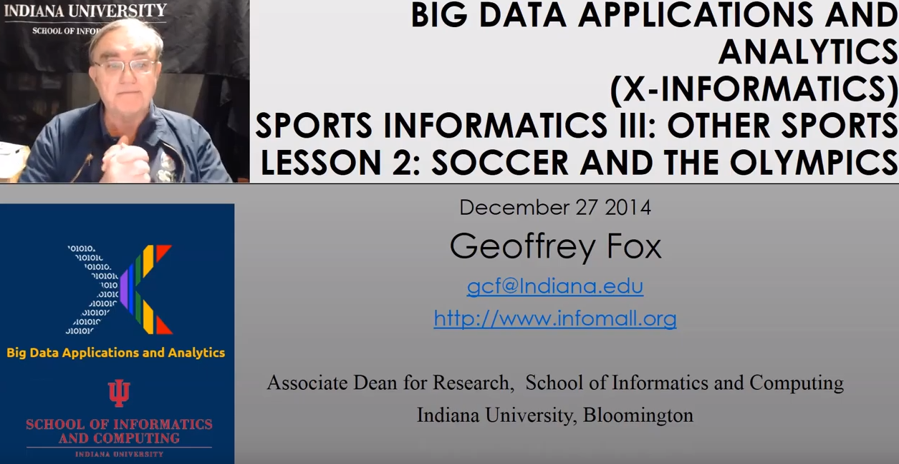{width=20%}](https://youtu.be/01mlZ2KBkzE?list=PLy0VLh_GFyz8NyO31rq28TLvabZ8ZSewD)

### BDAA 34.3 - E534 Sports - Spatial Visualization in NFL and NBA

NFL, NBA, and Spatial Visualization.

[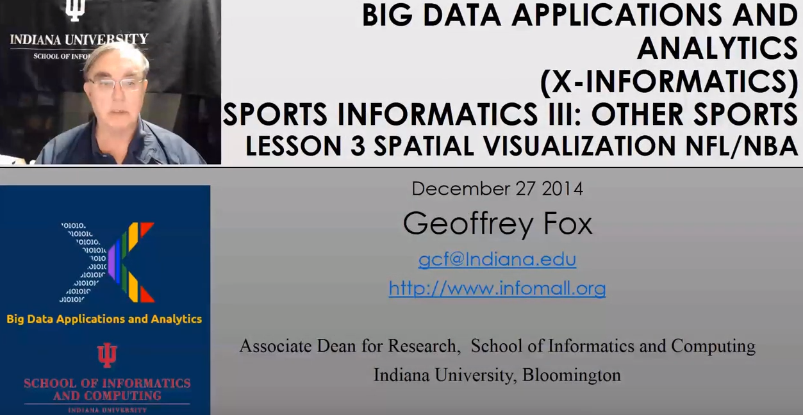{width=20%}](https://youtu.be/Q0Pt97BwRlo?list=PLy0VLh_GFyz8NyO31rq28TLvabZ8ZSewD)

### BDAA 34.4 - E534 Sports - Tennis and Horse Racing

Tennis, Horse Racing, and Continued Emphasis on Spatial Visualization.

[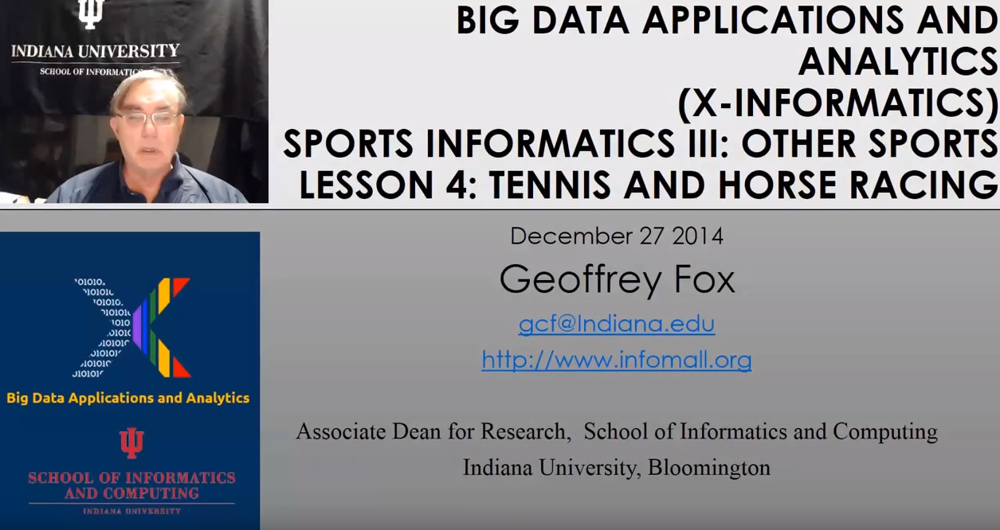{width=20%}](https://youtu.be/EuXrtfHG3cY?list=PLy0VLh_GFyz8NyO31rq28TLvabZ8ZSewD)
