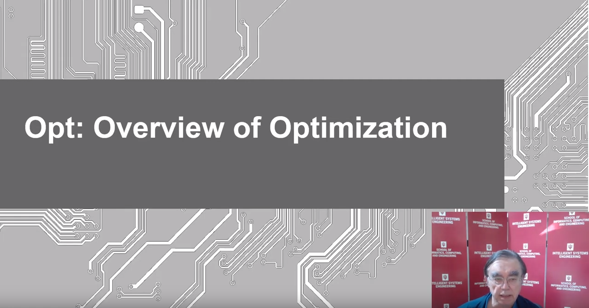
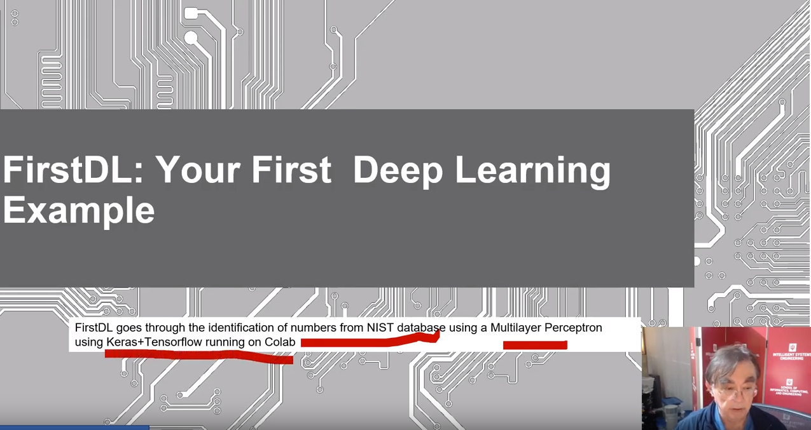
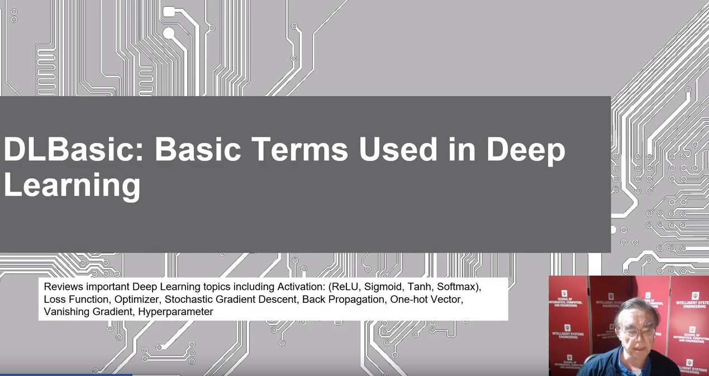
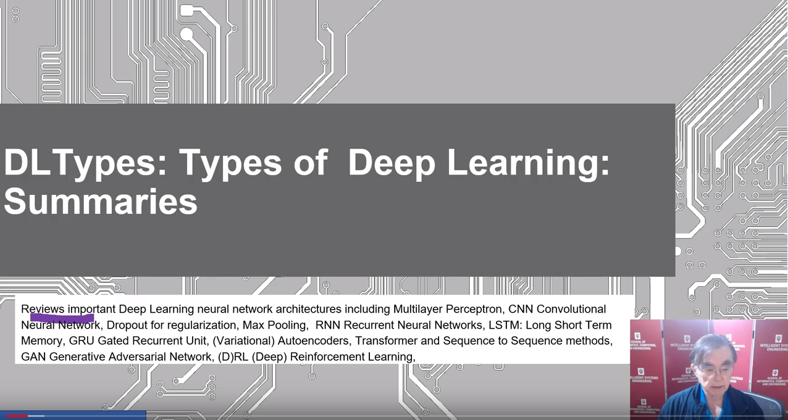

# Introduction to Deep Learning Part I

E534 2019 BDAA DL Section Intro Unit: E534 2019 Big Data Applications
and Analytics Introduction to Deep Learning Part I (Unit Intro) Section
Summary

This section covers the growing importance of the use of Deep Learning 
in Big Data Applications and Analytics. The Intro Unit is an
introduction to the technology with examples incidental. It includes an
introducton to the laboratory where we use Keras and Tensorflow. The
Tech unit covers the deep learning technology in more detail. The
Application Units cover deep learning applications at different levels
of sophistication.

## Intro Unit Summary

This unit is an introduction to deep learning with four major lessons

### Optimization

Lesson Summaries Optimization: Overview of Optimization Opt lesson
overviews optimization with a focus on issues of importance for deep
learning. Gives a quick review of Objective Function, Local Minima
(Optima), Annealing, Everything is an optimization problem with
examples, Examples of Objective Functions, Greedy Algorithms, Distances
in funny spaces, Discrete or Continuous Parameters, Genetic Algorithms,
Heuristics.

[{width=20%}](https://youtu.be/JvnzgbNGBM4?list=PLy0VLh_GFyz-jjQgNx09ccB-6Pa7E7aLM)

### First Deep Learning Example

FirstDL: Your First Deep Learning Example FirstDL Lesson gives an
experience of running a non trivial deep learning application. It goes
through the identification of numbers from NIST database using a
Multilayer Perceptron using Keras+Tensorflow running on Google Colab

[{width=20%}](https://youtu.be/jchO2kWv5Do?list=PLy0VLh_GFyz-jjQgNx09ccB-6Pa7E7aLM)

### Deep Learning Basics

DLBasic: Basic Terms Used in Deep Learning DLBasic lesson reviews
important Deep Learning topics including Activation: (ReLU, Sigmoid,
Tanh, Softmax), Loss Function, Optimizer, Stochastic Gradient Descent,
Back Propagation, One-hot Vector, Vanishing Gradient, Hyperparameter

[{width=20%}](https://youtu.be/3OLRON81K_g?list=PLy0VLh_GFyz-jjQgNx09ccB-6Pa7E7aLM)

### Deep Learning Types

DLTypes: Types of Deep Learning: Summaries DLtypes Lesson reviews
important Deep Learning neural network architectures including
Multilayer Perceptron, CNN Convolutional Neural Network, Dropout for
regularization, Max Pooling, RNN Recurrent Neural Networks, LSTM: Long
Short Term Memory, GRU Gated Recurrent Unit, (Variational) Autoencoders,
Transformer and Sequence to Sequence methods, GAN Generative Adversarial
Network, (D)RL (Deep) Reinforcement Learning.

[{width=20%}](https://youtu.be/hlCc2JaC_Q4?list=PLy0VLh_GFyz-jjQgNx09ccB-6Pa7E7aLM)