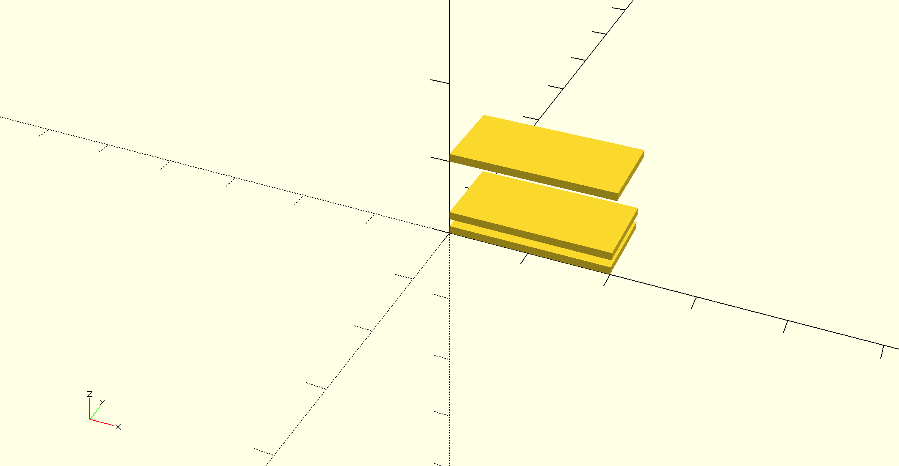
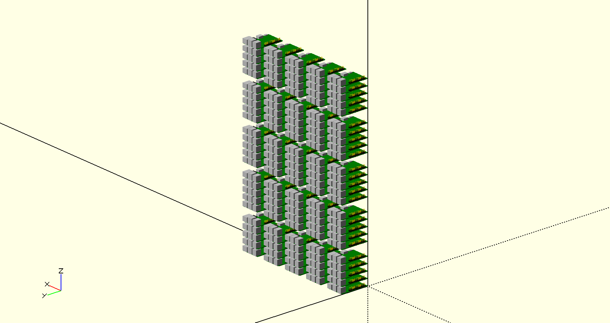
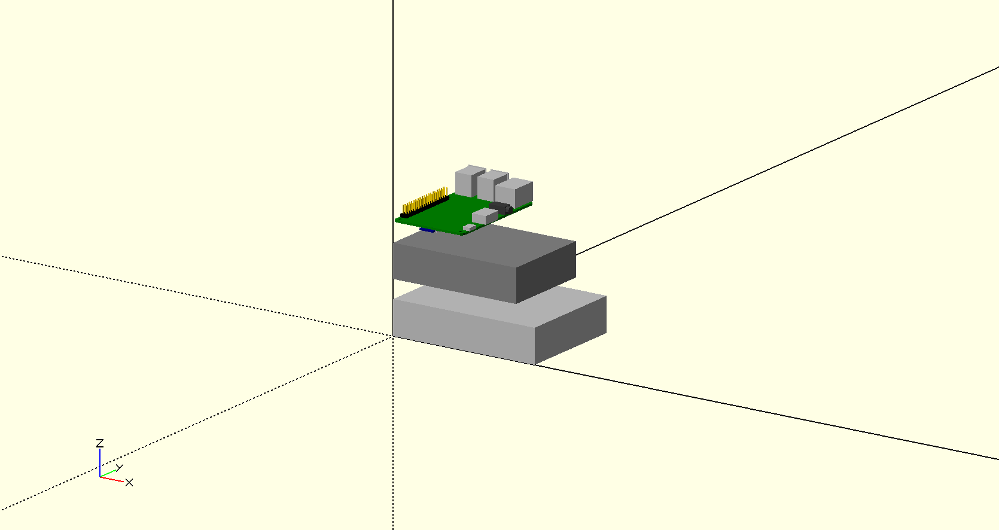
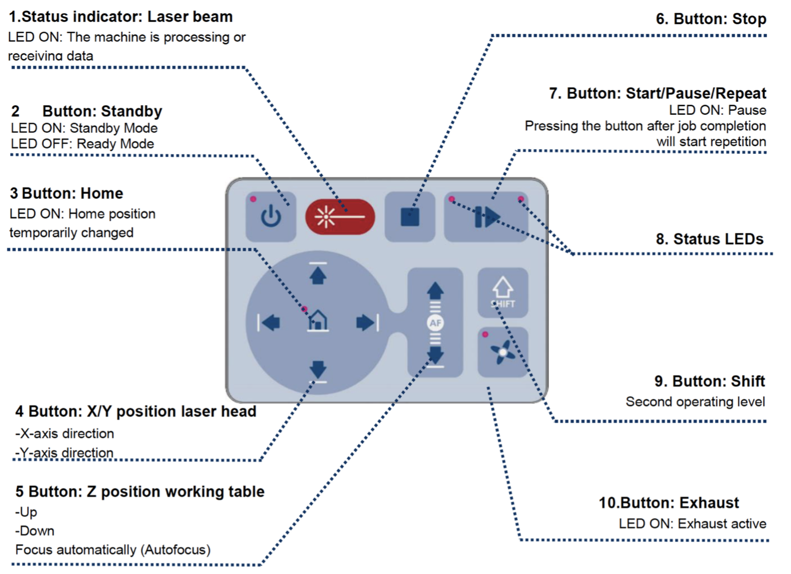

## IU 100 Node Cluster Case :o:

At Indiana University we have currently about 200 Raspberry Pi's
available for students that work with us as part of classes.

Our goal for the use of these PI's is multitude.

First, we naturally like that all PI's could be used together in a
large cluster. Second we like that student teams up to 3 students can
use a small cluster of between 6 - 5 Pi's and use them to provision
their own OS. Third, we like to crate a case and shelf structure that
allows this modular utilization of the cluster while breaking it down
easily, but also assembling or adding to the cluster easily.

This section will document our efforts to support this. The section is
heavily under construction and currently two STEM students work on the
case. They are joined by an independent study student offer the summer
that looks at the software for this cluster.

To simplify management we will be using github for managing tasks, but
we will start collecting these tasks here. At this time the STEM
students are using still a google docs document till they migrate to
this or their own github.

The outline of the section is as follows :construction:

First we provide an introduction to which tools to use for designing a
case. This is followed by some examples that may lead to a case design.
Next we provide an introduction on how to use the Laser cutter
at IU. The last part of this section includes a list of links and some
images of clusters designed by others.

### Designing a Case with CAD

We believe the best program for us to design a case for the cluster is
OpenSCAD. Links and tutorials to the software can be found here:

* <http://www.openscad.org/>
* <http://www.openscad.org/cheatsheet/>
* <https://github.com/RigacciOrg/openscad-rpi-library>
* <https://www.youtube.com/watch?v=WQd5db9lsQk>

Although OpenSCAD requires programming, it seems to be easier than
creating the design with a GUI based CAD program.  For this reason we
will be using SCAD.

Other CAD software may be accessible to you also. However will not use
for our case design. This includes the IU Maker Lab standard Software
is Fusion 360 which is available from

* <https://www.autodesk.com/products/fusion-360/overview>

As it does require a license it may not be accessible to many
students. However you can use alternative that can be used for
free. This includes FreeCAD 

* FreeCAD Software <https://www.freecadweb.org/>
* FreeCAD Documentation <https://www.freecadweb.org/wiki/Main_Page>

This program allows you to design the layout of a 3D case via a
sophisticated GUI just like Fusion 360. 

### IU cluster Case design

We have designed the following cases

TBD

Right now we just put some templates here to showcase we can actually
generate the cases. More details will be added here soon.

Obviously you need to be able to have some walls and shelfs for the case. The
following SCAD file shows how to use a simple cube to do that. This is
just a start as the design does not include any connectors.

[scad file](images/case-a.scad)

Next we show you how to use some predefined Raspberry PI boards in SCAD
and use for loops to create rows and columns of 5 PIs each.

[100-pis](images/100-pis.scad)

In the last design we showcase how the basis of a 5 node cluster could
start. Naturally many other thing s need to be improved. Such as the
connectors, and the proper width. However this SCAD will provide you
with a good start to improve your SCAD programming abilities and come
up with a final design.

[100-pis](images/parts.scad)

Once you have designed the 5 node cluster, you will also need to
design a shelf in which you can place them. Power plugs need to be
added. so you can power the PI within the cluster.

### Laser Cutter

With a laser cutter we can create very precise cases.  First, you will
need an overview of what a laser cutter is. There are many good
resources about this on youtube. One such video is provided by a
company that sells laser cutters:

* <https://www.youtube.com/watch?v=SIjUVCho_xU>

Disclaimer: While pointing to this video we do not endorse the
product. We do not own this particular brand.

After you have designed your case, you can create it on the laser
cutter available at Indiana University. The laser cutter is located at

* TBD

and operated by ISE. You can get access to it by contacting the help 
desk with an email. You will need to get certified for operating the 
laser cutter to use it.

:o: TODO: add contact email

The certification will teach you how to use the laser cutter properly. 
We will walk you through the steps that you can expect will be tought 
to you as part of the certification.

The first step includes turning on laser cutter. 

An instructor will demonstrate how to turn the laser cutter on
and carry out other preparation tasks on how to operate the laser
cutter. Please get familiar but do not yet touch any buttons from the
laser cutter.

Next the instructor will give you a walk through of the machine so you
can replicate these steps next time.

1. Turn the laser cutter on: Use key to turn on the laser cutter.
2. Turn the exhaust fan on: The fan is a separately switched
   unit. Turn on the switch on the wall next to the laser
   cutter. :warning: It to turn on the exhaust in order to have proper
   ventilation during the cutting process.
3. Put the cutting material onto the laser cutterbed. The instructor
   puts the cutting material onto the laser cutter bed. In case the
   material is smaller than the honeycomb bed you will need to place
   is as follows TODO: TBD
4. The buttons for the laser cutter do the following

   1. The middle top one is on-hold
      button, one can press it to save the power of the laser cutter.
   2. The start/pause button can be used to pause a job in the
      middle. Once you start from a paused state the job resumes.
   3. The stop button will cancel the job. You will need to restart
      the job from the beginning if this button is pressed to stop a
      job.
   4. The four buttons on the bottom left controls the x/y horizontal
      shift of the laser head. The other two controls the z-axis, or
      vertical movement of the cutting bed. 

   Note that while the stop button stops the entire process, the pause
   button will halt the process so you can continue.
5. To properly cut the material, you will need to focusing the laser
   head. Move the laser head above the cutting material, then will
   place the focusing tool on the laser head. Then carefully raise the
   cutting bed. When the focusing tool touches the material on the bed
   it will fall off indicating the laser is focused. You must be
   careful to not raise the bed too fast in order not to damage the
   laser head.
6. Now we need to send the file to the job control software and
   initiate cutting

   1. Send the file to the Job Control by opening the saved file in
      Adobe Illustrator. TODO: how do we get the SCAD file into it,
      which format do we need. You click print and set the printer to
      "Trotec Laser Cutter".
   2. Set laser cutting parameter will be set to width and height of
      the cutting area in the size column. By clicking the
      “Preferences” tab, one can adjust the settings of different
      colors (traditionally red lines are for cutting and black lines
      and areas are for engraving)
   3. Move the file to Job Control work surface by turning on the Job
      Control software and discover the job is in the queue on the
      right of screen.
      
   4. Next drag the file to be cut on to the Job Control work surface
      and set it up in the upper right corner.
   5. Select the Play arrow in JobControl
   6. An exhaust warning will appear. Select OK. The job will start.

Questions to be integrated:

* What is the importance of setting cutting parameters? 
* What will you check before pressing the start button to ensure safety?

### Cases and Parts Designed by the Community

A 3D model of the Raspberry PI is available at

* STL <https://www.thingiverse.com/thing:1701186>
* <https://grabcad.com/library/raspberry-pi-3-reference-design-model-b-rpi-raspberrypi-raspberry-pi-2>

These models are important as they allow us to use them in the CAD
drawings to identify proper placement.

Certainly we need to identify how to connect the walls of the
case. The following links provide some ideas for such connections.

* T-nut design: A convenient connector using screws ant nuts to
  connect walls in 90 degree angles [[link]](http://www.instructables.com/id/How-to-Make-Anything-Using-Acrylic-and-Machine-Sc/)
* How To: Make Cheap LaserCut Custom Boxes for Your DIY Electronics,
  includes t-bolt design [[link]](http://store.curiousinventor.com/blog/how-to-make-cheap-lasercut-custom-boxes-for-your-diy-electronics/)  
* A tutorial on how to make snug joints. It has some good tips of
  placing circles as stress relieve points [[link]](https://www.ponoko.com/blog/how-to-make/how-to-make-snug-joints-in-acrylic/)
* Screw only: A design to just use screws to connect the walls. The
  disadvantage is that the receiving ends need to be cut by a hand tool. [[link]](http://skpang.co.uk/blog/archives/152)
* A sample design that just uses groves, so this would have to be
  glued. [[link]](http://www.uugear.com/product/acrylic-case-for-zero4u-and-raspberry-pi-zero-clear/)
* Another design with groves that needs to be glued [[link]](https://www.modmypi.com/blog/piot-relay-zero-case-assembly-instructions)
* A guide to handle acrylic [[link]](https://www.bit-tech.net/guides/modding/a_modders_guide_to_acrylic/3/)
* Some special brackets which could be 3 D printed. These brackets
  have the advantage that only slots and holes need to be placed
  [[link]](http://discuss.arachnidlabs.com/t/easier-lasercut-boxes-with-custom-brackets/177). 
* Although CNC, here are some connector ideas that could be replicated
  or modified
  for acrylic [[link]](https://makezine.com/2012/04/13/cnc-panel-joinery-notebook/)
* Some tips for working with acrylic in general [[link]](https://makezine.com/2015/10/29/skill-builder-acrylic/)
* [[link]](https://www.picocluster.com/)
* A design based on metal beams to create the outside. This may be
  more expensive, but stable [[link]](https://www.phidgets.com/docs/T-Slot_Primer)
* Some also used lego technics [[link]](https://www.thorlabs.com/newgrouppage9.cfm?objectgroup_id=9048)

We also previously indicated that the width of the mounting holes on a
Pi is about 7 spaces wide, making it possible to create a lego technic
case.

