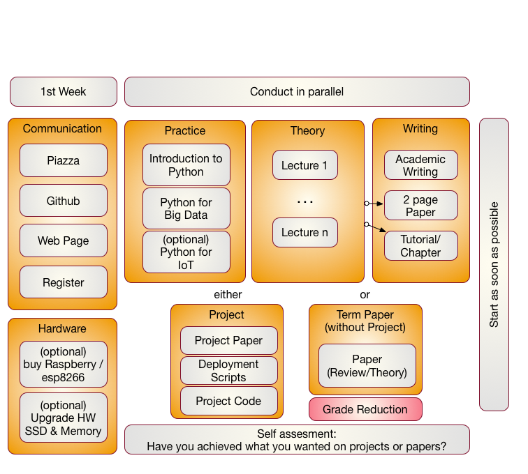

Organization
============

This class is an online class. Online classes require you to be very
disciplined in order to execute the tasks necessary for the class in
time. It is your responsibility to organize the lessons so that you
can complete them not only by the end of the semester, but also in
time for conducting your assignments. This is a great opportunity for
you to structure the class based on your availability. The classes are
attended by two different set of students. One set are remote online
students, while to other are residential students. For the residential
students we have a mandatory in person meeting that takes place at the
posted location and hours once a week. For pure online students we
have weekly online hours that we will identify based on our
availability and a doodle poll.

Figure *Components of the Class i523, i423, e534* showcases the
different parts of the class.  If you have taken a previous class with
us you are able to continue your previous project upon approval. It
must however be a significant improvement.  Please note that the in
i523 and i524 the project and it's report can be substituted by a
longer term paper that does not require programming. As this is a
significant reduction in work and goals, for that class, the maximum
grade in this case for the entire class can only be an A-.

There will not be any bonus projects or tasks to improve
grades. Instead make sure your deliverables of the few assignments
are truly outstanding.

The content for this class will be available through a series of
documents that will be regularly updated and are linked from this
document. All communication is done with Piazza. 
issues.

First Week
----------

In the first week we will be introducing you how we communicate to you.
Naturally you need to register for the class. Once you register you need
to set up a number of services. 

Access to Clouds
----------------

As part of the course you will also need access to a cloud. We will
try our best to provide you with access to suitable computers for the class,
but do be reminded that the amount of time and access to supercomputers
and clouds we offer is limited. Our class policy is to use the compute
resources only when you really need them. Thus you **must** shut down
your VMs when they are not in use. It would be a violation of class
policy if we would find out through an analysis of the cloud logs that
you unnecessarily keep your VMs running. Thus we will implement a
**strict policy** that you must record yourself how many hours you run
VM's and provide this information to us. We will than compare that time
with the time recorded by the computer system as well as with your
target application and will deduct points form your project if you can
not justify why you have not shut down your VMs. A resource section
needs to be added to your report justifying the used resources.

Why is this such a big deal you may ask? For example we estimate if
every student in class violates this policy it would cost about $200000
to rent the time for this on a public cloud. Due to this high cost, we
no longer tolerate deliberate violations of the policy and will
terminate your account. Furthermore, violators will have to find
alternative resources to conduct their projects while not using our
resources. In our case the problem is even beyond the issue of cost as
our allocation on the clouds would be terminated due to abuse and **no
student**, including those that follow policies, could use the cloud. It
may take weeks to reestablish cloud access and would effect every
student in class.

We will provide clarification for accessing cloud resources and teach
you how to avoid getting in such a situation. I am sure that a future
employer of yours will be real happy if you have a deep understanding of
resource vs. cost estimate.

Listing the used computer time for your project is part of your
report.

Using Your Own Computer
-----------------------

In many cases however you could and are recommended to use your own
personal computer, but make sure the computer is up-to-date. We also
like to make sure that you do not use a work computer as you need to
avoid that when you develop a cloud program you do not by accident
introduce a security risk on your machine.  This does not mean that
you need to buy a new computer, or need to upgrade it. However, if you
consider an upgrade of an older machine please consider the following.

These days we recommend that your computer has a solid-state drive and
fast memory (put as much memory in your machine as is
supported). We recommend 16 GB off main
memory which gives you enough space to run containers, virtual
machines and naturally the main operating system. We fond that
students with only 8GB could do the work but it was slow. In some
cases the memory to conduct their projects was not sufficient.
Make sure you follow your upgrade guide to your computer and by suitable
memory chips. In most cases you have to buy them in **pairs** and make
sure all chips in your computer are the same. When it comes to buying
a solid-state drive, make sure that you buy one that is compatible
with motherboards bus speed. As you may want to reuse your solid-state
drive at a later time I suggest to get a 6GB/s SSD and not a 3GB/s.

In case of Windows, your could also get yourself a UBS stick or
external SSD drive and place ubuntu on it. You could than use your
bios to boot of from that drive. This way you do not have to modify
anything on your computer. This method works very well for most
computers and allows you to use the maximum memory while for example
using ubuntu.

Students that only had a chromebook and took this class gave us the
feedback that they are too inconvenient as they do not allow you to
program directly in python on them and the ssh terminals to login to
other computer although working are not supporting the GUI tools.

Another option is (if money is an issue) you can buy a Raspberry Pi
and edit your programs there and when satisfied run them on a
cloud. However a PI is small and has only very limited memory and
processing power.

We also like to remind you that this course does not require you to
purchase expensive text books, thus the money you safe on this could be
used in upgrading your hardware or renting yourself from your own money
time on AWS. However, be careful with the cloud its easy to spend lots of
money there if you are not careful.

### Self Discipline

As this class has no graded tests and only few graded homework, we like
that you deliver an **exceptional** project report or paper. Instead of
focusing on preparing for tests we provide you with the opportunity to
**explore** without the pressure of grades. However you should not give
up or take the easy way out or it will effect you in your project
execution. Also, to achieve your best do not just say: *We do not have a
test, so let me not do this weeks assignment, let me do it next week*.
After a couple of times with this attitude you will be in big trouble.
All this requires discipline. For example, if you believe you are so
good that you can do a project within one week before deadline, you will
**certainly fail**. To avoid this and to introduce discipline, you will
also be monitored on progress and we check your github for activities
which will be part of the participation grade.

It will be up to you to assess what you want to deliver before handing
it in to us. Self assessment or a check with other students is a real
good way to do that. You should not expect to get an A if you yourself
are not convinced about your project or are unsure about it. Common
sense prevails.

### Fun

I hope you have fun and are able to integrate in the projects your own
thoughts and interests.

We have quotes form students such as

> "This is the best class I have taken ..."

or

> "I really enjoyed taking this class and having maximum flexibility to
> schedule the lectures."

or

> "The lessons learned from this class were adopted within my company."

Furthermore you should know that the way we teach the class has also
been adopted in STEM classes. As a result a team coached by Gregor von
Laszewski won an award at the FLL Robotics World Championship. The
certainly had lots of fun and integrated their own ideas into the
project that won the award.

### Uniqueness

We will try to have every project or paper to be non overlapping with
another topic, If there are overlaps we may ask you to modify your
focus.

### Continuation

If you like to put additional effort in the project, the report could
be made to a conference or workshop paper. Dr. von Laszewski is happy
to help as co-author.

Parallel Tracks
---------------

In this class we have three parallel tracks. 

### Track 1: Practice

Track 1 introduces you to using python for Big Data. We recommend that
you do know a programming language for any of our courses. Learning a
programming language is not part of the hours you spend for this
class. It is an additional time requirement that you must plan
for. Maybe you want to take for example a python programming language
class at the same time. This can also be done in self study.  Although
you do not need to know any programming language, it is certainly
useful as it will make this course much easier for you. We had
students that had no prior programming knowledge and successfully
completed the course. So we know it can be done.  The course is
designed in such a fashion, that there is enough time to learn
programming and do a project.

We provide you with a general introduction to Python. This includes
enough knowledge so you can conduct a project with it. We will build
on these technologies to introduce you to python libraries that can be
used for big data.

### Track 2: Theory

The theory track includes a number of online lectures that introduces
you to a variety of topics related to Big Data. You have especially
the opportunity to become part of a project that would contribute to
the understanding and the development of a Big Data Architecture
developed in collaboration with NIST. Other topics that are covered
include IoT, Health Care, Physics, Science, Biology, Genomics, and so
forth. We will update the Theory track and will release lectures in
the specified areas. Some lectures may be used in multiple classes.

### Track 3: Writing

You have a choice in this class between writing a two page review
paper about a big data technology or application (area), or contribute
a chapter to this document. We explain next the difference:

**Review Paper:** This track will introduce you into how to write an
academic paper and conduct proper bibliography management. Knowing how
to write is a preparation for your term project.

You will be writing a paper that is 2 pages long possibly within a
team. In case you work in a team you have to produce as many papers as
you have team members.  We like to avoid that all students take the
same topic. We will use github to avoid that everyone chooses same
topic. Knowing how to write is a preparation fo your project or term
paper.

We noticed a curious observation in previous classes. Any paper
written in MSWord was inferior. Thus we no longer provide the choice
to write papers in MSWord in order for you to achieve your
best. Papers and Project reports must be written in LaTeX

**Chapter:** The chapter is essentially similar to a review paper, but
is written in markdown and can be added to the lecture notes. A
chapter should be formulated in a consistent form and is equivalent in
length (number of words) to those of the 2 page paper. Bibliography
management is conducted in bibtex and can e used in the markdown
document.

Important in both cases is that you stay focused. You can assume that
if you write a document about "Big Data in Baseball", you do not spend
1.5 pages sto describe what big data is and only half a page where
baseball fits in. What you should do is focus on the topic. A chapter
could also include some practical lessons with real programming lessons.

### Track 4: Term Paper/Project

The major deliverable of the course is a term project or paper. The
exact details will be posted on the Web page in this document.  The
important part is that you start on this project once you are
sufficiently familiar with Track 1-3. However you can also use the
project to for example learn python and engage in a goal oriented
learning activity while working towards implementing your project and
integrating the python lessons that you encounter. The same is valid
for the theory.

It is **expected** that you identify a suitable analysis and data set
for the project and that you learn how to apply this analysis as well as
justify it. It is part of the learning outcome that you determine this
instead of us giving you a topic.

Furthermore, it is also important to note that if you do not do a
project (this is your option) the maximum grade for the entire class is
limited to an A-. This is achieved simply by reducing the grade of
your term report by a full grade due to the distribution of the grade
this will result in a fractional grade reduction and limits the
maximum grade to an A-.

