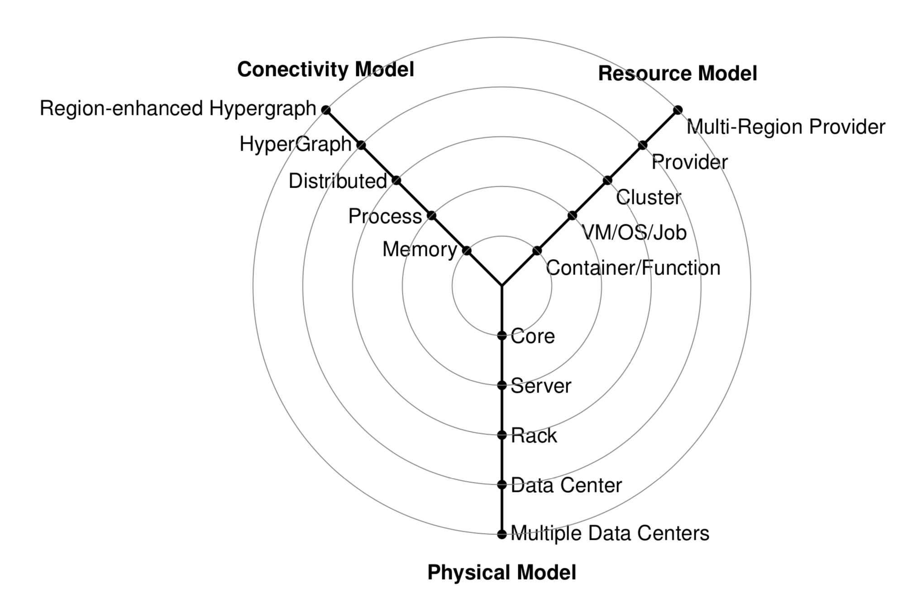

# The Y-Scheduling Architecture View

Previous architecture views were concerned about high-level interactions
such as the view projected by NIST that introduces a service model based
on infrastructure, platform, and application.

However, such a view my provide too little detail to develop meaningful services that uses cloud resources in a multi-cloud environment. For
this reason von Laszewski has devised a Y diagram that showcases the
interaction between the different layers more clearly we like to refer
the reader to the Y-cloud scheduling diagram.

In this taxonomy, we are concerned about how resources are placed on
physical models and are interconnected with each other to facilitate, for example, scheduling algorithms. @{fig:graph-y} depicts the different
models integrated into the Taxonomy. It includes:

* **Physical Model**: that represents major physical resource layers to
  enable a hierarchical scheduling strategy across multiple data
  centers, data centers, racks, servers, and computing cores.

* **Resource Model**: that represents models that the scheduling
  algorithm addresses including containers and functions, virtual
  machines and jobs, virtual clusters, provider-managed resources, and
  multi-region provider-managed resources.

* **Connectivity Model**: that introduces connectivity between components
  when addressing scheduling. This includes components such as memory,
  processes, connectivity to distributed resources, hyper-graphs to
  formulate hierarchies of provider based resources, and region
  enhanced hyper-graphs. The connectivity model allows us to leverage
  classical scheduling algorithms while applying such models and
  leveraging established or new scheduling algorithms for these
  models.

To for example develop scheduling algorithms a layered approach can be
chosen to separate concerns between different layers while utilizing an
abstracting services, the models project in each layer.

{#fig:graph-y}

