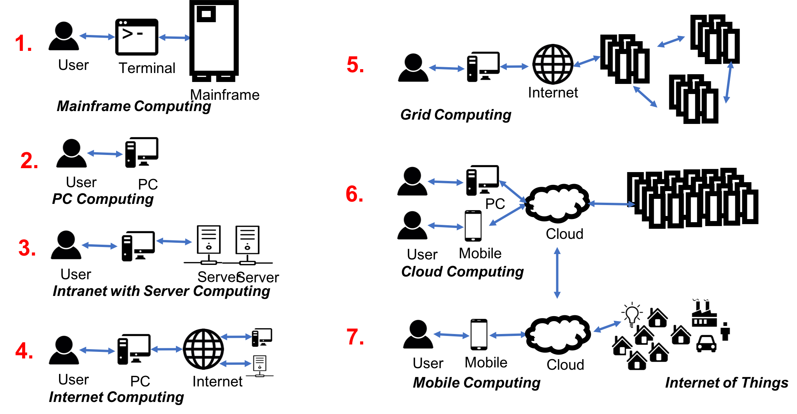

# Architectures {#sec:cloud-architectures}

---

 **Learning Objectives**

* Review classical architectural models leading up to cloud computing.
* Review some mayor cloud architecture views.
* Visualize the NIST cloud architecture
* Discuss an architecture for multi-cloud frameworks.

---

While we have introduced in our introductory section a number of
definitions for cloud computing, as well as an architectural view for
clouds based on the *as a Service* model, we look a bit closer at
other alternative views. These views are in some cases necessary as
they provide appropriate abstractions for more detailed
implementations.

## Evolution of Compute Architectures

We start our observation with some a depiction of some of the
important architectural models motivating the current state of
information technology services we provide in
@fig:evolution-computer-arch.  They are computers used primarily by
large organizations for critical applications; bulk data processing,
such as census, industry and consumer statistics, enterprise resource
planning; and transaction processing.  The term originally referred to
the large cabinets called "mainframes" that housed the central processing unit and main memory of early computers. It has been updated
by von Laszewski to include mobile computing and the internet of
things phase that is bringing rapid changes to how we perceive and use
the cloud in the near future.

{#fig:evolution-computer-arch}

We define the following terminology based on the evolution of compute
architectures.

### Mainframe Computing

Mainframe computing originated on the principle of using more massive and more reliable computers,
like IBM System z9, to run the critical applications, bulk data processing,
enterprise resource planning and business transaction processing.

> According to
> [Wikipedia](https://en.wikipedia.org/wiki/Mainframe_comp), the term
> mainframe initially referred to the large cabinets called "main
> frames" that housed the central processing unit and main memory of
> early computers.  Later, the term was used to distinguish high-end
> commercial machines from less powerful units. Most large-scale
> computer system architectures were established in the 1960s, but
> continue to evolve. Mainframe computers are used primarily by large
> organizations for critical applications; bulk data processing, such
> as census, industry and consumer statistics, enterprise resource
> planning; and transaction processing. The term originally referred
> to the large cabinets called "mainframes" that housed the central
> processing unit and main memory of early computers.

Some key attributes of Mainframes that distinguishes it from other
computers include its larger size, speed, throughput, power, and
environmental requirements, and operating system. Furthermore, we find
that they have inbuilt redundancy to address high uptimes as required
by business applications. Even some of the earliest Mainfraims
supported fast I/O and computation via virtualization. The concept of
hot-swapping of hardware helps these machines to run without failure for
years.

### PC Computing

The term PC is short for a personal computer. IBM introduced the first PCs to the market. PCs need an operating system such as
Windows, macOS, or Linux

PC Computing refers to

> an era where consumers predominantly used personal computers to
> conduct their work. Such computers were mostly stand-alone without
> network as early networks were not available to consumers.

### Intranet and Server Computing

We refer to Intranet and Server Computing as an environment in which

> the computers are part of a private network, also called, intranet,
> that is contained within an enterprise and later on also
> homes. Intranets can connect many local resources within a
> Local but also a wide area network

### Grid Computing Computing

and its evolution is defined in
[The Grid-Idea and Its Evolution](http://citeseerx.ist.psu.edu/viewdoc/download?doi=10.1.1.61.196&rep=rep1&type=pdf). The
original definition of Grid computing has been summarised as follows:

> A computational Grid is a hardware and software infrastructure that
> provides dependable, consistent, pervasive, and inexpensive access
> to high-end computational capabilities. [@foster-book]

However, we also define that Grids were not just about
computing, but introduced an approach that through the introduction of
virtual organizations lead to the following definition

> A production Grid is a shared computing infrastructure of hardware,
> software, and knowledge resources that allows the coordinated
> resource sharing and problem-solving in dynamic, multi-institutional
> virtual organizations to enable sophisticated international
> scientific and business-oriented collaborations.

This definition is undoubted including services that are today offered
by the cloud. Hence in the early days of cloud computing, there was a
large debate occurring if cloud is just another term for Grid. In
[Cloud Computing and Grid Computing 360-Degree Compared](http://datasys.cs.iit.edu/publications/2008_GCE08_Clouds_Grids.pdf)
an analysis is conducted between the different architecture models
outlining that collective resources and connectivity protocols
introduced by the Grid community have been replaced by the cloud with
platform and unified resources.

To provide a very simple but possibly incomplete comparison, cloud
computing integrated infrastructure such as supercomputers and other
large scale resources through unified protocols. The effort was
initially provided by research institutions but have been introduced
in business. However, with the growth of the data centers to foster
common tasks such as Web hosting, we see a clear difference:

* while the Grid was originally designed to give a few scientist access
  to the biggest agglomerated research supercomputers,
* business focused on serving originally millions of users with the
  need to run only a view data or compute services.

This indeed resulted in independent development, while cloud
computing has today consumed Grids. Tools such as the Globus toolkit
are no longer widely used, and the development has shifted to the
support of data services only.

### Internet Computing

With the occurrence of the WWW protocols, internet commuting brought to
the consumers a global computer network providing a variety of
information and communication facilities.

Internet Computing refers to

> the infrastructure that enables sharing of data within the WWWW community.

Internet computing also comprises early infrastructures such as AOL,
which popularized the term *you got mail*

### Cloud Computing

Cloud Computing refers to

> delivery of services such as database, server, network storage, and others over the internet so the
> user does not have to maintain a data center and only pays for services in use.
> This reduces the cost and increases productivity as services can be available in
> minutes on-demand with state of the art security and no hardware datacenter staff needed on the users' side.

We have provided a lecture about the definition of cloud computing
previously.

### Mobile Computing

Mobile Computing refers to

> a diverse set of devices allowing users to access data and
> information from wherever they are with mobile devices such as cell
> phones or tablet computers. mobile computing is dominated by
> transmission of data, voice, and video over a network via the mobile
> device

### Internet of Things Computing

Internet of Things Computing refers to

> devices that are interconnected via the internet while they are
> embedded in *things* or common objects. The device send and receive
> data to be integrated into a network with sensors and actuators
> reacting upon sensory and other data.

### Edge Computing

In addition, we need to point out two additional terms that we will
integrate into this image. Edge Computing and Fog Computing.  Currently
there is still some debate about what these terms are, but we will
follow the following definitions:

Edge Computing refers to

> computing conducted on the very edge of infrastructure. This means
> that data that is not needed in the data center can be calculated
> and analyzed on the edge devices instead. No interaction between
> cloud services is needed. Only the absolute required data is sent to
> the cloud.

### Fog Computing

FoG Computing refers to

> computing conducted in-between the cloud and edge devices. This
> could be for example part of a smart network, that hosts a small set
> of analytics capabilities, so that the data does not have to travel
> back to the data center, but the edge device is not powerful enough
> to do the calculation. Thus a Fog computing infrastructure provides
> the ability to conduct the analysis closer to the edge saving
> valuable resources while not needing to transmit all data to the
> data center although it will be analyzed

## As a Service Architecture Model

The *as a Service* architecture was one of the earliest definitions of
cloud architecture while focusing on the service aspect provided by
the cloud. The layers, such as IaaS, PaaS, and SaaS, provide a layered
architecture view while separating infrastructure, platform, and
services. This allows a separation of concerns typically between
infrastructure providers, platform developers, and software architects
using platforms and or infrastructure services.

The typical triangular diagram (see @fig:iaas-triangle) is often used
to represent it.

](images/architecture-iaas.png){#fig:iaas-triangle}

## Product or Functional Based Model

When we inspect prominent providers such as Amazon, Azure, and Google,
we find that on their Web pages, they do provide their customers an
alternative view that is motivated by exposing numerous products to
the customers grouped by functions. These services are often in the
hundreds. To achieve the exposure of the products in a meaningful
fashion, they introduce a functional view, motivation a functional
architecture view of the cloud.

When we analyze these functions for example for Amazon Web services we
find the following

* Compute
* Storage
* Databases
* Migration
* Networking & Content Delivery
* Developer Tools
* Management Tools
* Media Services
* Security, Identity & Compliance
* Machine Learning
* Analytics
* Mobile
* Augmented reality and Virtual Reality
* Application Integration
* Customer Engagement
* Business Productivity
* Desktop & App Streaming
* Internet of Things
* Game Development
* AWS Marketplace Software
* AWS Cost Management

From this, we derive that for the initial contact to the customer the
functionality is put in the foreground, rather than the distinction
between SaaS, PaaS, and IaaS. If we sort these services into the as a
Service mode we find:

* IaaS

  * Compute
  * Storage
  * Databases
  * Migration
  * Networking & Content Delivery

* PaaS
  * Developer Tools
  * Management Tools
  * Media Services
  * Security, Identity & Compliance
  * Machine Learning
  * Analytics
  * Mobile
  * Augmented reality and Virtual Reality
  * Application Integration
  * Customer Engagement
  * Business Productivity
  * Desktop & App Streaming
  * Game Development
  * AWS Marketplace Software
  * AWS Cost Management
  * Internet of Things

We observe that AWS focuses on providing infrastructure and
platforms so others can provide integrated service to its customers.

Other examples for product lists such as the one from Azure are provided in the Appendix.

## NIST Cloud Architecture

In the introduction, we have extensively discussed the NIST cloud
architecture. A Nice visual representation is provided in @fig:nist-cloud-arch.

](images/nist-vis-arch.png){#fig:nist-cloud-arch}

## Cloud Security Alliance Reference Architecture

Founded in 2008, the Cloud Security Alliance (CSA) is a nonprofit
organization that provides a variety of security resources to
institutions including guidelines, education and best practices for
adoption.

This is a great organization to lean on if you have open questions
about architecture and the best way to secure it.  There are working
groups that look across 38 domains of Cloud Security. These groups
meet actively, and they cover current topics, opportunities, and ask
relevant questions.  It is a place for networks with experts in
the field and ask questions specific to your company or academic
project.  You may also find an answer to your question in the white
papers, reports, tools, training, and services they have available.

The group of industry experts use the following guiding
principles when publishing their reference Architecture.

* Define protections that enable trust in the cloud.
* Develop cross-platform capabilities and patterns for proprietary and
  open-source providers.
* Will facilitate trusted and efficient access, administration and
  resiliency to the customer/consumer.
* Provide direction to secure information that is protected by regulations.
* The Architecture must facilitate proper and efficient
   identification, authentication, authorization, administration and auditability.
* Centralize security policy, maintenance operation, and oversight functions.
* Access to information must be secure yet still easy to obtain.
* Delegate or Federate access control where appropriate.
* Must be easy to adopt and consume, supporting the design of security patterns
* The Architecture must be elastic, flexible and resilient supporting
  multi-tenant, multi-landlord platforms
* The architecture must address and support multiple levels of
  protection, including network, operating system, and application
  security needs.

An overview of the architecture is shown in the diagram from the cloud
Security Alliance. See @fig:csa-arch

](images/csa-architecture.png){#fig:csa-arch}

## Multicloud Architectures

One of the issues we see today is that it is unrealistic to assume
clouds are only provided by one vendor, or that they have all the same
interface. Each vendor is advertising their special services to
distinguish themselves from the competitors. For the end-user and the
developer that projects the problem of vendor lockin. However, we need
to be aware of efforts that allow an easy of such vendor lock-in while, 
for example, providing multi-cloud solutions.  Such solutions integrate
multiple vendors and technologies into a single architecture allowing
them to use multiple cloud vendors at the same time.

### Cloudmesh Architecture

One of the earliest such tools is Cloudmesh.org, which is lead by von
Laszewski. The tool was developed at a time when AWS and Nimbus, and
Eucalyptus where predominant players. At that time, OpenStack had just
transitioned from a NASA project to a community development.

FutureGrid was one of the earliest academic cloud offerings to explore
the effectiveness of different cloud infrastructure solutions. It
was clear that a unifying framework and abstraction layer was needed
allowing us to utilize them easily. In fact, Cloudmesh did provide not only a REST based API, but also a command line shell allowing to
switch between clouds with a single variable. It also provided bare
metal provisioning before OpenStack even offered it. Through an
evolution of developments, the current Cloudmesh architecture that
allows multi-cloud services is depicted in the next figure. We still
distinguish the IaaS level, which included not only IaaS Abstractions,
but also Containers, and HPC services. Platforms are typically
integrated through DevOps that can be hosted on the IaaS. Examples
are Hadoop, and Spark The services are exposed through a client API
hiding much of the internals to the user. A portal and application
services have successfully demonstrated the feasibility of this
approach (see @fig:cloudmesh-arch).

![Cloudmesh Arch [@las14cloudmeshmultiple]](images/arch-cloudmesh.png){#fig:cloudmesh-arch}

Within our e516 class, we are developing a modern version of
Cloudmesh from the ground up by only using python 3 as implementation
language, integration of containers, and REST services based on
OpenAPI. Local data to manage the different services are hosted in a
MongoDB database and exposed through portable containers, so that a
single cross-platform environment exists as part of the project
deliverables.

Students from e516 can and are in fact expected to participate
actively on the development of Cloudmesh v4.0. In addition the OpenAPI
service specifications developed for the project will be integrated in
Volume 8 of the NIST Big data reference architecture, which is
discussed elsewhere.

The advantage of developing such an environment is that we can look at
various aspects of cloud computing while demonstrating integrated use patterns.

## Resources

* [@www-tata12] <http://www.lifl.fr/iwaise12/presentations/tata.pdf>
* [@wwwvaria2010architecting] <https://media.amazonwebservices.com/AWS_Cloud_Best_Practices.pdf>
* [@wwwsun09] <http://staff.polito.it/alessandro.mantelero/cloud_computing/Sun_Wp2009.pdf>
* [@wwwkaefer10] <https://resources.sei.cmu.edu/asset_files/Presentation/2010_017_001_23337.pdf>
* [@wwwoctave12] <https://www.oracle.com/technetwork/articles/entarch/orgeron-top-10-cloud-1957407.pdf>
* [@wwworacle09] <http://www.oracle.com/technetwork/topics/entarch/oracle-wp-cloud-ref-arch-1883533.pdf>
* [@wwwcloudcomputing] <https://pdfs.semanticscholar.org/cecd/c193b73ec1e7b42d132b3c340e6dd348d3f4.pdf>
