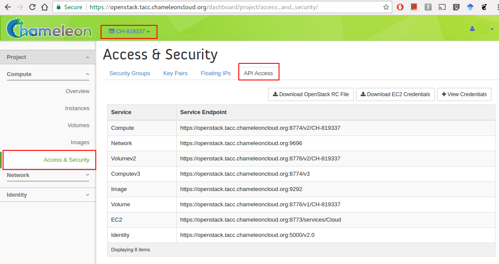

# OpenStack Command Line Interface {#sec:chameleon-cli}

OpenStack on Chameleon delivers KVM based compute resources to provision
virtual machines. It provides various image types on which we can deploy
tools and software needed for the class and projects. We will you
through the basic steps of getting access to OpenStack Chameleon cloud
under the class allocation. Next, we will introduce you to the command
line tools which you can use in your projects. Naturally using the GUI
for your projects is not sufficient as setting up your environment will
need steps to be executed by hand which is not sufficient. It is a goal
of this class that you create your environment ins a reproducible
fashion via scripts. Hence, although the Web interface called OpenStack
Horizon is initially attractive, we should make sure to move on to the
commandline interfaces. Furthermore, it is often difficult to resolve
technical issues as the command line tools generate full debugging
messages in case of issues and copy and past into help windows is much
easier and efficient than copy and past incomplete screenshots.

## OpenStack RC File

We will use the Nova command line tools for Chameleon OpenStack and to
authorize our account on the command line tools. To do so, you will need
an openstack RC file.

### Creating OpenStack RC via the editor

The easiest way is to create this file by hand while copying the
following lines into the file `~/.cloudmesh/chameleon/cc-openrc.sh`.
Make sure that you place the file in a location you easily be found:

    $ mkdir -p ~/.cloudmesh/chameleon

The easiest way is to download a template from pur book with

    $ wget https://raw.githubusercontent.com/cloudmesh/book/master/examples/chameleon/cc-openrc.sh -O ~/.cloudmesh/chameleon/cc-openrc.sh

The 'cc-openrc.sh' looks as follows:

    #!/bin/bash

    export CC_PROJECTID="CH-819337"
    export CC_PREFIX="albert-111" # repalce with your username and hid number

    export OS_AUTH_URL=https://openstack.tacc.chameleoncloud.org:5000/v2.0
    # With Keystone you pass the keystone password.
    echo "Please enter your OpenStack Password: "
    read -sr OS_PASSWORD_INPUT
    export OS_PASSWORD=$OS_PASSWORD_INPUT

    export OS_TENANT_ID=$CC_PROJECTID
    export OS_TENANT_NAME=$CC_PROJECTID
    export OS_PROJECT_NAME=$CC_PROJECTID
    export OS_USERNAME="<put your chameleon cloud username here>"

    export OS_REGION_NAME="RegionOne"
    if [ -z "$OS_REGION_NAME" ]; then unset OS_REGION_NAME; fi

Please make sur to replace `<put your chameleon cloud username here>`
with your chameleon cloud username. Now whenever you need top access
chameleon cloud you can use the command

    $ source ~/.cloudmesh/chameleon/cc-openrc.sh

To simplify the configuration and documentation, we have included two
shell environment variables. The first one is `CC_PROJECT`, that
specifies the project number. The second one is a prefix that you will
use for VMS and keys as we are using a shared project. This way we can
see which VMS and which keys have been uploaded and keep the names of
them unique.

    $ export CC_PROJECT=CH-819337
    $ export CC_PREFIX=albert-111

### Creating OpenStack RC via the GUI

In case you do not want to use the commandline option to obtain an RC
sample, you can obtain the OpenStack RC file with the OpenStack
Dashboard.

<https://openstack.tacc.chameleoncloud.org/dashboard>

Login and chose your project number for this project. Confirm your
project number and find **Access & Security** on the left menu. The
Access & Security page has tabs and choose **API Access** to download
credentials on a local machine. Click **Download OpenStack RC File** to
download *CH-\$PROJECTID-openrc.sh* file on your machine (see
@fig:chameleon-access). Every time you use nova command line tools, the
file should be loaded on your terminal.

{#fig:chameleon-access}

    $ mkdir -p ~/.cloudmesh/chameleon
    $ mv ~/Downloads/CH-$CC_PROJECT-openrc.sh ~/.cloudmesh/chameleon/cc-openrc.sh

Just as in the previous section please add the following to your
openrc.sh file while adapting it appropriately.

    $ export CC_PROJECT=CH-819337
    $ export CC_PREFIX=albert-111

Once you *source* the file, you can use nova command line tools without
sourcing it again. The environment variables are enabled while your
terminal is alive. In case you have not stored the original RC file in
the Downloads folder, please copy it from that location instead.

## CLI to Manage Virtual Machines

OpenStack provides a commandline tool called *nova* to manage virtual
machines. To install it please use the command

    $ pip install python-openstackclient

To see if your configuration works and the command is installed, make
sure you have the `cc-openrc.sh` file and sourced it. Than issue the
command

    $ nova image-list

You will see an output similar to

    +----------------------------------+------------------+--------+---------+
    | ID                               | Name             | Status | Server  |
    +----------------------------------+------------------+--------+---------+
    | be46bd5a-c4a5-4495-ad30-35618... | CC-C7-autologin  | ACTIVE |         |
    | 1fe5138b-300b-4b30-8d22-e7287... | CC-CentOS7       | ACTIVE |         |
    ...

## Creating SSH keys :o:

Naturally you will need an ssh key. If you do not have an existing SSH
keypair, you can create one. Please see
Section ??[\[C:ssh\]](#C:ssh){reference-type="ref" reference="C:ssh"}?? for
more details:

    $ ssh-keygen -t rsa -C albert@example.edu

## KeyPair Registration

Once you have completed the installation of nova, you also need to
register a ssh keypair with openstack to be able to log into the virtual
machines that you start. To register your public key, use:

    $ nova keypair-add --pub-key ~/.ssh/id_rsa.pub $CC_PREFIX-key

Once you register your key, you can confirm if your key registration has
been successful by listing the keys:

    $ nova keypair-list

You will see an output similar to:

    +-----------------+-------------------------------------------------+
    | Name            | Fingerprint                                     |
    +-----------------+-------------------------------------------------+
    | $CC_PREFIX-key | cf:04:06:aa:8b:76:af:77:aa:0a:b5:87:ff:0f:ba:97 |
    +-----------------+-------------------------------------------------+

## Start a new VM instance

To start new instances you can use the *nova boot* command. It will
start a VM instance. You can use some parameters to specify which base
image and a server size we will use with a name. We use *CC-Ubuntu16.04*
base image in this section which is an official Ubuntu 16.04 image
provided by Chameleon project.

    $ nova boot --image CC-Ubuntu16.04 --key-name $CC_PREFIX-key --flavor m1.small $CC_PREFIX-01

where the 01 indicates the instance number. Note that we will be
terminating and deleting any VM in our project that does not follow this
naming convention.

## Floating IP Address

If your new VM instance is up and running, it needs an external ip
address which is also called floating IP address. A floating IP allows
you to get access to this VM from the internet. Note that chameleon has
a limited number of floating IP addresses and it is best to return them
if not in use. If chameleon runs out of floating IP addresses, please
submit a ticket to chameleon. However in many cases the VM may only need
a an internal IP address as a default. In case you need to access
others, you could even tunnel all connections through a single floating
IP. naturally this would limit data transfers in and out of chameleon,
but is a recommended way to deal with limited floating IPs.

Let us showcase how to associate a floating IP address and access it via
SSH.

     nova floating-ip-create ext-net
     +---------------+----------------+-----------+----------+---------+
     | Id            | IP             | Server Id | Fixed IP | Pool    |
     +---------------+----------------+-----------+----------+---------+
     | 13dc309e- ... | 129.114.111.37 | -         | -        | ext-net |
     +---------------+----------------+-----------+----------+---------+

Now we have a IP address to assign to a VM instance. In this section,
we will associate *129.114.111.37* to our albert-111-01 VM instance by:

    $ nova floating-ip-associate albert-111-01 129.114.111.37

Once you completed this step, you are now able to SSH into your VM
instance. Confirm *ACTIVE* state in your VM to get access.

    | f19e1... | albert-111-01 | ACTIVE | - | Running | $CC_PROJECT-net= |
    |          |                        |   |         |    192.168.0.13, |
    |          |                        |   |         |   129.114.111.37 |

where 111 is the number from your hid and 01 is the instance number

    $ ssh cc@129.114.111.37

Note that *cc* is login name your VM if you start a VM with the official
Chameleon cloud image.

## Termination of VM Instance

If you completed your work on your VM instance, you have to terminate
your VM and release a floating IP address associated with. For example,
we terminate our first instance and the IP address by:

    $ nova delete $CC_PREFIX-01
    $ nova floating-ip-delete 129.114.111.37

Please note that when using delete you will delete the VM. In case you
still need to use it use `stop` and to restart it use `start` instead.
