# OpenStack Virtual Machines

OpenStack is an Infrastructure as a Service (IaaS) platform that allows
you to create and manage virtual environments. Chameleon provides an
installation of OpenStack version 2015.1 (Kilo) using the KVM
virtualization technology.

Since the KVM hypervisor is used on this cloud, any virtual machines you
upload must be compatible with KVM.

This section provides basic information about how to use the OpenStack
web interface and provides some information specific to using OpenStack
KVM on Chameleon.

## Web Interface

An easy way to use OpenStack KVM on Chameleon is via the [OpenStack web
interface](https://openstack.tacc.chameleoncloud.org/dashboard) also
known as Horizon. You log into the web interface using your Chameleon
username and password. If you change your Chameleon password in the
portal, that change will propagate to the OpenStack KVM interface in
about 5 minutes.

The initial log in page appears as:

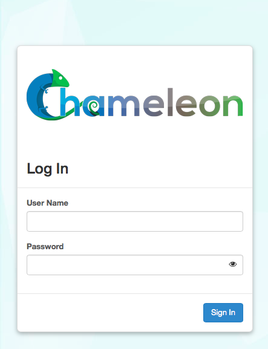{#fig:chameleon-login}

After a successful log in, you will see the Overview page as shown
below. This page provides a summary of your current and recent usage and
provides links to various other pages. Most of the tasks you will
perform are done via the menu on the lower left and will be described
below. One thing to note is that on the left, your current project is
displayed. If you have multiple Chameleon projects, you can change which
of them is your current project. All of the information displayed and
actions that you take apply to your current project. So in the screen
shot below, the quota and usage apply to the current project you have
selected and no information about your other projects is shown.

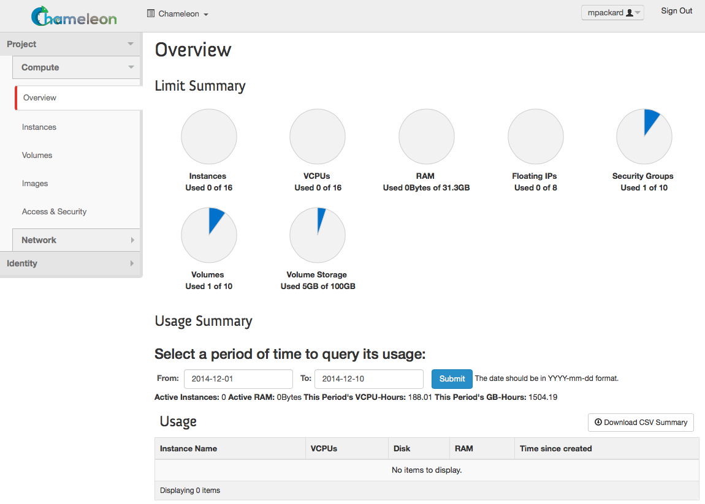{#fig:overview-page}

### Managing Virtual Machine Instances

One of the main activities you'll be performing in this web interface is
the management of virtual machines, or instances. You do this via the
Instances page that is reachable from the menu in the lower left of the
Overview page. An example Instances page is shown below. For instances
that you have running, you can click on the name of the instance to get
more information about it and to access the VNC interface to the
console. The dropdown menu to the left of the instance lets you perform
a variety of tasks such as suspending, terminating, or rebooting the
instance.

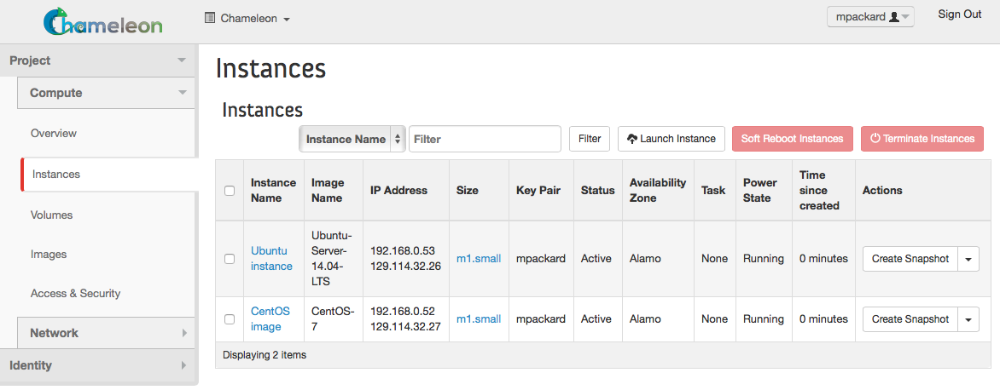{#fig:virtual-machine-instances}

The Instances page also lets you create new virtual machines by using
the 'Launch Instance' button in the upper-right. When you click this
button, a dialog window pops up. In the first 'Details' tab, you select
the 'Instance Boot Source' of the instance, which is either an 'Image',
a 'Snapshot' (an image created from a running virtual machine), or a
'Volume' (a persistent virtual disk that can be attached to a virtual
machine). If you select 'Boot from image', the Image Name dropdown
presents a list of virtual machine images that we have provided, that
other Chameleon users have uploaded and made public, or images that you
have uploaded for yourself. If you select 'Boot from snapshot', the
Instance Snapshot dropdown presents a list of virtual machine images
that you have created from your running virtual machines.

On the Details tab, you also provide a name for this instance (to help
you identify instances that you are running), and select the amount of
resources (Flavor) to allocate to the instance. If you select different
flavors from the Flavor dropdown, their characteristics are displayed on
the right.

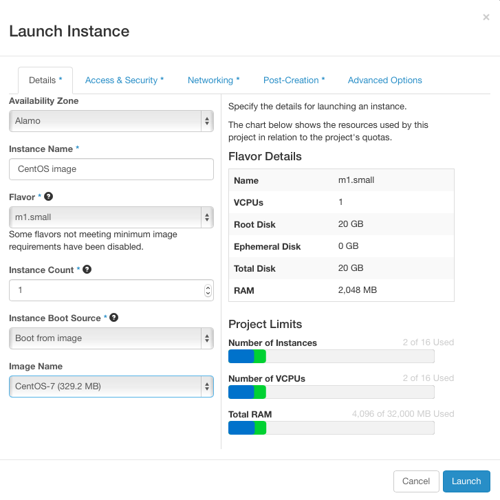{#fig:launcher-window}

The next tab is 'Access & Security', where you select an SSH keypair
that will be inserted into your virtual machine. These keypairs can be
uploaded via the main 'Access & Security' section. You will need to
select a keypair here to be able to access an instance created from one
of the public images Chameleon provides. These images are not configured
with a default root password and you will not be able to log in to them
without configuring an SSH key.

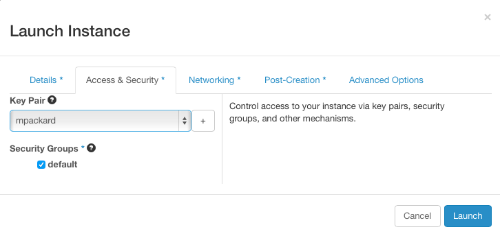{#fig:access-window}

Next is 'Networking', where you select which network should be
associated with the instance. Click the + next to your your project's
private network (PROJECT_NAME-net), not ext-net.

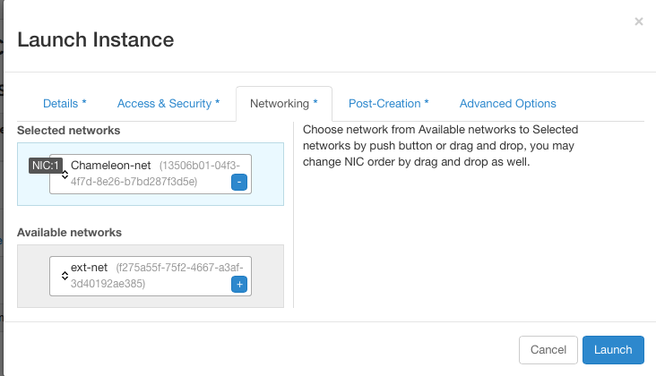{#fig:networking-window}

Once you do this, you can Launch your instance and the Instances page
will show progress as it starts.

If you would like to assign a public IP address to your VM, you can do
that while it is booting up. Click on the dropdown under *Actions* and
choose *Associate Floating IP*. Choose an IP from the *IP Address* menu
and click *Associate*. If there are no addresses available, click the +
and follow the prompts to add one.

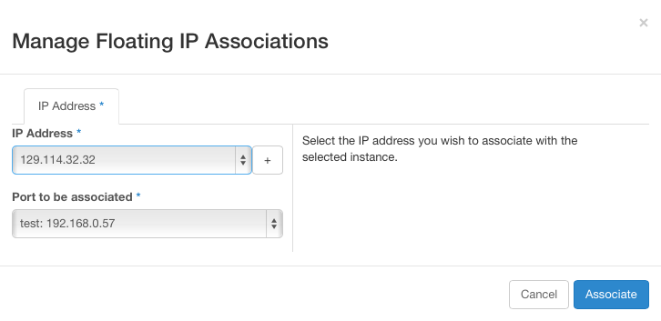{#fig:floating-ip-window}

OpenStack injects your SSH key into the VM and you can use the
corresponding private SSH key to log in to the VM. You will need to use
the public IP assigned to your VM to connect from outside of Chameleon,
or connect through an existing instance that both a public and private
IP.

**Note that the images we provide do not allow SSH into the root
account. For root access, SSH into the instance as user 'cc' and then
use the *sudo* command to become root.**

We have enabled auto-login for the cc user on the console of our
supported images. This should aid in debugging if you are unable to
reach the instane via ssh for some reason.

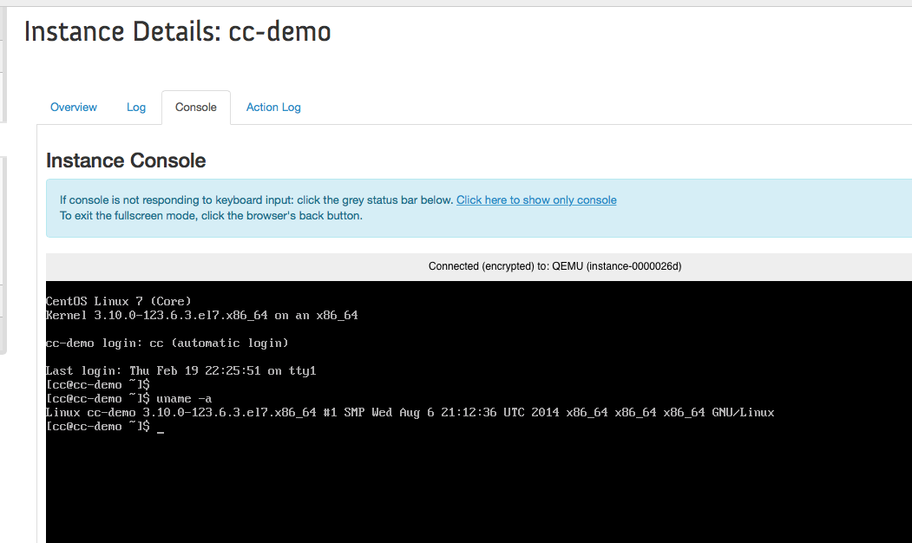{#fig:console}

### Snapshots

The instance list page shown above has an option 'Create Snapshot' that
allows you to save a copy of the disk contents of a running virtual
machine. This allows you to start new virtual machines in the future
that are identical to this one and is an easy way to save any changes
you make to a running virtual machine.

### Firewall (Access Security)

Each project has control over their own firewall settings for their
instances. At minimum you'll probably want to allow SSH access so you
can reach your instances.

To enable this traffic, you need to configure the security group used by
your virtual machine. You can see a list of your security groups using
the "Access & Security" link on the left.

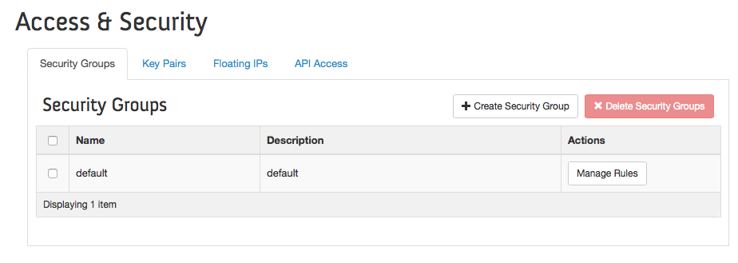{#fig:security-groups}

To edit a security group, click on "Edit Rules". This opens a page
showing the existing rules in the security group.

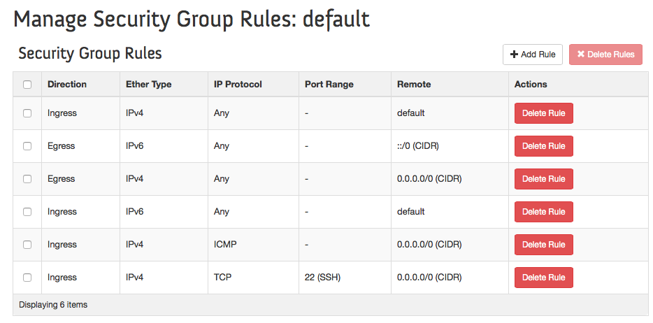{#fig:editing-a-security-group}

Click on "Add Rule" and choose the *SSH* rule from the list, and click
*Add*. Modifications are automatically propagated to the OpenStack
cloud. Feel free to add other rules as necessary.

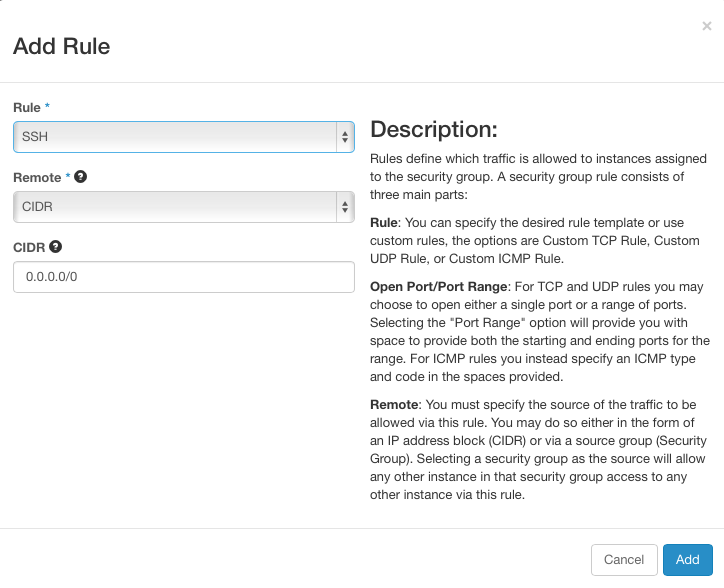{#fig:add-a-security-group}

## OpenStack REST Interfaces

The OpenStack REST Interfaces are supported on Chameleon over secure
HTTP connections. You can download your OpenStack credentials file from
the web interface via the "Access & Security" link in the left of any
page and then click on the "API Access" link on the top.

You can then install the OpenStack command line clients following [these
instructions](http://docs.openstack.org/user-guide/common/cli_install_openstack_command_line_clients.html).
If using pip, we recommend setting up a virtualenv.

The SSL certificate used by Chameleon is trusted by most operating
systems, so you should not have to provide any extra options to OpenStack
commands, i.e. "nova list" should work. If your command-line tool
complains about the certificate, [download the Mozilla CA bundle from
the cURL website](http://curl.haxx.se/docs/caextract.html) and run the
OpenStack client tools with the --os-cacert cacert.pem arguments.

## Downloading and uploading data

You can use the OpenStack command line clients to download data from and
upload data to Chameleon clouds. Configure your environment by following
the "OpenStack REST Interfaces" section above, then use the following
commands:

-   `glance image-download` to download images and snapshots from Glance
-   `glance image-create` to upload images and snapshots to Glance
-   `cinder upload-to-image` to convert a Cinder volume to a
    Glance image
-   `cinder create [--image-id <image-id>] [--image <image>]` to create
    a Cinder volume from a Glance image
