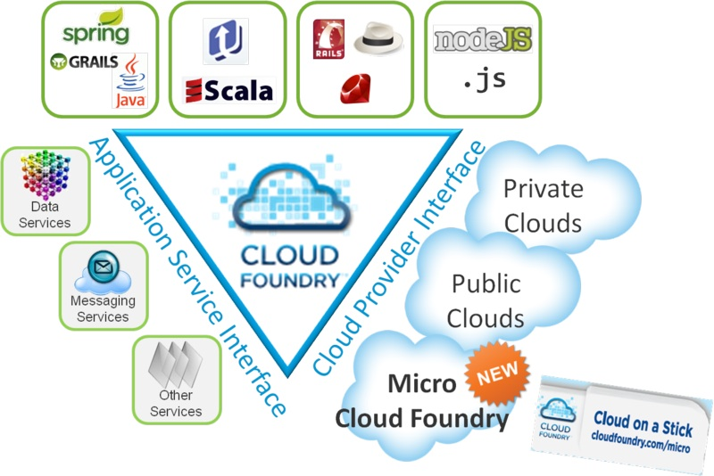
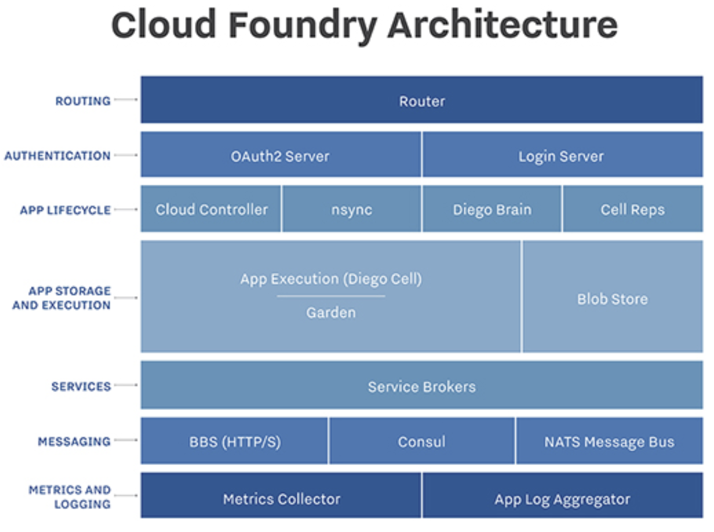

# Cloud Foundry - Open Source PaaS :hand: fa18-516-11
 
| Murali Cheruvu
| mcheruvu@iu.edu
| Indiana University
| hid: fa18-516-11
| github: [:cloud:](https://github.com/cloudmesh-community/fa18-516-11/blob/master/paper/paper.md)
  
---
 
Keywords: Cloud Foundry, Open Source, PaaS
 
---

## Cloud Foundry Overview
Cloud Foundry (CF) is, an open source, Platform as a Service (PaaS) 
available through a variety of private and public cloud distributions, 
which is developed and operated by VMware and then transferred to Pivotal Software, 
a joint venture by EMC, VMware and General Electric. Pivotal Cloud Foundry is 
an alternative paid version with additional commercial features, support and documentation.

As opposed to most of the PaaS offerings in the market, which are
*tied to proprietary implementations*, Cloud Foundry is an open
source software with flexibility to allow integrations with 
external systems. Cloud Foundry provides all the PaaS capabilities like
the popular public and private PaaS Providers - built-in scalable
infrastructure, middleware, and various tools for development, 
deployment and support. To enable infrastructure-agnostic 
architecture, Cloud Foundry, as shown in +@fig:cf-open-paas focused on three main categories: *Clouds,
Frameworks and Services* [@Badola2015].

{#fig:cf-open-paas}

### Category: Clouds

Public and private clouds have their advantages and disadvantages.
While public clouds provide flexibility and faster deployments, private 
clouds offer operational efficiency and total control. *Hybrid
cloud approach* gives best of both public and private cloud offerings: 
infrastructure scalability, deployment and monitoring tools, data
locality, industry regulations, zero-changes to the existing 
applications or develop with cloud-native mindset - API Gateways in
combination of Micro-Services. Cloud Foundry is an open PaaS
with ability to extend and collaborate with other private and public
cloud systems. It can co-exist with other PaaS and IaaS platforms,
in a way, it can be hosted on top of popular cloud environments
like AWS, Azure, Google Cloud and OpenStack.

### Category: Frameworks

Most of the cloud environments are *restricted to fewer frameworks*
and programming languages. Tough there is a good coverage
of runtime environments and programming languages offered by
most of the public clouds including AWS and Azure, there are still
some restrictions either in the way we will need to use them or in
the pricing and licensing models. Cloud Foundry, at architecture
level, is generic and intended to host any programming language.
It is written in Ruby and currently supports popular programming
languages like Spring, Java, Ruby and NodeJS.

### Category: Services

Similarly most of the clouds have limited set of support for various
types of data, messaging and other services, restricting companies
anddevelopmentteamsbyforcingthemtousespecifctechnologies.
Cloud Foundry, out of the box, shipped with support to various
services like relational (MySQL, PostgreSQL), NoSQL (MongoDB),
Key-Value pair (Redis) databases and RabbitMQ message queuing
system along with extensibility to allow third-party systems to be
added later.

## Key Components

Cloud Foundry comes with lots of ready-made components to 
support all the key aspects of PaaS cloud computing in a scalable
fashion [@Nimalsiri2016]. +@fig:cf-arch is a good representation of the major components
of Cloud Foundry:

{#fig:cf-arch}

### Router

Router is responsible for controlling all the external and application
level traffic, and also directing the incoming traffic to appropriate
components. Routerconfgurationallowstohavenumberofrouters
to enable proper load balancing and high availability of the cloud
foundry environment. Each router maintains a dynamic route table
with all details of the deployed applications. Gorouter interacts
with Cloud Controller and Droplet Execution Agent (*DEA*) to 
facilitate the updated routing information across the Cloud Foundry
Environment. Router is implemented in Go programming language
that can offer optimal performance.

### UAA and Login Server

User Account and Authentication (*UAA*) and Login Server 
components are the identity management system in CloudFoundry. Cloud
Foundry uses OAuth2 (Open Authorization) standards driven token-
based authentication and authorization to manage user security
tokens.

### Cloud Controller

We can think of Cloud Controller (*CC*) as the brain of Cloud Foundry
Environment and the main responsibility of Cloud Controller is to
manage the applications life cycle - deployment, application 
meta-data, staging and running the applications. CC uses *Diego Brain*,
CC-Bridge and Diego Cells to stage and run the applications. CC
redirects the first requests to the appropriate Droplet Execution
Engine (DEA) available in the load balancing pool. CC user 
permissions are maintained at various levels - Orgs, Spaces and Roles
for greater scalability to the role-based access control. Application
deployment artifacts - code packages, build-packs and droplets are
maintained in Blob Store.

### Execution and Storage

Droplet Execution Engine (*DEA*) is responsible for application 
deployment and runtime management - selecting appropriate build-
pack, stage the application and ensuring end-to-end life cycle 
management of the application instance. Build packs are the scripts
to identify the required framework for applications to run 
properly. Droplet is the unit of execution - deployed build pack of the
application along with the application metadata. Wardens are 
containers to host the droplets and isolate them in resource-controlled
environments. *BOSH* is used as tool for release management of
complex distributed systems.

### Service Brokers

Most of the applications have aspects like interacting with database,
sending messages using Service-Oriented Architecture (*SOA*) and
interfacing third-party components. Services cannot directly 
interact with the applications given they run in the containers which are
not persistent. Cloud Foundry uses service brokers in a decoupled
fashion through which application developers can facilitate and use
the services in applications. Cloud Controller uses *NATS* based messaging system.
It uses a light-weight publish-subscribe mechanism to distribute
the queued messages among applications.

### Monitoring and Logging

CC provides various tools for continuous monitoring - *(a)* Health
Manager: Responsible for monitoring health of the application
instances by interacting with DEA and CC, *(b)* Metric Collector:
Gathers various application metrics from the running instances,
and *(c)* Log Aggregator: Streams application logs. Developers and
support teams can access these logs and metrics to monitor, support
and take necessary actions to keep systems up and running.

## Conclusion

Lots of Fortune 500 companies from all over the world - various
industries and government organizations, rely on Cloud Foundry
for all the benefits of flexible open source PaaS offerings [@fortune-500]. 
Cloud Foundry is setting the new standards for cloud computing with
emphasis on scalability and industry best practices by promoting
12-factor application development [@twelve-factor-app].

