# Data Center

:question: indicates opportunities for comprehension assignments while
contributing to this document.

---

**:mortar_board: Learning Objectives**

* What is a data center.
* What are import metrics.
* What is the difference between a Cloud data center and a traditional
  datacenter.
* What are examples of Cloud data centers.

---

## Motivation: Data

Before we go into the details of a data center we like to motivate why
we need them.  Here we start with looking at the amount of data that
recently got created and provide one of many motivational aspects. Not
all data will or should be stored in data centers. However a
significant amount of data will be in such centers.

### How much data?

One of the issues we have is to actually comprehending how much data is
actually created. As humans the total sum created over a year is hard
to imagine and put into a perspective that can easily be understood.
In order to visualize the data produced we find often Graphics about
how much i created in one minute instead. Such depictions include
samples of data created as a part of popular cloud services or the
internet in general.

One such popular depiction is "Data Never Sleeps". It has been
produced a number of times over the years and is now at version 6.0
released in 2017. If you identify a newer version, please let us know.
It is worth while to study this image in detail and identify some of
the data that you can relate to of service you use. It is also a
possible indication to study other services that are mentioned. A
staggering 3.8Mil google searches are executed every minute.
Surprisingly the weather channel receives over 18Mil forecast requests
which is even higher than the 12Mil text messages send every minute.
Youtube certainly serving a significant number of users by 4.3Mil
videos watched every minute. Naturally the numbers are averages over
time.

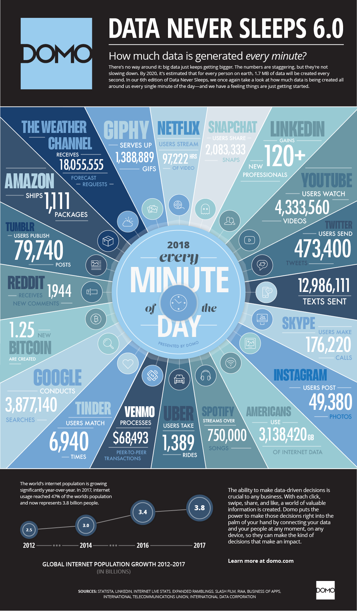

Source: <https://www.domo.com/blog/wp-content/uploads/2018/06/18-domo-data-never-sleeps-6.png>

A different source publishes what is happening on the internet in a
minute, but we have been able to locate a version from 2018. While
some data seems the same, others are slightly different. For example
this graph has a lower count for Google searches, while the number of
text messages send is significantly higher in contrast to the previous
figure.

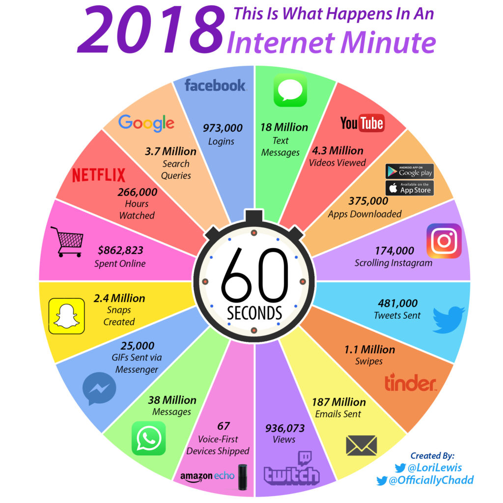

Source: <https://www.allaccess.com/merge/archive/28030/2018-update-what-happens-in-an-internet-minute>

While reviewing the image from last year from the same author, we find
not only increases, but also declines. Looking at facebook showcases a
loss of 73000 logins per minute. This loss is substantial. We can see
that facebook services are replaced by other services that are more
popular with the younger generation who tend to pick up new services
quickly.

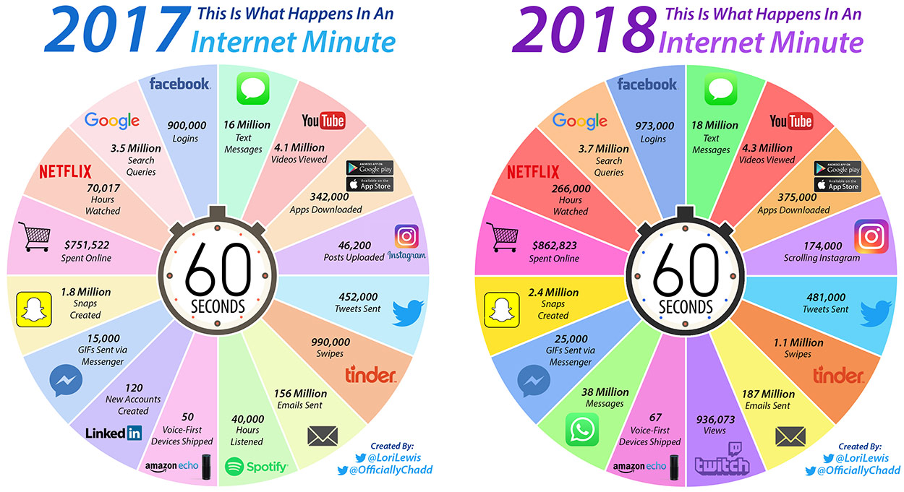

Source: <https://www.allaccess.com/assets/img/content/merge/2018/m-04-03-pic1-lg.jpg>

It is also interesting to compare such trends over a longer period of
time. An example is provided by looking at Google searches:
<http://www.internetlivestats.com/google-search-statistics/>.

**Figure:** Google searches over time

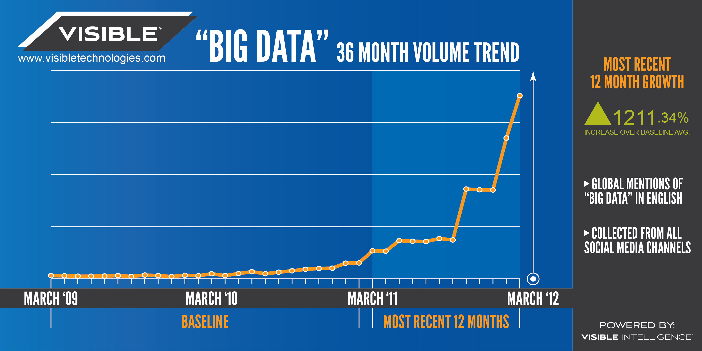

When looking at the trends, many predict an exponential growth in data.
This trend is continuing.

**Figure:** Big data trend. 2012, Source: <https://blogs-images.forbes.com/christopherfrank/files/2012/03/VI_BigData_Graphic_v3_low.png>

<!--

**Figure:** Big Data Landscape
-->

## Cloud Data Centers

A *data center* is a facility that hosts the information technology
related to servers and data serving a large number of customers. data
centers evolved from the need to originally have large rooms as the
original computers filled in the early days of the compute revolution
filled rooms. Once multiple computers were added to such facilities
super computer centers created for research purposes. With the
introduction of the internet and offering services such as Web
hosting large business oriented server rooms were created. The need
for increased facilities was even accelerated by the development of
virtualization and servers being rented to customers in shared
facilities. As the need of web hosting still is important but has
been taken over by cloud data centers, the terms internet data center,
and cloud data center are no longer used to distinguish it. Instead we
use today just the term *data center*. There may be still an important
difference between research data centers offered in academia and
industry that focus on providing computationally potent clusters focus
on numerical computation. Such data centers are typically centered
around the governance around a smaller number of users that are either
part of an organization or a virtual organization. However, we see
that even in the research community data centers not only host
supercomputers, but also Web server infrastructure and these days even
private clouds that support the organizational users. In case of the
latter we speak about supporting the "long tail about science".

The later is driven by the 80%-20% rule. E.g. 20% of the users use 80%
of the compute power. This means that the top 20% of scientists are
served by the leadership class super computers in the nation, while
the rest are either served by other servers, cloud offerings through
research and public clouds.

## Data Center Infrastructure

Due to the data and the server needs in th cloud and in research such
data centers may look very different. Some focus on large scale
computational resources, some on commodity hardware offered to the
community. The size of them is also very different. While a
supercomputing center as part of a University was one of the largest
such data centers two decades ago, they dwarf the centers now deployed
by industry to server the long tail of customers.

In general a data center will have the following components.

* Facility: the entire data center will be hosted in a building.  The
  building may have specific requirements related to security,
  environmental concerns, or even the integration into the local
  community with for example providing heat to surrounding residences.

* Support infrastructure: This building will include a significant
  number of support infrastructure that addresses for example
  continuous power supply, air conditioning, and security For this
  reason you find in such centers
  
  * Uninterruptible Power Sources (UPS) 
  * Environmental Control Units
  * Physical Security Systems
  
* Information Technology Equipment: Naturally the facility will host the IT equipment including the following:

  * Servers
  * Network Services
  * Disks
  * Data Backup Services
  
* Operations staff: The facility will need to be staffed with the various groups that support such data centers. It includes

  * IT Staff
  * Security and Facility Staff
  * Support Infrastructure Staff

  With regards to the number of people serving such a facility it is
  obvious that through automation is quite low. According to
  (<https://journal.uptimeinstitute.com/data-center-staffing/>) proper
  data center staffing is a key to a reliable operation.
  
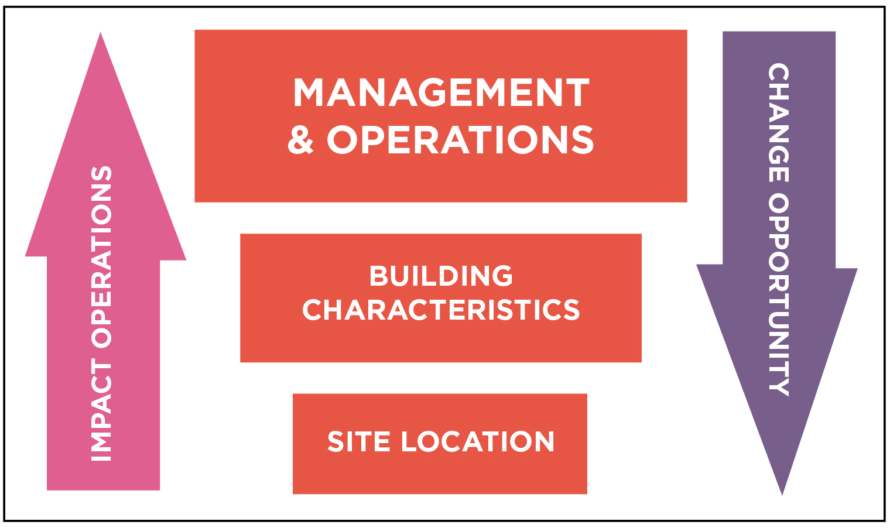
  
Figure Operational Sustainability.  According to Tier Standard:
Operational Sustainability, the three elements of Operational
Sustainability are Management and Operations, Building
Characteristics, and Site
Location. (<https://journal.uptimeinstitute.com/data-center-staffing/>)

Another interesting observation is the root cause of incidents in a
data center. Everyone has probably experienced some outage, so it is
important to identify where they come from in order to prevent
them. As we see in the Figure *Outage* not every error is caused by an
operational issue. External, installation, design and manufacturer
issues are together the largest issue for datacenter incidents.

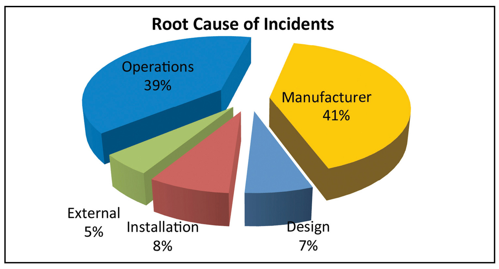 

Figure Outage. According to the Uptime Institute Abnormal Incident
Reports (AIRs) database, the root cause of 39% of data center
incidents falls into the operational
area. (<https://journal.uptimeinstitute.com/data-center-staffing/>)

## Data Center Characteristics

Next we identify a number of characteristics when looking at different data centers.

**Variation in Size**: Data centers range in size from small "edge”
facilities to megascale or hyperscale filling large ware houses.

**Variation in cost per server**: Although many data centers
standardize their components, specialized services my be afford not on
a 1K server, but on a 50K server.

**Variation in Infrastructure:** Servers in centers serve a variation
  of needs and motivate different infrastructure: Use cases, Web
  Server, E-mail, Machine Learning, Pleasantly Parallel problem,
  traditional super computing jobs.

**Energy Cost:** Data centers use a lot of energy. The energy cost
varies per region.  A motivation to reduce energy use and cost is also
been trended by environmental awareness, not only by the operators,
but by the community in which such centers operate.

**Reliability:** Although through operation l efforts the data center
  can be made more reliable, failure still can happen. Examples are

* <https://www.zdnet.com/article/microsoft-south-central-u-s-datacenter-outage-takes-down-a-number-of-cloud-services/>
* :question: find more examples

Hence Data Center IaaS advantages include

* Reduced operational cost 
* Increased reliability
* Increased scalability
* Increased flexibility
* Increased support
* Rapid deployment
* Decrease management: Outsourcing expertise that is not related to core business

Datacenter disadvantages include

* Loss of control of the HW
* Loss of control of the data
* Model is preferring many users
* Software to control infrastructure is not accessible
* Variations in performance due to sharing
* Integration requires effort beyond login
* Failures can have a humongous impact

## Data Center Metrics

One of the important factors for a smooth operation but also for a
smooth offering of services is to employ metrics that will be able to
provide significant impacting the operations. Having metrics allows
the staff to monitor and adapt to dynamic situations but also to plan
operations.

### Data Center Carbon Footprint

Scientists world wide have identified a link between carbon emission
and global warming. As the energy consumption of a data center is
substantial, it is prudent to estimate the overall carbon emission.
Schneider Electric (formerly APC) has provided a report on how to
estimate the Carbon footprint of a data center.

* Estimating a Data Center’s Electrical Carbon Footprint, White Paper
  66, <http://www.apc.com/salestools/DBOY-7EVHLH/DBOY-7EVHLH_R0_EN.pdf>

Although this report is already a bit older, it provides still
valuable information. It defines key terms such as

* Carbon dioxide emissions coefficient (“carbon footprint”) 
	
	With the increasing demand of data, bandwidth and high performance systems, there is substantial amount of power consumption. This leads to high amount of greenhouses gases emission into the atmosphere, released due to any kind of basic activities like driving a vehicle or running a power plant.
	
	" The measurement includes power generation plus transmission and distribution losses incurred during delivery of the electricity to its point of use."
	
Data centers in total used 91 billion kilowatt-hours (kWh) of electrical energy in 2013, and they will use 139 billion kWh by 2020. Currently, data centers consume up to 3 percent of all global electricity production while producing 200 million metric tons of carbon dioxide. Since world is moving towards cloud, causing more and more data center capacity leading more to power consumption.

* Peaker plant

	Peaking power plants, also known as peaker plants, and occasionally just "peakers", are power plants that generally run only when there is a high demand, known as peak demand, for electricity.Because they supply power only occasionally, the power supplied commands a much higher price per kilowatt hour than base load power. Peak load power plants are dispatched in combination with base load power plants, which supply a dependable and consistent amount of electricity, to meet the minimum demand.
	These plants are generally coal-fired which causes a huge amount of CO2 emissions. A peaker plant may operate many hours a day, or it may operate only a few hours per year, depending on the condition of the region's electrical grid. Because of the cost of building an efficient power plant, if a peaker plant is only going to be run for a short or highly variable time, it does not make economic sense to make it as efficient as a base load power plant. In addition, the equipment and fuels used in base load plants are often unsuitable for use in peaker plants because the fluctuating conditions would severely strain the equipment. For these reasons, nuclear, geothermal, waste-to-energy, coal and biomass are rarely, if ever, operated as peaker plants.
	
* Avoided emissions

	Emissions avoidance is the most effective carbon management strategy over a multi-decadal timescale to achieve atmospheric CO2 stabilization and a subsequent decline . This prevents, in the first place, stable underground carbon deposits from entering either the atmosphere or less stable carbon pools on land and in the oceans.

Carbon offsets based on energy efficiency rely on technical efficiencies to reduce energy consumption and therefore reduce CO2 emissions. Such improvements are often achieved by introducing more energy efficient lightening, cooking, heating and cooling systems. These are real emission reduction strategies and have created valid offset projects.

This type of carbon offset provides perhaps the simplest options that will ease the adoption of low carbon practice. When these practices become generally accepted (or compulsory), they will no longer qualify as offsets and further efficiencies will need to be promoted.
	
* CO2 (carbon dioxide, or “carbon”) 
	
	Carbon dioxide is the main cause of the greenhouse effect, it is emitted in huge amount into our atmosphere with a life cycle of almost 100 years. Data centers emit during the manufacturing process of all the components that populate a
data center (servers, UPS, building shell, cooling, etc.) and during operation of data centers (in terms of electricity consumed), the maintenance of the data centers (i.e. replacement of consumables like batteries, capacitors, etc.), and the disposal of the components of the data centers at the end of the lifecycle.
	Until now, power plants have been allowed to dump unlimited amounts of carbon pollution into the atmosphere — no rules were in effect that limited their emissions of carbon dioxide, the primary driver of global warming. Now, for the first time, the EPA has finalized new rules, or standards, that will reduce carbon emissions from power plants. Known as the Clean Power Plan, these historic standards represent the most significant opportunity in years to help curb the growing consequences of climate change.

The data center will have a total carbon profile, that includes the
many different aspects of a data center contributing to carbon
emissions. This includes manufacturing, packaging, transportation,
storage, operation of the data center, and decommissioning. Thus it is
important to notice that we not only need to consider the operation
but also the construction and decommission phases.

### Data Center Operational Impact

One of the main operational impacts is the cost and emissions of a
data center cause by running, and cooling the servers in the data
center. Naturally this is dependent on the type of fuel that is used
to produce the energy. The actual carbon impact using electricity
certainly depends on the type of powerplant that is used to provide
it. These energy costs and distribution of where the energy comes from
can often be looked up by geographical regions on the internet or form
the local energy provider. Municipal government organizations may also
have such information. Tools such as the Indiana State Profile and
Energy Use

* <https://www.eia.gov/state/?sid=IN>  

may provide valuable information to derive such estimates. Correlating
a data center with cheap energy is a key factor. To estimate both
costs in terms of price and carbon emission Schneider provides a
convenient Carbon estimate calculator based on energy consumption.

* <https://www.schneider-electric.com/en/work/solutions/system/s1/data-center-and-network-systems/trade-off-tools/data-center-carbon-footprint-comparison-calculator/tool.html>
* <http://it-resource.schneider-electric.com/digital-tools/calculator-data-center-carbon>

If we calculate the total cost, we need naturally add all costs
arising from build and teardown phase as well as operational upgrades.

**Exercises**

**E.Carbon.1:** Carbon footprint of a data center

> Complete the definitions of the terms used in the relevant section

**E.Carbon.2:** Carbon footprint of data centers

> World wide we have many data centers. Your task will be to find the
> carbon emission of a data center and its cost in $ based on energy
> use on a yearly basis. Add your findings to the following table.
> Make sure you avoid redundant reporting and find a new datacenter. A
> google doc will be provided to coordinate with the class
> participants

**Table:** Cost of the data center

.

| Data Center | Location | Year | Electricity Cost* | IT Load | Yearly Cost | Yearly CO2 Footprint | Equivalent in Cars |   |
|-------------|----------|------|-------------------|---------|-------------|----------------------|--------------------|---|
| :question:  | :question: | :question:  | :question:               | :question:     | :question:         | :question:                  | :question:                |   |
|             |          |      |                   |         |             |                      |                    |   |
|             |          |      |                   |         |             |                      |                    |   |

*as adjusted in calculator

> If you find other estimates for a data center or an entire data
> center fleet such as AWS world wide, please provide citations.

**E.Carbon.3:** Your own Carbon footprint

> It is interesting to compare and measure your own carbon footprint.
> We will ask you anonymously to report your carbon footprint via a
> form we will prepare in future. As the time to do this is less than
> 2 minutes, We ask all students to report their footprint.
 
Please use the calculator at:

* <http://carbonfootprint.c2es.org/>

### Power Usage Effectiveness

One of the frequent measurements in data centers that is used is the
Power usage effectiveness or PUE in short. It is a measurement to
identify how much energy is ued for the computing equipment versus
other energy costs such as air conditioning.

Formally we define it as

> *PUE is the ratio of total amount of energy used by a computer data
> center facility to the energy delivered to computing equipment.*
 
PUE was published in 2016 as a global standard under
[ISO/IEC 30134-2:2016](https://www.iso.org/standard/63451.html).

The inverse of PUE is the data center infrastructure efficiency (DCIE).

The best value of PUE is 1.0. Any data center must be higher than
this value as offices and other cost surely will arise when we look at
the formula

$\mathrm{PUE} = \frac{\mathrm{Total~Facility~Energy}}{\mathrm{IT~Equipment~Energy}}$

$\mathrm{PUE} = 1 + \frac{\mathrm{Non~IT~Facility~Energy}}{\mathrm{IT~Equipment~Energy}}$

According to the PUE calculator at 

* <https://www.42u.com/measurement/pue-dcie.htm>

The following ratings are given

| PUE | DCIS | Level of Efficiency |
| --- | --- | --- |
| 3.0 | 33% | Very Inefficient |
| 2.5 | 40% | Inefficient |
| 2.0 | 50% | Average |
| 1.5 | 67% | Efficient |
| 1.2 | 83% | Very Efficient |

PUE is a very popular metric as it is relatively easy to calculate and
provides a metric that can easily compare data centers between each
other.

This metric comes also with some drawbacks:

* It does not integrate for example climate based differences, such as
  that the energy use to cool a data center in colder climates is
  less than in warmer climates. However, this may actually be a good
  side-effect as this will likely result in less cooling needs sand
  therefor energy costs.
* It also forces large data centers with many shared servers in
  contrast to small data centers where operational cost may become
  relevant.
* It does not take in consideration recycled energy to for example
  heat other buildings outside of the data center.

Hence it is prudent not to just look at the PUE but also at other
metrics that lead to the overall cost and energy usage of the total
ecosystem the data center is located in.

Already in 2006, Google reported its six data centers efficiency as
1.21 and Microsoft as 1.22 which at that time were considered very
efficient. However over time these target has shifted and today's data
centers achieve much lower values. The Green IT Cube in Darmstadt,
Germany even reported 1.082. According to Wikipedia an unnamed Fortune
500 company achieved with 30000 SuperMicro blades a PUE of 1.06 in
2017.

**Exercises**

**E.PUE.1:** Lowest PUE you can find

> What is the lowest PUE you can find. 
> Provide details about the system as well as 
> the date when the PUE was reported.

### Hot-Cold Isle :o: :question:

Contribute a section discussing the hot cold isle.

### Workload Monitoring

#### Workload of HPC in the Cloud

Clouds and especially university data centers do not just provide
virtual machines but provide traditional super computer services. This
includes the NSF sponsored XSEDE project. As part of this project the
"XDMoD auditing tool provides, for the first time, a comprehensive
tool to measure both utilization and performance of high-end
cyberinfrastructure (CI), with initial focus on XSEDE. Several case
studies have shown its utility for providing important metrics
regarding resource utilization and performance of TeraGrid/XSEDE that
can be used for detailed analysis and planning as well as improving
operational efficiency and performance. Measuring the utilization of
high-end cyberinfrastructure such as XSEDE helps provide a detailed
understanding of how a given CI resource is being utilized and can
lead to improved performance of the resource in terms of job
throughput or any number of desired job characteristics.

Detailed historical analysis of XSEDE usage data using XDMoD clearly
demonstrates the tremendous growth in the number of users, overall
usage, and scale."

Source: <https://experts.illinois.edu/en/publications/using-xdmod-to-facilitate-xsede-operations-planning-and-analysis>

Having access to a detailed metrics analysis allows users and center
administrators, as well as project managers to better evaluate the use
and utilization of such large facilities justifying their existence.

**Figure:** XDMod: XSEDE Metrics on Demand

Additional information is available at

* <https://open.xdmod.org/7.5/index.html>

#### Scientific Impact Metric

Gregor von Laszewski and Fugang Wang are providing a scientific impact
metric to XDMoD and XSEDE. It is a framework that (a) integrates
publication and citation data retrieval, (b) allows scientific impact
metrics generation at different aggregation levels, and (c) provides
correlation analysis of impact metrics based on publication and
citation data with resource allocation for a computing facility. This
framework is used to conduct a scientific impact metrics evaluation of
XSEDE, and to carry out extensive statistical analysis correlating
XSEDE allocation size to the impact metrics aggregated by project and
Field of Science. This analysis not only helps to provide an
indication of XSEDE’S scientific impact, but also provides insight
regarding maximizing the return on investment in terms of allocation
by taking into account Field of Science or project based impact
metrics. The findings from this analysis can be utilized by the XSEDE
resource allocation committee to help assess and identify projects
with higher scientific impact. Through the general applicability of
the novel metrics we invented, it can also help provide metrics
regarding the return on investment for XSEDE resources, or campus
based HPC centers.
[PDF](http://cgl.soic.indiana.edu/publications/Metrics2014.pdf)

#### Clouds and Virtual Machine Monitoring

Although no longer in operation in its original form FutureGrid
<http://archive.futuregrid.org/metrics/html/results/2014-Q3/reports/rst/india-All.html>
has pioneered the extensive monitoring and publication of its virtual
machine and project usage. We are not aware of a current system that
provides this level of detail as sof yet. However, efforts as part of
XSEDE within the XDMoD project are under way at this time but are not
integrated.

Futuregrid provided access to all virtual machine information, as well
as usage across projects. An archived portal view is available at:

* <http://archive.futuregrid.org/metrics/html/results/2014-Q3/reports/rst/india-All.html>

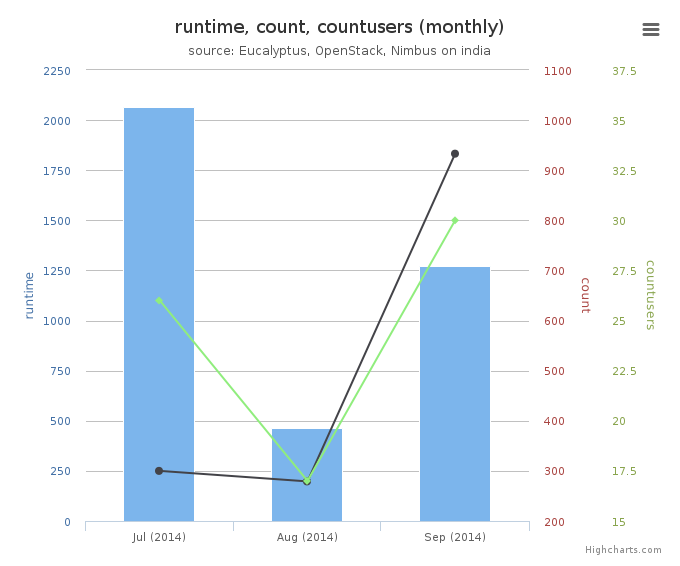

**Figure:** FutureGrid Cloud Metric

Futuregrid offered multiple clouds including clouds based on
OpenStack, Eucalyptus, and Nimbus. Nimbus and Eucalyptus are systems
that are no longer used in the community. Only OpenStack is the only
viable solution in addition to the cloud offerings by Comet that do
not uses OpenStack.

Futuregrid, could monitor all of them and published its result in its
Metrics portal. Monitoring the VMs is an important activity as they
can identify VMs that may no longer be used (the user has forgotten to
terminate them) or too much usage of a user or project can be detected
in early stages.

We like to emphasize several examples where such monitoring is helpful:

* Assume a student participates in a class, metrics and logs allow to
  identify students that do not use the system as asked for by the
  instructors. For example it is easy to identify if they logged on and
  used VMs. Furthermore the length of running a VM ba
* Let us assume a user with willful ignorance does not
  shut down VMs although they are not used because research clouds are
  offered to us for free. In fact, this situation happened to us
  recently while using another cloud and such monitoring capacities were
  not available to us (on jetstream). The user used up simple handedly
  the entire allocation that was supposed to be shared with 30 other
  users in the same project. All accounts of all users were quasi
  deactivated as the entire project they belonged to were deactivated.
  Due to allocation review processes it took about 3 weeks to reactivate
  full access. sed on the tasks to be completed can be compared against
  other student members.
* In commercial clouds you will be charged money. Therefore, it is
  less likely that you forget to shutdown your machine
* In case you use github carelessly and post your cloud passwords or
  any other passwords in it, you will find that within five minutes your
  cloud account will be compromised. There are individuals on the
  network that cleverly mine github for such security lapses and will
  use your password if you indeed have stored them in it. In fact
  github's deletion of a file does not delete the history, so as a non
  expert deleting the password form github is not sufficient. You will
  have to either delete and rewrite the history, but definitely in this
  case you will need to reset the password. Monitoring the public cloud
  usage in the data center is important not only in your region but
  other regions as the password is valid also there and intruders could
  hijack and start services in regions that you have never used.

In addition to FutureGrid, we like to point out Comet (see other
sections). It contains an exception for VM monitoring as it uses a
regular batch queuing system to manage the jobs. Monitoring of the
jobs is conducted through existing HPC tools

#### Workload of Containers

Monitoring tools for containers such as for kubernetes are listed at:

<https://kubernetes.io/docs/tasks/debug-application-cluster/resource-usage-monitoring/>

Such tools can be deployed alongside kubernetes in the data center,
but will likely have restrictions to its access. They are for those
who operate such services for example in kubernetes. We will discuss
this in future sections in more detail.

## Example Data Centers

In this section we will be giving some data center examples while
looking at some of the mayor cloud providers.

### AWS

AWS focuses on security aspects of their data centers that include
four aspects
(<https://aws.amazon.com/compliance/data-center/data-centers/>):

* [Perimeter Layer](https://aws.amazon.com/compliance/data-center/perimeter-layer/)
* [Infrastructure Layer](https://aws.amazon.com/compliance/data-center/infrastructure-layer/)
* [Data Layer](https://aws.amazon.com/compliance/data-center/data-layer/)
* [Environmental Layer](https://aws.amazon.com/compliance/data-center/environmental-layer/)

The global infrastructure is presented (ass of Aug 29th 2018) at
<https://aws.amazon.com/about-aws/global-infrastructure/> and includes
55 Availability Zones within 18 geographic Regions and 1 Local Region
around the world. Plans exists to add 12 Availability Zones and four
additional Regions in Bahrain, Hong Kong SAR, Sweden, and a second AWS
GovCloud Region in the US.

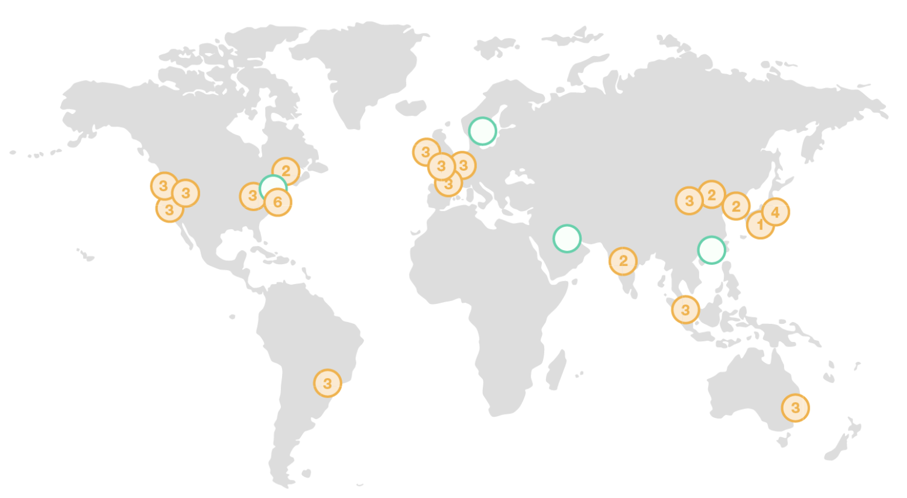

**Figure:** AWS regions

Amazon strives to achieve high availability through multiple availability zones, 
improved continuity with replication between regions, meeting compliance and data residency requirements as well as providing geographic expansion.

The regions and number of availability zones are as follows:

Region US East: N. Virginia (6), Ohio (3)
US West N. California (3), Oregon (3)

Region: Asia Pacific Mumbai (2), Seoul (2), Singapore (3), Sydney (3), Tokyo (4), Osaka-Local (1)1
Canada Central (2)
China Beijing (2), Ningxia (3)

Region: Europe Frankfurt (3), Ireland (3), London (3), Paris (3)
South America São Paulo (3)

Region Gov Cloud:
AWS GovCloud (US-West) (3)
  
New Region (coming soon):
Bahrain
Hong Kong SAR, China
Sweden
AWS GovCloud (US-East)

### Azure

* <https://azure.microsoft.com/en-us/global-infrastructure/regions/>

Azure claims to have more global regions than any other cloud
provider. They motivate this by their advertisement to bring and
applications to the users around the world. The goal is similar as
other commercial hyprescale providers by introducing preserving data
residency, and offering comprehensive compliance and resilience. As of
Aug 29, 2018 Azure supports 54 regions worldwide. These regions can
currently be accessed by users in 140 countries. Not every service is
offered in every region as the service to region matrix shows:

* <https://azure.microsoft.com/en-us/global-infrastructure/services/>

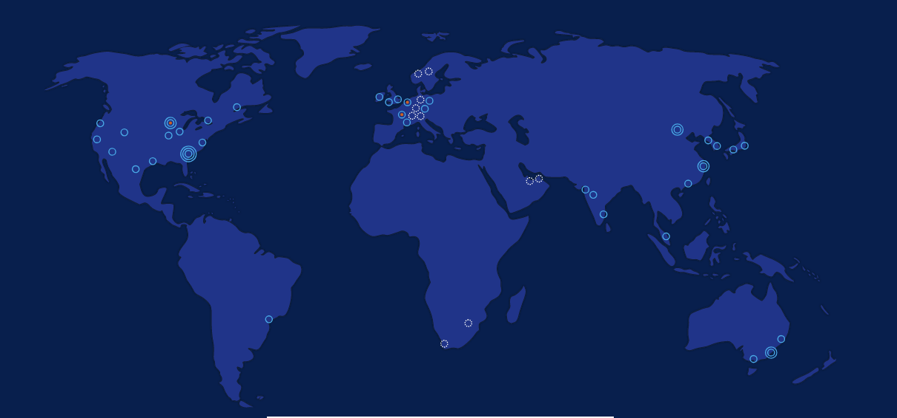

**Figure:** Azure regions

### Google

From
<https://www.google.com/about/datacenters/inside/locations/index.html>
we find that on Aug. 29th Google has the following data center
locations:

* **North America:** Berkeley County, South Carolina; Council Bluffs,
  Iowa; Douglas County, Georgia; Jackson County, Alabama; Lenoir, North
  Carolina; Mayes County, Oklahoma; Montgomery County, Tennessee; The
  Dalles, Oregon
* **South America:** Quilicura, Chile
* **Asia**: Changhua County, Taiwan; Singapore
* **Europe:* Dublin, Ireland; Eemshaven, Netherlands; Hamina, Finland;
  St Ghislain, Belgium

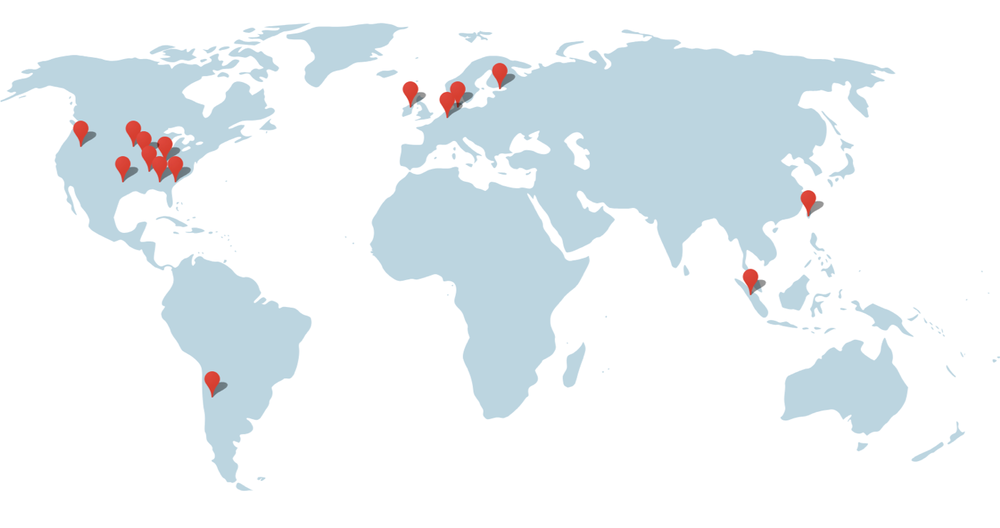

Each data center is advertised with a special environmental impact
such as a unique cooling system, or wildlife on premise. Google's data
centers support its service infrastructure and allow hosting as well
as other cloud services to be offered to it's customers.

Google highlights its efficiency strategy and methods here:

* <https://www.google.com/about/datacenters/efficiency/>

They summarize their offers are based on 

* Measuring the PUE
* Managing airflow
* Adjusting the temperature
* Use free Cooling
* Optimizing the power distribution

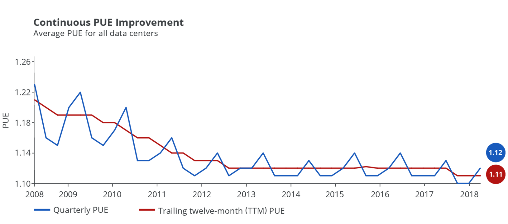

**Figure:** [PUE data for all large-scale Google data centers](https://www.google.com/about/datacenters/efficiency/internal/)

An important lesson from Google is the PUE boundary. That is the
different efficiency based on the closeness of the IT infrastructure
to the actual data center building. This indicates that it is
important to take at any providers definition of PUE in order not to
report numbers that are not comparable between other vendors and are
all encompassing.

**Figure:** [Google data center PUE measurement boundaries. The average PUE for all Google data centers is 1.12, although we could boast a PUE as low as 1.06 when using narrower boundaries.](https://www.google.com/about/datacenters/efficiency/internal/)
 
 As a consequence, Google is defining its PUE in detail as follows:
 
 
 
where the abbreviations stand for 

* ESIS = Energy consumption for supporting infrastructure power
  substations feeding the cooling plant, lighting, office space, and
  some network equipment
* EITS = Energy consumption for IT power substations feeding servers,
  network, storage, and computer room air conditioners (CRACs)
* ETX = Medium and high voltage transformer losses
* EHV = High voltage cable losses
* ELV = Low voltage cable losses
* EF = Energy consumption from on-site fuels including natural gas &
  fuel oils
* ECRAC = CRAC energy consumption
* EUPS = Energy loss at uninterruptible power supplies (UPSes) which
  feed servers, network, and storage equipment
* ENet1 = Network room energy fed from type 1 unit substitution
 
For more details see <https://www.google.com/about/datacenters/efficiency/internal/>

 
### IBM

IBM maintains almost 60 data centers, which are placed globally in 6
regions and 18 availability zones. IBM targets businesses while
offering local access to its centers to allow for low latency. IBM
states that trough this localization users can decide where and how
data and workloads and address availability, fault tolerance and
scalability. As IBM is business oriented it also stresses its
certified security.

More information can be obtained from:

* <https://www.ibm.com/cloud/data-centers/>

A special service offering is provided by Watson.

* <https://www.ibm.com/watson/>

which is focusing on AI based services. It includes PaaS services for
deep learning, but also services that are offered to the healthcare
and other communities as SaaS

### XSEDE

XSEDE is an NSF sponsored large distributed set of clusters,
supercomputers, data services, and clouds, building a "single virtual
system that scientists can use to interactively share computing
resources, data and expertise". The Web page of XSEDE is located at

* <https://www.xsede.org/>

Primary compute resources are listed in the resource monitor at

* <https://portal.xsede.org/resource-monitor>

For cloud Computing the following systems are of especial importance
although selected others may also host container based systems while
using singularity:

* Comet virtual clusters
* Jetstream OpenStack

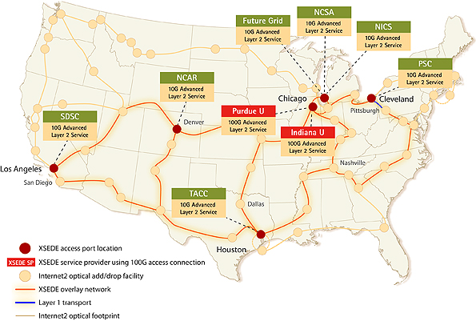

**Figure:** XSEDE distributed resource infrastructure

#### Comet

The comet machine is a larger cluster and offers bare metal
provisioning based on KVM and SLURM. Thus it is a unique system that
can run at the same time traditional super computing jobs such as MPI
based programs, as well as jobs that utilize virtual machines. With
its availability of >46000 cores it provides one of the larges NSF
sponsored cloud environment. Through its ability to provide bare metal
provisioning and the access to infiniband between all virtual machines
it is an ideal machine for exploring performance oriented
virtualization techniques.

Comet has about 3 times more cores than Jetstream.

#### Jetstream

Jetstream is a machine that specializes in offering a user friendly
cloud environment. It utilizes an environment called atmosphere that
is targeting inexperienced scientific cloud users. It also offers an
OpenStack environment that is used by atmosphere and is for classes
such as ours the preferred access method. More information about the
system can be found at

* <https://dcops.iu.edu/>

### Chameleon Cloud

Chameleon cloud is a configurable experimental environment for
large-scale cloud research. It is offering OpenStack as a service
including some more advanced services that allow experimentation with
the infrastructure.

* <https://www.chameleoncloud.org/>

An overview of the hardware can be obtained from 

* <https://www.chameleoncloud.org/hardware/>

### Indiana University

Indiana University has a data center in which many different systems
are housed. This includes not only jetstream, but also many other
systems. The systems include production, business, and research
clusters and servers.

**Figure:** IU Data Center

On the research cluster side it offers Karst:

* <https://kb.iu.edu/d/bezu>

One of the special systems located in the data center and managed by
the Digital Science Center is called Futuresystems, which provides a
great resource for the advanced students of Indiana University
focusing on data engineering. While systems such as Jetstream and
Chameleon cloud specialize in production ready cloud environments,
Futuresystems, allows the researchers to experiment with
state-of-the-art distributed systems environments supporting research.
It is available with Comet and thus could also serve as an on-ramp to
using larger scale resources on comet while experimenting with the
setup on Futuresystems.

Such an offering is logical as researchers in the data engineering
track want to further develop systems such as Hadoop, SPark, or
container based distributed environments and not use the tools that
are released for production as they do not allow improvements to the
infrastructure. Futuresystems is managed and offered by by the Digital
Science Center.

Hence IU offers very important but needed services

* Karst for traditional supercomputing
* Jetstream for production use with focus on virtual machines
* Futuresystems for state-of-the-art research experiment environments
  with access to bare metal.

### Shipping Containers

A few years ago data centers build from shipping containers were very
popular. This includes several main Cloud providers. Such providers
have found that they are not the best way to develop centers at scale.
This includes
[Microsoft](https://www.datacenterknowledge.com/archives/2016/04/20/microsoft-moves-away-from-data-center-containers)
and
[Google](https://blogs.technet.microsoft.com/msdatacenters/2013/04/22/microsofts-itpac-a-perfect-fit-for-off-the-grid-computing-capacity/)
The current trend however is to build mega or hyperscale data centers.

## Server Consolidation 

One of the driving factors in cloud computing and the rise of large
scale data centers is the ability to use server virtualization to
place more than one server on the same hardware. Formerly the services
were hosted on their own servers. Today they are managed on the sae
hardware although they look to the customer like separate servers.

As a result we find the following advantages:

* **reduction of administrative and operations cost:** While we reduce
  the number of servers and utilize hardware to host multiple on them
  management cost, space, power, and maintenance cost are reduced.

* **better resource utilization:** Through load balancing strategies
  servers can be better utilized while for example increase load so
  resource idling is avoided.

* **increased reliability:** As virtualized servers can be
  snapshotted, and mirrored, these features can be utilized in
  strategies to increase reliability in case of failure.

* **standardization:** As the servers are deployed in large scale, the
  infrastructure is implicitly standardized based on server, network,
  and disk, making maintenance and replacements easier. This also
  includes the software that is running on such servers (OS, platform
  and may even include applications).

## Data Center Improvements and Consolidation

Due to the immense number of servers in data centers, as well as the
increased workload on its servers, the energy consumption of data
centers is large not only to run the servers, but to provide the
necessary cooling. Thus it is important to revisit the impact such
data centers have on the energy consumption.  One of the studies that
looked into this is from 2016 and is published by
[LBNL](https://cloudfront.escholarship.org/dist/prd/content/qt84p772fc/qt84p772fc.pdf)
In this study the data center electricity consumption back to 2000 is
analyzed while using previous studies and historical shipment data. A
forecast is with different assumption is contrasts till 2020

Figure Energy Forecast depicts "an estimate of total U.S.  data center
electricity use (servers, storage, network equipment, and
infrastructure) from 2000-2020".

While in "2014 the data centers in the U.S. consumed an estimated 70
billion kWh" or "about 1.8% of total U.S. electricity consumption".
However, more recent studies find an increase by about 4% from
2010-2014.  This contrasts a large derivation from the 24% that were
originally predicted several years ago. The study finds that the
predicted energy use would be approximately 73 billion kWh in 2020.

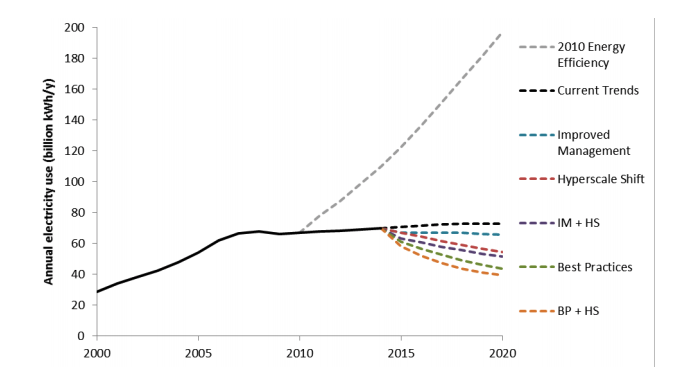

Figure: Energy Forecast 

Source: <https://cloudfront.escholarship.org/dist/prd/content/qt84p772fc/qt84p772fc.pdf>

It is clear that the original prediction of large energy consumption
motivated a trend in industry to provide more energy efficient data
centers. However if such energy efficiency efforts would not be
conducted or encouraged we would see a completely different scenario.

The scenarios are identified  that will significantly impact the prediction:

* **improved management** increases energy-efficiency through
operational operational or technological changes with minimal
investment. Strategies include improving the least efficient
components.

* **best practices** increases the energy-efficiency gains that can be obtained
through the widespread adoption the most efficient technologies and best management
practices applicable to each data center type. This scenario focuses on maximizing the
efficiency of each type of data center facility. 

* **hyperscale data centers** where the infrastructure will be moved
  from smaller data centers to larger *hyperscale* data centers.

## Project Natick

To reduce energy consumption in data centers and reduce cost of
cooling Microsoft has developed **Project Natick**. To tackle this
problem Microsoft has built underwater datacenter. Another benefit of
this project is that data center can be deployed in large bodies of
water to serve customers residing in that area so it helps to reduce
latency by reducing distance to users and therefore increasing data
transfer speed. There are two phases of this project.

The project was executed in two phases.

Phase 1 was executed between August to November 2015.  In this phase
Microsoft was successfully able to deploy and operate vessel
underwater. The vessel was able to tackle cooling issues and effect of
biofouling as well. Biofouling is referred to as the fouling of pipes
and underwater surfaces by organisms such as barnacles and algae.

The PUE (Power Usage Effectiveness) of Phase1 vessel was 1.07 which is
very efficient and a perfect WUE (Water Usage Effectiveness) of
exactly 0, while land data centers consume ~ 4.8 liters of water per
KWH. This vessel consumed computer power equivalent to 300 Desktop PCs
and was of 38000 lbs and it operated for 105 days.

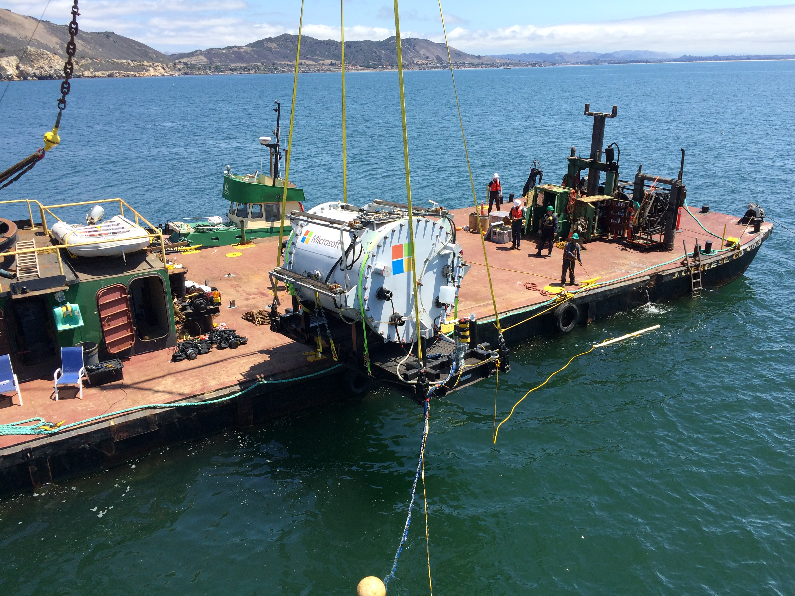

**Figure:** The *Leona Philpot* prototype was deployed off the central
coast of California on Aug. 10, 2015. Source: [Microsoft](https://news.microsoft.com/features/microsoft-research-project-puts-cloud-in-ocean-for-the-first-time/)

The phase 2 started in June 2018 and lasted for 90 days. Microsoft
deployed a vessel at the European Marine Energy Center in UK.

The phase 2 vessel was 40ft long and had 12 racks containing 864
servers. Microsoft powered this data center using 100% renewable
energy. This data ceter is claimed to be able to operate without
maintenance for 5 years. For cooling Microsoft used infrastructure
which pipes sea water through radiators in back on server racks and
then move water back in to ocean.

The total estimated lifespan of a Natick datacenter is around 20 years, after
which it will be retrieved and recycled.

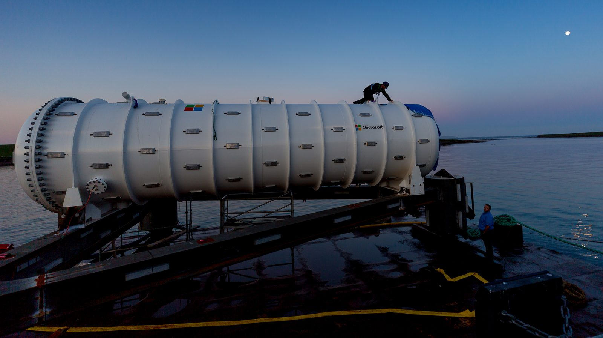

**Figure:** The *Northern Isles* prototype being deployed near
Scotland. Source: [Microsoft](https://news.microsoft.com/features/under-the-sea-microsoft-tests-a-datacenter-thats-quick-to-deploy-could-provide-internet-connectivity-for-years/)

Although the cooling provides a significant benefit while using
seawater, it is clear that long time studies need to be conducted with
this approach and not just studies over a very short period of
time. The reason for this is not just the measurement of a PUE factor
or the impact of algae on the infrastructure, but also how such a
vessel impacts the actual ecosystem itself.

Some thought on this include:

1. How doe the vesil increase the surrounding water temperature and
   effects the ecosystem
2. If places in saltwater, corrosion can occur that may not only
   effect the vesel, but also the ecosystem
3. Positive effects could also be created on ecosystems, which is for
   example demonstrated by creation of artificial reefs. However if
   the structure has to be removed after 20 years, which impat has it
   than on the ecosystem. 

**References:**

:o: TODO we will use also bibtex fro references

* <https://www.nytimes.com/2016/02/01/technology/microsoft-plumbs-oceans-depths-to-test-underwater-data-center.html>
* <https://news.microsoft.com/features/microsoft-research-project-puts-cloud-in-ocean-for-the-first-time/>
* <https://news.microsoft.com/features/under-the-sea-microsoft-tests-a-datacenter-thats-quick-to-deploy-could-provide-internet-connectivity-for-years/>
