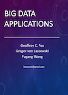
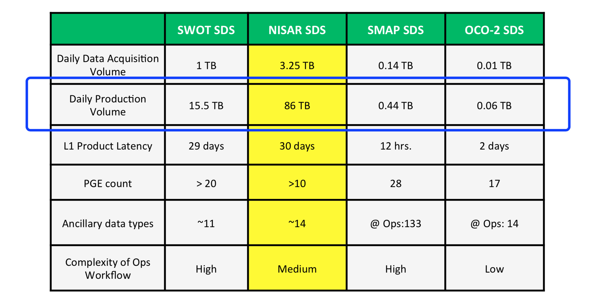

# Cloud Computing: Use Cases :hand: :o:

## Big Data

The material provided in this ePub is related to Cloud Computing. However part of our motivation to use cloud computing is to deal with Big Data. For that purpose we have a separate class which is documented in the following volumes. The first volume provides an overview. The second volume lists some technologies relevant for big data.

| Link | CLass | Description |
| --- | --- | --------------------------|
| |e534, I523, I423 | Evolving Lecture notes for class e534, I523, I423  |
|  | e534, I523, I423 | Cloud Technologies |

## Earth Science :hand: :o:

The Earth Observing System Data and Information System (EOSDIS) and the Earth
Science Data and Information System (ESDIS) provide key core capabilities for
NASA's Earth Science Data Systems (ESDS) Program.

According to <https://earthdata.nasa.gov/about>, EOSDIS *"provides end-to-end
capabilities for managing NASA’s Earth science data from various sources –
satellites, aircraft, field measurements, and various other programs*" and
"*provides capabilities for command and control, scheduling, data capture
and initial (Level 0) processing"* for the Earth-Observing System (EOS)
satellites NASA manages. The ESDIS project, on the other hand, manages the
downstream processes and capabilities which include *"generation of higher level
(Level 1-4) science data products for EOS missions; archiving and distribution
of data products from EOS and other satellite missions, as well as aircraft
and field measurement campaigns"* [@earthdata-about]. +@fig:use-cases-es-esdops
depicts the overall context of EOSDIS and ESDIS in Earth Science data
operations [@earthdata-about].

![Earth Science Data Operations [:o:]](images/use-cases-es-esdops.jpg){#fig:use-cases-es-esdops}

Traditionally, higher level products (those used by end users) are produced by
a Science Investigator-led Processing System (SIPS) usually hosted and
operated at on-premise facilities belonging to the Science and Instrument
Team's affiliate research center. Furthermore, these higher level products are
then ingested and cataloged by an affiliate Distributed Active Archive Center
(DAAC) for the purpose of providing public distribution, access, and discovery
to these datasets. Historically, these DAACs provide their capability using
on-premise resources and compute as well. +@fig:sips-daac-centers
depicts the geographic locations of the various on-premise SIPSs and DAACs
that generate and distribute the various NASA EOS datasets
[@nasa-eosdis-cumulus].

![SIPS & DAAC Centers [:o:]](images/use-cases-es-sips-daac-centers.png){#fig:sips-daac-centers}

### Big Data :hand: :o:

For NASA, technological advancements in satellite instrumentation,
communication and other fields has resulted in the current and upcoming
deluge of remote sensing Earth science data. In 2012, Skytland wrote:

*We (NASA) have deep space spacecraft that sends back data in the order of
MB/s. Then we have earth orbiters that can send back data in GB/s per second.
In our current missions, data is transferred with radio frequency, which is
relatively slow. In the future, NASA will employ technology such as optical
(laser) communication to increase the download and mean a 1000x increase in
the volume of data. This is much more then we can handle today and this is
what we are starting to prepare for now. We are planning missions today that
will easily stream more than **24TB’s** a day.* [@nasa-big-data]

Note that the **24TB's** only refers to the Level 0 (raw) data streamed from
the satellite. Not accounted for is the post-processing of that Level 0 into
higher-level data products by the SIPSs.

One such mission is the upcoming NASA/Indian Space Research Organisation (ISRO)
Synthetic Aperture Radar (NISAR) mission that is currently schedule to launch
in 2021 +@fig:nisar-satellite:

*Using advanced radar imaging that will provide an unprecedented, detailed
view of Earth, the NASA-ISRO Synthetic Aperture Radar, or NISAR, satellite
is designed to observe and take measurements of some of the planet's most
complex processes, including ecosystem disturbances, ice-sheet collapse,
and natural hazards such as earthquakes, tsunamis, volcanoes and
landslides.* [@nisar-mission]

![NISAR [:o:]](images/use-cases-es-nisar.png){#fig:nisar-satellite}

+@fig:mission-data-vols presents the data volume requirements for current
(OCO-2 & SMAP) and future (NISAR & SWOT) NASA missions and highlights the
upcoming big data volume for NISAR in particular [@sds-considerations].

{#fig:mission-data-vols}

Note the **Daily Data Acquisition Volume** (Level 0) and **Daily Production
Volume** (Level 1-4) for NISAR. The total daily volume produced by the mission
will be a little less than **90TB**. NISAR Program Scientist Craig Dobson notes
that as much as 140PB of data will be generated by NISAR over its 3-year mission
and *"places considerable demands on the logistics of shipping data and on
computational speed and efficiency"* [@getting-ready-for-nisar]. Additionally,
Skytland notes that *"as our wealth of data increases, the challenge of
indexing, searching, transferring, and so on all increase exponentially as
well"* [@nasa-big-data]. +@fig:eosdis-growth shows EOSDIS current holdings
and projected growth [@nasa-eosdis-cumulus].

![EOSDIS Holdings and Projected Growth [:o:]](images/use-cases-es-datavols-growth.png){#fig:eosdis-growth}

### Science End Users

Not to be forgotten are the scientists and science end users who ultimately
use the final data products to perform analysis and produce scientific
publications or other high-level, high-value derived products. Traditionally,
these science end users would perform their analysis on-premise either on a
desktop, a laptop, an HPC/HEC cluster, or other compute resource managed by
the end user themselves or by their affiliate organization. Obviously before
they can perform their analysis, they would have to search for the particular
granules of a product that pertains to their study and download them locally.
Historically, granule file sizes for these product granules tend to be in the
tens or hundreds of MBs and so downloading them from the DAACs don't usually
take up a significant amount of time. However with the upcoming NISAR mission,
this will change. Chris Stoner, the Project Office Manager at NASA’s Alaska
Satellite Facility (ASF) Distributed Active Archive Center (DAAC) which will
serve as the DAAC for NISAR, notes that:

*"The file sizes are large and the overall volume of data will be huge. This
means we have to do something different to ensure that NISAR data users have
a good user experience and are able to do their research."* [@getting-ready-for-nisar]

In the case of NISAR, each scene (file granule) will take up about 25GB
compressed and typical science end users of SAR data usually *"download
hundreds or sometimes thousands of scenes for their research"* [@getting-ready-for-nisar]. As such, downloading the data needed to perform
an analysis now becomes a huge bottleneck to the process of conducting
research.

### Role of Cloud: Data Lake

In addition to the big data volumes of upcoming missions and the bottlenecks
they cause for end users, Skytland notes that *"the increasing complexity of
instruments and algorithms, increasing rate of technology refresh, and the
decreasing budget environment, all play a significant factor"* [@nasa-big-data]
in NASA's challenges for the future of Earth Science missions.

However commercial cloud vendors such as Amazon Web Services, Microsoft Azure,
Google Compute Platform and others provide infrastructure and services that are
built for scale and fault tolerance in a pay-as-you-go costing model. Coupled
with the potential for major cost-saving by using discounted compute (e.g. AWS
spot pricing, preemptible VMs, and so on), cloud computing will play a
significant role in providing a solution to many of NASA's challenges. If the
SIPSs, DAACs and science end users all made a move off-premise and went "all-in"
into a cloud vendor, at the risk of **vendor lock-in**, then many of the
technical challenges of scaling to NISAR volumes can be offloaded to the cloud
vendors themselves.

Central to this is the concept of a **data lake** where data producers, data
service providers, and end users all adapt their previously on-premise
resources, infrastructure, and analysis tools over to cloud-native
implementations. The essential premise is that all stakeholders must buy into
moving their compute to the data; no longer moving the data to their compute.
+@fig:eosdis-data-lake depicts the concept of an EOSDIS data lake and highlights
the assumptions that [@sds-considerations]:

- all data produced by the satellites and SIPSs (SDS) are stored in a cloud
object store and produced by cloud-native resources
- DAAC services are built, cloud-natively, with the assumption that the data
they are indexing and providing access and discovery services for comes from
the same object store
- Science end users can provision their own user accounts on the cloud vendor to
directly access, process, and analyze the data in the same object store using
cloud-native resources

![EOSDIS Data Lake [:o:]](images/use-cases-es-datalake.png){#fig:eosdis-data-lake}

Current investigations are underway to determine the technical and cost
viability of moving to an entirely cloud-native architecture. In particular,
the "Getting Ready for NISAR" (GRFN) project aims to [@getting-ready-for-nisar]:

- *Obtain a better understanding of the costs and technical challenges associated
with cloud-based and hybrid architectures for processing and storing NISAR data*
- *Provide the opportunity for the science community to become comfortable interacting with and working with large SAR datasets in the cloud*

Moving forward, NASA's challenges for future missions are significant.
Innovation in sensor, instrument and communication technology continues to move
at a frantic pace and the end result will be an explosion in the total volume of
data produced for future Earth Science missions. This big data problem presents
challenges of scale for the all stakeholders: data producers (SIPSs), data
service providers (DAACs), and science end users. However, commercial cloud
vendors such as AWS, Microsoft Azure, and Google Compute Platform have built
upon their infrastructure and years of experience scaling web resources for
millions of users to provide cloud computing services that abstract away the
underlying technical issues of massive scaling. It would be of great benefit to
the Earth Science community for all stakeholders to leverage these cloud
resources in some capacity so as to enable and facilitate the continuation of
science discovery in this age of big data.

## Bioinformatics :hand: :o:

Content goes here.
