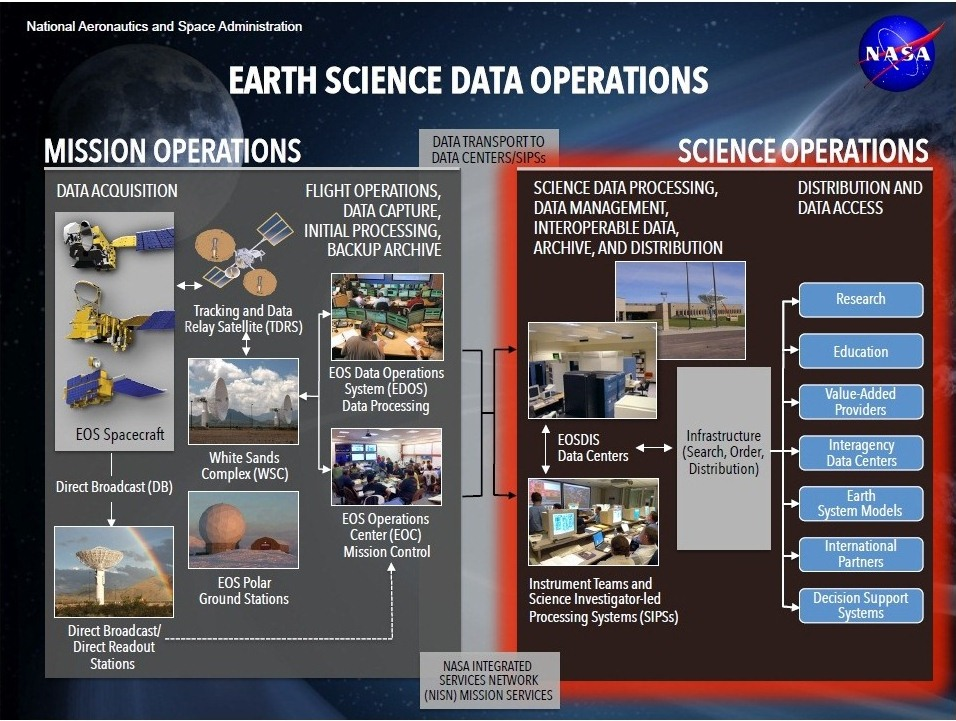

# Cloud Computing: Use Cases :hand: :o:

~~TODO: rename so filenames do no include underscore~~ done

~~TODO: use bibtex citations~~ done

~~TODO: Fix figures, see notation.md~~ done

~~TODO: should image from this be used:
      <https://earthdata.nasa.gov/about>~~ done

## Big Data

The material provided in this ePub is related to Cloud Computing. However part of our motivation to use cloud computing is to deal with Big Data. For that purpose we have a separate class which is documented in the following volumes. The first volume provides an overview. The second volume lists some technologies relevant for big data.

| Link | CLass | Description |
| --- | --- | --------------------------|
| |e534, I523, I423 | Evolving Lecture notes for class e534, I523, I423  |
|  | e534, I523, I423 | Cloud Technologies |

## Earth Science :hand: :o:

The Earth Observing System Data and Information System (EOSDIS) and the Earth
Science Data and Information System (ESDIS) provide key core capabilities for
NASA's Earth Science Data Systems (ESDS) Program.

According to https://earthdata.nasa.gov/about, EOSDIS *"provides end-to-end
capabilities for managing NASA’s Earth science data from various sources –
satellites, aircraft, field measurements, and various other programs*" and
"*provides capabilities for command and control, scheduling, data capture
and initial (Level 0) processing"* for the Earth-Observing System (EOS)
satellites NASA manages. The ESDIS project, on the other hand, manages the
downstream processes and capabilities which include *"generation of higher level
(Level 1-4) science data products for EOS missions; archiving and distribution
of data products from EOS and other satellite missions, as well as aircraft
and field measurement campaigns"* [@earthdata-about]. +@fig:use-cases-es-esdops
depicts the overall context of EOSDIS and ESDIS in Earth Science data
operations [@earthdata-about].

{#fig:use-cases-es-esdops}

Traditionally, higher level products (those used by end users) are produced by
a Science Investigator-led Processing System (SIPS) usually hosted and
operated at on-premise facilities belonging to the Science and Instrument
Team's affiliate research center. Furthermore, these higher level products are
then ingested and cataloged by an affiliate Distributed Active Archive Center
(DAAC) for the purpose of providing public distribution, access, and discovery
to these datasets. Historically, these DAACs provide their capability using
on-premise resources and compute as well. +@fig:sips-daac-centers
depicts the geographic locations of the various on-premise SIPSs and DAACs
that generate and distribute the various NASA EOS datasets
[@nasa-eosdis-cumulus].

{#fig:sips-daac-centers}

### Big Data :hand: :o:

For NASA, technological advancements in satellite instrumentation,
communication and other fields has resulted in the current and upcoming
deluge of remote sensing Earth science data. In 2012, Skytland wrote:

*We (NASA) have deep space spacecraft that sends back data in the order of
MB/s. Then we have earth orbiters that can send back data in GB/s per second.
In our current missions, data is transferred with radio frequency, which is
relatively slow. In the future, NASA will employ technology such as optical
(laser) communication to increase the download and mean a 1000x increase in
the volume of data. This is much more then we can handle today and this is
what we are starting to prepare for now. We are planning missions today that
will easily stream more than **24TB’s** a day.* [@nasa-big-data]

Note that the **24TB's** only refers to the Level 0 (raw) data streamed from
the satellite. Not accounted for is the post-processing of that Level 0 into
higher-level data products by the SIPSs.

One such mission is the upcoming NASA/Indian Space Research Organisation (ISRO)
Synthetic Aperture Radar (NISAR) mission that is currently schedule to launch
in 2021 +@fig:nisar-satellite:

*Using advanced radar imaging that will provide an unprecedented, detailed
view of Earth, the NASA-ISRO Synthetic Aperture Radar, or NISAR, satellite
is designed to observe and take measurements of some of the planet's most
complex processes, including ecosystem disturbances, ice-sheet collapse,
and natural hazards such as earthquakes, tsunamis, volcanoes and
landslides.* [@nisar-mission]

{#fig:nisar-satellite}

+@fig:mission-data-vols presents the data volume requirements for current
(OCO-2 & SMAP) and future (NISAR & SWOT) NASA missions and highlights the
upcoming big data volume for NISAR in particular [@sds-considerations].

{#fig:mission-data-vols}

Note the **Daily Data Acquisition Volume** (Level 0) and **Daily Production
Volume** (Level 1-4) for NISAR. The total daily volume produced by the mission
will be a little less than **90TB**. NISAR Program Scientist Craig Dobson notes
that as much as 140PB of data will be generated by NISAR over its 3-year mission
and *"places considerable demands on the logistics of shipping data and on
computational speed and efficiency"* [@getting-ready-for-nisar]. Additionally,
Skytland notes that *"as our wealth of data increases, the challenge of
indexing, searching, transferring, and so on all increase exponentially as
well"* [@nasa-big-data]. +@fig:eosdis-growth shows EOSDIS current holdings
and projected growth [@nasa-eosdis-cumulus].

{#fig:eosdis-growth}

### Science Users

## Bioinformatics :hand: :o:

Content goes here.
