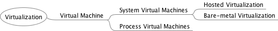

# Virtualization :o:

---

**:mortar_board: Learning Objectives**

* Gain understanding of the basic the concepts of virtualization
* Understand what a virtual machine is
* Understand what a Hypervisor is

---

Virtualization is one of the important technologies that started the
cloud revolution. It provides the basic underlaying principles for the
development and adoption of clouds. The concept, although old and
already used in the early days of computing, has recently been
exploited to lead to better utilization of servers as part of data
centers, but also the local desktops.

Virtualization enables to execute multiple applications in such a way
that the applications seem to run independently form each other in
their own virtualized context.

Examples of the usefulness of virtualization include testing of
applications and run experiments on a different operating system than
the one on our host computer. To enable this we need virtual machines.

## Virtual Machines

We define a virtual machine as follows:

> A virtual machine (VM) is a software-based emulation of a computer
> system. This can include process virtualization and physical
> computer virtualization such as running an operating
> system. Multiple virtual machines share the resources of the
> computer or system on which they run.

We distinguish the following types of Virtual machines

* **System Virtual Machines** or **Hardware Virtual Machine**, which
  is the virtualization of the operating system providing a complete
  system platform environment emulating the hardware. Here we
  essentially run another operating system on top of the existing OS
  while using a software abstraction between them allowing the
  virtualization.

  Examples of such virtualization include VirtualBox and VMWare.

* **Process Virtual Machines** or **Application Virtual Machine**
  which provides a platform independent programming environment that
  abstracts the details of the underneath hardware or OS from software
  or application runtime.

  Examples of such virtual machines include Java Virtual Machine (JVM)
  and the .NET Framework

Next we will be analyzing the system machine virtualization in more
detail, as they are one of the reasons for the clouds revolution.

## System Virtual Machines 

The use of a system as a virtual machine has its clear advantages for
the cloud. We distinguish two main ways of system virtualizing:

* **Bare-metal Virtualization** in which the virtual machine monitor 
  is installed directly on top of the hardware so that the it
  has direct access to the underlaying hardware. It hosts the
  operating system. The VMM is also called hypervisor. We also use for bare-metal supporting VMM the term *Type 1 hypervisor*.

* **Hosted Virtualization** in which the base operating system is
  installed on the hardware. Here a virtual machine monitor (VMM) is
  installed on top of the host OS allowing the users to run
  other operating systems on the VMM. In addition, the Virtual Machine
  Monitor or *Hypervisor* manages the deploymenst of potentialy
  multiple virtual machines on top of the underlaying Operating system.
  We also use for hosted VMM the term *Type 2 hypervisor*.

In either case the functionality a virtual machine is supported
through configuration files, specifications, and access to the
physical resources either directly or indirectly through the host
OS. A virtual machine provides the same functionality as a physical
computer, but with the advantage that through virtualization the are
portable, can be managed and provide increased security while
shielding the underlaying OS from harmful actions. As a virtual
machine is in principle a program, it consists of several files including
a configuration file, virtual disk files, virtual RAM, and a log
file. virtual machines are configured to run a virtual operating
system that allows applications to run on them. Each virtual machine
has its own copy of the OS making it independent and more secure.

End users and developers will benefit from using virtual machines in
case they need to operate or support on different hardware or porting software on it.

## Hosted Virtualization

As in the hosted virtualization the guest operating system accessed the underlaying hardware through the host OS, it usyally has limited acces to the hrdware as defined by the host OS. This allows the host OS to impose policies that govern the operation of  multiple guest OS concurrently. This includes management and scheduling of processes, memory, I/O operations to assign them appropreatly to the guest OS. Through this mechanism the hypervisor provides an emulation of available hardware to each Virtual Machine run on top of it in timesharing fashion for resource constraint or resource shared activities.

As example, the hypervisor has the ability to present generic I/O devices and it has no access to non-generic I/O devices. Generic I/O devices are network, interface cards,  CD-ROMs. Examples for non-generic I/O devices are PCI data acquisition card, etc. However with appropriate driver support even such devices could be made accessible to the VMs.

Often we also find that hosted virtualization supports  connected USB drives in the VMs which becomes very practical for USB attached devices needed in storage, or even edge computing applications.

Advantages of Hosted Virtualization include

* Multiple Operating systems run on separate virtual machines on a VMM. 
* Different Operating systems run on separate virtual machines on a VMM. 
* Hardware level driver support is controlled by VMM, allowing an isolation of certain security aspects for accessing the hardware.
* Instalation of software can be doen by the owner of the virtual machine and does not have to be conducted by the provider of the hypervisor.

Disadvantages of Hosted Virtualization include 

* Increased resource requirements as the GUest OS is running a full copy of the OS. In iits worst case this will lead to a significant performance reduction while using resources that are in contention.
*  The user of hypervisors must be familiar with operating system management and security to assure it is safe to use.

## Summary

To showcase how these technologies relate to each other wil like you to review +@fig:vm-taxonomy

{@fig:vm-taxonomy}

We summarize the following *hypervisor* types:

* Type-1 hypervisors supporting native or bare-metal. They run directly on the host's hardware to control the hardware and to manage guest operating systems. 

* Type-2 hypervisors supporting hosted virtualization. They run on a conventional operating system (OS) just as other computer programs do. A guest operating system runs as a process on the host.

## Virtualization Approches

Next we look at different virtualization approaches that relate to resource utilization.

### Fullvirtualization

When looking at virtualization we often identify it with being a full virtualization. The hypervisor provides a full abstraction of the OS exposed to  the guest OS's. In this case, the the guest OS's the virtual machine just run without any special modification on the host OS. It just looks like an independent running computer [@paravsfull-virt]. 

### Paravirtualization

Para -- alongside/partial -- virtualization is developed to improve 
performance by intarcting between the OS and the hypervisor. This is done for  complex and time-consuming tasks that otherwise could not be managed by the VMM manager. Commands sent from the OS to the hypervisor are called *hypercalls* [@paravsfull-virt]. 

## Virtualization Technologies

In this section we cover introduction to underlying virtualization technologies used on some main stream platforms.

Cloud providers, such as AWS, Azure, and Google, and OpenStack use for example QEMU and KVM technologies
for compute instance virtualization. 

### Selected Hardware Virtualization Technologies

### AMD-V and Intel-VT

The hardware virtualization support enabled by AMD-V and Intel VT technologies introduces virtualization in the x86 processor architecture. According to Intel, Intel Hyper-Threading Technology allows a single processor to execute two or more separate threads concurrently. When it is enabled, multi-threaded software applications can execute their threads in parallel, thereby improving their performance.

### I/O MMU virtualization (AMD-Vi and Intel VT-d)

The term IOMMU is an abbreviation for input–output memory management unit. An IOMMU allows through virtual adresses to interface with physical adresses, allowing external  direct-memory-access–capable IO devices to interface with the main memory [@iommu-1]. AMD's I/O Virtualization Technology (AMD-Vi) was originally called *IOMMU*.

To use Intel's *Virtualization Technology for Directed I/O* (VT-d), both the motherboard chipset and system firmware (BIOS or UEFI) need to fully support the IOMMU I/O virtualization functionality for it to be usable [@iommu-2].

### Selected VM Virtualization Software and Tools

A number of noteworthy virtualization software and tools exist which make the development and use of virtualization on the hardware possible. They include

* Libvirt
* KVM
* Xen
* Hyper-V
* QEMU
* VMWare
* VirtualBox

We will be discussing them next.

#### Libvirt

[Libvirt](<https://libvirt.org/api.html>) is an library with an API for managing virtualization solutions such as provided by  KVM and Xen. It provides a common management API for them, allowing uniform, cross-hypervisor interfaces for higher-level management tools. Furthermoe, it  provides APIs for management of virtual networks and storage on the VM Host Server. The configuration of each VM Guest is stored in an XML file [@libvirt]. The official website for `libvirt` is located at 

* <https://libvirt.org/>

#### QEMU :new:

QEMU provides two generic functions.  One of them is open source machine emulator and the other is a virtualizer.

* *Machine emulation:* using it as a machine emulator it runs the OSes and programs designed for one machine on a different machine of potential different architecture. It uses dynamic translation through which  it achieves very good performance.

* *Virtualizer:* Using is as a virtualizer it executes the guest code directly on the host CPU. This enables QEMU to achieve near native performance. 

QEMU supports either XEN or KVM to enable virtualization. With the help of KVM, QEMU can virtualize x86, server and embedded PowerPC, 64-bit POWER, S390, 32-bit and 64-bit ARM, and MIPS guests according to the [QEMU Wiki](https://wiki.qemu.org/Main_Page).

Useful links include the following:

* An extensive manual is provided at <https://qemu.weilnetz.de/doc/qemu-doc.html>.

* QEMU can be downloaded from <http://www.qemu.org/download/>.

* A collection of images for testing purposes is provided at <https://wiki.qemu.org/Testing/System_Images>

An example for using QEMU is provided in Section [Virtual Machine Management with QEMU]{@s-qemu-kvm}

#### KVM (B)

#### KVM vs QEMU :new:

KVM includes a fork of the Qemu executable. The QEMU project focuses on hardware emulation and portability. KVM focus on the kernel module and interfacing with the rest of the userspace code.
KVM comes with a `kvm-qemu` executable tht just like QEMU manages the resourecs while allocating RAM, loading the code. However instead of recompiling the code it spawns a thread which calls the KVM kernel module to switch to guest mode. 
It than proceeds to execute the VM code. When privileged instructions are found, it switches back to the KVM kernel module, and if necessary, signals the Qemu thread to handle most of the hardware emulation. This means that the guest code is emulated in a posix thread which can be managed with common Linux tools [@kvmvsqemu]. 

#### Xen (?)

#### Hyper-V (?)

#### VMWare (?)

#### VirtualBox :new:

VirtualBox is a free open-source hypervisor for x86 architectures. It is now owned by Oracccle while transitioning from SUN which in turn aquired the original technology from Innotek.

One of the nice features for us is thet VirtualBox is able to create and manageme of guest virtual machines such as  Windows, Linux, BSD, OSx86  and even in part also  macOS (on Apple hardware). Hence it makes it for us a very valuable tool while being able to run virtual machines on a locat desktop or computer to simulkate cloud resources without charging cost. In addition we find command line tols such as vagrant (see Section ?? :o:) that make the use convenient while not having to utilize the GUI or the more complex virtual box comamnd interfaces. A guest additions package allows compatibility with the host OS, to for example allow window management between host and guest OS.

In Section [VirtualBox](@s-virtualbox) we have provided a practical introduction to VirtualBox. 

#### Comparission of some technologies 

QEMU and KVM are better integrated in Linux and has a smaller footprint. 
This may result in better performance. VirtualBox is soly targeted as  virtualization software and imited to x86 and amd64.  As Xen uses QEMU it allows hardware virtualization. However, Xen can also  use paravirtualization [@diff-qemu]. In the following table we summarize support for full- and paravirtualization

|     | XEN | KVM | VirtualBox | VMWare |
| --- | ---: | ---: | ---: | ---: |
| Paravirtualization | yes | no | no | no | 
|Full virtualization | yes | yes | yes |yes |

### Selected Storage Virtualization Software and Tools

TBD

