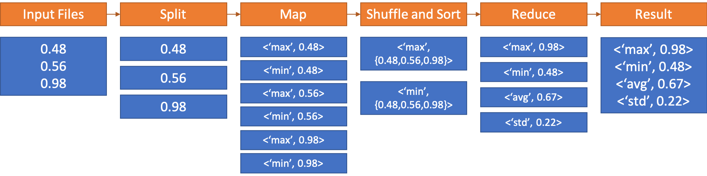

# Hadoop with Docker :o: {#s-hadoop-docker}

In this section we will explore the Map/Reduce framework using Hadoop
provided through a Docker container.

We will showcase the functionality on a small example that calculates
minimum, maximum, average and standard deviation values using several
input files which contain float numbers.


This section is based on the hadoop release 3.0.3 which
includes significant enhancements over the previous version of Hadoop
2.x. Changes include the use of the following software:

* CentOS 7
* systemctl
* Java SE Development Kit 8

A Dockerfile to creat the haddop deployment is available at

*<https://github.com/cloudmesh-community/book/blob/master/examples/docker/hadoop/3.0.3/Dockerfile>

## Building Hadoop using Docker

You can build hadoop from the Dockerfile as follows:

```bash
$ mkdir cloudmesh-community
$ cd cloudmesh-community
$ git clone https://github.com/cloudmesh-community/book.git
$ cd book/examples/docker/hadoop/3.0.3
$ docker build -t cloudmesh/hadoop:3.0.3 .
```

The complete docker image for Hadoop consumes 1.5GB.

```bash
$ docker images
```

```bash
REPOSITORY       TAG   IMAGE ID     CREATED    SIZE
cloudmesh/hadoop 3.0.3 ba2c51f94348 1 hour ago 1.52GB
```

To use the image interactively you can start the container as follows:

```bash
$ docker run -it cloudmesh/hadoop:3.0.3 /etc/bootstrap.sh -bash
```

It may take a few minutes at first to download image.

## Hadoop Configuration Files

The configuration files are included in the `conf` folder

## Virtual Memory Limit

IN case you need more memory, you can increase it by cahnging the
parameters in the file `mapred-site.xml`, for example:

- mapreduce.map.memory.mba to 4096
- mapreduce.reduce.memory.mb to 8192

## hdfs Safemode leave command

A Safemode for HDFS is a read-only mode for the HDFS cluster, where it does not allow any modifications of files and blocks.  Namenode disables safe mode automatically after starting up normally. If required, HDFS could be forced to leave the safe mode explicitly by this command:

```bash
$ hdfs dfsadmin -safemode leave
```


## Examples

We included a statistics and a PageRank examples into the
container. The examples are also available in github at

* <https://github.com/cloudmesh-community/book/tree/master/examples/docker/hadoop/3.0.3/examples>

We explain the examples next

### Statistical Example with Hadoop

After we launcht the container and use the interactive shell, we can
run the statistics Hadoop application wich calculates the  minimum,
maximim, average, and standard derivation from values stored in a
number of input files.

To achieve this, this Hadoop program reads multiple files from HDFS and
provides calculated values. We walk through every step from compiling
Java source code to reading a output file from HDFS. The idea of this
exercise is to get you started with Hadoop and the MapReduce concept.
You may seen the WordCount from Hadoop official website or documentation
and this example has a same functions (Map/Reduce) except that you will
be computing the basic statistics such as min, max, average, and
standard deviation of a given data set.

The input to the program will be a text file(s) carrying exactly one
floating point number per line. The result file includes *min, max,
average, and standard deviation*.

{#fig:docker-hadoop-a}

:o: +@fig:docker-hadoop-a shows something but we are not sure what

#### Base Location

The example is available within the container at:

```bash
container$ cd /cloudmesh/examples/statistics
```

#### Input Files

A test input files are available under `/cloudmesh/exer1/input_data}`
directory inside of the container. The statistics values for this input
are *Min: 0.20 Max: 19.99 Avg: 9.51 StdDev: 5.55* for all input files.

10 files contain 55000 lines to process and each line is a random float
point value ranging from 0.2 to 20.0.

#### Compilation

The source code file name is *MinMaxAvgStd.java* which is available at
*/cloudmesh/examples/statistics/src/exercise/*.

There are three functions in the code *Map, Reduce and Main* where Map
reads each line of a file and updates values to calculate minimum,
maximum values and Reduce collects mappers to produce average and
standard deviation values at last.

```bash
$ export HADOOP_CLASSPATH=`$HADOOP_PREFIX/bin/hadoop classpath`
$ mkdir /cloudmesh/examples/statistics/dest
$ javac -classpath $HADOOP_CLASSPATH -d /cloudmesh/examples/statistics/dest /cloudmesh/examples/statistics/src/exercise/MinMaxAvgStd.java
```

These commands simply prepare compiling the example code and the
compiled class files are generated at the *dest* location.

#### Archiving Class Files

Jar command tool helps archiving classes in a single file which will be
used when Hadoop runs this example. This is useful because a jar file
contains all necessary files to run a program.

```bash
$ cd /cloudmesh/examples/statistics
$ jar -cvf exer1.jar -C ./dest/ .
```

:o: filename incorrect

#### HDFS for Input/Output

The input files need to be uploaded to HDFS as Hadoop runs this example
by reading input files from HDFS.

:o: change exer1 to something more reasonable

```bash
$ export PATH=$PATH:/$HADOOP_PREFIX/bin
$ hadoop fs -mkdir exer1_input
$ hadoop fs -put input_data/* exer1_input
$ hadoop fs -ls exer1_input/
```

If uploading is completed, you may see file listings like:

```bash
Found 10 items
-rw-r--r-- 1 root supergroup  13942 2018-02-28 23:16 exer1_input/data_1000.txt
-rw-r--r-- 1 root supergroup 139225 2018-02-28 23:16 exer1_input/data_10000.txt
-rw-r--r-- 1 root supergroup  27868 2018-02-28 23:16 exer1_input/data_2000.txt
-rw-r--r-- 1 root supergroup  41793 2018-02-28 23:16 exer1_input/data_3000.txt
-rw-r--r-- 1 root supergroup  55699 2018-02-28 23:16 exer1_input/data_4000.txt
-rw-r--r-- 1 root supergroup  69663 2018-02-28 23:16 exer1_input/data_5000.txt
-rw-r--r-- 1 root supergroup  83614 2018-02-28 23:16 exer1_input/data_6000.txt
-rw-r--r-- 1 root supergroup  97490 2018-02-28 23:16 exer1_input/data_7000.txt
-rw-r--r-- 1 root supergroup 111451 2018-02-28 23:16 exer1_input/data_8000.txt
-rw-r--r-- 1 root supergroup 125337 2018-02-28 23:16 exer1_input/data_9000.txt
```

#### Run Program with a Single Input File

We are ready to run the program to calculate values from text files.
First, we simply run the program with a single input file to see how it
works. `data_1000.txt` contains 1000 lines of floats, we use this file
here.

:o: filename incorrect

```bash
$ hadoop jar exer1.jar exercise.MinMaxAvgStd exer1_input/data_1000.txt exer1_output_1000
```

The command runs with input parameters which indicate a jar file (the
program, exer1.jar), exercise.MinMaxAvgStd (package name.class name),
input file path (`exer1_input/data_1000.txt`) and output file path
(`exer1_output_1000`).

The sample results that the program produces look like this:


    18/02/28 23:48:50 INFO client.RMProxy: Connecting to ResourceManager at /0.0.0.0:8032
    18/02/28 23:48:50 INFO input.FileInputFormat: Total input paths to process: 1
    18/02/28 23:48:50 INFO mapreduce.JobSubmitter: number of splits:1
    18/02/28 23:48:50 INFO mapreduce.JobSubmitter: Submitting tokens for job: job_1519877569596_0002
    18/02/28 23:48:51 INFO impl.YarnClientImpl: Submitted application application_1519877569596_0002
    18/02/28 23:48:51 INFO mapreduce.Job: The url to track the job: http://f5e82d68ba4a:8088/proxy/application_1519877569596_0002/
    18/02/28 23:48:51 INFO mapreduce.Job: Running job: job_1519877569596_0002
    18/02/28 23:48:56 INFO mapreduce.Job: Job job_1519877569596_0002 running in uber mode: false
    18/02/28 23:48:56 INFO mapreduce.Job: map 0% reduce 0%
    18/02/28 23:49:00 INFO mapreduce.Job: map 100% reduce 0%
    18/02/28 23:49:05 INFO mapreduce.Job: map 100% reduce 100%
    18/02/28 23:49:05 INFO mapreduce.Job: Job job_1519877569596_0002 completed successfully
    18/02/28 23:49:05 INFO mapreduce.Job: Counters: 49
      File System Counters
        FILE: Number of bytes read=81789
        FILE: Number of bytes written=394101
        FILE: Number of read operations=0
        FILE: Number of large read operations=0
        FILE: Number of write operations=0
        HDFS: Number of bytes read=14067
        HDFS: Number of bytes written=86
        HDFS: Number of read operations=6
        HDFS: Number of large read operations=0
        HDFS: Number of write operations=2
      Job Counters
        Launched map tasks=1
        Launched reduce tasks=1
        Data-local map tasks=1
        Total time spent by all maps in occupied slots (ms)=2107
        Total time spent by all reduces in occupied slots (ms)=2316
        Total time spent by all map tasks (ms)=2107
        Total time spent by all reduce tasks (ms)=2316
        Total vcore-seconds taken by all map tasks=2107
        Total vcore-seconds taken by all reduce tasks=2316
        Total megabyte-seconds taken by all map tasks=2157568
        Total megabyte-seconds taken by all reduce tasks=2371584
      Map-Reduce Framework
        Map input records=1000
        Map output records=3000
        Map output bytes=75783
        Map output materialized bytes=81789
        Input split bytes=125
        Combine input records=0
        Combine output records=0
        Reduce input groups=3
        Reduce shuffle bytes=81789
        Reduce input records=3000
        Reduce output records=4
        Spilled Records=6000
        Shuffled Maps =1
        Failed Shuffles=0
        Merged Map outputs=1
        GC time elapsed (ms)=31
        CPU time spent (ms)=1440
        Physical memory (bytes) snapshot=434913280
        Virtual memory (bytes) snapshot=1497260032
        Total committed heap usage (bytes)=402653184
      Shuffle Errors
        BAD_ID=0
        CONNECTION=0
        IO_ERROR=0
        WRONG_LENGTH=0
        WRONG_MAP=0
        WRONG_REDUCE=0
      File Input Format Counters
        Bytes Read=13942
      File Output Format Counters
        Bytes Written=86

The second line of the following logs indicates that the number of input
files is 1.

#### Result for Single Input File

:o: filename incorrect

We reads results from HDFS by:

```bash
$ hadoop fs -cat exer1_output_1000/part-r-00000
```

The sample output looks like:

    Max: 19.9678704297
    Min: 0.218880718983
    Avg: 10.225467263249385
    Std: 5.679809322880863

#### Run Program with Multiple Input Files

The first run was done pretty quickly (1440 milliseconds took according
to the sample result above) because the input file size was small (1,000
lines) and it was a single file. We provides more input files with a
larger size (2,000 to 10,000 lines). Input files are already uploaded to
HDFS. We simply run the program again with a slight change in the
parameters.

```bash
$ hadoop jar exer1.jar exercise.MinMaxAvgStd exer1_input/ exer1_output_all
```

The command is almost same except that an input path is a directory and
a new output directory. Note that every time that you run this program,
the output directory will be created which means that you have to
provide a new directory name unless you delete it.

The sample output messages look like the following which is almost
identical compared to the previous run except that this time the number
of input files to process is 10, see the line two below:

    18/02/28 23:17:18 INFO client.RMProxy: Connecting to ResourceManager at /0.0.0.0:8032
    18/02/28 23:17:18 INFO input.FileInputFormat: Total input paths to process: 10
    18/02/28 23:17:18 INFO mapreduce.JobSubmitter: number of splits:10
    18/02/28 23:17:18 INFO mapreduce.JobSubmitter: Submitting tokens for job: job_1519877569596_0001
    18/02/28 23:17:19 INFO impl.YarnClientImpl: Submitted application application_1519877569596_0001
    18/02/28 23:17:19 INFO mapreduce.Job: The url to track the job: http://f5e82d68ba4a:8088/proxy/application_1519877569596_0001/
    18/02/28 23:17:19 INFO mapreduce.Job: Running job: job_1519877569596_0001
    18/02/28 23:17:24 INFO mapreduce.Job: Job job_1519877569596_0001 running in uber mode: false
    18/02/28 23:17:24 INFO mapreduce.Job: map 0% reduce 0%
    18/02/28 23:17:32 INFO mapreduce.Job: map 40% reduce 0%
    18/02/28 23:17:33 INFO mapreduce.Job: map 60% reduce 0%
    18/02/28 23:17:36 INFO mapreduce.Job: map 70% reduce 0%
    18/02/28 23:17:37 INFO mapreduce.Job: map 100% reduce 0%
    18/02/28 23:17:39 INFO mapreduce.Job: map 100% reduce 100%
    18/02/28 23:17:39 INFO mapreduce.Job: Job job_1519877569596_0001 completed successfully
    18/02/28 23:17:39 INFO mapreduce.Job: Counters: 49
      File System Counters
        FILE: Number of bytes read=4496318
        FILE: Number of bytes written=10260627
        FILE: Number of read operations=0
        FILE: Number of large read operations=0
        FILE: Number of write operations=0
        HDFS: Number of bytes read=767333
        HDFS: Number of bytes written=84
        HDFS: Number of read operations=33
        HDFS: Number of large read operations=0
        HDFS: Number of write operations=2
      Job Counters
        Launched map tasks=10
        Launched reduce tasks=1
        Data-local map tasks=10
        Total time spent by all maps in occupied slots (ms)=50866
        Total time spent by all reduces in occupied slots (ms)=4490
        Total time spent by all map tasks (ms)=50866
        Total time spent by all reduce tasks (ms)=4490
        Total vcore-seconds taken by all map tasks=50866
        Total vcore-seconds taken by all reduce tasks=4490
        Total megabyte-seconds taken by all map tasks=52086784
        Total megabyte-seconds taken by all reduce tasks=4597760
      Map-Reduce Framework
        Map input records=55000
        Map output records=165000
        Map output bytes=4166312
        Map output materialized bytes=4496372
        Input split bytes=1251
        Combine input records=0
        Combine output records=0
        Reduce input groups=3
        Reduce shuffle bytes=4496372
        Reduce input records=165000
        Reduce output records=4
        Spilled Records=330000
        Shuffled Maps =10
        Failed Shuffles=0
        Merged Map outputs=10
        GC time elapsed (ms)=555
        CPU time spent (ms)=16040
        Physical memory (bytes) snapshot=2837708800
        Virtual memory (bytes) snapshot=8200089600
        Total committed heap usage (bytes)=2213019648
      Shuffle Errors
        BAD_ID=0
        CONNECTION=0
        IO_ERROR=0
        WRONG_LENGTH=0
        WRONG_MAP=0
        WRONG_REDUCE=0
      File Input Format Counters
        Bytes Read=766082
      File Output Format Counters
        Bytes Written=84

#### Result for Multiple Files

```bash
$ hadoop fs -cat exer1_output_all/part-r-00000
```

The expected result looks like:

    Max: 19.999191254
    Min: 0.200268613863
    Avg: 9.514884854468903
    Std: 5.553921579413547

### Conclusion

The example program of calculating some values by reading multiple files
shows how Map/Reduce is written by a Java programming language and how
Hadoop runs its program using HDFS. We also observed the one of benefits
using Docker container which is that the hassle of configuration and
installation of Hadoop is not necessary anymore.


## Pagerank

:o: The pagerank is not explained or mentioned here. there seems to be
a different file for that

## Refernces


* The details of the new version is available from the official site
  at <http://hadoop.apache.org/docs/r3.0.3/index.html>
