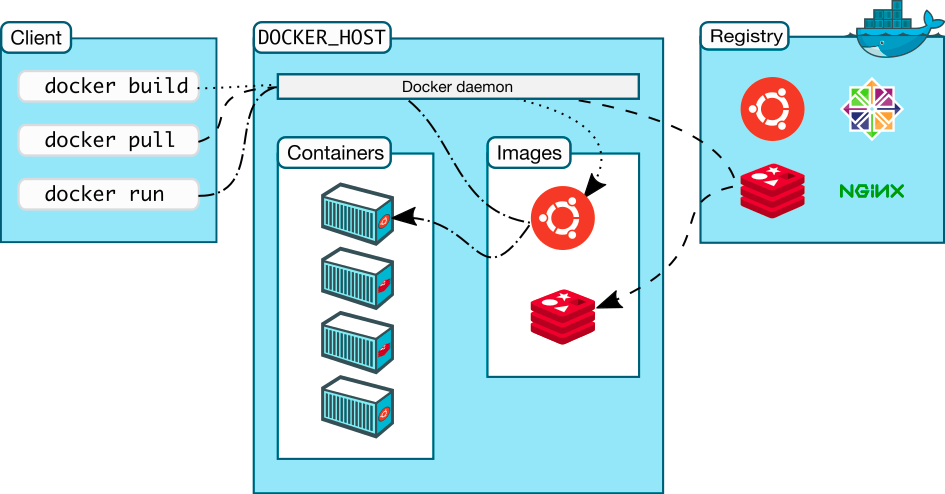

# Introduction to Docker :o:

Docker is the company driving the container movement and the only
container platform provider to address every application across the
hybrid cloud. Today's businesses are under pressure to digitally
transform but are constrained by existing applications and
infrastructure while rationalizing an increasingly diverse portfolio of
clouds, datacenters and application architectures. Docker enables true
independence between applications and infrastructure and developers and
IT ops to unlock their potential and creates a model for better
collaboration and innovation. An overview of docker is provided at

* <https://docs.docker.com/engine/docker-overview/>

{#fig:docker-container}

Image Source
<https://www.docker.com/sites/default/files/Package%20software%40x2.png>

+@fig:docker-container shows how docker containers fit into the system
## Docker platform

Docker provides users and developers with the tools and technologies that are
needed to manage their application development using containers. Developers 
can easily setup different environments for development, testing and 
production. 

## Docker Engine

The Docker engine can be thought of as the core of the docker runtime. The 
docker engine mainly provides 3 services. +@fig:docker-flow shows how 
the docker engine is composed.

* A long running server which manages the containers
* A REST API
* A command line interface

{#fig:docker-flow}
Image Source <https://docs.docker.com/engine/docker-overview/#docker-engine>

## Docker Architecture

The main concept of the docker architecture is based on the simple client-server
model. Docker clients communicate with the Docker server also known as the 
Docker daemon to request various resources and services. THe daemon manages 
all the background tasks that need to be performed to complete client requests.
Managing and distributing containers, running the containers, bulding 
containers, etc. are responsibilities of the Docker daemon. +@fig:docker-arch
shows how the docker architecture is setup. The client module and server can
run either in the same machine or in separate machines. In the latter case 
the communication between the client and server are done through the network.

{#fig:docker-arch}
Image Source <https://docs.docker.com/engine/docker-overview/#docker-architecture>

## Docker Survey

In 2016 Docker Inc. surveyed over 500 Docker developers and operations
experts in various phases of deploying container-based technologies. The
result is available in the *The Docker Survey 2016* as seen in +@fig:docker-survey.

* <https://www.docker.com/survey-2016>

{#fig:docker-survey}
Image Source
<https://blog.docker.com/2016/04/the-modern-software-supply-chain-runs-on-docker/>

