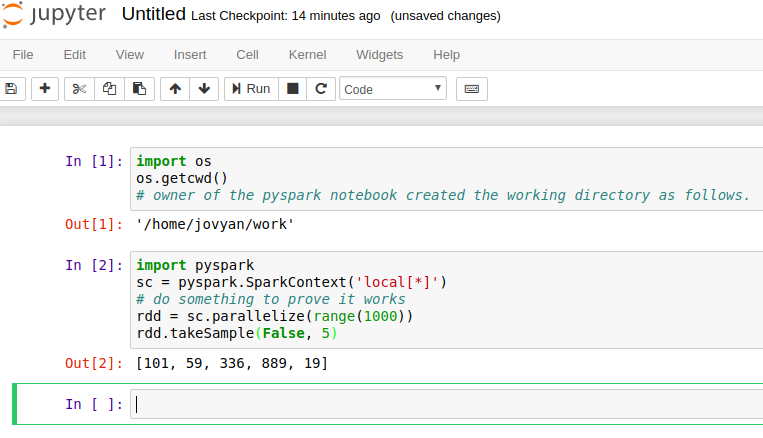
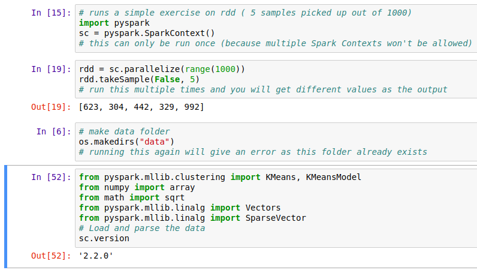
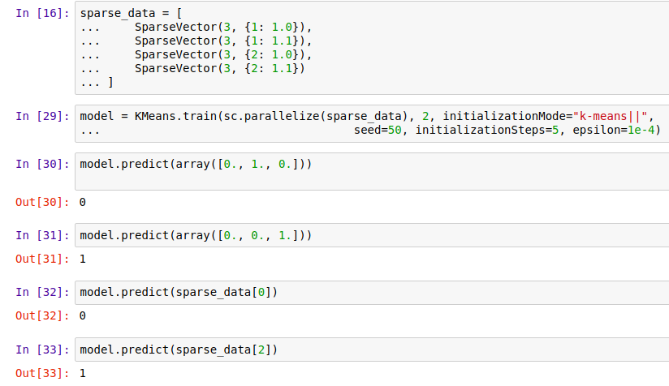

# Draft: Apache Spark with Docker

## Pull Image from Docker Repository

We use a Docker image from Docker Hub:
(https://hub.docker.com/r/sequenceiq/spark/) This repository contains a
Docker file to build a Docker image with Apache Spark and Hadoop Yarn.

    docker pull sequenceiq/spark:1.6.0

## Running the Image

In this step, we will launch a Spark container.

### Running interactively

    docker run -it -p 8088:8088 -p 8042:8042 -h sandbox sequenceiq/spark:1.6.0 bash

### Running in the background

    docker run -d -h sandbox sequenceiq/spark:1.6.0 -d

## Run Spark

After a container is launched, we can run Spark in the following two
modes: (1) yarn-client and (2) yarn-cluster. The differences between the
two modes can be found here:
https://spark.apache.org/docs/latest/running-on-yarn.html

### Run Spark in Yarn-Client Mode

    spark-shell --master yarn-client --driver-memory 1g --executor-memory 1g --executor-cores 1

### Run Spark in Yarn-Cluster Mode

    spark-submit --class org.apache.spark.examples.SparkPi --master yarn-client --driver-memory 1g --executor-memory 1g --executor-cores 1 $SPARK_HOME/lib/spark-examples-1.6.0-hadoop2.6.0.jar

## Observe Task Execution from Running Logs of SparkPi

Let us observe Spark task execution by adjusting the parameter of
SparkPi and the Pi result from the following two commands.

    spark-submit --class org.apache.spark.examples.SparkPi --master yarn-client --driver-memory 1g --executor-memory 1g --executor-cores 1 $SPARK_HOME/lib/spark-examples-1.6.0-hadoop2.6.0.jar 10

    spark-submit --class org.apache.spark.examples.SparkPi --master yarn-client --driver-memory 1g --executor-memory 1g --executor-cores 1 $SPARK_HOME/lib/spark-examples-1.6.0-hadoop2.6.0.jar 10000

## Write a Word-Count Application with Spark RDD

Let us write our own word-count with Spark RDD. After the shell has been
started, copy and paste the following code in console line by line.

### Launch Spark Interactive Shell

    spark-shell --master yarn-client --driver-memory 1g --executor-memory 1g --executor-cores 1

### Program in Scala

    val textFile = sc.textFile("file:///etc/hosts")
    val words = textFile.flatMap(line => line.split("\\s+"))
    val counts = words.map(word => (word, 1)).reduceByKey(_ + _)
    counts.values.sum()

### Launch PySpark Interactive Shell

    pyspark --master yarn-client --driver-memory 1g --executor-memory 1g --executor-cores 1

### Program in Python

    textFile = sc.textFile("file:///etc/hosts")
    words = textFile.flatMap(lambda line:line.split())
    counts = words.map(lambda word:(word, 1)).reduceByKey(lambda x,y: x+y)
    counts.map(lambda x:x[1]).sum()

## Docker Spark Examples

### K-Means Example

First we need to pull the image from the Docker Hub :

    docker pull sequenceiq/spark-native-yarn

It will take sometime to download the image. Now we have to run docker
spark image interactively.

    docker run -i -t -h sandbox sequenceiq/spark-native-yarn /etc/bootstrap.sh -bash

This will take you to the interactive mode.

Let's run a sample KMeans example. This is already built with Spark.

Here we specify the data data set from a local folder inside the image
and we run the sample class KMeans in the sample package. The sample
data set used is inside the sample-data folder. Spark has it's own
format for machine learning datasets. Here the kmeans_data.txt file
contains the KMeans dataset.

    ./bin/spark-submit --class sample.KMeans --master execution-context:org.apache.spark.tez.TezJobExecutionContext --conf update-classpath=true ./lib/spark-native-yarn-samples-1.0.jar /sample-data/kmeans_data.txt

If you run this successfully, you can get an output as shown here.

    Finished iteration (delta = 0.0)
    Final centers:
    DenseVector(0.15000000000000002, 0.15000000000000002, 0.15000000000000002)
    DenseVector(9.2, 9.2, 9.2)
    DenseVector(0.0, 0.0, 0.0)
    DenseVector(9.05, 9.05, 9.05)

### Join Example

Run the following command to do a sample join operation on a given
dataset. Here we use two datasets, namely join1.txt and join2.txt. Then
we perform the join operation that we discussed in the theory section.

    ./bin/spark-submit --class sample.Join --master execution-context:org.apache.spark.tez.TezJobExecutionContext --conf update-classpath=true ./lib/spark-native-yarn-samples-1.0.jar /sample-data/join1.txt /sample-data/join2.txt

### Word Count

In this example the wordcount.txt will used to do the word count using
multiple reducers. Number 1 at the end of the command determines the
number of reducers. As spark can run multiple reducers, we can specify
the number as a parameter to the programme.

    ./bin/spark-submit --class sample.WordCount --master execution-context:org.apache.spark.tez.TezJobExecutionContext --conf update-classpath=true ./lib/spark-native-yarn-samples-1.0.jar /sample-data/wordcount.txt 1

## Interactive Examples

Here we need a new image to work on. Let's run the following command.
This will pull the necessary repositories from docker hub, as we donot
have most of the dependencies related to it. This can take a few minutes
to download everything.

    docker run -it-p 8888:8888 -v $PWD:/cloudmesh/spark --name spark jupyter/pyspark-notebook

Here you will get the following output in the terminal.

\centering
{width="100%"}

Please copy the url shown at the end of the terminal output and go to
that url in the browser.

You will see the following output in the browser, (Use Google Chrome)

\centering
{width="100%"}

First navigate to the work folder. Let us create a new python file here.
Click python3 in the new menu.

\centering
{width="100%"}

Now add the following content in the new file. In Jupyter notebook, you
can enter a python command or python code and press

    SHIFT + ENTER

This will run the code interactively.

Now let's create the following content.

\centering
{width="100%"}

Now let us do the following.

In the following stage we configure spark context and import the
necessary files.

\centering
{width="100%"}

Next stage we use sample data set by creating them in form of an array
and we train the kmeans algorithm.

\centering
{width="100%"}

In the final stage we put sample values and check the predictions on the
cluster. In addition to that feed the data using SparseVector format and
we add the kmeans initialization mode, the error margin and the
palatalization. We put the step size as 5 for this example. In the
previous one we didnot specify any parameters.

The predict term predicts the cluster id which it belongs to.

\centering
{width="100%"}

Then in the following way you can check whether two data points belong
to one cluster or not.

\centering
{width="100%"}

\centering
{width="100%"}

### Stop Docker Container

    docker stop spark

### Start Docker Container Again

    docker start spark

### Remove Docker Container

    docker rm spark
