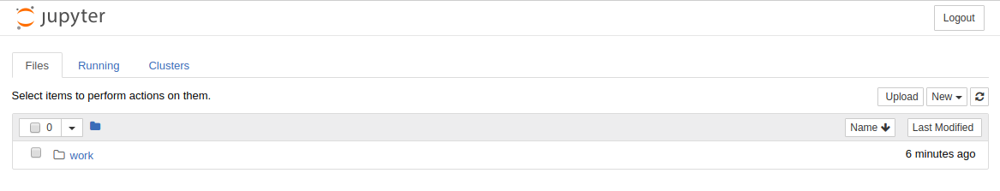
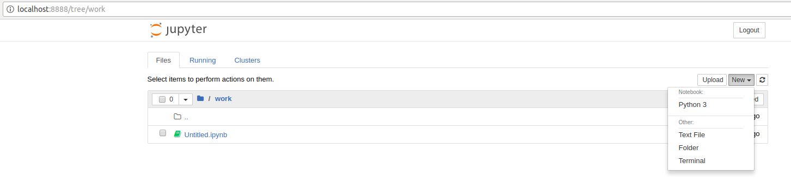

# Apache Spark with Docker

## Pull Image from Docker Repository

We use a Docker image from Docker Hub:
(https://hub.docker.com/r/sequenceiq/spark/) This repository contains a
Docker file to build a Docker image with Apache Spark and Hadoop Yarn.

```bash
$ docker pull sequenceiq/spark:1.6.0
```

## Running the Image

In this step, we will launch a Spark container.

### Running interactively

```bash
$ docker run -it -p 8088:8088 -p 8042:8042 -h sandbox sequenceiq/spark:1.6.0 bash
```

### Running in the background

```bash
$ docker run -d -h sandbox sequenceiq/spark:1.6.0 -d
```

## Run Spark

After a container is launched, we can run Spark in the following two
modes: (1) yarn-client and (2) yarn-cluster. The differences between the
two modes can be found here:
https://spark.apache.org/docs/latest/running-on-yarn.html

### Run Spark in Yarn-Client Mode

```bash
$ spark-shell --master yarn-client --driver-memory 1g --executor-memory 1g --executor-cores 1
```

### Run Spark in Yarn-Cluster Mode

```bash
$ spark-submit --class org.apache.spark.examples.SparkPi --master yarn-client --driver-memory 1g --executor-memory 1g --executor-cores 1 $SPARK_HOME/lib/spark-examples-1.6.0-hadoop2.6.0.jar
```

## Observe Task Execution from Running Logs of SparkPi

Let us observe Spark task execution by adjusting the parameter of
SparkPi and the Pi result from the following two commands.

```bash
$ spark-submit --class org.apache.spark.examples.SparkPi \
    --master yarn-client --driver-memory 1g \
    --executor-memory 1g \
    --executor-cores 1 $SPARK_HOME/lib/spark-examples-1.6.0-hadoop2.6.0.jar 10
$ spark-submit --class org.apache.spark.examples.SparkPi \
    --master yarn-client --driver-memory 1g \
    --executor-memory 1g \
    --executor-cores 1 $SPARK_HOME/lib/spark-examples-1.6.0-hadoop2.6.0.jar 10000
```

## Write a Word-Count Application with Spark RDD

Let us write our own word-count with Spark RDD. After the shell has been
started, copy and paste the following code in console line by line.

### Launch Spark Interactive Shell

```bash
$ spark-shell --master yarn-client --driver-memory 1g --executor-memory 1g --executor-cores 1
```

### Program in Scala

```scala
val textFile = sc.textFile("file:///etc/hosts")
val words = textFile.flatMap(line => line.split("\\s+"))
val counts = words.map(word => (word, 1)).reduceByKey(_ + _)
counts.values.sum()
```

### Launch PySpark Interactive Shell

```bash
$ pyspark --master yarn-client --driver-memory 1g --executor-memory 1g --executor-cores 1
```

### Program in Python

```python
textFile = sc.textFile("file:///etc/hosts")
words = textFile.flatMap(lambda line:line.split())
counts = words.map(lambda word:(word, 1)).reduceByKey(lambda x,y: x+y)
counts.map(lambda x:x[1]).sum()
```

## Docker Spark Examples

### K-Means Example

First we need to pull the image from the Docker Hub :

```bash
$ docker pull sequenceiq/spark-native-yarn
```

It will take sometime to download the image. Now we have to run docker
spark image interactively.

```bash
$ docker run -i -t -h sandbox sequenceiq/spark-native-yarn /etc/bootstrap.sh -bash
```

This will take you to the interactive mode.

Let's run a sample KMeans example. This is already built with Spark.

Here we specify the data data set from a local folder inside the image
and we run the sample class KMeans in the sample package. The sample
data set used is inside the sample-data folder. Spark has it's own
format for machine learning datasets. Here the kmeans_data.txt file
contains the KMeans dataset.

```bash
$ ./bin/spark-submit --class sample.KMeans \
    --master execution-context:org.apache.spark.tez.TezJobExecutionContext
\
    --conf update-classpath=true \
    ./lib/spark-native-yarn-samples-1.0.jar /sample-data/kmeans_data.txt
```

If you run this successfully, you can get an output as shown here.

    Finished iteration (delta = 0.0)
    Final centers:
    DenseVector(0.15000000000000002, 0.15000000000000002, 0.15000000000000002)
    DenseVector(9.2, 9.2, 9.2)
    DenseVector(0.0, 0.0, 0.0)
    DenseVector(9.05, 9.05, 9.05)

### Join Example

Run the following command to do a sample join operation on a given
dataset. Here we use two datasets, namely join1.txt and join2.txt. Then
we perform the join operation that we discussed in the theory section.

```bash
$ ./bin/spark-submit --class sample.Join --master execution-context:org.apache.spark.tez.TezJobExecutionContext --conf update-classpath=true ./lib/spark-native-yarn-samples-1.0.jar /sample-data/join1.txt /sample-data/join2.txt
```

### Word Count

In this example the wordcount.txt will used to do the word count using
multiple reducers. Number 1 at the end of the command determines the
number of reducers. As spark can run multiple reducers, we can specify
the number as a parameter to the programme.

```bash
$ ./bin/spark-submit --class sample.WordCount --master execution-context:org.apache.spark.tez.TezJobExecutionContext --conf update-classpath=true ./lib/spark-native-yarn-samples-1.0.jar /sample-data/wordcount.txt 1
```

## Interactive Examples

Here we need a new image to work on. Let's run the following command.
This will pull the necessary repositories from docker hub, as we do not
have most of the dependencies related to it. This can take a few minutes
to download everything.

```bash
$ docker run -it-p 8888:8888 -v $PWD:/cloudmesh/spark --name spark jupyter/pyspark-notebook
```

Here you will get the following output in the terminal.

```
docker run -it -p 8888:8888 -v $PWD:/cloudmesh/spark --name spark jupyter/pyspark-notebook
Unable to find image 'jupyter/pyspark-notebook:latest' locally
latest: Pulling from jupyter/pyspark-notebook
a48c500ed24e: Pull complete
1e1de00ff7e1: Pull complete
0330ca45a200: Pull complete
471db38bcfbf: Pull complete
0b4aba487617: Pull complete
d44ea0cd796c: Pull complete
5ac827d588be: Pull complete
d8d7747a335e: Pull complete
08790511e3e9: Pull complete
e3c68aea9a5f: Pull complete
484c6d5fc38a: Pull complete
0448c1360cb9: Pull complete
61d7e6dc705d: Pull complete
92f1091ed72b: Pull complete
8045d3663a7e: Pull complete
1bde7ba25439: Pull complete
5618f8ed38b4: Pull complete
f08523cb6144: Pull complete
99eee56fda2f: Pull complete
b37b1ce39785: Pull complete
aee4b9eac4ea: Pull complete
f810ef87439d: Pull complete
038786dce388: Pull complete
ded31312ea33: Pull complete
30221ffdd1a6: Pull complete
da1d368f8592: Pull complete
523809a30a21: Pull complete
47ab1b230dd2: Pull complete
442f9435e1a9: Pull complete
Digest: sha256:f8b6309cd39481de1a169143189ed0879b12b56fe286d254d03fa34ccad90734
Status: Downloaded newer image for jupyter/pyspark-notebook:latest
Container must be run with group "root" to update passwd file
Executing the command: jupyter notebook
[I 15:47:52.900 NotebookApp] Writing notebook server cookie secret to /home/jovyan/.local/share/jupyter/runtime/notebook_cookie_secret
[I 15:47:53.167 NotebookApp] JupyterLab extension loaded from /opt/conda/lib/python3.6/site-packages/jupyterlab
[I 15:47:53.167 NotebookApp] JupyterLab application directory is /opt/conda/share/jupyter/lab
[I 15:47:53.176 NotebookApp] Serving notebooks from local directory: /home/jovyan
[I 15:47:53.177 NotebookApp] The Jupyter Notebook is running at:
[I 15:47:53.177 NotebookApp] http://(3a3d9f7e2565 or 127.0.0.1):8888/?token=f22492fe7ab8206ac2223359e0603a0dff54d98096ab7930
[I 15:47:53.177 NotebookApp] Use Control-C to stop this server and shut down all kernels (twice to skip confirmation).
[C 15:47:53.177 NotebookApp]

    Copy/paste this URL into your browser when you connect for the first time,
    to login with a token:
        http://(3a3d9f7e2565 or 127.0.0.1):8888/?token=f22492fe7ab8206ac2223359e0603a0dff54d98096ab7930
```

Please copy the url shown at the end of the terminal output and go to
that url in the browser.

You will see the following output in the browser, (Use Google Chrome)



First navigate to the work folder. Let us create a new python file here.
Click python3 in the new menu.



Now add the following content in the new file. In Jupyter notebook, you
can enter a python command or python code and press

    SHIFT + ENTER

This will run the code interactively.

Now let's create the following content.

```python
import os
os.getcwd()

import pyspark
sc = pyspark.SparkContext('local[*]')
rdd = sc.parallelize(range(1000))
rdd.takeSample(False, 5)
```

Now let us do the following.

In the following stage we configure spark context and import the
necessary files.

```python
os.makedirs("data")

from pyspark.mllib.clustering import KMeans, KMeansModel
from numpy import array
from math import sqrt
from pyspark.mllib.linalg import Vectors
from pyspark.mllib.linalg import SparseVector
sc.version
```

Next stage we use sample data set by creating them in form of an array
and we train the kmeans algorithm.

```python
sparse_data = [
    SparseVector(3, {1:1.0}),
    SparseVector(3, {1:1.1}),
    SparseVector(3, {2:1.0}),
    SparseVector(3, {2:1.1})
]

model = KMeans.train(sc.parallelize(sparse_data), 2, initializationMode='k-means||',
                    seed=50, initializationSteps=5, epsilon=1e-4)

model.predict(array([0.,1.,0.]))

model.predict(array([0.,0.,1.]))

model.predict(sparse_data[0])

model.predict(sparse_data[2])
```

In the final stage we put sample values and check the predictions on the
cluster. In addition to that feed the data using SparseVector format and
we add the kmeans initialization mode, the error margin and the
palatalization. We put the step size as 5 for this example. In the
previous one we did not specify any parameters.

The predict term predicts the cluster id which it belongs to.

```python
data = array([0.0, 0.0, 1.0, 1.0, 9.0, 8.0, 8.0, 9.0]).reshape(4, 2)
model = KMeans.train(sc.parallelize(data), 2, initializationMode='random',
                    seed=50, initializationSteps=5, epsilon=1e-4)
model.predict(array([0.0, 0.0])) == model.predict(array([1.0, 1.0]))
model.predict(array([8.0, 9.0]))
model.predict(array([8.0, 9.0])) == model.predict(array([9.0, 8.0]))
model.k
model.computeCost(sc.parallelize(data))
```

Then in the following way you can check whether two data points belong
to one cluster or not.


```python
isinstance(model.clusterCenters, list)
```

### Stop Docker Container

```bash
$ docker stop spark
```

### Start Docker Container Again

```bash
$ docker start spark
```

### Remove Docker Container

```bash
$ docker rm spark
```
