# Google Cloud Functions :o: fa18-516-08

:o: add (see ...) for figures, see first figure, use proper captions

---

**:mortar_board: Learning Objectives**

* Introduction to Google Cloud Function
* Practical example using console mode

---

Google Cloud Function is Google's offering for Function as a
Service. It enables serverless computing and offers functions as
services on Google Cloud Platform drivenby trigger events from Cloud
Pub/Sub, Cloud Storage, HTTP or changes in log in Stackdriver
logging. Cloud functions can also be invoked for real time mobile
changes.  Google Cloud page on cloud functions

* <https://cloud.google.com/functions/use-cases/> 

gives more detail about the use cases such as Serverless application
backends, Real-time data processing, Intelligent applications - all
without the need of provisioning a server instance or the overhead of
managing a server instance. The functions are invoked as services
whenever needed for a business requirement and the cost is billed as
per the minutes of usage just for the function execution time. The
Google Cloud Functions can be written in Node.js or Python. For Python
runtime environment refer to the page

* <https://cloud.google.com/functions/docs/concepts/python-runtime>

For Node.js 6 runtime environment refer to the page

* <https://cloud.google.com/functions/docs/concepts/nodejs-6-runtime>

For Node.js 8 runtime environment refer to the page

* https://cloud.google.com/functions/docs/concepts/nodejs-8-runtime>

## Google Cloud Function Example

Following from the example as presented in AWS Lambda section, we will
look into a simple example of building a Google Cloud Function to
check if a string is Palindrome or not.  The implementation will be in
Python and we will use Python runtime environment. We will use HTTP
trigger to invoke the function using HTTP request. We will also use
the Google Cloud Console to build, deploy and test the
function. Finally we will use HTTP url to send request to the function
to get the result of our query.

Let us begin:

**Step 1**: Login to Google Cloud Platform with your GCP account. We
are using free tier for this demonstration. Refer to the section for
Google Cloud in the epub for creting a free tier GCP account.

**Step 2**: Select or create a Project and go to dashboard (see
+@fig:dashboard)

{#fig:dashboard}

**Step 3**: Click "Create a Cloud Function"

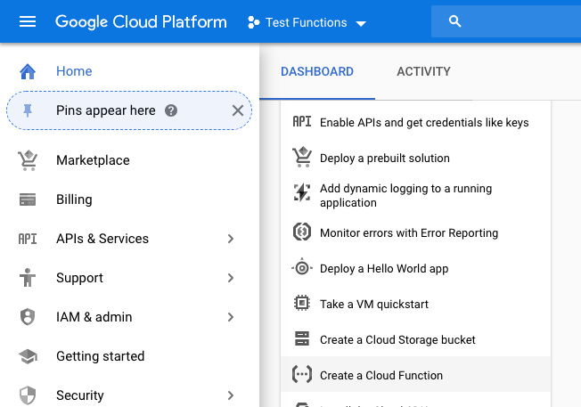

**Step 4**: Enable cloud function API if it is not enabled:

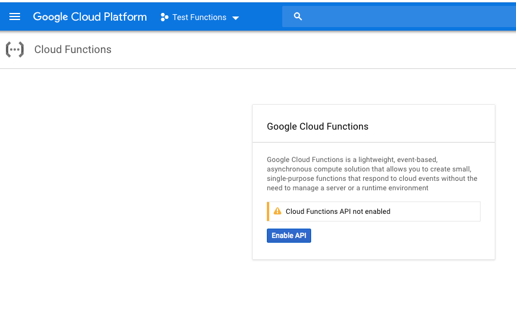

**Step 5**: Click Create Function

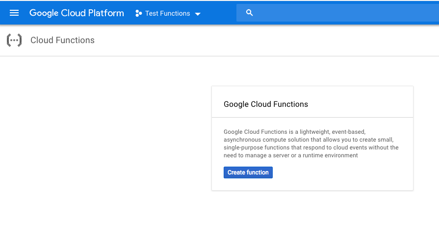

**Step 6**: In the next page, give a name to the function. In our case
we are giving function name as isPalindrome. Specify the memory (128
mb is good for this demo). Select the function trigger as
HTTP. Choose inline editor for the source code and finally
Python 3.7 as the run time environment.

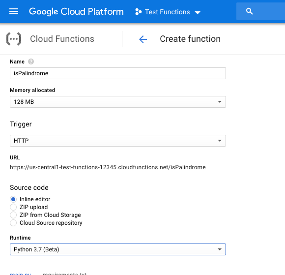

**Step 7**: In the inline source editor, write a Python function and
then click Create. We have written a Python function to check for
Palindrome string. NOTE: This is not an optimized Python code, it is
just used here for demonstration purpose. This function can be
optimized further with Python standards style writing.

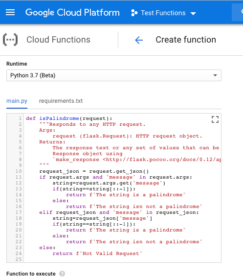

**Step 8**: The function is created and deployed in the next page.

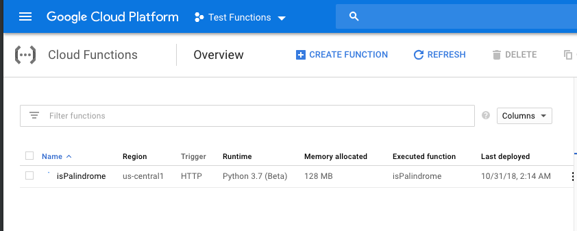

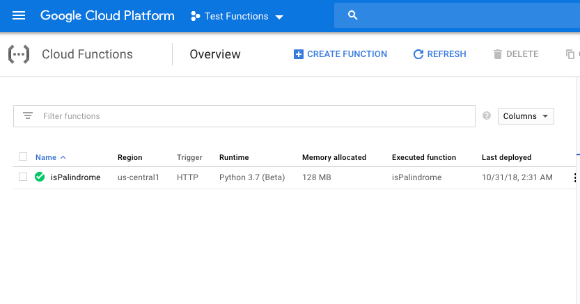

**Step 9**: Finally we will test the function

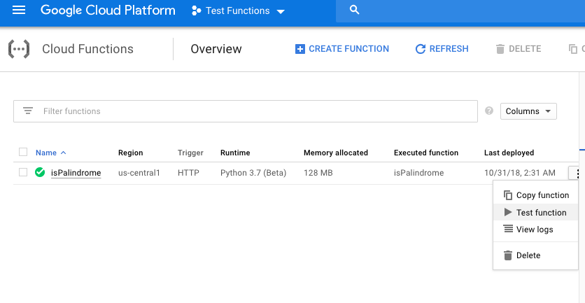

**Step 10**: In the Trigger event box, write a HTTP message request in
JSON format and click Test the Function

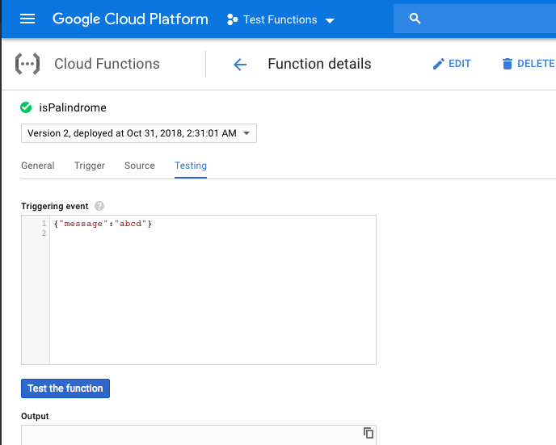

**Step 11**: The response box will show the result of the test as expected

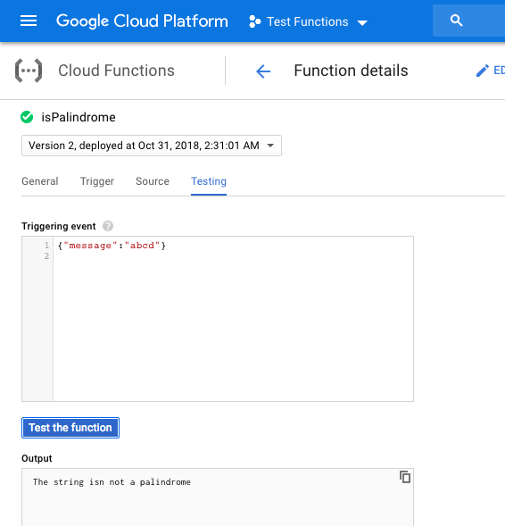

**Step 12**: Let's run one more Test

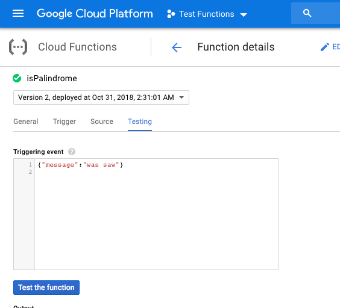

**Step 13**: You will get the expected result

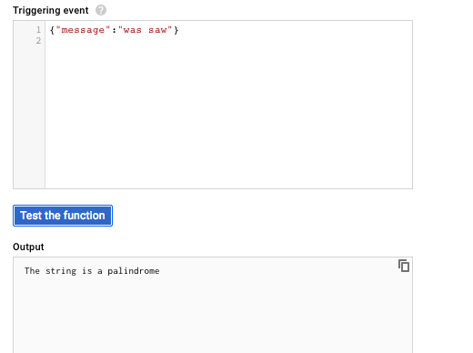

**Step 14**: Let's test our function deployment using url. Click on the function name

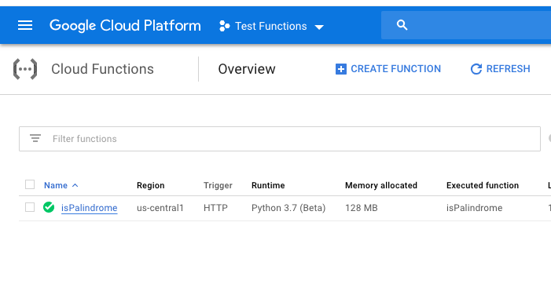

**Step 15**: In the next page, click on Trigger page and copy the url

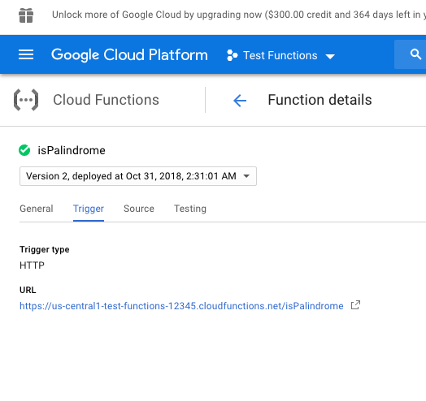

**Step 16**: In a web browser type the url and add the HTTP request to
it and hit enter

* <https://us-central1-test-functions-12345.cloudfunctions.net/isPalindrome?message=abcd>

**Step 17**: You will get a response back from the function

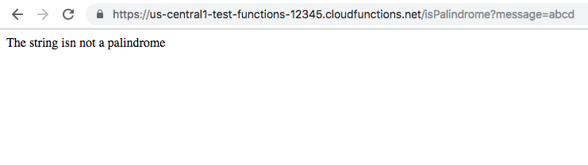

**Step 18**: Another test

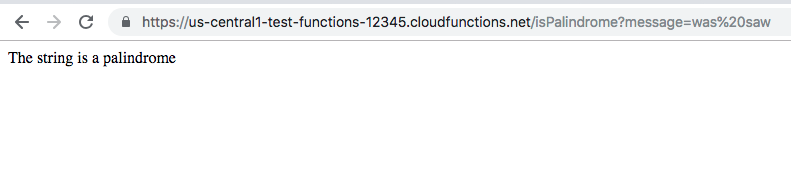

This completes our demo for Google Cloud Function offered as Function
as Service. To learn more about Google Cloud Functions and trigger
options available alongwith triggers using command line - visit

<https://cloud.google.com/functions/>

To learn about creating and deploying functions using command line
instead of GCP console - visit

* <https://cloud.google.com/functions/docs/quickstart>

