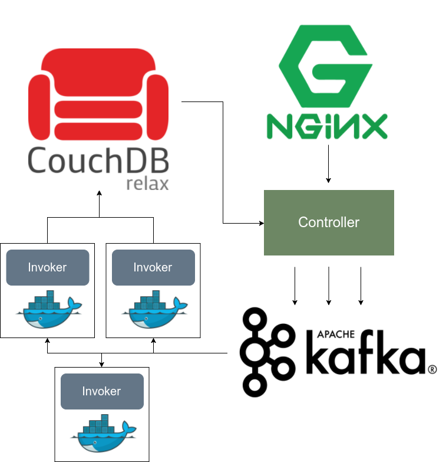

# Apache OpenWhisk :o: :hand: fa18-516-26 {#s-openwhisk}

Apache OpenWhisk is a Function as a Service (FaaS), aka Serverless computing, platform used to execute code in response of an events via triggers by managing the infrastructure, servers and scaling. The advantage of OpenWhisk over traditional long-running VM or container approach is that there is lack of resiliency-related overhead in OpenWhisk. OpenWhisk is inherently scalable since the actions are executed on demand. OpenWhisk also helps the developers to focus only on coding by taking care of infrastructure-related tasks like monitoring and patching.

The developers provide the code written in the desired programming language for the desired action and this code will be executed in response to the events. The *triggering* can be invoked using HTTP requests or external feeds. The events invoking the triggers ranges from database modification to new variables in IoT sensors. Actions that response to these events could also range from a Python code snippet to a binary code in a container and it is as well possible to chain the actions. Note that these actions are deployed and executed instantaneously and can be invoked not only by triggers but also using the OpenWhisk API or CLI.

## OpenWhisk Workflow

OpenWhisk uses Nginx, Kafka, Docker and CouchDB as internal components. To understand the role of each of these components, let's review an action invocation trace in the system. Remember the main outcome of OpenWhisk (or Serverless architecture in general) is to execute the user's code inside the system and return the result. The workflow of the OpenWhisk is illustrated in the following figure:

{#fig:openwhisk-workflow}

We will review the role of each components in the OpenWhisk workflow.
### The Action and Nginx
As mentioned prior, the action is the response of the OpenWhisk to triggers. Consider the following JavaScript function:
``` Javascript
function main() {
    return { hello: 'world' };
}
```
This is the Hello World example of the OpenWhisk action where the action returns a JSON object with the key `hello` which has a value of `world`.  After saving this function in a `.js` file, e.g. `action.js` then the action could be created using the following command:
```bash
$ wsk action create HelloAction action.js
```
Then, the `HelloAction` can be invoked using:
```bash
$ wsk action invoke HelloAction --result
```
The `wsk` command is what is known as OpenWhisk CLI, which we will show how to install in the next sections.  Note that OpenWhisk's API is RESTful and fully HTTP based. In other words, the above-mentioned `wsk action` command  is basically a HTTP request equivalent to the following:
```
POST /api/v1/namespaces/$userNamespace/actions/HelloAction
Host: $openwhiskEndpoint
```
The `userNamespace` variable defines the namespace in which the `HelloAction` is put into. Accordingly, nginx is the entering point of the OpenWhisk system and it plays an important role as a HTTP server as well as a reverse proxy server, mainly used for SSL termination and HTTP request  forwarding.
### Controller: The System's Interface
We learned that nginx does not do any processing on the HTTP request except decrypting it (SSL Termination). The main processing of the request starts in the Controller. The controller plays the role of the interface for user both for actions and Create, Read, Update, and Delete (CRUD) requests, translating the user's POST request to action invocation. The controller has an essential role in OpenWhisk workflow and its role is not finished here and is partially involved in next steps as well.
### CouchDB
Naturally some notion of authentication is essentially required for the system. This authentication is performed by the Controller via CouchDB. The CouchDB instance has a specific database, namely `subjects` which contains the credentials and corresponding privileges. The credentials that corresponds to a request are verified against the `subjects` database and if the user's privileges satisfies the permissions required for the requested `HelloAction`, the action will be invoked. In our example, we are assuming that the `HelloAction` is in a namespace owned by the user, meaning that the user has the required permission to invoke the action.

After authentication and authorization using the `subjects` database, the record for the action `HelloAction` is load from `whisks` database. This record contains the code, the parameters consist of default parameters merged with user parameters, as well as the resource limits, e.g. maximum memory. The `HelloAction` record in `whisk` contains its code (listed above) and no parameters as the code does not get any parameters.
### Load Balancer
Next comes the load balancer which is technically part of the controller and it is load balancer's responsibility to check the health status of the executors, known as `Invokers`, continuously. Load balancer is aware of the available invokers and select them for the actions accordingly.
### Kafka
For a request user sends, there are two scenarios where things can go bad:

* Invocation is lost due to a crash
* Invocation has to wait for invokers to be available

Both of this scenarios can be handled with Kafka distributed messaging system. The action invocation mechanism with Kafka is as follows:

The controller "publishes" a message to Kafka. This message contains the required action and corresponding parameters and is addressed to an Invoker chosen by the controller. Kafka responds to the HTTP request of the user with an `ActivationId` which could be used later by the user to get the result. OpenWhisk supports both synchronous and asynchronous invocation models. In the former model, the user's HTTP request is terminated as the system accepts it. The latter model, known as blocking invocation, is otherwise.
### Invoker
As the heart of the OpenWhisk, the Invoker's responsibility is to invoke the action. Invoker is implemented in Scala but it uses Docker for a safe and isolated execution. For each invoked actions, a container is spawned and the code as well as the parameters are passed to it. As soon as the result is obtained, the container is terminated.

The `HelloAction` example is a node.js action and therefore the invoker will start a node.js container, inject our above-mentioned code to it, runs the code and gets the results, save the logs and terminates the node.js container.
### CouchDB again
The result of the Invoker is saved in another database in CouchDB, namely `activations`, under same ActivationId that was sent back to the user. The result of the `HelloAction` example containing the log in JSON format, would look like this:

```json
{
   "activationId": "31809ddca6f64cfc9de2937ebd44fbb9",
   "response": {
       "statusCode": 0,
       "result": {
           "hello": "world"
       }
   },
   "end": 1474459415621,
   "logs": [
       "2016-09-21T12:03:35.619234386Z stdout: Hello World"
   ],
   "start": 1474459415595,
}
```
Similar to the same API call used for submitting the action, we can use OpenWhisk's API to retrieve the result using the ActivationId:
```bash
wsk activation get 31809ddca6f64cfc9de2937ebd44fbb9
```
## Setting up the OpenWhisk CLI
