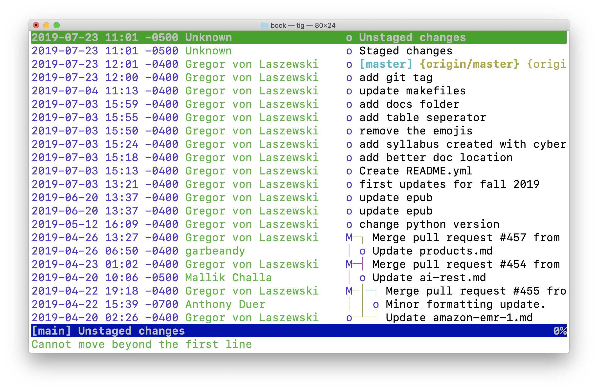

# Tig

Many browsers exist to gain insight into git repositories. In case you have
Linux or Ubuntu a tool to display information in a terminal is available.

* https://jonas.github.io/tig/

On OSX it can be installed with:

    $ brew install tig

Tig has many different views including views for main, log, diff, tree, blob,
blame, refs, status, stage. stash, grep, and
pager .

A screenshot shows some if its basic functionality is shown in @fig:git-tig

{#fig:git-tig}

 Example infocations are

    $ tig
    $ git show | tig
    $ git log | tig
