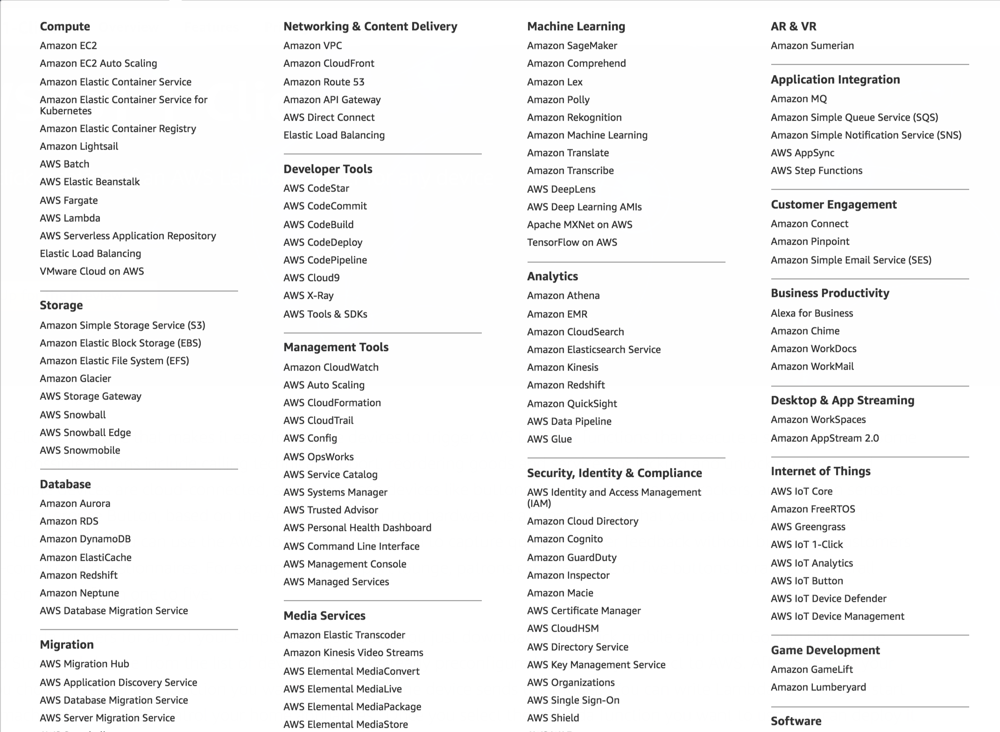
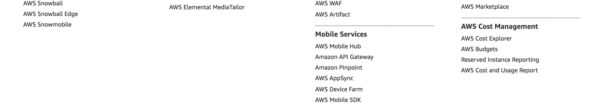
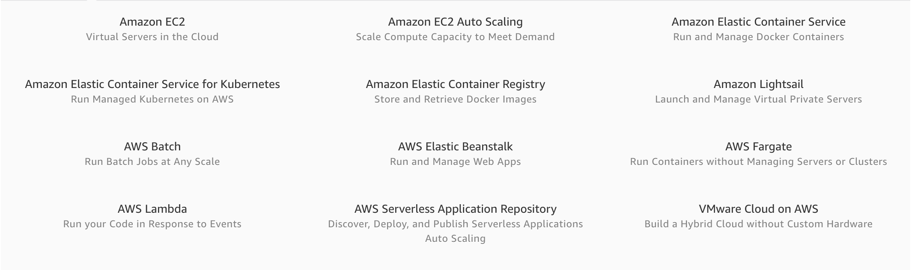

# Draft: Amazon Web Services
\label{s:aws}
\index{AWS}

## AWS Products

Amazon Web Services offers a large number of products that are centered around their cloud services. These services have grown considerably over the years from the core 
offering realted to virtual machine (EC2) and datastorage (S3). An overview of them is provided by Amazon in the following document:

* <https://d0.awsstatic.com/whitepapers/aws-overview.pdf>

We list the product in screenshots from their Product Web page panel in Figure \label{F:aws-products}

\begin{figure}

\caption{AWS Products}
\label{F:aws-products}
\end{figure}

Service offerings are grouped by categories:

* Compute
* Storage
* Database
* Migration
* Networking and Content Delivery
* Developer Tools
* Management Tools
* Media Services
* Machine Learning
* Analytics
* Security and Identity Compliance
* Mobile Services
* AR and VR
* Application Integration
* Customer Engagement
* Business Productivity
* Desktop and App Streaming
* Internet of Things
* Game Development
* Software
* Aws Core Management

Within each category you have several products. When choosing products form AWS it is best to start with the overview paper and identify products that can be of benefit to you. For our 
purpose we focus on the traditional Compute and Storage offerings.

## Locations

## Compute

AWS offers a number of compute related services. 

## Serverless Computing with AWS Lambda

<https://aws.amazon.com/lambda/>

## Storage

### NoSQL with DynamoDB

* <https://aws.amazon.com/dynamodb/>

## App Integration

## Access from the Command Line

	aws s3 <Command> [<Arg> ...]
	aws ec2 <Command> [<Arg> ...]

* <https://aws.amazon.com/cli/>
* <https://docs.aws.amazon.com/cli/latest/reference/>

* EC2: <https://docs.aws.amazon.com/cli/latest/reference/ec2/index.html>
* S3: <https://docs.aws.amazon.com/cli/latest/reference/s3/index.html>

### S3

commands: cp, ls, mb, mv, presign, rb, rm, sync, website

## Access from python

### libcloud

"Libcloud is a Python library for interacting with many of the popular cloud service providers using a unified API. It was created to make it easy for developers to build products that work between any of the services that it supports.

Resource you can manage with Libcloud are divided in the following categories:

Cloud Servers and Block Storage - services such as Amazon EC2 and Rackspace CloudServers
Cloud Object Storage and CDN - services such as Amazon S3 and Rackspace CloudFiles
Load Balancers as a Service - services such as Amazon Elastic Load Balancer and GoGrid LoadBalancers
DNS as a Service - services such as Amazon Route 53 and Zerigo
For more information about the features and supported providers, please refer to the [documentation](https://libcloud.readthedocs.org/en/latest/)."
from https://libcloud.apache.org/about.html

* <https://libcloud.apache.org/>

### Boto

Boto is a Python software development kit specifically targeting  Amazon Web Services (AWS). It allows acces to services such as S3 and EC2. It is using object oriented programming paradigms ta acess the lower level services. The advantage is that it is written just for  Amazon and thus we assume it will be developed with high quality due to its specialization. However this is also its limitation as in contrast to libcloud it does not support other cloud providers. Hence it bares the risk of vendor lockin. Boto is maintained in github.

Documentation about boto can be found at 

* https://boto3.readthedocs.io/en/latest/
* <https://github.com/boto/boto3>

