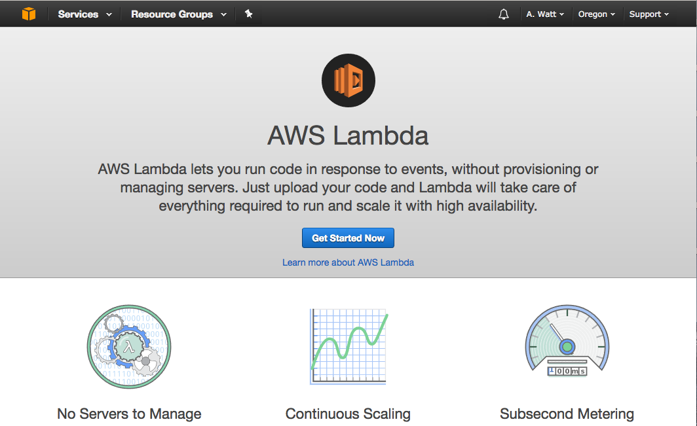
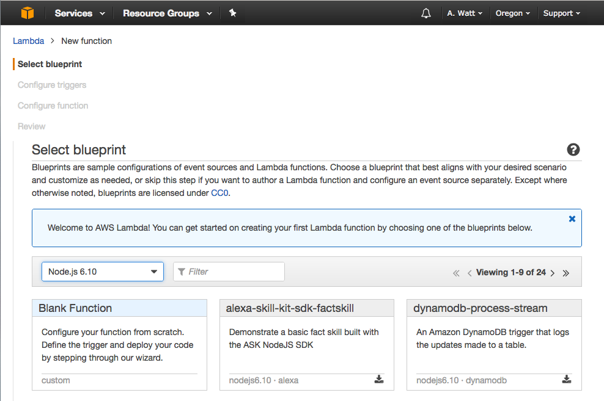
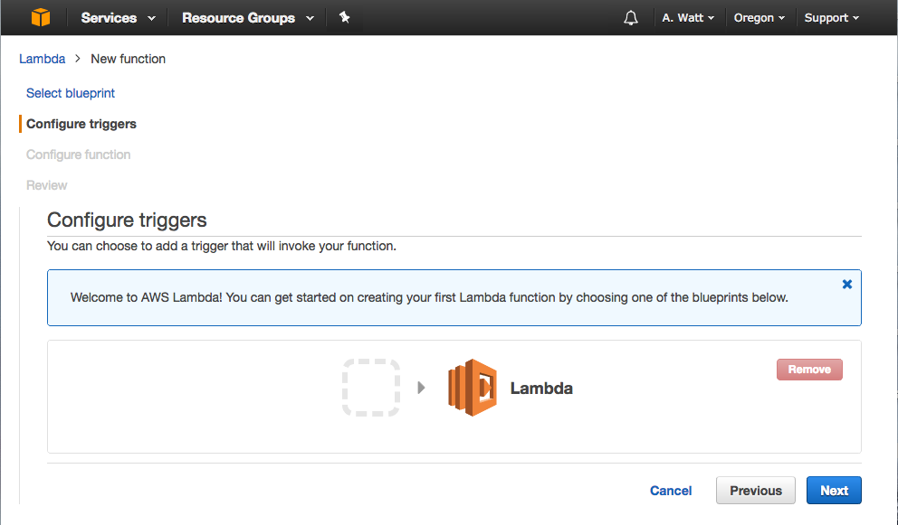
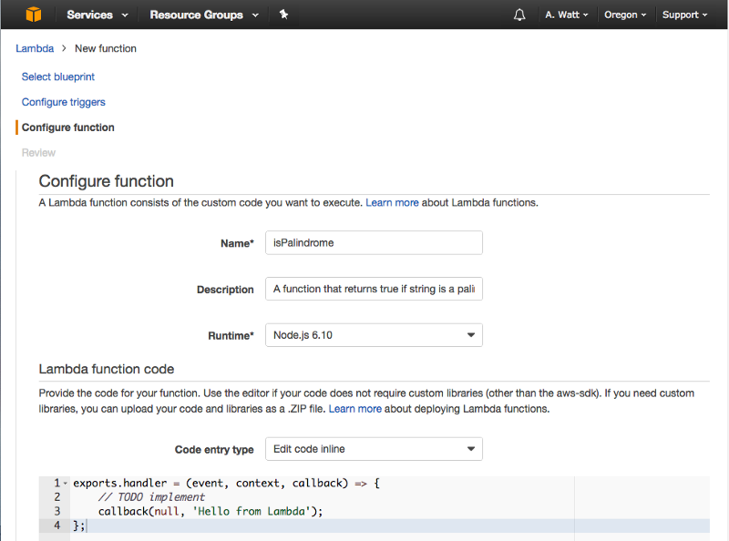
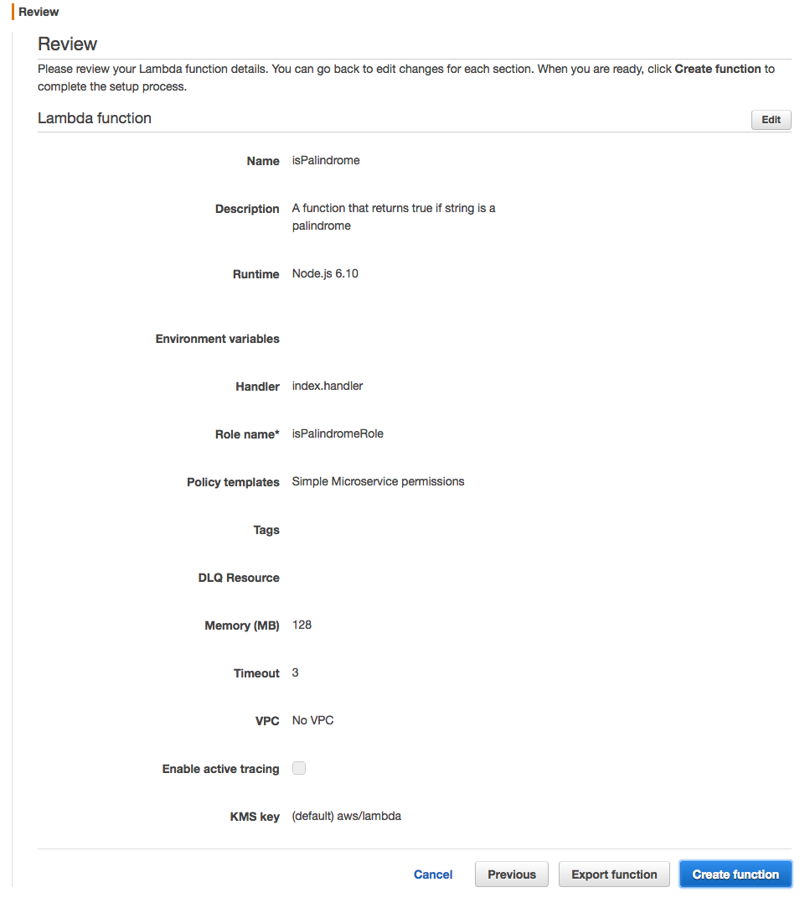
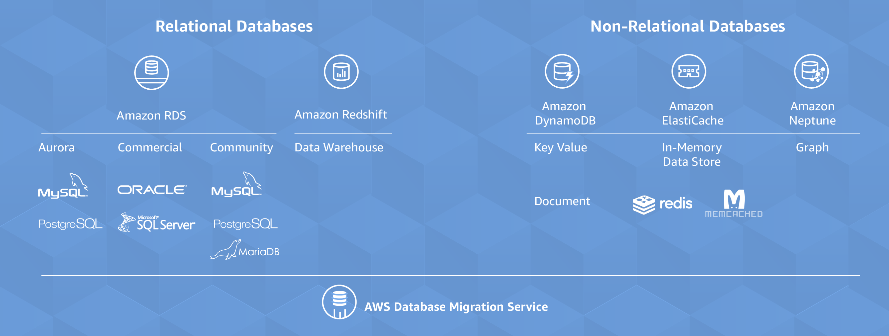

# Amazon Web Services :o:

## AWS Products

Amazon Web Services offers a large number of products that are
centered around their cloud services. These services have grown
considerably over the years from the core offering related to virtual
machine (EC2) and datastorage (S3). An overview of them is provided by
Amazon in the following document:

* <https://d0.awsstatic.com/whitepapers/aws-overview.pdf>

We list the product in screenshots from their Product Web page panel
in Figure AWS Products.

Figure: AWS Products

Service offerings are grouped by categories:

* Compute
* Storage
* Database
* Migration
* Networking and Content Delivery
* Developer Tools
* Management Tools
* Media Services
* Machine Learning
* Analytics
* Security and Identity Compliance
* Mobile Services
* AR and VR
* Application Integration
* Customer Engagement
* Business Productivity
* Desktop and App Streaming
* Internet of Things
* Game Development
* Software
* Aws Core Management

Within each category you have several products. When choosing products
form AWS it is best to start with the overview paper and identify
products that can be of benefit to you. For our purpose we focus on
the traditional Compute and Storage offerings.

## Locations

## Compute

AWS offers a number of compute related services. 

## Serverless Computing with AWS Lambda

Serverless computing or FaaS is a new cloud computing paradigm that has
gained popularity recently. 

## AWS Lambda 

### What is AWS Lambda

AWS Lambda is an event-driven, serverless computing platform provided by Amazon as a part of the Amazon Web Services. It is a computing service that runs code in response to events, runs the code that has been loaded into the system and automatically manages the computing resources required by that code.

	“AWS Lambda lets you run code without provisioning or managing servers,” AWS states on the Lambda product page.

For example, one of the use-cases would be that everytime AWS Lambda could resize the picture, after it is uploaded onto AWS S3 system and rendered on different devices like phone, ipad or desktop. The event that triggers the Lambda function is the file being uploaded to S3. Lambda then executes the function of resizing the image. The Seattle Times uses the AWS Lambda to automatically resize the images. 

One key point to note here is that Amazon charges only when the functions are executed. So, The Seattle Times is charged for this service only when the images are been resized.
Lambda can be used for Analytics. So lets say, there has been a purchase of a house on zillow, this data can be saved into a NoSQL database and this entry into the database is an event which can trigger Lambda function to load the order information into Amazon Redshift. Then we can run Analytics on top of this data.
We can also build serverless applications composed of functions that are triggered by events and automatically deploy them using AWS CodePipeline and AWS CodeBuild. For more information, see Deploying Lambda-based Applications.

In one of the interviews with Matt Wood, Chief product strategist at Amazon Web Services, says "There’s a particular category of usage where the developer wants to focus primarily on adding functionality to their application, they don’t want to worry about scaling up and down (infrastructure), and they want costs that run in line with usage of their application, not the utilization of their infrastructure. Lambda provides a really good answer for developers looking for that sort of focus."

Ironically, Lambda could be a threat to one of the Amazon's most popular EC2. Developers can build apps that run entirely on Lambda functions instead of spinning up EC2 VMs. Amazon may be out-innovating itself with Lambda.

### Serverless Computing

In Serverless Computing, servers are still there, its just that we dont need to manage them.

Another advantage of going serverless is that you no longer need to keep a server running all the time. The “server” suddenly appears when you need it, then disappears when you’re done with it. Now you can think in terms of functions instead of servers, and all your business logic can now live within these functions.

In AWS Lambda, we have triggers. Lambda Functions can be triggered in different ways: an HTTP request, a new document upload to S3, a scheduled Job, an AWS Kinesis data stream, or a notification from AWS Simple Notification Service (SNS).

### How to run your first AWS Lambda function in the cloud - Example

Let us create our first Lambda function.

Step 1: We need an AWS account firstly. We already have a section here for that.

Step 2: We will be writing a function isPalindrome, which will check if the string is Palindrome String or not.

const isPalindrome = (string) => {
    	const reverse = string.split('').reverse().join('');
  	const isPalindrome = (string === reverse);
    	const result = isPalindrome ? `${string} is a Palindrome` : `${string} is not a Palindrome`;
              return result;
  };
	
	This example is in javascript - isPalindrome.js

 Step 3: Creating an AWS Lambda function - isPalindrome. Go to AWS Console
 
  
 
 
Step 4: Now go to AWS Lambda from console and hit "Get Started Now"
 
 

Step 5: For runtime select Node.js 6.10 and then press “Blank Function.”
 

Step 6: Skip this step and press “Next.”

 
Step 7:  Say Name as isPalindrome and put in a description of your new Lambda Function, or leave it blank.

 

Lambda function is just a function, named as “handler” here and the function takes three parameter - event, context and a callback function.
The callback will run when the Lambda function is done and will return a response or an error message. For the Blank Lambda blueprint response is hard-coded as the string ‘Hello from Lambda’. 

Step 8: Scroll down, for Role choose “Create new Role from template”, and for Role name use isPalindromeRole or any name.
For Policy templates, choose “Simple Microservice” permissions.
 
 

Step 9: For Memory, 128 megabytes is more than enough for our simple function.
As for the 3 second timeout, this means that — should the function not return within 3 seconds — AWS will shut it down and return an error. Three seconds is also more than enough.
Leave the rest of the advanced settings unchanged.

 

Step 10: Create function now

 

Step 11: First Lambda function is created. To test it, press “Test”
 
 

Output will be the hard-coded response of “Hello from Lambda.” from the created Lambda function.
 
 

Step 12: Now let’s add our isPalindrome.js function code here to Lambda function but instead of return result use callback(null, result). Then add a hard-coded string value of abcd on line 3 and press “Test.”

 

Output returns “abcd is not a Palindrome”

 

Similarly, let’s try with string “abcdcba” and in this case output should return “abcdcba is a Palindrome”
So our Lambda function is behaving as expected. 

## Storage

AWS provides many storage services that users can leverage for developing
applications and solutions. The list below showcases AWS storage 
services

### Database

AWS also provides many data base solutions. AWS has both SQL based
databases and NoSQL based databases. The list below shows the database
services that AWS offers. And other database related services

*Image reference - https://aws.amazon.com/products/databases/*

## App Integration

## Access from the Command Line

AWS also provides an command line interface that can be used to manage
all the AWS services through simple commands. below are two example 
commands.

	aws s3 <Command> [<Arg> ...]
	aws ec2 <Command> [<Arg> ...]

You can find more information regarding the AWS CLI in the following 
documents.

* AWS Command Line: <https://aws.amazon.com/cli/>
* AWS Command Line reference: <https://docs.aws.amazon.com/cli/latest/reference/>

* EC2: <https://docs.aws.amazon.com/cli/latest/reference/ec2/index.html>
* S3: <https://docs.aws.amazon.com/cli/latest/reference/s3/index.html>

## Access from Python

### Boto

Boto is a Python software development kit specifically targeting
Amazon Web Services (AWS). It allows access to services such as S3 and
EC2. It is using object oriented programming paradigms ta access the
lower level services. The advantage is that it is written just for
Amazon and thus we assume it will be developed with high quality due
to its specialization. However this is also its limitation as in
contrast to libcloud it does not support other cloud providers. Hence
it bares the risk of vendor lockin. Boto is maintained in github.

Documentation about boto can be found at 

* https://boto3.readthedocs.io/en/latest/
* <https://github.com/boto/boto3>

### libcloud

"Libcloud is a Python library for interacting with many of the popular
cloud service providers using a unified API. It was created to make it
easy for developers to build products that work between any of the
services that it supports. A more detailed description on Libcloud and
how you can use it to connect with AWS is provided in the [LibCloud section](../libcloud.md)

For more information about the features and supported providers, please
refer to the [documentation](https://libcloud.readthedocs.org/en/latest/)
