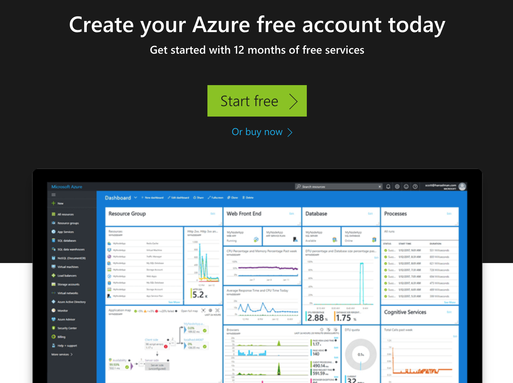
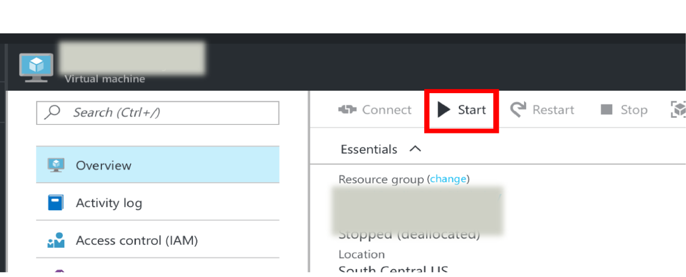
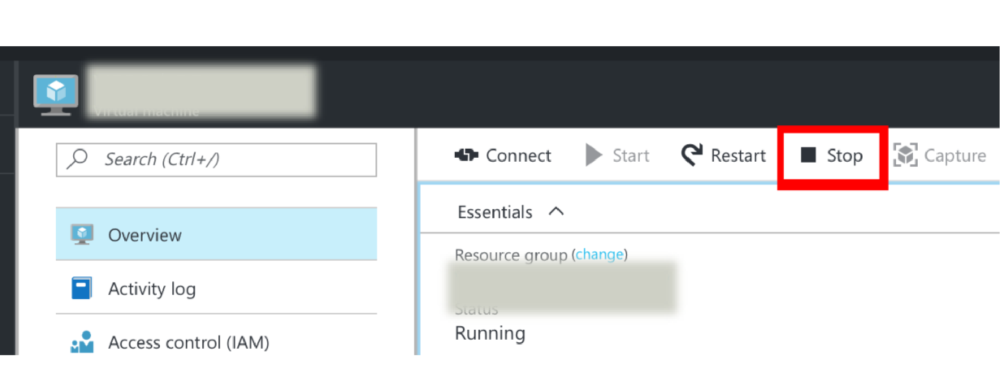

# Microsoft Azure

Microsoft Azure is a cloud computing service created by Microsoft. It
includes computing services and products for building, testing,
deploying, and managing applications and services through a global
network of Microsoft-managed data centers.  It provides software as a
service (SaaS), platform as a service (PaaS) and infrastructure as a
service (IaaS) and supports many different programming languages,
tools and frameworks, including both Microsoft-specific and
third-party software and systems.

## Products

Just as  Microsoft offers a large number of services.
We included the from Microsoft in Sep. 2018 highlighted services in
the appendix, with convenient links to them.

The services are organized in the following categories:

-   AI + Machine Learning
-   Analytics
-   Compute
-   Containers
-   Databases
-   Developer Tools
-   DevOps
-   Identity
-   Integration
-   Internet of Things
-   Management Tools
-   Media
-   Migration
-   Mobile
-   Networking
-   Security
-   Storage
-   Web

We focus next on the

* compute,
* container, and
* data resources

For a more elaborate list please consult our Appendix. To see the
complete list lease visit the Microsoft Web page via this
[link](https://azure.microsoft.com/en-us/services/#compute).

###  Virtual Machine Infrastructure as a Services 

Source: <https://support.microsoft.com/en-us/allproducts>

Microsoft offers core IaaS 
[Compute](https://azure.microsoft.com/en-us/product-categories/compute/ "Compute")
compute resources. This includes the following services:

-
    [Virtual Machines](https://azure.microsoft.com/en-us/services/virtual-machines/
    "Virtual Machines") to provision Windows and Linux
    virtual machines 

-
    [Virtual Machine Scale Sets](https://azure.microsoft.com/en-us/services/virtual-machine-scale-sets/
    "Virtual Machine Scale Sets") to  manage and scale
     thousands of Linux and Windows virtual
    machines

### Container Infrastructure as a Service

Microsoft offers
[Containers](https://azure.microsoft.com/en-us/overview/containers/)
to allow for the development of 
containerized applications. This includes:

-
    [Azure Kubernetes Service (AKS)](https://azure.microsoft.com/en-us/services/kubernetes-service/)
    to provide access to Kubernetes as a Service so that deployment, management, and operations of
    Kubernetes can be conducted on the cloud resources offered.

-
   [Service Fabric](https://azure.microsoft.com/en-us/services/service-fabric/
    "Service Fabric") to develop microservices and
    orchestrate containers on Windows or
    Linux as part of the infrastructure

-
    [Container Instances](https://azure.microsoft.com/en-us/services/container-instances/
    "Container Instances") to run containers on Azure without managing
    servers which seems unrelated to kubernetes

-
    [Container Registry](https://azure.microsoft.com/en-us/services/container-registry/
    "Container Registry") to store and manage container images for deployments

### Databases

Storage is offered through a variety of
[Database](https://azure.microsoft.com/en-us/product-categories/databases/
"Databases") servicess to provide access to enterprise-grade, and fully managed  services.

-
    [Azure Cosmos DB](https://azure.microsoft.com/en-us/services/cosmos-db/
    "Azure Cosmos DB") is a  globally distributed,
    multi-model database for any
    scale

-
    [Azure SQL Database](https://azure.microsoft.com/en-us/services/sql-database/
    "Azure SQL Database") is a managed relational SQL database as a
    service

-
    [Azure Database for MySQL](https://azure.microsoft.com/en-us/services/mysql/
    "Azure Database for MySQL") is a managed MySQL database as a
    service

-
    [Azure Database for PostgreSQL](https://azure.microsoft.com/en-us/services/postgresql/
    "Azure Database for PostgreSQL") is a managed
    PostgreSQL database service

-
    [SQL Server on Virtual Machines](https://azure.microsoft.com/en-us/services/virtual-machines/sql-server/
    "SQL Server on Virtual Machines") allowing to host enterprise SQL
    Server apps in the cloud

-
    [SQL Data Warehouse](https://azure.microsoft.com/en-us/services/sql-data-warehouse/
    "SQL Data Warehouse") is an elastic data warehouse as a service
    with enterprise-class features

-
    [Azure Database Migration Service](https://azure.microsoft.com/en-us/services/database-migration/
    "Azure Database Migration Service") simplifies on-premises
    database migration to the cloud

- [Redis Cache](https://azure.microsoft.com/en-us/services/cache/
  "Redis Cache") which provides a Redis Cache as a service to
  support high-throughput and  low-latency data access

-
    [SQL Server Stretch Database](https://azure.microsoft.com/en-us/services/sql-server-stretch-database/
    "SQL Server Stretch Database") which supports dynamically
    stretch on-premises SQL server databases to 
    Azure

### Networking

We will not go much into the network offerings at this time

## Registration

In order for you to register in Azure and start your free account, you
will need to go to

* [https://azure.microsoft.com/en-us/free/](https://azure.microsoft.com/en-us/free/)

You will see an image such as below: +@fig:registration.

{#fig:registration}

On that image you click the `Start free` button to obtain a free one
year account. You will have to either create a new Microsoft account
or use the one from Indiana University which will be your IU id
followed by the @iu.edu domain. You will be redirected to the single
sign on from IU to proceed. If you use another e-mail you can
certainly do that and you free account sis not associated with the IU
account. This could be your Skype account or some other e-mail.  After
registration you will be provided with 12 months of free usage of a
few selected services and $200 credits for 30 days.

The services that you have access to include:

* Linux Virtual Machines (750 Hours)
* Windows Virtual Machines (750 Hours)
* Managed Disks (64 GB X 2)
* Blob Storage (5 GB)
* File Storage (5 GB)
* SQL Database (250 GB)
* Azure Cosmos DB (5 GB)
* Bandwidth (Data Transfer 15 GB)
* In case Azure changes the product list, please refer to the official
  page for a full list of free products:
  https://azure.microsoft.com/en-us/free/

## Introduction to the Azure Portal

Azure can be accessed via a portal. An introductory video from
Microsoft provides you with some elementary information:

[:clapper: Introduction to Azure Portal](https://channel9.msdn.com/Blogs/Azure/Get-Started-with-Azure-Portal/player)

## Creating a VM

Choose `Create a resource` in the upper left-hand corner of the Azure
portal. Select a VM name, and the disk type as SSD, then provide a
username. The password must be at least 12 characters long and meet
the defined complexity requirements. As the following: +@fig:creating-a-vm.

{#fig:creating-a-vm}

Source: <https://docs.microsoft.com/en-us/azure/virtual-machines/windows/media/quick-create-portal/create-windows-vm-portal-basic-blade.png>

## Starting a VM

Now we like to introduce you how to start a VM. Please note that VMS
do cost and reduce your free hours on Azure. Hence you need to make
sure you carefully review the charging rates and chose VM sizes and
types that minimize your charges.

A VM can be started through the Portal as follows: +@fig:start-button.

* On the overview tqb, a VM can be started by clicking the `Start`
  button.

{#fig:start-button}

## Stopping the VM

It is the most important to stop your VMS once they are not in used,
or you get continuously charged. The portal allows you to see the list
of VM that you run as follows

To shut a VM down, please do the following: see +@fig:stop-button.

* On the overview tab, a VM can be started by clicking the `Stop` button.

{#fig:stop-button}

## Exercises

E.Azure.0:

> Identify all products related to IaaS service offerings and mark
> them with :star: after the bullet. Do copy the aws.md file into your
> own repository, do not yet create a pull request. Confirm in a team
> your findings and agree with each other.

E.Azure.1:

> What is the difference between terminating, shutting down, and
> suspension?

E.Azure.2:

> Do I get charged when the VM is suspended, terminated, shutdown?

E.Azure.3:

> How do I resume a VM if it is suspended?

