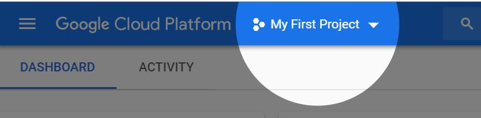
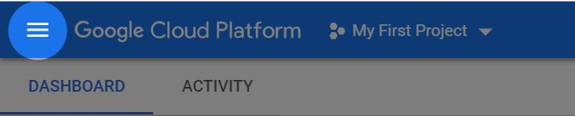
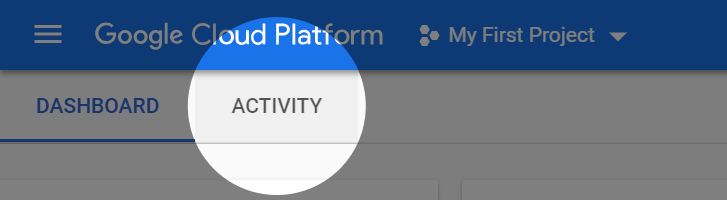

# Google IaaS Cloud Services {#sec:google-products}

Google Cloud, offered by Google, is a suite of cloud computing
services that runs on the same infrastructure that Google uses
internally for its end-user products, such as Google Search and
YouTube. Alongside a set of management tools, it provides a series of
modular cloud services including computing, data storage, data
analytics and machine learning. Registration requires a credit card or
bank account details. Pricing is on a pay-as-you-go per second basis,
and discounts are offered for certain services that run for extended
periods. A free trial of $300 worth of services is available for the
first 12 months. Many services are always free up to a certain amount
of use.

Google Cloud Platform provides Infrastructure as a Service, Platform
as a Service, and Server-less Computing environments.

Google Cloud Platform is a part of Google Cloud, which includes the
Google Cloud Platform public cloud infrastructure, as well as G Suite,
Cloud Identity, Apigee, Firebase, enterprise versions of Android and
Chrome OS, and Google Maps Platform. The platform and all its
offerings can be managed via a customizable dashboard
@fig:gcloud-dashboard.

](images/dashboard.png){#fig:gcloud-dashboard}

## Cloud Computing Services and Products

All products here and their links can be found on

* <https://cloud.google.com>

We have copied the information form that location and made them
conveniently available in this section.

### AI and Machine Learning

Google offers many machine learning and artificial intelligence tools,
including tools for text-to-speech, speech-to-text, translation, and
image and video analysis as well as various tools for making models
and predictions and deploying pipelines and out-of-the-box algorithms.

* [AI Hub (alpha)](https://cloud.google.com/ai-hub/): Discover, share, and deploy AI on Google Cloud.
* [Cloud AutoML (beta)](https://cloud.google.com/automl/): Easily train high-quality, custom ML models.
* [Cloud TPU](https://cloud.google.com/tpu/) Train and run ML models faster than ever.
* [Cloud Machine Learning Engine](https://cloud.google.com/ml-engine/): Build superior models and deploy them into production.
* [Cloud Talent Solution](https://cloud.google.com/solutions/talent-solution/): Put AI to work on your hiring needs.
* [Dialogflow Enterprise Edition](https://cloud.google.com/dialogflow-enterprise/): Create conversational experiences across devices and platforms.
* [Cloud Natural Language](https://cloud.google.com/natural-language/): Derive insights from unstructured text.
* [Cloud Speech-to-Text](https://cloud.google.com/speech-to-text/): Speech-to-text conversion powered by ML.
* [Cloud Text-to-Speech](https://cloud.google.com/text-to-speech/): Text-to-speech conversion powered by ML.
* [Cloud Translation](https://cloud.google.com/translate/): Dynamically translate between languages.
* [Cloud Vision](https://cloud.google.com/vision/): Derive insight from images powered by ML
* [Cloud Video Intelligence](https://cloud.google.com/video-intelligence/): Extract metadata from videos.
* [Cloud Inference API (alpha)](https://cloud.google.com/inference/): Quickly run large-scale correlations over typed time-series datasets.
* [Firebase Predictions](https://firebase.google.com/products/predictions/): Smart user segmentation based on predicted behavior.
* [Cloud Deep Learning VM Image](https://cloud.google.com/deep-learning-vm-image/): Preconfigured VMs for deep learning applications.

### API management

API tools include monetization and analytic tools as well as
deployment tools. Apigee Edge integrates these tools together into a
platform for managing APIs through the use of API proxies, which are
combined together with a service plan into an API product.

* [Apigee API Platform](https://cloud.google.com/apigee-api-management/):
  Develop, secure, deploy, and monitor your APIs everywhere.
* [API Analytics](https://cloud.google.com/api-analytics/):
  Insight into operational and business metrics for APIs.
* [API Monetization](https://cloud.google.com/api-monetization/):
  Flexible, easy-to-use solution to realize value from APIs.
* [Apigee Sense](https://cloud.google.com/apigee-sense/): Intelligent behavior detection to protect APIs from attacks.
* [Cloud Endpoints](https://cloud.google.com/endpoints/): Develop, deploy, and manage APIs on GCP.
* [DeveloperPortal](https://cloud.google.com/developer-portal/): Enable developers and API teams with a turnkey self-service platform.
* [Apigee healthcare APIx](https://apigee.com/about/solutions/apigee-health-apix): Accelerate building new FHIR API-based digital services.
* [Apigee Open Banking APIx](https://apigee.com/about/solutions/apigee-open-banking-apix): Accelerate open banking and PSD2 compliance.
* [Cloud Healthcare API](https://cloud.google.com/healthcare-api/): Secure APIs powering actionable healthcare insights.

](images/api_management.png){#fig:gcloud-api-management}

### Compute

Google Cloud Compute services offer infrastructure as a service tools
including virtual machines, containers, as well as an app engine for
deploying web, mobile and IoT apps.

* [Compute Engine](https://cloud.google.com/compute/): Scalable, high-performance VMs.
* [App Engine](https://cloud.google.com/appengine/): Serverless application platform for apps and backends.
* [Google Kubernetes Engine](https://cloud.google.com/kubernetes-engine/): Run containerized applications.
* [GKE On-Prem (alpha)](https://cloud.google.com/gke-on-prem/): Make apps "cloud-ready" and move them to the cloud at your own pace.
* [Cloud Functions](https://cloud.google.com/functions/): Event-driven serverless compute platform.
* [Cloud Functions for Firebase](https://firebase.google.com/docs/functions/): Run mobile backend code without managing servers.
* [Knative](https://cloud.google.com/knative/): Components to create modern, Kubernetes-native cloud-based software.
* [Shielded VMs (beta)](https://cloud.google.com/shielded-vm/): Hardened virtual machines on GCP.
* [Container security](https://cloud.google.com/containers/security/): Secure your container environment on GCP.
* [Graphics Processing Unit (GPU)](https://cloud.google.com/gpu/): Leverage GPUs on Google Cloud for machine learning, scientific computing, and 3D visualization.

### Data Analytics

Google Cloud's data analytics services include serverless data
warehousing, tools for running Hadoop and Spark clusters, data
preparation and processing, creating dashboards and reports, NoSQL
databases, and a tool that lets you experiment with transforming,
analyzing, modeling, and predicting data.

* [BigQuery](https://cloud.google.com/bigquery/): A fully managed, highly scalable data warehouse with built-in ML.
* [Cloud Dataflow](https://cloud.google.com/dataflow/): Real-time batch and stream data processing.
* [Cloud Dataproc](https://cloud.google.com/dataproc/): Managed Spark and Hadoop service.
* [Cloud Datalab](https://cloud.google.com/datalab/): Explore, analyze, and visualize large datasets.
* [Cloud Dataprep](https://cloud.google.com/dataprep/): Cloud data service to explore, clean, and prepare data for analysis.
* [Cloud Pub/Sub](https://cloud.google.com/pubsub/): Ingest event streams from anywhere, at any scale.
* [Cloud Composer](https://cloud.google.com/composer/): A fully managed workflow orchestration service built on Apache Airflow.* [Genomics](https://cloud.google.com/genomics/): Power your science with Google Genomics.
* [Google Marketing Platform](https://marketingplatform.google.com/about/enterprise/#?modal_active=none): Enterprise analytics for better customer experiences.
* [Google Data Studio](https://marketingplatform.google.com/about/data-studio/): Tell great data stories to support better business decisions.
* [Firebase Performance Monitoring](https://firebase.google.com/products/performance/): Gain insight into your app's performance.

### Databases

Google offers a range of databases including NoSQL, managed file
system storage, and VM and container storage.

* [Cloud SQL](https://cloud.google.com/sql/): MySQL and PostgreSQL database service.
* [Cloud Bigtable](https://cloud.google.com/bigtable/): NoSQL wide-column database service.
* [Cloud Spanner](https://cloud.google.com/spanner/): Mission-critical, scalable, relational database service.
* [Cloud Memorystore](https://cloud.google.com/memorystore/): Fully managed in-memory data store service.
* [Cloud Firestore](https://cloud.google.com/firestore/): Store mobile and web app data at global scale.
* [Firebase Realtime Database](https://firebase.google.com/products/realtime-database/): Store and sync data in real time.

A flow chart is even provided for helping determine the best service
for your needs @fig:gcloud-dbflow.

{#fig:gcloud-dbflow}

### Developer Tools

Google's developer tools include tools for Visual Studio, IntelliJ,
Google Cloud, and Powershell, cloud-hosted git repositories, a
infrastructure for testing mobile apps, and a deployment management
tool.

* [Cloud SDK](https://cloud.google.com/sdk/): CLI for GCP products and services.
* [Container Registry](https://cloud.google.com/container-registry/): Store, manage, and secure your Docker container images.
* [Cloud Build](https://cloud.google.com/cloud-build/): Continuously build, test, and deploy.
* [Cloud Source Repositories](https://cloud.google.com/source-repositories/): A single place for your team to store, manage, and track code.
* [Cloud Scheduler (beta)](https://cloud.google.com/scheduler/): Fully managed cron job service.
* [Cloud Tasks (beta)](https://cloud.google.com/tasks/): Asynchronous task execution.
* [Cloud Tools for IntelliJ](https://cloud.google.com/intellij/): Debug production cloud apps inside IntelliJ.
* [Cloud Tools for PowerShell](https://cloud.google.com/powershell/): Full cloud control from Windows PowerShell.
* [Cloud Tools for Visual Studio](https://cloud.google.com/visual-studio/): Deploy Visual Studio applications to GCP.
* [Cloud Tools for Eclipse](https://cloud.google.com/eclipse/docs/): Deploy Eclipse projects to GCP.
* [Gradle App Engine Plugin](https://github.com/GoogleCloudPlatform/app-gradle-plugin): Use Gradle for your App Engine projects.
* [Maven App EnginePlugin](https://github.com/GoogleCloudPlatform/app-maven-plugin): Use Maven for your App Engine projects.
* [Cloud Test Lab](https://firebase.google.com/docs/test-lab/): On-demand testing infrastructure for Android apps.
* [Firebase Crashlytics](https://firebase.google.com/products/crashlytics/): Prioritize and fix stability issues faster.

### Internet of Things

Google's internet of things offerings include a tool for device connection management and two tools for edge computing, one of which is in beta and the other is only accessible by request currently.

* [Cloud IoT Core](https://cloud.google.com/iot-core/): Secure device connection and management.
* [Edge TPU (early access)](https://cloud.google.com/edge-tpu/): Purpose-built ASIC designed to run inference at the edge.
* [Cloud IoT Edge (alpha)](https://cloud.google.com/iot-edge/): Deliver Google AI capabilities at the edge.

### Management Tools

Management tools provide a variety of services for managing cloud
applications. Google's Stackdriver has components for managing logs,
monitoring exceptions, latency information, and overall health and
also has a debugger component. Google also offers a web UI, a mobile
app, and a command line interface for monitoring and managing cloud
applications. Their cost management service includes components for
monitoring and reporting, controlling spending and billing, and sizing
recommendations for virtual machines.

* [Stackdriver](https://cloud.google.com/stackdriver/): Monitoring and management for services, containers, applications, and
infrastructure.
* [Monitoring](https://cloud.google.com/monitoring/): Monitoring for applications on GCP and AWS.
* [Service Monitoring (early access)](https://cloud.google.com/service-monitoring/): Stackdriver Service monitoring for Istio and Google App Engine services.
* [Logging](https://cloud.google.com/logging/): Logging for applications on GCP and AWS.
* [Error Reporting](https://cloud.google.com/error-reporting/): Identifies and helps you understand application errors.
* [Trace](https://cloud.google.com/trace/): Find performance bottlenecks in production.
* [Debugger](https://cloud.google.com/debugger/): Investigate code behavior in production.
* [Profiler (beta)](https://cloud.google.com/profiler/): Low-impact CPU and heap profiling to reduce latency.
* [Transparent Service Level Indicators](https://cloud.google.com/transparent-sli/): Monitor Google Cloud services and their effects on your workloads.
* [Cloud Deployment Manager](https://cloud.google.com/deployment-manager/): Manage cloud resources with simple templates.
* [Cloud Console](https://cloud.google.com/cloud-console/): GCP's integrated management console.
* [Cloud Shell](https://cloud.google.com/shell/): Command-line management from any browser.
* [Cloud Mobile App](https://cloud.google.com/console-app/): Manage GCP services from your mobile device.
* [Cost management](https://cloud.google.com/cost-management/): Tools for monitoring, controlling, and optimizing your costs.
* [Cloud APIs](https://cloud.google.com/apis/): Programmatic interfaces for all GCP services.


### Media and Migration

Google currently offers two media tools, Anvato for live-streaming
videos, and Zync Render for rendering videos.

* [Anvato](https://www.anvato.com/): Stream live and on-demand video to any device.
* [Zync Render](https://www.zyncrender.com/): Render directly from your 3D modeling tools, quickly and cost
efficiently.

## Migration

Google's migration tools are geared towards transferring data or
applications fully or partially to the cloud.

* [Cloud Data Transfer](https://cloud.google.com/data-transfer/): Command-line tools for developers to transfer data over the network.
* [Transfer Appliance](https://cloud.google.com/transfer-appliance/): Rackable storage server for shipping large volumes of data to Google Cloud.
* [Cloud Storage Transfer Service](https://cloud.google.com/storage/transfer/): Transfer data between cloud storage services such as AWS S3 and Google
Cloud Storage.
* [BigQuery Data Transfer Service](https://cloud.google.com/bigquery/transfer/): Fully managed data import service for BigQuery.
* [Velostrata](https://cloud.google.com/velostrata/): Purpose-built, enterprise-grade migration to Google Cloud.
* [VM Migration](https://cloud.google.com/vm-migrate/): Migrating VMs is a fast, effective way to get started in Google Cloud.

### Networking

The Google Virtual Private Cloud Network is Google's own world-wide
network where you can host your applications and services. Google also
has load balancing, DNS, CDN, and connectivity tools for working with
this network.

* [Virtual Private Cloud (VPC)](https://cloud.google.com/vpc/): VPC networking for GCP resources.
* [Cloud Load Balancing](https://cloud.google.com/load-balancing/): High-performance, scalable load balancing.
* [Cloud Armor](https://cloud.google.com/armor/): Protect your services against DoS and web attacks.
* [Cloud CDN](https://cloud.google.com/cdn/): Content delivery on Google's global network.
* [Cloud NAT](https://cloud.google.com/nat/): GCP-managed high-performance Network Address Translation.
* [Cloud Interconnect](https://cloud.google.com/hybrid-connectivity/): Connect directly to GCP's network edge.
* [Cloud VPN](https://cloud.google.com/hybrid-connectivity/): Securely connect to your GCP VPC via the public internet.
* [Cloud DNS](https://cloud.google.com/dns/): Reliable, resilient, low-latency DNS serving.
* [Network Service Tiers](https://cloud.google.com/network-tiers/): Optimize your network for performance or cost.
* [Network Telemetry](https://cloud.google.com/network-telemetry/): In-depth network telemetry to keep your services secure.

### Security

Google's security offerings are aimed at protection from phishing,
ransomware, and DoS attacks, controlling the transfer of data,
controlling access to applications and resources, and monitoring and
controlling vulnerabilities and incidents.

* [Cloud IAM](https://cloud.google.com/iam/): Fine-grained identity and access management.
* [Cloud Identity for Customers and Partners (beta)](https://cloud.google.com/identity-cp/): Add Google-grade identity and access management to your apps.
* [Firebase Authentication](https://firebase.google.com/products/auth/): Simple, free multi-platform sign-in.
* [Cloud Identity-Aware Proxy](https://cloud.google.com/iap/): Use identity and context to guard access to your applications and VMs.
* [Cloud Data Loss Prevention](https://cloud.google.com/dlp/): Discover and redact sensitive data.
* [Security Key Enforcement](https://cloud.google.com/security-key/): Enforce the use of security keys to help prevent phishing.
* [Titan Security Key](https://cloud.google.com/titan-security-key/): Defend against account takeovers from phishing attacks.
* [Cloud HSM](https://cloud.google.com/hsm/): Protect cryptographic keys with a fully managed hardware security module
service.
* [VPC Service Controls (beta)](https://cloud.google.com/vpc-service-controls/): Define security perimeters for sensitive data in Google Cloud Platform services.
* [Cloud Key Management Service](https://cloud.google.com/kms/): Manage encryption keys on GCP and encrypt secrets in GKE.
* [Resource Manager](https://cloud.google.com/resource-manager/): Hierarchically manage resources on GCP.
* [Cloud Security Command Center (beta)](https://cloud.google.com/security-command-center/): Comprehensive security and data risk platform for GCP.
* [Cloud Security Scanner](https://cloud.google.com/security-scanner/): Automatically scan your App Engine apps.
* [Access Transparency](https://cloud.google.com/access-transparency/): Get visibility over your cloud provider through near real-time logs.
* [Binary Authorization (beta)](https://cloud.google.com/binary-authorization/): Deploy only trusted containers on Kubernetes Engine.

### Storage

Google's storage services include all the services mentioned in its
database services as well as Persistent Disk, which offers block
service for virtual machines and containers.

* [Cloud Storage](https://cloud.google.com/storage/): Object storage with global edge-caching.
* [Persistent Disk](https://cloud.google.com/persistent-disk/): Block storage for VM instances.
* [Cloud Storage for Firebase](https://firebase.google.com/products/storage/): Store and serve content with ease.
* [Cloud Filestore](https://cloud.google.com/filestore/): High-performance file storage.
* [Drive Enterprise](https://cloud.google.com/drive-enterprise/): Cloud-based content collaboration and storage.

### Google IaaS Example

To demonstrate an example of what Google IaaS solutions are available, Google has provided theese options: <https://cloud.google.com/solutions/>

Locate the `Try for Free` button option on the top right portion of the webpage. 
The free trial allows a person access to all Cloud Platform Products.
You get everything you need to build and run your apps, websites and services, including Firebase and the Google Maps API.
Note, you will be asked you for your credit card to make sure you are not a robot. 
You will not be charged unless you manually upgrade to a paid account. 
Disclaimer: Please be aware that you pay for this service only after you accrue costs, via an automatic charge when you reach your billing threshold or 30 days after your last automatic payment, whichever comes first.
You will be presented the option to agree and continue. Once you satisfy all the formalities you will be granted the 12-month free trial.

### Google Cloud Console Overview
This material was obtained from Google on the `Cloud Console Tour`. 
This information covers the core features of Cloud Console to get you ready to build and manage your applications on Google Cloud Platform.
You will learn about the following concepts:
* GCP projects and resources
* High-level resource overview and activity logs
* Console navigation and search
* User and permissions management
* Technical support
* GCP's browser-based command line

### Use GCP Resources
GCP resources are the fundamental components that make up all Google Cloud services. 
Resources are organized hierarchically and help organize your work on GCP.
Projects are the first level of the resource hierarchy, and they contain other low-level resources like Cloud Storage buckets and Compute Engine instances. Project navigation Easily navigate across your GCP projects using the scopepicker in Cloud Console. Switching projects will tailor the view to that project and all of its child resources.

### Project navigation
Easily navigate across your GCP projects using the scopepicker in Cloud Console. 
Switching projects will tailor the view to that project and all of its child resources.
](images/dashboard.png){#fig:gcloud-dashboard}

{#fig:score-picker}
 
More detail regarding resources can be found at:
<https://cloud.google.com/resource-manager/docs/cloud-platform-resource-hierarchy>

### Navigate Google Cloud Services
Service navigation
Google Cloud services are accessible in the left-hand navigation menu organized by product area including Big Data, Compute, Networking, etc.

{#fig:left-hand-nav-exam}

### Section pinning
For any service that you visit regularly, pin the section to the top of the navigation menu by hovering over the section item and clicking the pin icon.
See a high-level overview of any project
* Home dashboard
The Home dashboard provides a high-level overview of the selected GCP project, highlighting key metrics, billing, and other useful information.
* Customization
You can customize your dashboard by clicking Customize. Any card can be hidden, shown, and reordered on the page. Each card also has custom options accessible from the overflow menu when hovering a card.
Customize Figure:
 

### View activity across your GCP resources
With Activity Stream, you will be able to understand all the activities that occur across your GCP resources in one place.
See what your teammates are updating in any project to track down issues and audit access. Easily filter through the feed to find exactly what you need.

{#fig:gcloud-activity-example}
 

### Search across Cloud Console
The search bar in Cloud Console allows you to quickly access Google Cloud products and any of your resources across GCP.
Try running a search for App Engine or the name of one of your projects.

{#fig:gcloud-searchbar-example}

 
### Get support anytime
If you ever get stuck, or need help navigating the world of GCP, the Google support team is here to help.
Access support from the navigation menu.

More information regarding support options and details can be found at: <https://cloud.google.com/support/>

### Manage users and permissions
Google Cloud Identity and Access Management (Cloud IAM) enables you to manage and create permissions for your GCP resources.
As your team continues to grow, you can grant access to teammates using Cloud IAM in the `IAM & Admin` section.
Add users, groups, or service accounts and assign them any number of roles to grant them the permissions they need.

Additional resources for Google Cloud Identity and Access Management documentation:
<https://cloud.google.com/iam/docs/>
 
### Access the command line from your browser
Google Cloud Shell provides you with command-line access to your cloud resources directly from your browser. You can easily manage your projects and resources without having to install the Google Cloud SDK or other tools on your system.
With Cloud Shell, the Cloud SDK gcloud command-line tool and other utilities you need are always available, up to date and fully authenticated when you need them.

{#fig:gcloud-shell-example}


Reference to more documented detail about the Cloudshell:
<https://cloud.google.com/shell/>

## Create a VM Example
Since we have been exploring virtual machines in this class, I thought that I would provide an additional example explaining how to create a Linux virtual machine instance in Compute Engine using the Google Cloud Platform Console.
Navigate to Compute Engine
Open the menu on the left side of the console.
Then, select the `Compute Engine` section.

{#fig:gcloud-menu-example}

### Create a virtual machine instance
Click the Create instance button.
* Select a name and zone for this instance.
* In the Firewall selector, select Allow HTTP traffic. This opens port 80 (HTTP) to access the app.
* Click the Create button to create the instance.
Note: Once the instance is created your billing account will start being charged according to the GCE pricing. You will remove the instance later to avoid extra charges.

### VM instances page
While the instance is being created take your time to explore the VM instances page.
* At the bottom you can see the list of your VMs
* At the top you can see a control panel allowing you to
* Create a new VM instance or an instance group
* Start, stop, reset and delete instances.

Compute Engine lets you use virtual machines that run on Google's infrastructure. 
Create micro-VMs or larger instances running Debian, Windows, or other standard images. Create your first VM instance, import it using a migration service, or try a quickstart to build a sample app.
More detail can be found at the following link regarding VM instances:
<https://cloud.google.com/compute/?hl=en_US&_ga=2.98598104.-779866669.1550427921>

### Connect to your instance
When the VM instance is created, you'll run a web server on the virtual machine.
The SSH buttons in the table will open up an SSHsession to your instance in a separate window.

For this tutorial you will connect using Cloud Shell. 
Cloud Shell is a built-in command line tool for the console.

Open the Cloud Shell
Open Cloud Shell by clicking the `Activate Cloud Shell` button in the navigation bar in the upper-right corner of the console.
Wait for the instance creation to finish
The instance creation needs to finish before the tutorial can proceed. 
The activity can be tracked by clicking the notification menu from the navigation bar at the top.

To Connect to the instance, enter the following command to SSH into the VM. If this is your first time using SSH from Cloud Shell, you will need to create a private key. 
Enter the zone and name of the instance you created.

```bash
$  gcloud compute --project \"regal-buckeye-232200" ssh --zone \<vm-zone> <vm-name>
```

### Run a simple web server
Create a simple index.html file with the following command inside the parenthesis and double quotes:
```echo Hello World index.html```

Then, enter this command to run a simple Python webserver:
```bash
$  sudo python -m SimpleHTTPServer 80
```

### Visit your application
Visit your webserver at the IP address listed in the External IP column.

### Cleanup
To remove your instance, select the checkbox next to your instance name and click the Delete button.

It is recommended to review the Google Cloud Platform on Github for additional examples.
Here is the link to the GCP on GitHub:
<https://github.com/GoogleCloudPlatform>.
