# Google IaaS Cloud Services :o: :question:

Google Cloud, offered by Google, is a suite of cloud computing
services that runs on the same infrastructure that Google uses
internally for its end-user products, such as Google Search and
YouTube. Alongside a set of management tools, it provides a series of
modular cloud services including computing, data storage, data
analytics and machine learning. Registration requires a credit card or
bank account details. Pricing is on a pay-as-you-go per second basis, 
and discounts are offered for certain services that run for extended periods. 
A free trial of $300 worth of services is available for the first 12 months. 
Many services are always free up to a certain amount of use. 

Google Cloud Platform provides Infrastructure as a Service, Platform
as a Service, and Server-less Computing environments.

Google Cloud Platform is a part of Google Cloud, which includes the
Google Cloud Platform public cloud infrastructure, as well as G Suite, Cloud Identity, Apigee, Firebase,
enterprise versions of Android and Chrome OS, and Google Maps Platform. The platform and 
all its offerings can be managed via a customizable dashboard @fig:gcloud-dashboard.

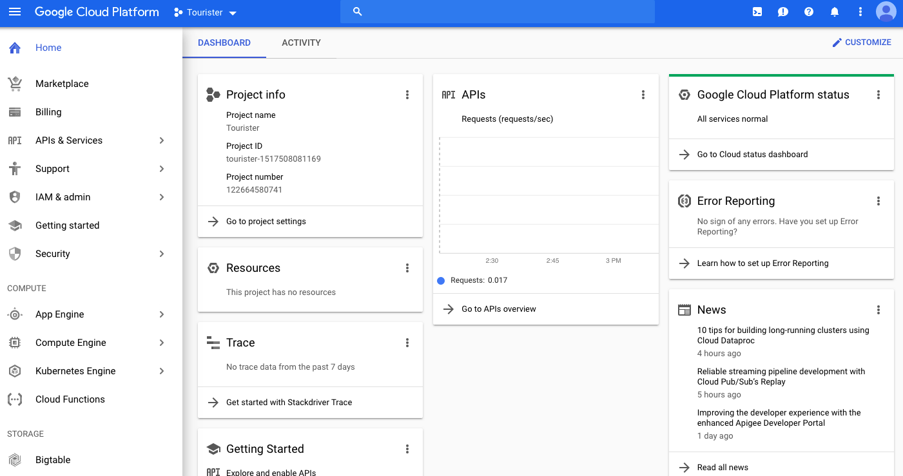{#fig:gcloud-dashboard}

## Cloud Computing Services and Products

### AI and Machine Learning

Google offers many machine learning and artificial intelligence tools, including tools for text-to-speech, speech-to-text, translation, and image and video analysis as well as various tools for making models and predictions and deploying pipelines and out-of-the-box algorithms @fig:gcloud-machine-learning.

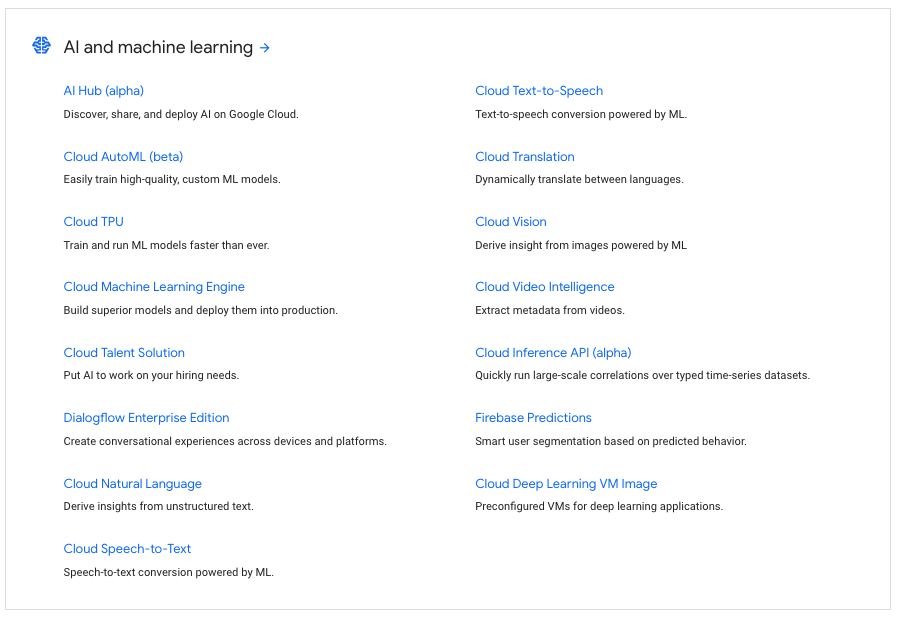{#fig:gcloud-machine-learning}

### API management

API tools include monetization and analytic tools as well as deployment tools. Apigee Edge integrates these tools together into a platform for managing APIs through the use of API proxies, which are combined together with a service plan into an API product @fig:gcloud-api-management. 

{#fig:gcloud-api-management}

### Compute

Google Cloud Compute services offer infrastructure as a service tools including virtual machines, containers, as well as an app engine for deploying web, mobile and IoT apps @fig:gcloud-compute.

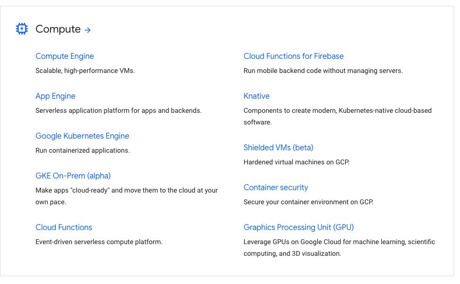{#fig:gcloud-compute}

### Data Analyics

Google Cloud's data analytics services include serverless data warehousing, tools for running Hadoop and Spark clusters, data preparation and processing, creating dashboards and reports, NoSQL databases, and a tool that lets you experiment with transforming, analyzing, modeling, and predicting data @fig:gcloud-analytics. 

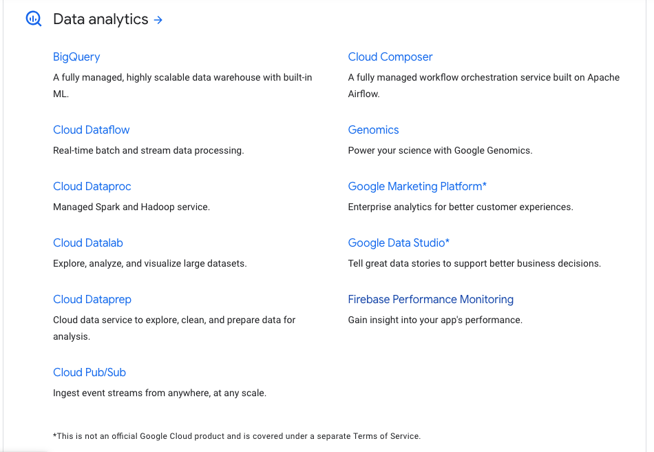{#fig:gcloud-analytics}

### Databases

Google offers a range of databases including NoSQL, managed file system storage, and VM and container storage @fig:gcloud-databases. 

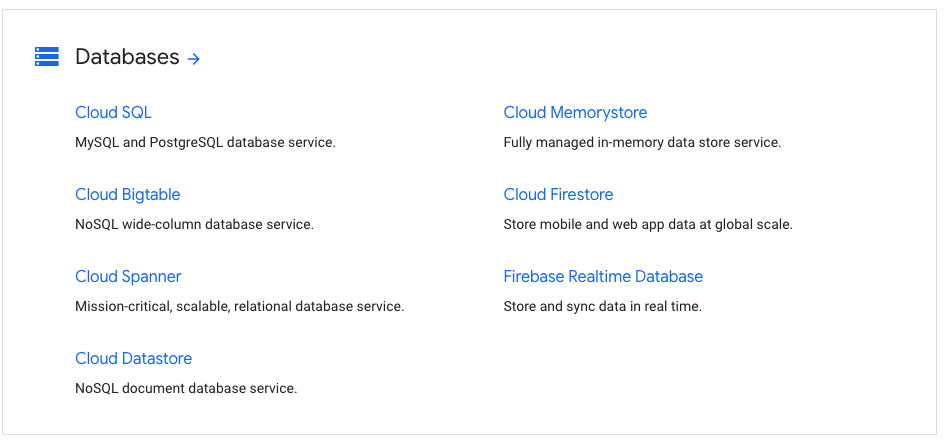{#fig:gcloud-databases}

A flow chart is even provided for helping determine the best service for your needs @fig:gcloud-dbflow. 

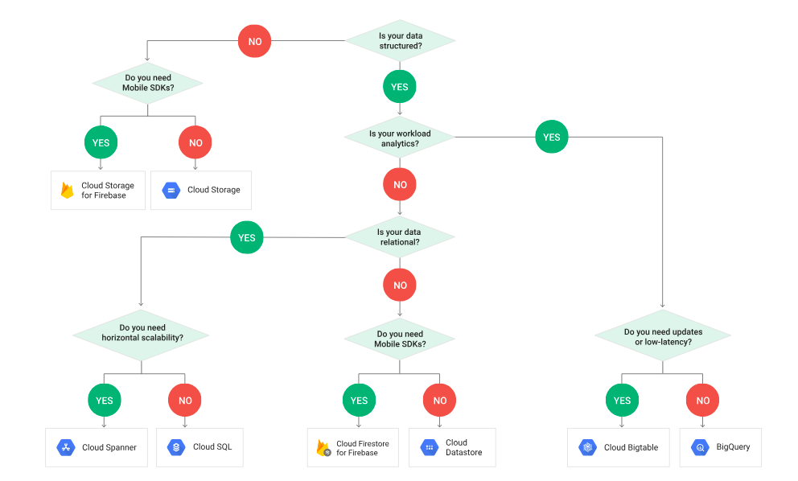{#fig:gcloud-dbflow}

### Developer Tools

Google's developer tools include tools for Visual Studio, IntelliJ, Google Cloud, and Powershell, cloud-hosted git repositories, a infrastructure for testing mobile apps, and a deployment management tool @fig:gcloud-devtools.

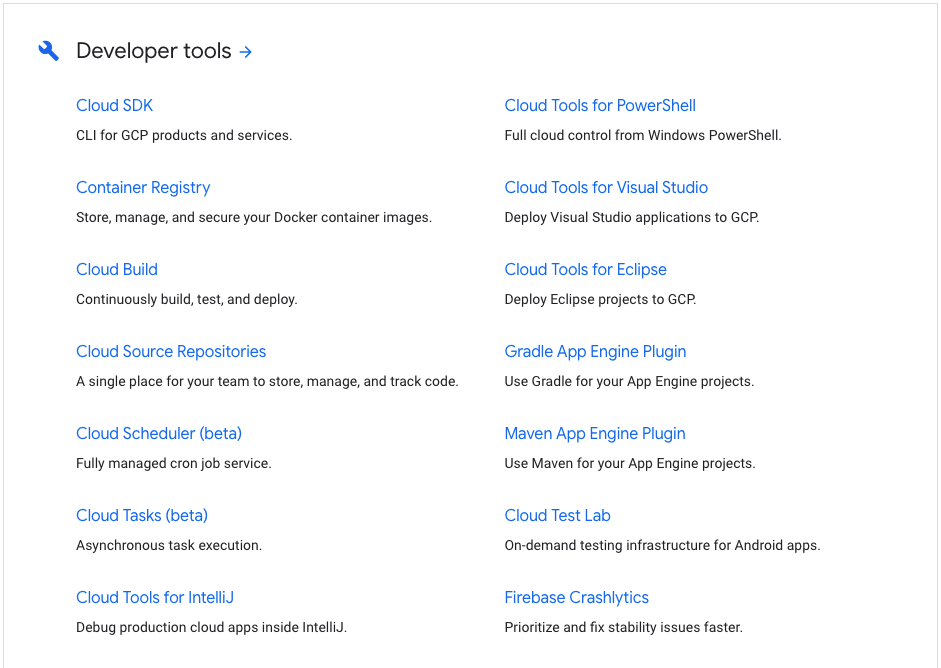{#fig:gcloud-devtools}

### Internet of Things

Google's internet of things offerings include a tool for device connection management and two tools for edge computing, one of which is in beta and the other is only accessible by request currently @fig:gcloud-iot.

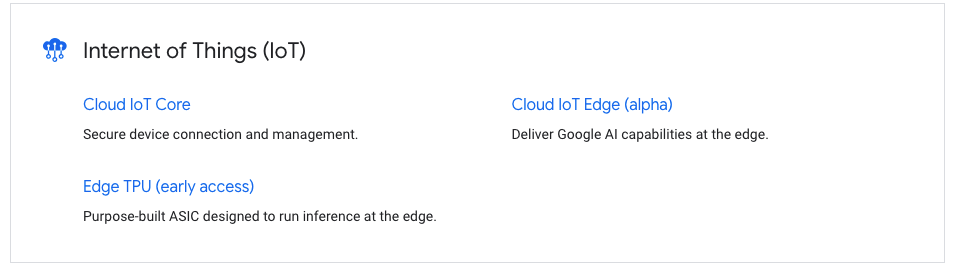{#fig:gcloud-iot}

### Management Tools

Management tools provide a variety of services for managing cloud applications. Google's Stackdriver has components for managing logs, monitoring exceptions, latency information, and overall health and also has a debugger component. Google also offers a web UI, a mobile app, and a command line interface for monitoring and managing cloud applications. Their cost management service includes components for monitoring and reporting, controlling spending and billing, and sizing recommendations for virtual machines @fig:gcloud-mgt.

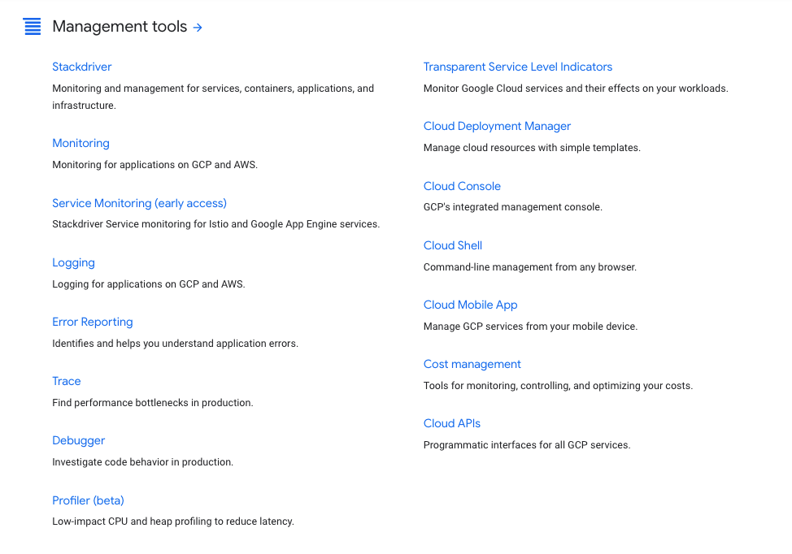{#fig:gcloud-mgt}

### Media and Migration

Google currently offers two media tools, Anvato for live-streaming videos, and Zync Render for rendering videos. Their migration tools are geared towards transferring data or applications fully or partially to the cloud. @fig:gcloud-media-migration.

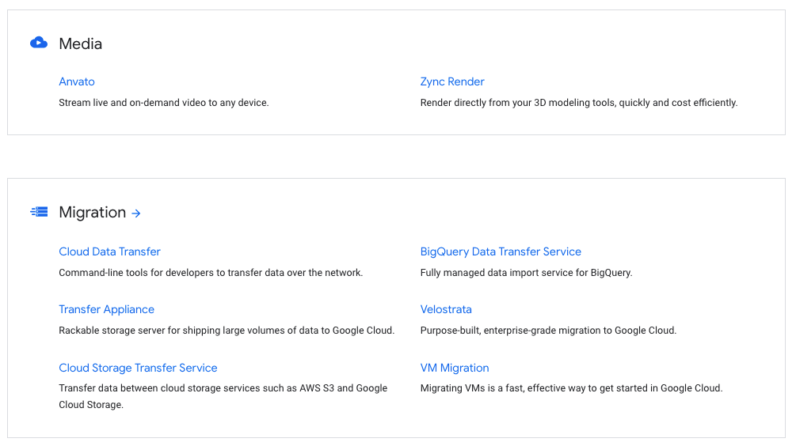{#fig:gcloud-media-migration}

### Networking

The Google Virtual Private Cloud Network is Google's own world-wide network where you can host your applications and services. Google also has load balancing, DNS, CDN, and connectivity tools for working with this network @fig:gcloud-networking.

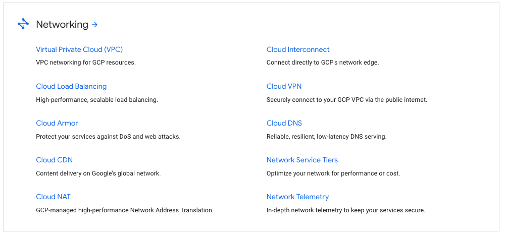{#fig:gcloud-networking}

### Security

Google's security offerings are aimed at protection from phishing, ransomware, and DoS attacks, controlling the transfer of data, controlling access to applications and resources, and monitoring and controlling vulnerabilities and incidents @fig:gcloud-security.

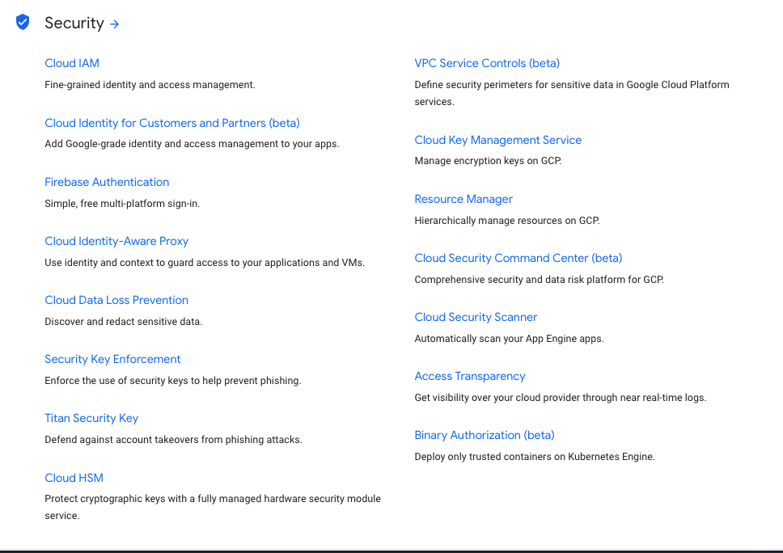{#fig:gcloud-security}

### Storage

Google's storage services include all the services mentioned in its database services as well as Persistent Disk, which offers block service for virtual machines and containers @fig:gcloud-storage.

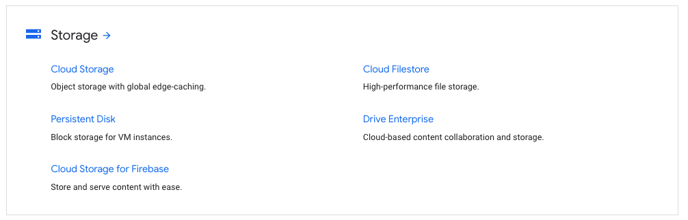{#fig:gcloud-storage}
