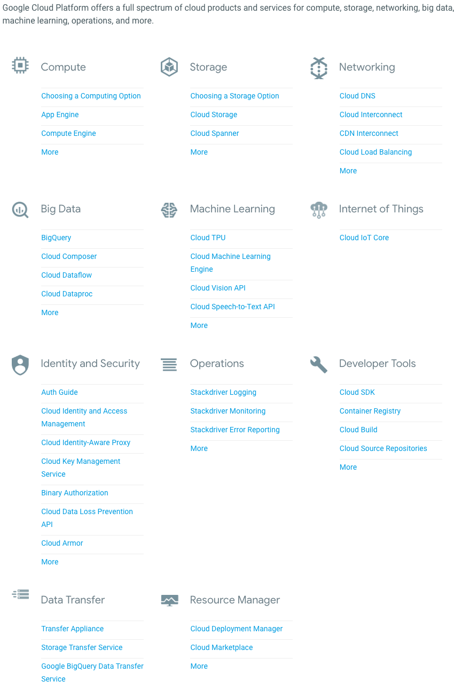

# Google IaaS Cloud Services :o: :question:

Google Cloud, offered by Google, is a suite of cloud computing
services that runs on the same infrastructure that Google uses
internally for its end-user products, such as Google Search and
YouTube. Alongside a set of management tools, it provides a series of
modular cloud services including computing, data storage, data
analytics and machine learning. Registration requires a credit card or
bank account details.

Google Cloud Platform provides Infrastructure as a Service, Platform
as a Service, and Server-less Computing environments.

Google Cloud Platform is a part of Google Cloud, which includes the
Google Cloud Platform public cloud infrastructure, as well as G Suite,
enterprise versions of Android and Chrome OS, and application
programming interfaces (APIs) for machine learning and Google Maps. See @fig:gcloud-services

## Cloud Computing Services and Products

{#fig:gcloud-services}
