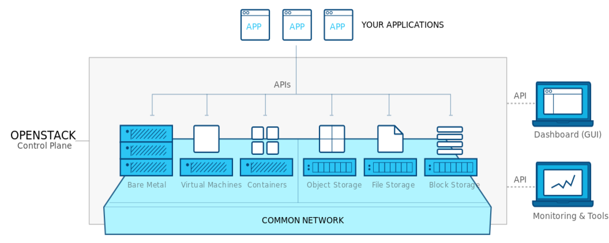

# OpenStack

## Introduction

OpenStack can be described as a cloud operating system. OpenStack can
be used on private or public clouds to manage large amounts of compute,
storage and network resources. OpenStack is built up using a large
number or small software components, which will be described in more 
detail in the next couple of sections. Another important aspect of 
OpenStack is that it is completely OpenSource, which means that
anyone can access and use the product without having to pay any licensing
or any other fee. And since the source code is publicly available
under the Apache-2.0 License developers can modify and use OpenStack as
needed. 

OpenStack is managed and maintained by the "The OpenStack Foundation",
which is an non-profit organization which organizers the development of
OpenStack and keeps the OpenStack community running. 

## OpenStack Architecture

OpenStack consists of a large number of small components. Which
components to use for your OpenStack deployment depends on your usecases
and requirements. The existing components can be integrated to 
achieve the desired deployment by carefully examining and understanding
each component. +@fig:opsnstack-overview shows an high-level architecture
diagram of OpenStack which gives a clear understanding of how the
overall framework is organized.

{#fig:opsnstack-overview}
Image reference - <https://www.openstack.org/software/>

However each of the high-level components are in constructed using
several small components. +@fig:openstack-arch shows one such popular 
deployment and its architecture. 

{#fig:openstack-arch}
Image reference - <https://docs.openstack.org/arch-design/design.html>

## Components

The components in OpenStack can be divided into several sub-groups. And
each group has several components which specialize in various tasks. The
following list shows all the major component groups and components that
are listed under each group. The list is referenced from the OpenStack
documentation - [OpenStack Service List](https://www.openstack.org/software/project-navigator/openstack-components#openstack-services)

#### Compute

 * NOVA - Compute Service
 * ZUN - Containers Service
 * QINLING - Functions Service

#### Bare Metal

 * IRONIC - Bare Metal Provisioning Service
 * CYBORG - Accelerators resource management

#### Storage

 * SWIFT - Object store
 * CINDER - Block Storage
 * MANILA - Shared filesystems
 
#### Networking

 * NEUTRON - Networking
 * OCTAVIA - Load balancer
 * DESIGNATE - DNS service
 
#### Shared Services

 * KEYSTONE - Identity service
 * GLANCE - Image service
 * BARBICAN - Key management
 * KARBOR - Application Data Protection as a Service
 * SEARCHLIGHT - Indexing and Search
 
#### Orchestration

 * HEAT - Orchestration
 * SENLIN - Clustering service
 * MISTRAL - Workflow service
 * ZAQAR - Messaging Service
 * BLAZAR - Resource reservation service
 * AODH - Alarming Service

#### Workload Provisioning

 * MAGNUM - Container Orchestration Engine Provisioning
 * SAHARA - Big Data Processing Framework Provisioning
 * TROVE - Database as a Service

#### Application Lifecycle

 * MASAKARI - Instances High Availability Service
 * MURANO - Application Catalog
 * SOLUM - Software Development Lifecycle Automation
 * FREEZER - Backup, Restore, and Disaster Recovery

#### API Proxies

 * EC2API - EC2 API proxy

#### Web Frontend

 * HORIZON - Dashboard
 
 
 The list above is just for open stack services, additionally there are
 several other major component groups such as Operational Services, 
 Add-Ons to Services and Bridges for Adjacent Tech listed in the 
 services page at - [OpenStack Services](https://www.openstack.org/software/project-navigator/openstack-components#openstack-services).
 
 Among all the service components that are available for OpenStack,
 there are 9 services that are considered to be "Core" services, these
 services are essential to any OpenStack deployment.
 
####  Nova - Compute
 
Nova is provides services to manage virtual machines in cloud 
environments. It is also capble of handing other compute resources such
as containers and is highly scalable. 

#### Glance - Image Services

Glance adds image services capabilities to OpenStack, this allows open
stack users to manage virtual machine images and provides services such 
as image registration and discovery.

#### Swift - Object Storage

Swift allows developers refer to files and other data similar to object
references. All actual storage and management is handled by Swift
so the developers do not need to worry about were to store data and files

#### Cinder - Block Storage

Cinder provides block storage management capabilities to OpenStack,
Cinder supports several block storage devices underneath and provides an
unified API so that developers do not need to worry or think about what
device is been used underneath. 

#### Neutron - Networking

Neutron provides networking capabilities to OpenStack. It allows the
creation and management of various networks that are used as the
communication medium for OpenStack deployments. Neutron supports 
multi-tenancy and scale to large deployments with ease. Extension 
frameworks for Neutron allow users to deploy more advance network
features such as VPN's, firewalls, load-balancer, etc. 

#### Horizon - Dashboard

Horizon is the graphical user interface(GUI) for OpenStack, which 
developers can use to manage and monitor their OpenStack deployment.

#### Keystone - Identity Service

Keystone is the identity management services in OpenStack, it keeps a 
list of users and maps all the access rights for each user for all the
cloud services that are available in the OpenStack deployment. Keystone
supports several authentication mechanisms such as classical user name
password based authentication and token based systems

#### Ceilometer - Telemetry

Ceilometer provides developers with billing and usage services that
allow developers to bill end users based on each individuals usage
amounts. It also records and saves usage values of the cloud for each
user so that anything that needs verification can be done.

##### Heat - Orchestration

Heat is the orchestration component of OpenStack. It allows developers
to use a requirement files that define the resources requirements for 
cloud application, which can later be referenced when needed.

## Access from Python and Scripts

### Libcloud

"Libcloud is a Python library for interacting with many of the popular
cloud service providers using a unified API. It was created to make it
easy for developers to build products that work between any of the
services that it supports." A more detailed description on Libcloud and
how you can use it to connect with OpenStack is provided in the Section 
[Python libcloud](#python-libcloud).

### DevStack
 
 DevStack is a set of scripts that can be used by developers to manage
 and maintain their OpenStack development. This was developed to 
 increase the ease of use for developers. It is very useful to 
 setup a developer environment where you can test your deployment. More
 detailed information regarding DevStack can be found in their official
 documentaion - [DevStack documentation](https://docs.openstack.org/devstack/latest/)
 
 