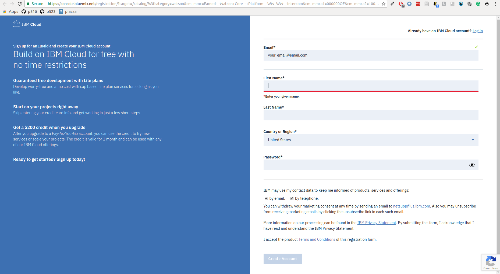
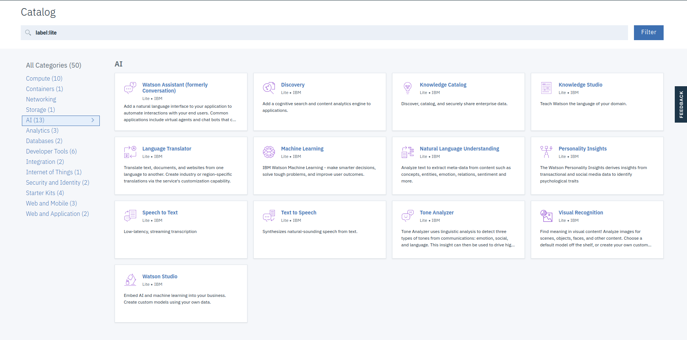

## IBM Watson

### Introduction

[IBM Watson](https://www.ibm.com/watson/index.html) is a machine learning platform that provides machine learning services to user in the cloud.
The IBM Watson library provides many machine learning services from image processing to natural language processing.
This section will guide through the processes of creating an IBM Watson account and explain the free tier 
details so that you can leverage the tools and products available in AWS for your work and research.

### Creating an account

* A valid email address

First you need to visit the [IBM Watson home page](https://www.ibm.com/watson/index.html) and click in the "Get Started Free" link on the top right corner.
You will then be asked to provide some basic details including your email address as shown in the image below

Once you have submited the signup form an confirmation email will be sent to your email account, check your inbox and click on the confirm account link in the email you receive.
This will activate your IBM Watson account. Once you have accepted the terms and conditions you will be taken to the product and service catalog of IBM Watson as shown in the image below.

### Understanding the free tier

IBM watson provides a set of services for free with their Lite account. Since you did not provide any credit/debit card information when creating the account, by default you will
have a Lite account. The lite plan does apply usage caps for services offered under the plan. If you need to expand and remove such limits you would have to upgrade to a payed account
However the free quotas are typically more than sufficient for testing and learning purposes. For example under the Lite plan you can use the "Watson Assistant" service with caps such as 10K API
calls per month. 
