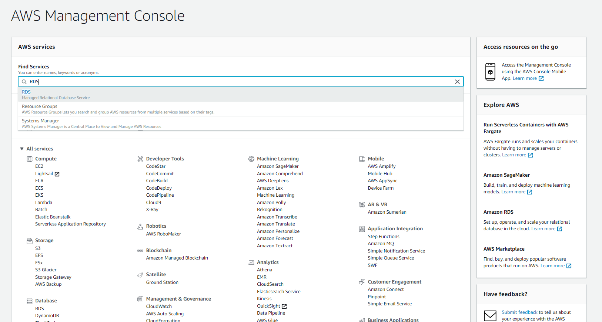

# Amazon Aurora DB {#s-Amazon-aurora-db}

---

**:mortar_board: Learning Objectives**

* Learn about AWS Aurora DB
* Features and Benefits
* Pricing
* How to provision Aurora database

---

Amazon Aurora is an on-cloud relational database offering from AWS 
that aims to offer the performance and reliability of traditional 
enterprise databases combined with cost-effectiveness of open source 
databases.

Aurora comes as an SaaS offering in RDS suite offered by Amazon.

## Amazon Aurora Features and Benefits

### Compatible Databases

Currently, Aurora is compatible with MySQL and PostGreSQL Databases.
It provides a wrapper to provision these open source databases and manage
them for high availaibility.
This allows users to provision these open source databases through Amazon 
and still use existing code, tools and drivers with little change. 

### High Performance

Aurora offers upto 5 times the throughput of a standard MySQL database 
and 3 times throughput of standard PostGreSQL. All this is offered at a
price point which 1/10th of a commerical database.

### Scalability

Aurora allows users to scale up and down the databases to smaller or larger 
sized servers based on the dynamic business needs to match the required
compute power.
There is also a serverless offering where AWS to manages the scaling of 
compute requirements.
Aurora also adds additional storage as needed upto 64TB per instance as 
the data grows.

### High Availability and Durability

Aurora DB offers multi AZ option to make the data replicated across more 
than one availability zone making the resilient to failures. 
Data can be backuped to Amazon S3 to enable point in time recovery in case
of errors.

### High Performance through Read Replicas

Aurora DB offers to create upto 15 low latency Read Reaplica nodes for a 
database which allows for high performance. One can have writer node to 
write data into the database and use the Read Replica nodes ofr query data. 

### Fully Managed

Aurora comes as part of RDS suite where Amazon manages the database 
management actvities like hardware provisioning, set up and configuration,
software patching, database backups and performance monitoring.

### Security

Aurora allows to secure the data at rest and and in transit by using keys
through Key Management Service. Databases can also be made part of VPC 
and secured using private subnets and security groups. 
Database encryption can be enabled at the time of database creation which
means that the data, backups, snapshots and replicas is also encrypted.

### Parallel Query for Analytical Queries

This feature allows users to run analytical queries on the database without 
the need to copy the data into another system to not impact the system performance.
Aurora offloads the query to the CPU nodes in its storage layer allowing 
transactional and analytical loads alongside each other.

### Performance Monitoring

Aurora provides Performance Insight as a database performance tuning and
monitoring feature that can be enabled on the database for additional cost.
It allows to visualize the loads to identify performance issues. 

### Support for Migration

Amazon provides tools for migrating existing MySQL and PostgreSQL to Aurora.
AWS Database Migration Service is provided as a service to migrate from commerical
databases into Aurora.

## Amazon Aurora Pricing

Amazon Aurora pricing is determined by various factors:
* Type and Size of database instance
* Storage and IO
* Backup Storage
* Data Transfer

For detailed pricing refer AWS Aurora Pricing documentation  
[AWS Aurora Pricing](https://aws.amazon.com/rds/aurora/pricing/).

## How to provision Aurora database

Assumption : User must have an AWS account.

### Step 1 : Login to the AWS console.
Select RDS from the Database section or alternatively, you can type 
RDS in the search bar to look up. (see @fig:aws-aurora-console)

{#fig:aws-aurora-console}

### Step 2 : Click on Create Database
On the RDS home page, one can either click on the 
"Create Database" button in the Amazon Aurora section directly or 
clcik on the "Create Database" button in the Create Database section
(see @fig:aws-aurora-rdshome)

{#fig:aws-aurora-rdshome}

### Step 3 : Select Amazon Aurora Engine

Create Database section lists all RDS database flavours
available.
Choose Amazon Aurora database on the list.
After choosing Amazon Aurora, AWS will display list of available editions
within MySQL and PostgreSQL engines.
At the time of writing this page, MySQL 5.6-compatible is comes with
Serverless and Parallel Query capabilities, hence we will go with this option.
(see @fig:aws-aurora-MySQL)

{#fig:aws-aurora-MySQL}

### Step 4 : Aurora Configuration and Settings

Once we select the engine, next step is to select the Configuration
and Setting.(see @fig:aws-aurora-config)

{#fig:aws-aurora-config}

#### Configuration

Capacity Type: This attribute allows us to select between Provisioned,
Provisioned (with Parallel Query Feature) and Serverless offerings. We will
go with provisioned option in this example.

DB Instance Class: This attribute allows to select the type of instance based
on the need like small, medium or large. It defines the number of CPUs and RAM
available to the DB server.

Multi AZ - Deployment: Selecting this option means that Aurora will create a
Read Replica in the a different availability zone. This can be used as a reader
node for faster read performance and as a standy by in case the primary DB server
becomes unaavailable due to some issue.

#### Settings

DB Instance Identifier : This will be a unique name that will be used for the
writer DB node.

Master UserName and Password : These attribute define the master user and password
for the DB that can be used to manage the database once created.

#### Step 5 : Configure Advance Settings - Network and Security

This page will help configure some additional settings for the database. We will
cover them in the next few steps.(see @fig:aws-aurora-advconfig-1)

{#fig:aws-aurora-advconfig-1}

##### Network and Security

Virtual Private Cloud (VPC) : This attribute defines the virtual data center under 
which we want to create the database. Typically an organisation will create its own
VPC under which it will deploy its database and application servers. In this example 
we will proceed with the default VPC from AWS.

Subnet Groups : Subnets define the IP ranges to be used the DB.
There can be broadly 2 types of subnets that can be created - private 
and public. Private subnets cannot be accessed from outside the organization
network. Public subnets on the other hand have internet connectvity and can be 
accessed from out side the organization network.

Availaiblity zone : Having the servers across multiple availability zones with a region
help prevent against localized issues and failures. AWS allows to select a preference for 
an availabiblity zone within the region. We dont have a specific preference for this example.

#### Step 6 : Configure Advance Settings - Database Options

This section will help define the database cluster, database name, port and 
parameter groups.(see @fig:aws-aurora-advconfig-2)

{#fig:aws-aurora-advconfig-2}

#### Step 7 : Configure Advance Settings - Encryption and Failover

(see @fig:aws-aurora-advconfig-3)

{#fig:aws-aurora-advconfig-3}

Enryption : Encryption on the database can be enabled only at the time of 
DB creation.Once enabled the database, associated replicas and snapshots are all 
encrypted. One can either use the default KMS encryption keys provided by AWS or 
use their own encrption keys.

Failure Over : This defines the the failure over priority order with which a read 
replica can be promoted as the primary node incase of a failure on the current writer. 
