# Amazon Elastic Beanstalk

---

**:mortar_board: Learning Objectives**

* Learn about AWS Elastic Beanstalk
* Benefits
* Pricing
* How to provision a Elastic Beanstalk Environment for Quick Start
* Explore Elastic Beanstalk Features

---

Amazon Elastic Beanstalk is an PaaS offering from AWS 
that aims to offer be a one stop solution for fast deployment of
scalable web-applications.

Elastic Beanstalk has been developeed with an idea of allowing developers to focus on 
code developement instead of the environment set up. All the developers need to 
provide is a working code, beanstalk takes care of providing the platform to run it.

A Variety of Platforms are supported

* Java
* Python
* Node JS
* .NET
* PHP
* Ruby
* Go
* Docker

Features of Elastic Beanstock include

:o: change to bullet list with headings italic

### High Performance

Elastic Beanstalk allows freedom to provision servers from a variety of EC2 
configurations based on business to suit the compute requirements.

### Scalability

Easy configurable auto scaling settings are available to handle peak loads based on 
metrics monitoring.

### High Availability

Elastic Beanstalk provides easy health check based load balancing options to ensure 
high avialability of the web application.

### Complete source control

The user has freedom to select the AWS resources and has full control over the 
infrastructure powering the application using the Elastic Beanstalk management
capabilities.

### Fully Managed

With Elastic Beanstalk, AWS manages actvities like hardware provisioning, set up and 
configuration, software patching, database backups and performance monitoring.

## Amazon Elastic Beanstalk Pricing

Amazon Elastic Beanstalk has no additional charges of its own. You pay for the 
resources and services provisioned by the beanstalk environment.
These are typically:
* EC2 instances
* S3 Storage
* Elastic Load Balancer
* Database

## How to provision a Amazon Elastic Beanstalk Environment for Quick Start

:o: remove this section 

:o: there is no space before :

:o: Assumption : is not a full sentence use `select` instead of double quotes so they ar everbatim

:o: (see ...) is an incomplete sentence and does not have a period. Review grammar rulkes on setting periods e.g. it needs to be inside the sendtence and the period needs to be behind .

:o: you shoudl have looked at the modifications i made to your other text

:o: All figures must be refered to 

This section will help with steps to be followed to create a Highly Availble, Load 
Balanced sample application on Elastic Beanstalk in a few quick Steps.

Assumption : User must have an AWS account.

### Step 1 : Login to the AWS console.

Console URL : [AWS Console URL](https://aws.amazon.com/console/).
On successfull login, select Elastic Beanstalk from the Compute section or 
alternatively, you can type Beanstalk in the search bar to look up. 
(see @fig:aws-beanstalk-console)

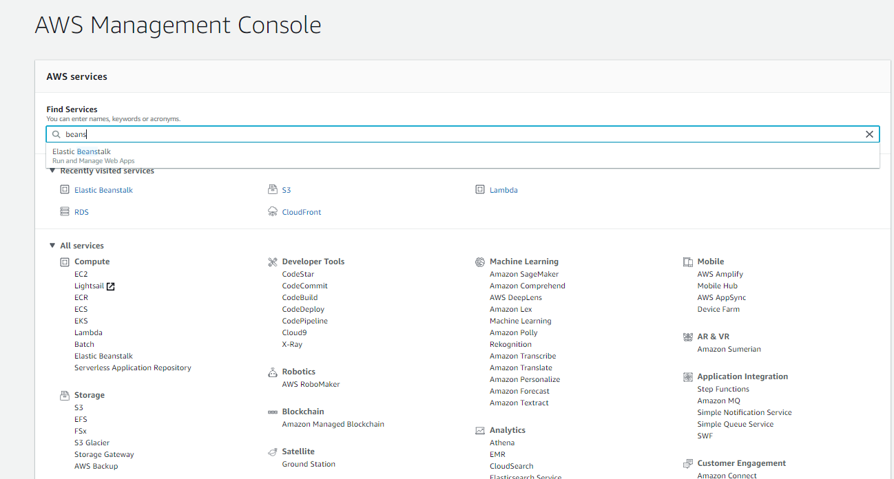{#fig:aws-beanstalk-console}

### Step 2 : Click on Create New Application

On the Beanstlak home page, one can either click on the 
"Create New Application" button at the top right corner or 
click on the "Get Started" button in the screen center.
(see @fig:aws-beanstalk-home)

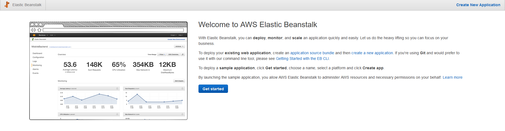{#fig:aws-beanstalk-home}

### Step 3 : Select Base Configuration

Provide a suitable name for your application. (see @fig:aws-beanstalk-baseconfig)
In the Base Configuration section, select the type of platform you wish provision for 
you code to be executed. There are several option available like Java, Python, Ruby, 
Go, .NET, PHP, Node JS, Docker and Tomcat. (see @fig:aws-beanstalk-baseoption)
For this example we will go with Tomcat.

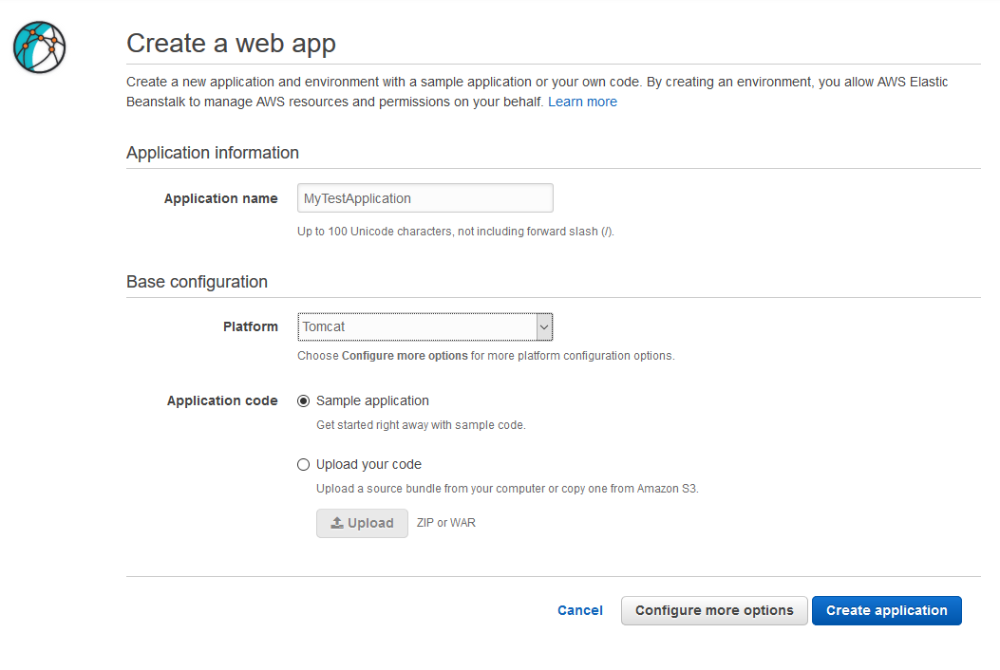{#fig:aws-beanstalk-baseconfig}

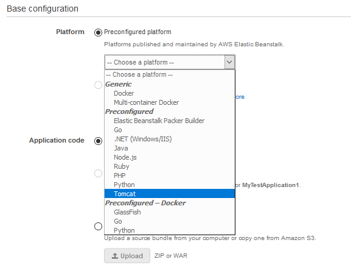{#fig:aws-beanstalk-baseoption}

### Step 4 : Click on Configure More Options

Do not click on Create Application button in the previous step in case you wish to create 
your application in a particular VPC. This is will be a requirement for most organizations
since they would like the application to be created in their own VPCs on cloud so that 
they can restrict the access to the application and also allow the application to connect 
with other resources on their cloud like databases.
If you go ahead and click on Create Application button, the application will be created \
in default AWS VPC.
Once an application is created, the VPC on it cannot be updated.

To be able to launch the application in the VPC of your choice, click on
"Configure More Options" button.

### Step 5 : Select High Availability as Config Preset

Once you click on "Configure More Options" button, AWS will take you to Advance
Configuration page.
Select High Availaibility option as configuration present. This will allow you provision a 
load balancer for your application.
If this option is not selected, the application is launched as low cost and no load 
balancer can be mapped to it.
(see @fig:aws-beanstalk-configpreset)

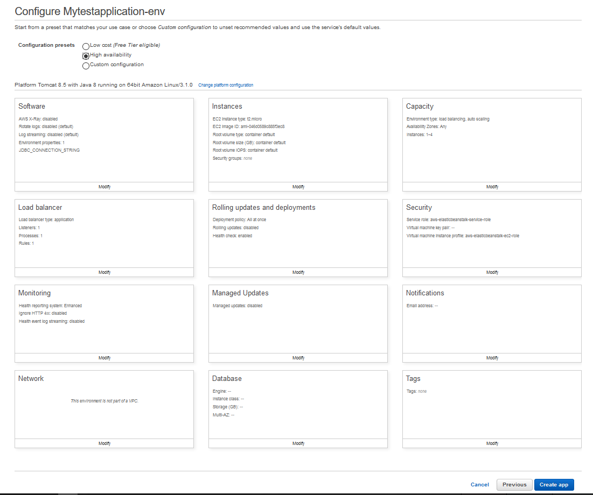{#fig:aws-beanstalk-configpreset}

### Step 6 : Map VPC

Click on the Network section on the Advance Configuration page. 
(see @fig:aws-beanstalk-configpreset)
This will open the another page which will allow to select the VPC under which we 
want the application to be launched. This step cannot be reversed so pay special 
attention to the VPC that is selected here. For this example, we will continue with the
default VPC. (see @fig:aws-beanstalk-network)

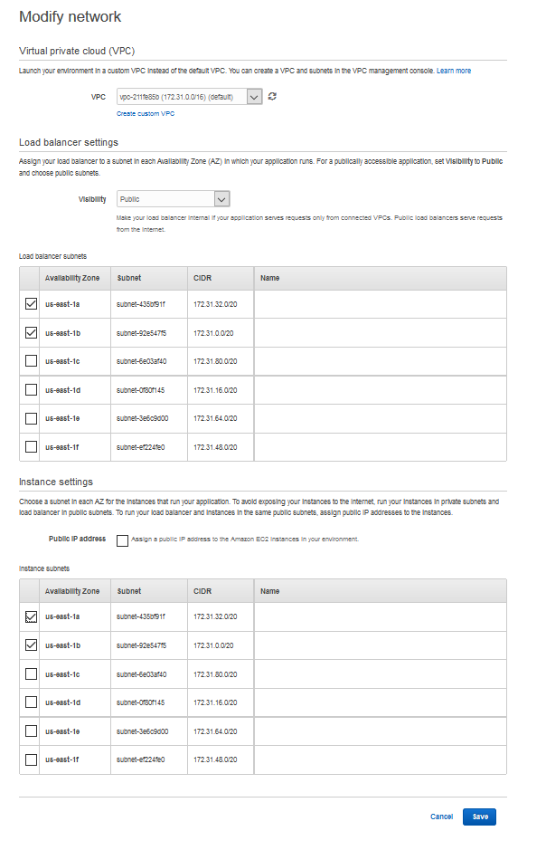{#fig:aws-beanstalk-network}

Other options on that can be configured in this section are explained next.

#### Load Balancer settings

Select visibility as public in case you want your application to be accessible from other 
VPCs or over internet.

This section also allows you to select the subnet to be used for the load balancer 
across availability zones.

These settings can be modified after the application launch as well.

#### Instance settings

You can assign public IP address to your EC2 instances from this section.
Howver this action is discourage and the application should be accesible only the load 
balancers.

This section also allows you to select the subnet to be used for the application servers
across availability zones.

These settings can be modified after the application launch as well.

{#fig:aws-beanstalk-configpreset}

Once done, click on Save button. This action will save the settings and will take you 
back to the Advance Configuration page. (see @fig:aws-beanstalk-configpreset)

### Step 7 : Launch Application

These settings done so far are sufficeint to create a High Availability Load Balanced 
application. Click on "Create App" button. (see @fig:aws-beanstalk-configpreset)

This will initiate the process of application creation. Once the process completes, the 
application health will be displayed with a green check and the application URL (which
points to the publlic load balancer) will be displayed in the top section.
(see @fig:aws-beanstalk-appready)

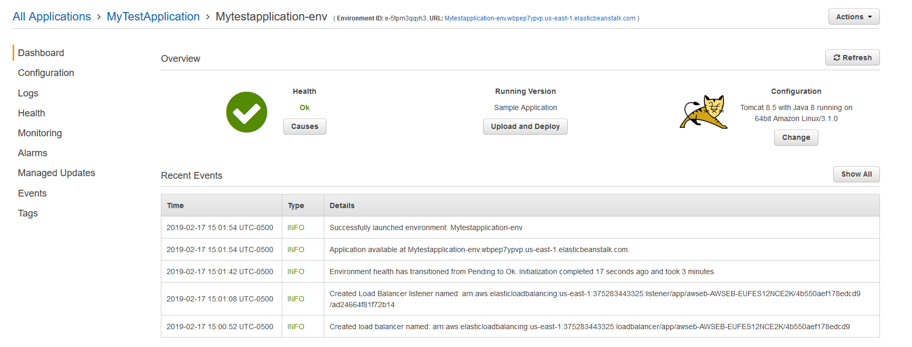{#fig:aws-beanstalk-appready}

### Step 8 : Verify application URL

Click on the URL gerenerated in the previous step. This will open the homepage of the 
sample application. (see @fig:aws-beanstalk-homepage)

{#fig:aws-beanstalk-homepage}

## Explore Amazon Elastic Beanstlalk Features

### Beanstalk Deployment

Beanstalk deployment is quick an easy. Lets deploy a sample springboot war to this
environment.
Go to the application dashboard. Click on Upload and Deploy button.
This will open a pop up that will allow to upload package and apply a version label.
Once can also select to deploy to all instances at once or batch wise. Click on deploy 
once ready.
(see @fig:aws-beanstalk-upload)

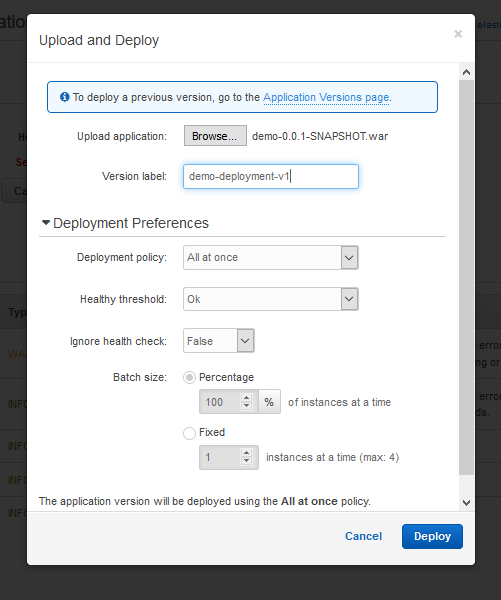{#fig:aws-beanstalk-upload}

Upon completion of the deployment, beanstalk will display success message in the 
recent events sections.
(see @fig:aws-beanstalk-deployed)

{#fig:aws-beanstalk-deployed}

The updated application can be validated by clicking the beanstalk URL.
(see @fig:aws-beanstalk-url)

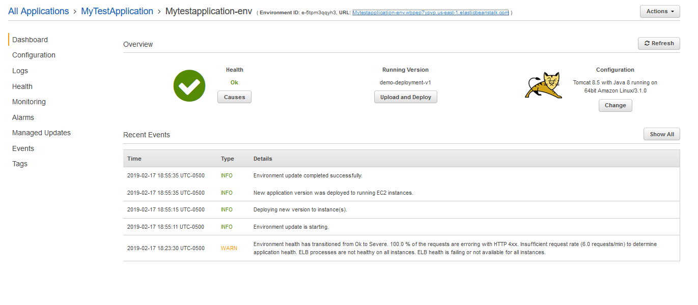{#fig:aws-beanstalk-url}

#### Tracking Deployments

All deployments can be tracked by clicking the "Application Versions page" on the 
upload pop up. (see @fig:aws-beanstalk-upload)

Once you click the link, a new page is opened which allows to :
* View and download all past packages deployed.
* Deploy a previous package again
* Manage the life cycle policy for backing up past deployments.
(see @fig:aws-beanstalk-deployments)

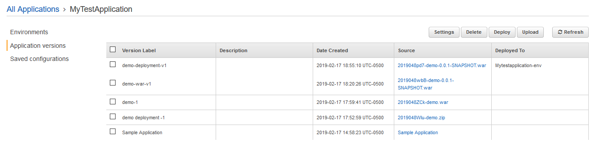{#fig:aws-beanstalk-deployments}

### Beanstalk Env management

The Action button on the application dashboard allows to perform the next set of actions on 
the application environment:
* Restart App servers
* Save the configuration for re-use
* Load a new configuration
* Clone the environment
* Rebuild the environment
* Teminate the environment

(see @fig:aws-beanstalk-manageenv)

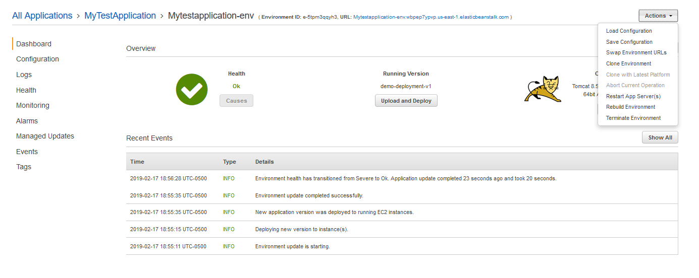
{#fig:aws-beanstalk-manageenv}

### Beanstalk Logs

The application logs can be accessed from the Logs link in the application dashboard.

(see @fig:aws-beanstalk-logs)

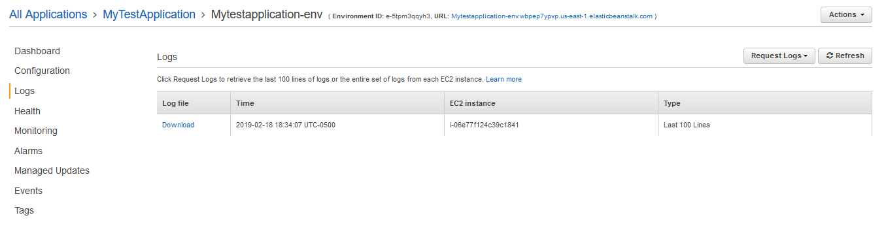{#fig:aws-beanstalk-logs}

### Beanstalk Instance Health

The Health link in the application dashboard takes to the heath monitoring screen and 
allows to view the health of all the EC2 server instances associated with the beanstalk
application.

Additionally, this screen gives option to reboot or termite the selected EC2 instances.

(see @fig:aws-beanstalk-health)

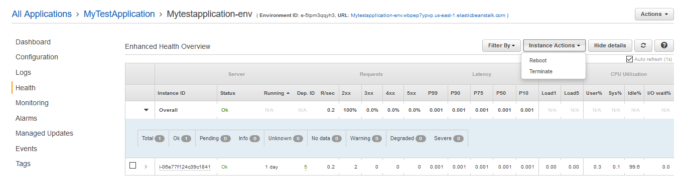{#fig:aws-beanstalk-health}

### Beanstalk Environment Monitoring and Alarms

The Monitoring link in the application dashboard takes to the environment monitoring 
screen which displays different types of graphs / metrics under different sections.
The duration and intervals for monitoring can be edited to adjust the granularity.
(see @fig:aws-beanstalk-monitor)

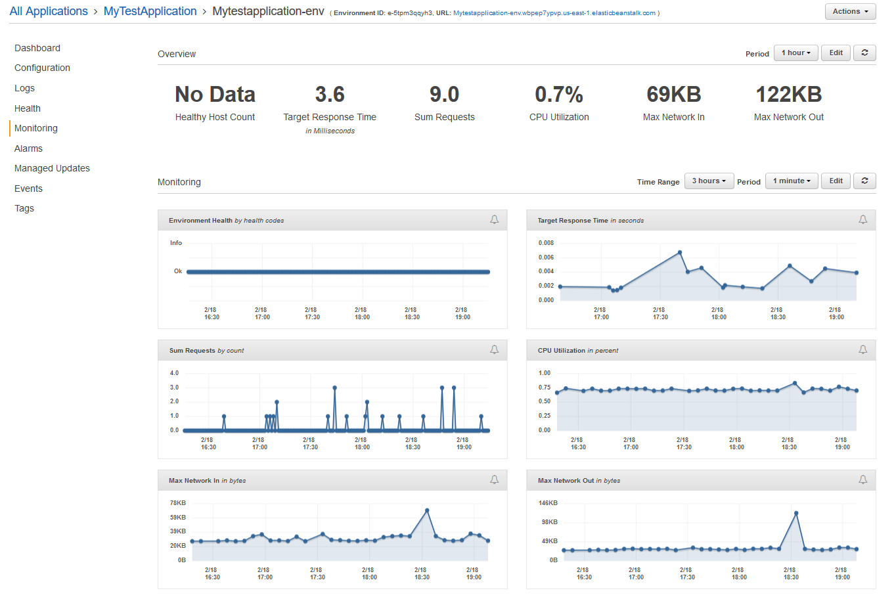{#fig:aws-beanstalk-monitor}

Each metric section also has a bell icon on the top right corner. Using this icon one 
can set alarms based on specific thresholds. Alarms can be integrated SNS topics for
notification or DynamoDB.

(see @fig:aws-beanstalk-alarm)

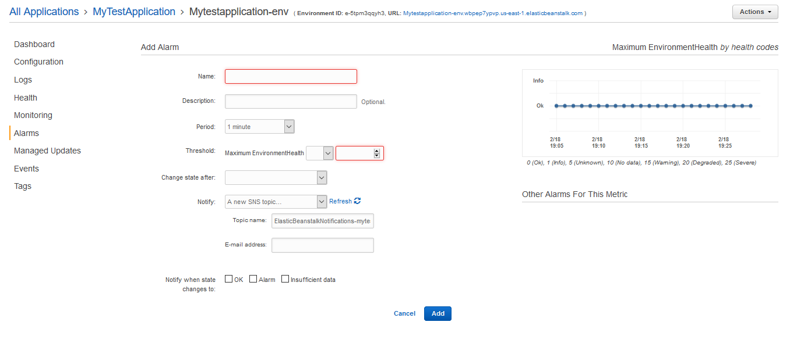{#fig:aws-beanstalk-alarm}

### Beanstalk Patching Logs

The Managed Updates link in the application dashboard allows to view the history of 
the patching activities performed on the environment by AWS.
(see @fig:aws-beanstalk-patchlog)

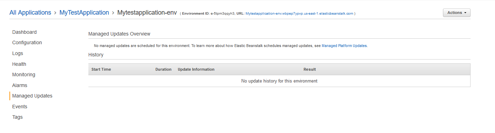{#fig:aws-beanstalk-patchlog}

### Beanstalk Event Logs

The Events link in the application dashboard allows to view the history of 
events occurred on the environment. These are typically from the configuring 
changes made, instances transitioning from one health status to another, or 
deployments made on the environment.
(see @fig:aws-beanstalk-eventlog)

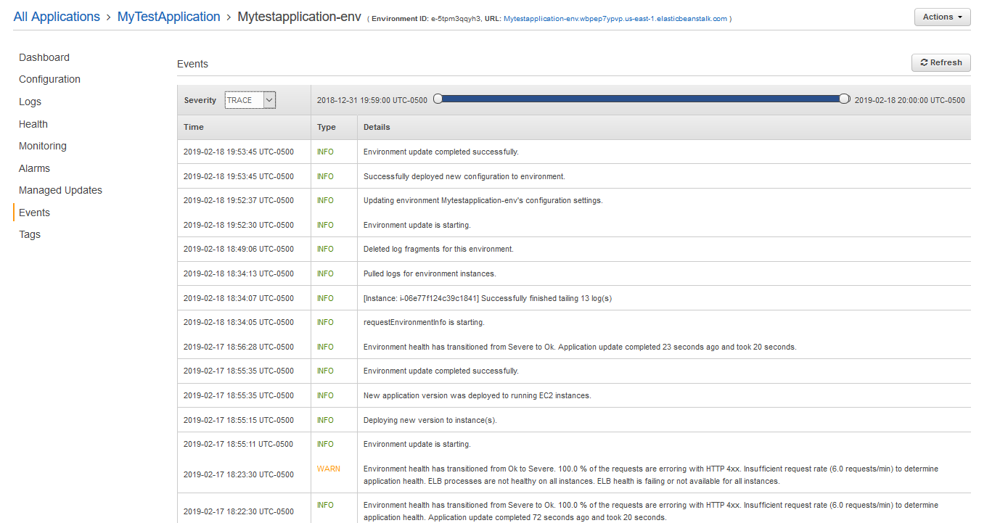{#fig:aws-beanstalk-eventlog}

### Beanstalk Tags

The Tags link in the application dashboard allows to view all the tags applied to the 
environment. Tags are key value pairs that help to identify the beanstalk resources 
for managment or pricing activities.
(see @fig:aws-beanstalk-tags)

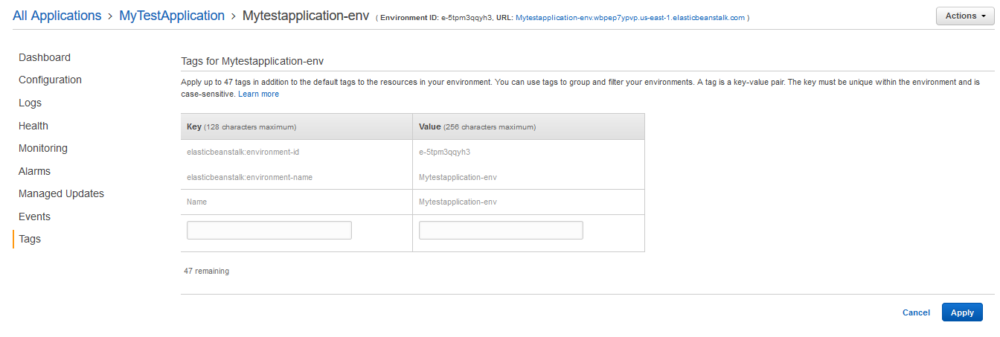{#fig:aws-beanstalk-tags}

### Beanstalk Configuration Management

The Configurations link the application dashboard allows to modify various 
configurations for the beanstalk application. These are grouped into different sections 
which are explained under the following pages.
(see @fig:aws-beanstalk-config)

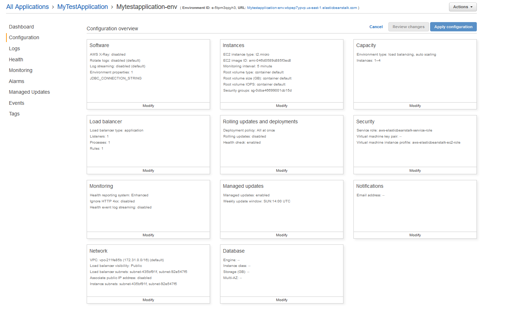{#fig:aws-beanstalk-config}

#### Software

##### Container Options

This section provides options to configure the container settings to host the 
application.
* Proxy Server - Apache, Nginx
* Gzip Compression
* Initial JVM Heap Size
* Max JVM Heap Size
* Max Perm Size

##### X Ray 

AWS X Ray is a service that can be enabled to trace an application request end to 
end through to the underlying components. This is extremely useful in helping debug
systems following distributed architecture.
This service however is not free and will incur additional charges.

##### S3 Log Storage 

This section allows to optionially rotate logs to Amazon S3. Again, S3 storage will incur
addtional charges.

##### Environment properties

The properties defined here are passed to the application as environment properties.
These are especially useful in maintaining variables like the Database connection string 
which would vary between the development, staging and production environment.

Maintaining these properties here allows migration of same code package between 
environments without any code changes.
(see @fig:aws-beanstalk-config-software)

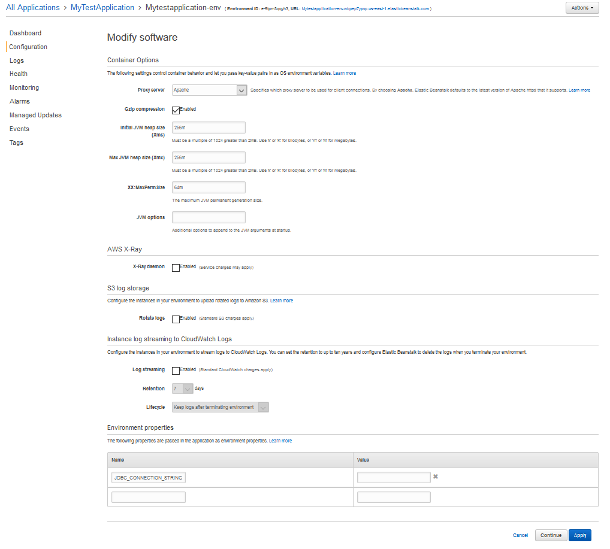{#fig:aws-beanstalk-config-software}

#### Intances

##### Instance Type

This section allows to update the EC2 server instance type to be used to host the 
application. EC2 instance come in various categories (t2, t3, m4, m5, c1, c2 etc) and
size (micro, small, medium, large etc) and can be selected based on the application 
needs and usage pattern.

##### Amazon CloudWatch monitoring

The cloudwatch monitoring period can be selected between 1 and 5 mins from this 
section. Smaller monitoring interval incur additional charges.

##### Root volume (boot device)

This section allows to choose the volume type (Magnetic, General Purpose SSD, 
Provisioned IOPS SSD), size and IOPS for the instances

##### Security Groups

This section allows to secuirty groups to the EC2 instances to restirct traffic ingress.
(see @fig:aws-beanstalk-config-intances)

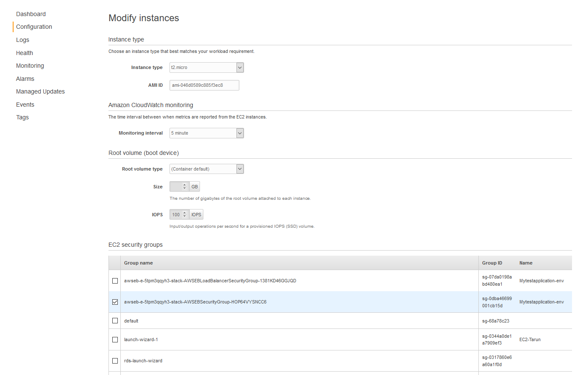{#fig:aws-beanstalk-config-intances}

#### Capacity

##### Auto Scaling Group

Auto Scaling Groups allow to define an auto scaling policy where in the beanstalk 
environment would toggle between min and max number of instances defined based 
on scaling triggers like 
* Network Out
* CPU Utilization
* Network In
* Disk IO
* Latency
* Healthy Host Count
* Unhealthy Host Count
* Response Time

Alternatively, auto scaling can be timed if we know the time period of peak load.
(see @fig:aws-beanstalk-config-capacity)

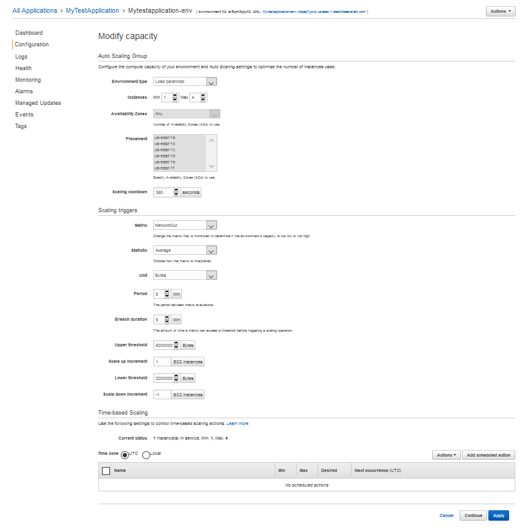{#fig:aws-beanstalk-config-capacity}

#### Load Balancer

This section allows to modify the following load balance configruations:
* Add remove http / https listeners
* Serve http / https services on one or more ports
* Health check paths

Opening application on https will require you to upload signed certificates.
(see @fig:aws-beanstalk-config-loadbalancer)

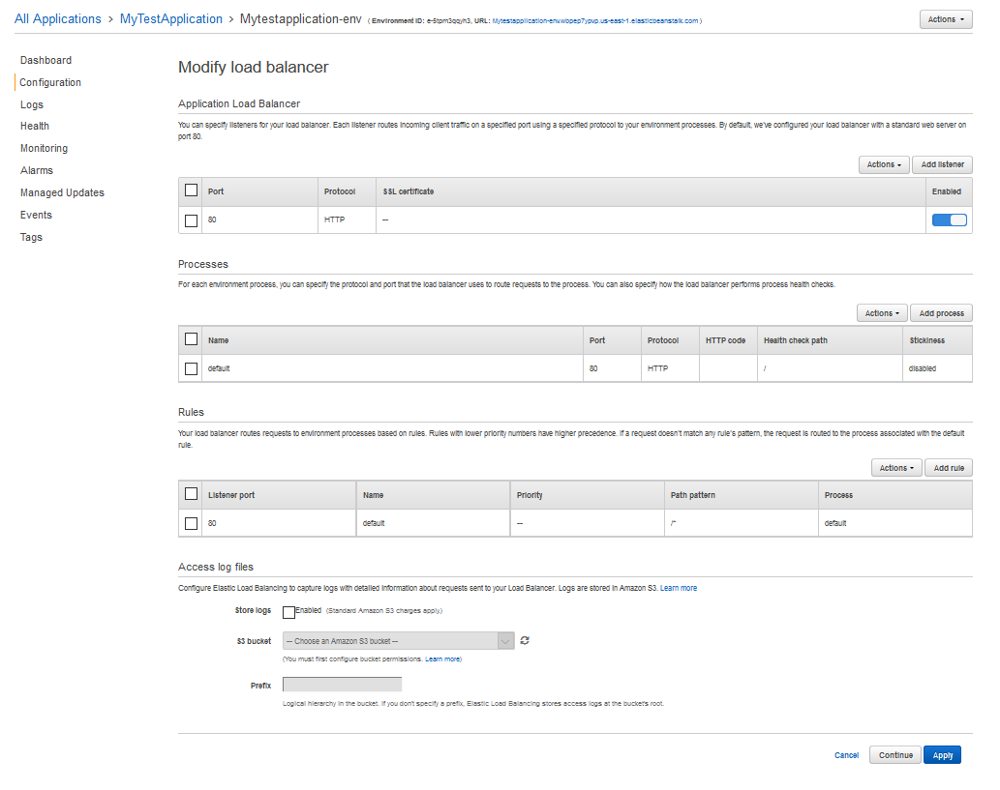{#fig:aws-beanstalk-config-loadbalancer}

#### Rolling updates and deployments

##### Application Deployments

This section allows to specify the if the deployments will be done on all instances at once
or one by one.

##### Configuration Updates

This section allows to specify the if the configuration changes on VMs will be done 
on all instances at once or one by one.

(see @fig:aws-beanstalk-config-updates)

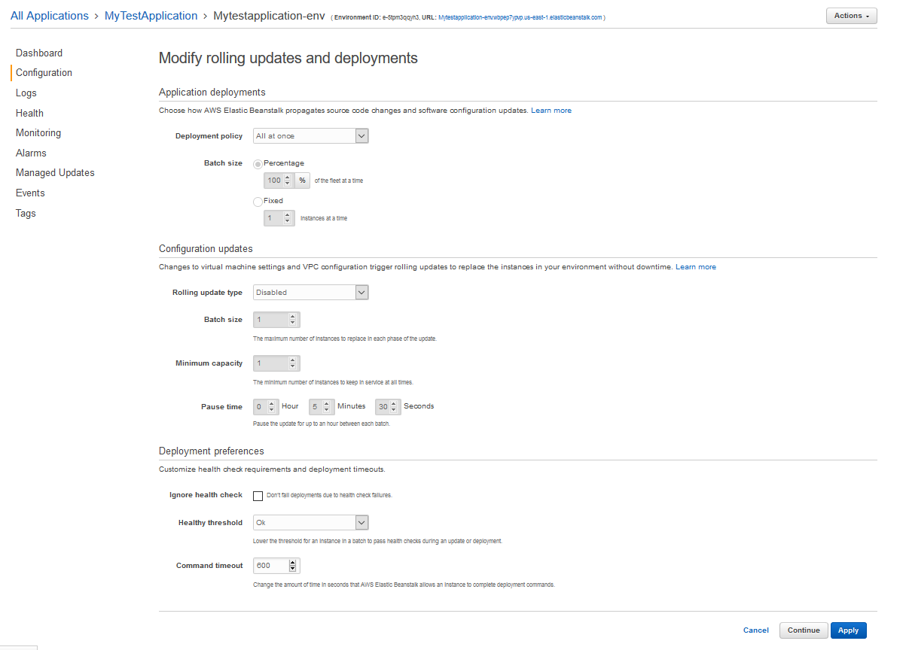{#fig:aws-beanstalk-config-updates}

#### Security

This section allows to map the the following list of attributes
* Service Role - AWS role that beanstalk will assume. This role specifies the 
permissions to beanstalk to provision resources like EC2.
* Instance Role - AWS role that the EC2 instances will assume. This role specifies the 
permissions to EC2 instances to access other AWS services.
* EC2 key pair - This selected key pair can be used to SSH into the EC2 instances if
needed.
(see @fig:aws-beanstalk-config-security)

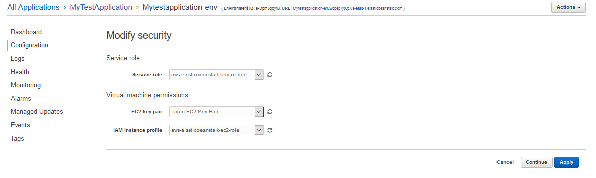{#fig:aws-beanstalk-config-security}

#### Monitoring

##### Health Reporting
This section allows to select between basic and enhanced monitoring options.
While enhanced monitoring incurs addtional charges, it allows to select custom metrics
to be reported to Cloud Watch.

##### Health monitoring rule customization
This section currently allows to ignore http 4XX errors for monitoring health checks.

(see @fig:aws-beanstalk-config-monitoring)

{#fig:aws-beanstalk-config-monitoring}

#### Managed Updates

This section allows to manage the automatic updates to the platform and specify the 
time period / slot for updates.
(see @fig:aws-beanstalk-config-updates)

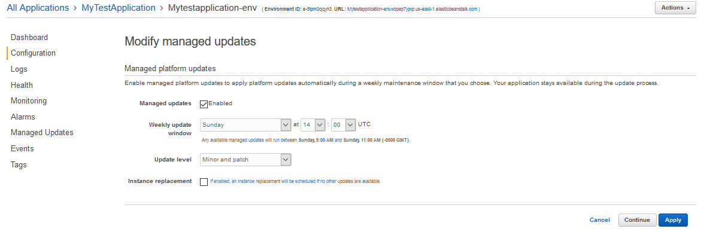{#fig:aws-beanstalk-config-updates}

#### Notifications

Using this section, we can specify email address to receive notifications about 
important events.
(see @fig:aws-beanstalk-config-notifications)

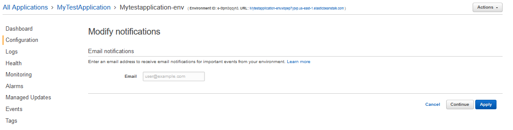{#fig:aws-beanstalk-config-notifications}

#### Network

Using this section, we can update the subnets associated with the load balancer and
EC2 instances

Note : VPC on the application can be mapped only at the time of creation of the 
beanstalk application and cannot be modified later.
(see @fig:aws-beanstalk-config-network)

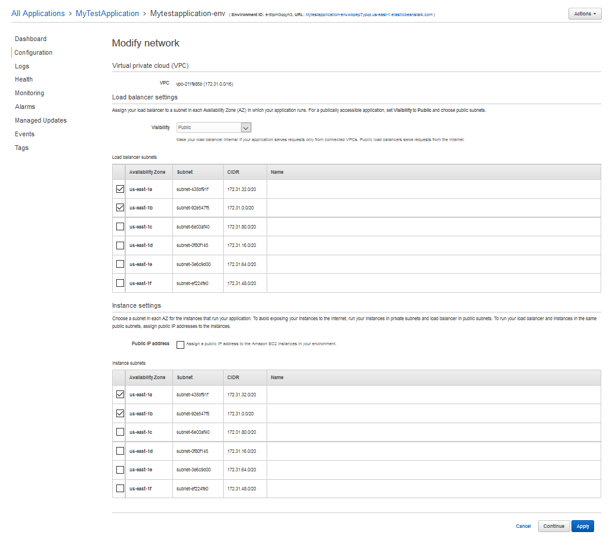{#fig:aws-beanstalk-config-network}

#### Database

This section allows to create and manage an RDS database as part of the beanstalk
configuration.
(see @fig:aws-beanstalk-config-database)

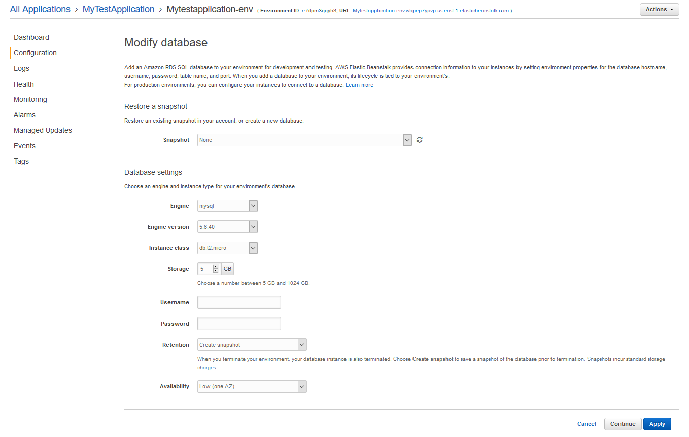
{#fig:aws-beanstalk-config-database}

## References

https://aws.amazon.com/elasticbeanstalk/
