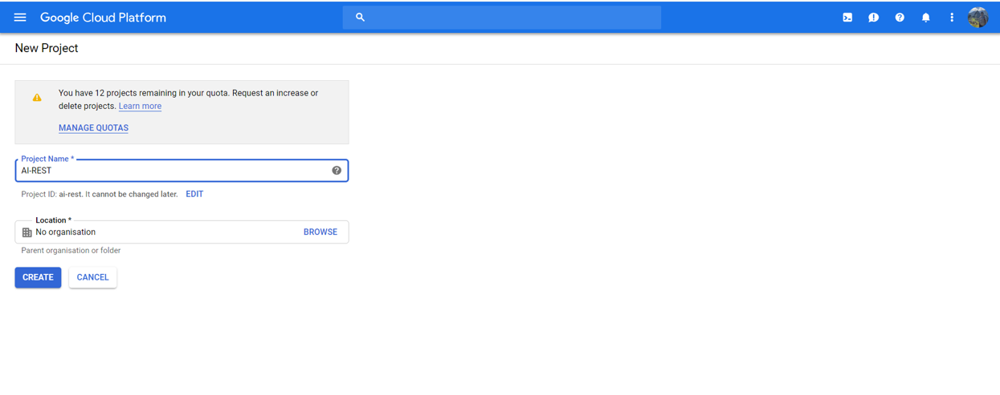
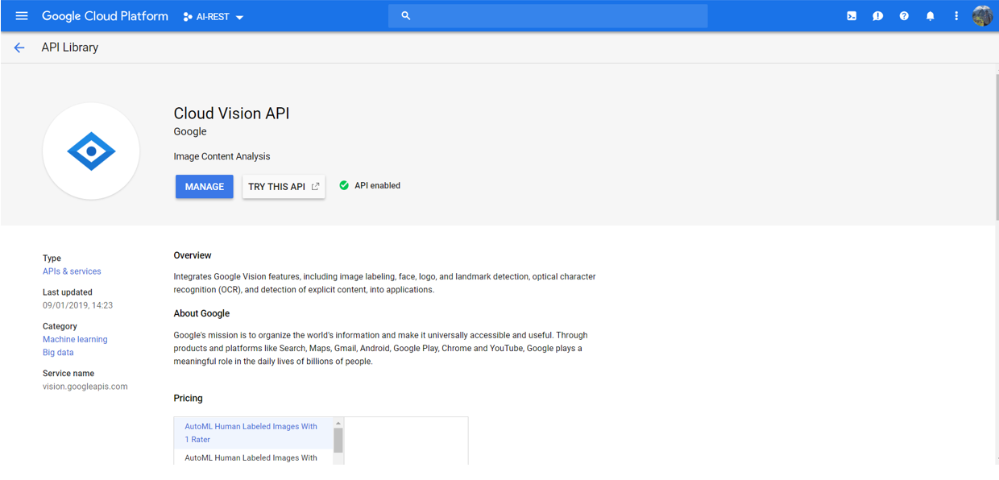

# Artificial Intelligence Service with REST

## AI and ML offerings by Cloud service providers

All major cloud service providers offer a suite of AI and ML products 
and services. A few of the notable services include, but are not limited to:

* [Amazon ML](https://aws.amazon.com/machine-learning/)
* [Google Cloud AI](https://cloud.google.com/products/ai/)
* [IBM Watson](https://dataplatform.cloud.ibm.com/docs/content/wsj/analyze-data/wml-ai.html)
* [Microsoft Azure ML Studio](https://studio.azureml.net/)

Some of the cloud service providers have exposed a few REST based APIs to the 
users and one such API is Google Cloud Vision API which we will discuss in the 
next section and illustrate the usage with an example.


## Image Analysis using Google Cloud Vision API

Googl Cloud Vision API offers a powerful image analysis API and it enables developers
to understand the content of an image by encapsulating powerful machine learning models 
in an easy-to-use REST API. The API classifies the images and can detect labels, logos,
faces, landmarks, text within the images. The API uses JSON for both requests and responses.

In this section, we showcase how to use Google Cloud Vision API for label detection 
using a REST service. 

Following are the pre-requisites before we can start using the API:

* Sign in to your google account and create a Google Cloud Platform Project 
as the following figure shows: @fig:GCP-Project. (make sure billing is enabled)

{#fig:gcp-project}

* Enable Cloud Vision API as the following figure shows: @fig:GCV-API.

{#fig:gcp-api}

* In the GCP console, create service account key as the following figure 
shows:  @fig:GCV-KEY. Save the JSON file that contains your key.

{#fig:gcp-key}

* Set the envionment variable *GOOGLE_APPLICATION_CREDENTIALS* to the 
path of the JSON key file downloaded.

* Install the client library as follows:

```python
pip install --upgrade google-cloud-vision

```


Now, we create a python module `gcv.py` for detecting labels in an image
importing `google.cloud.vision` library.
Image will be read from a local library and the name of the image will be 
passed as a parameter. The environment variable *GOOGLE_APPLICATION_CREDENTIALS*
can also be set in the program as shown in the following code:


```python
import io
import os
from flask import jsonify
# Imports the Google Cloud client library
from google.cloud import vision
from google.cloud.vision import types


def get_labels(image_name):
    current_path = os.getcwd()
    relative_path = current_path + '<name of key file>.json'
    os.environ["GOOGLE_APPLICATION_CREDENTIALS"] = relative_path

    # Instantiates a client
    client = vision.ImageAnnotatorClient()

    # The name of the image file to annotate
    file_name = os.path.join(current_path, image_name)

    # Loads the image into memory
    with io.open(file_name, 'rb') as image_file:
        content = image_file.read()

    image = types.Image(content=content)

    # Performs label detection on the image file
    response = client.label_detection(image=image)
    labels = response.label_annotations

    label_dict = {}
    label_list = []
    for label in labels:
        label_list.append(label.description)
    label_dict['Labels'] = label_list
    return jsonify(label_dict)
    
```

Next, we create an OpenAPI specification which invokes the above module 
and takes the input image name as an inline parameter. 
The OpenAPI yaml file `gcv.yaml` can be created as follows:

```python
swagger: "2.0"
info: 
  version: "0.0.1"
  title: "cpuinfo"
  description: "Image analyis service using swagger-2.0 specification and codegen"
  termsOfService: "http://swagger.io/terms/"
  contact: 
    name: "Google Cloud Vision REST Service"
  license: 
    name: "Apache"
host: "localhost:8080"
basePath: "/airest"
schemes: 
  - "http"
consumes: 
  - "image/jpeg"
produces: 
  - "application/json"
paths: 
  /gcv/{image_name}:
    get:
      tags:
        - GCV
      operationId: gcv.get_labels
      description: "Returns labels detected in the image"
      parameters:
        - in: path
          name: image_name 
          description: "Provide the image name in path"
          required: true
          type: string
      produces: 
        - "application/json"
      responses: 
        "200":
          description: "label detection"
          schema: 
            $ref: "#/definitions/GCV"
definitions:
  GCV:
    type: "object"
    required: 
      - "label"
    properties: 
      label:
        type: "string"

```


Finally, we create a module (`server.py`) to use connexion service to read the 
above created OpenAPI specification (`gcv.yaml`) and dynamically call the methods 
to be implemented on the server side.


```python
"""
Main module of the server file
"""
from flask import jsonify
import connexion

# Create the application instance
app = connexion.App(__name__, specification_dir="./")

# Read the yaml file to configure the endpoints
app.add_api("gcv.yaml")

# create a URL route in our application for "/"
@app.route("/")
def home():
    msg = {"msg": "AI service with REST"}
    return jsonify(msg)


if __name__ == "__main__":
    app.run(port=8080, debug=True)
    
```

To implement the REST service, run the following on the terminal:

```python
python server.py
```

Once the connection is established, run the following CURL command 
on the terminal

```python
curl http://localhost:8080/airest/gcv/mp1.jpg
```

Input image: 

{#fig:gcp-image}


Output response from the REST API:

```python
{
  "Labels": [
    "Mountainous landforms", 
    "Mountain", 
    "Landmark", 
    "Highland", 
    "Hill station", 
    "Historic site", 
    "Mountain range", 
    "Wonders of the world", 
    "Ruins", 
    "Ancient history"
  ]
}

```


## Naive Bayes Algorithm for Text classification

Naive Bayes is a simple yet powerful classification machine learning algorithm.
In this section we demonstrate the implementation of Naive Bayes algorithm 
on text documents in a RESTful service to classify a review as positive or negative.

Example setup: In this example we will consider a text document containing 
reviews of a restaurant. Data is split into two datasets - 
training dataset and test datset. The datasets can be downloaded from an Azure public
blob storage container, the links to which are mentioned in the following details: 

* Training data: We will utilize a pre-processed training dataset with labels attached 
to each review as *positive* or *negative*. Training data can be downloaded from [here](https://azuremallikresourcediag.blob.core.windows.net/mltest/ProcessedTrain.csv).

* Test data: Test dataset has been setup in such a way that first 2989 reviews are positive 
and rows from 2990 to 4321 are negative reviews. Test data needs to pre-processed and 
cleaned before the algorithm is implemented. After the test data is cleaned, 
we will label the test data as per the information given. Finally, we will implement 
Multinomial Naive Bayes classifier algorithm and calculate the accuracy of the 
test prediction. Test data can be downloaded from 
[here](https://azuremallikresourcediag.blob.core.windows.net/mltest/testSet.txt).

To implement machine learning algorithm on text documents we will use 
scikit-learn feature extraction modules. Please refer to related documentation 
in the following scikit-learn link - 
[Feature Extraction](https://scikit-learn.org/stable/modules/feature_extraction.html).

For the current example we will use the following specific modules:

```python
sklearn.feature_extraction.text.CountVectorizer
sklearn.feature_extraction.text.TfidfTransformer
```

Solution will be implemented in following steps:

* **Step-1:** Define a function to pre-process Test dataset.
* **Step-2:** Define a function to implement Naive Bayes algorithm.
* **Step-3:** Define an OpenAPI speficification in a YAML file. 
The specification will have endpoints for the following:
  * Pre-process Test data with parameter.
  * Build Naive Bayes classification model and return test accuracy.
* **Step-4:** Create a simple module to use the connexion service and read 
in the specification from the yaml file.


Pre-requisites:

Following libraries will be used for the current example:

```python
from cloudmesh.common.util import path_expand
import os
import re
from sklearn.naive_bayes import MultinomialNB
from sklearn.feature_extraction.text import CountVectorizer
from sklearn.feature_extraction.text import TfidfTransformer
import numpy as np
from flask import jsonify
import connexion

```


**Step-1:**

Pre-processing test data involves following tasks:

 * Cleaning the text data i.e. remove unwanted characters, converting text 
 to lower case, delete any extra spaces and finally put back the words
 together into sentences.
 * Label the rows as per the information provided i.e. label first 2989 rows 
 as *positive* and rest as *negative*. We will take 2990 as a input parameter
 when we define the endpoint.
 

```python
from cloudmesh.common.util import path_expand
import os
import re

def preProcessTestFile(linenum):
    test_fp = os.path.join(path_expand("~/ai"), 'testSet.txt')
    processed_test = os.path.join(path_expand("~/ai"), 'processedTest.csv')
    test_file = open(test_fp)
    lines = test_file.readlines()
    write_test = open(processed_test, "w")

    # Label 1st 'linenum' lines as positive
    file_clean(lines[:linenum], "Positive", write_test)

    # Label lines after 'linenum' count as negative
    file_clean(lines[linenum:], "Negative", write_test)

    test_file.close()
    write_test.close()

# Internal function for File cleanup
def file_clean(infile, label, writeFile):
    badChar = "[,!.?#@=\n]" 

    for line in infile:
        line = line.lower().replace("\t", " ")  
        line = re.sub(badChar, "", line) 
        arr = line.split(" ")  
        words = " ".join(word for word in arr) 
        toWrite = label+","+words 
        writeFile.write(toWrite)
        writeFile.write("\n") 
 
```


**Step-2:**

After the Test dataset has been cleaned and labelled, we now run the 
Multinomial Naive Bayes algorithm on training data and use the model
to classify test data.

As mentioned earlier, we will use scikit-learn feature selection modules 
CountVectorizer and TfidfTransformer to transform the text into numerical 
feature vectors and downscale weights for words that occur in many data 
points but are less informative (like 'a', 'is', 'the', etc.)


```python
from sklearn.naive_bayes import MultinomialNB
from sklearn.feature_extraction.text import CountVectorizer
from sklearn.feature_extraction.text import TfidfTransformer
import numpy as np

def naivebayes():

    processed_train = os.path.join(path_expand("~/ai"), 'processedTrain.csv')
    processed_test = os.path.join(path_expand("~/ai"), 'processedTest.csv')
    
    # get the data and label for training and test data
    data_train, label_train = getDataAndLabel(processed_train)
    data_test, label_test = getDataAndLabel(processed_test)  

    count_vect = CountVectorizer()  
    X_train_counts = count_vect.fit_transform(data_train) 
    tfidf_transformer = TfidfTransformer()  
    X_train_tfidf = tfidf_transformer.fit_transform(X_train_counts)

    model = MultinomialNB(fit_prior=True)  
    model.fit(X_train_tfidf, label_train)  
    X_new_counts = count_vect.transform(data_test)
    X_new_tfidf = tfidf_transformer.transform(X_new_counts)

    predLabel = model.predict(X_new_tfidf)  

    nb_result = {}
    nb_result["Test Accuracy"] =  round(np.mean(predLabel == label_test) * 100, 2)
    return jsonify(nb_result)
    
# Internal Function to fetch Data and labels
def getDataAndLabel(inp_file):
    file = open(inp_file)  # read the processed file
    label = []
    data = []

    for line in file:
        arr = line.replace("\n", "").split(",")  # split with comma
        label.append(arr[0])  # first element is class label
        data.append(arr[1].replace("\n", ""))  # second element is SMS
    return data, label
    
```

**Step-3:**

Now we define an OpenAPI specification in yaml format to create 2 different 
endpoints for functions defined in step-1 and step-2. 

* Functions defined in step-1 and step-2 need to be 
part of a module named `ai.py` 
* operationId in the specification will correspond to the names of the functions
defined in step-1 and step-2 respectively.
* The input parameter required for function in step-1 will be passed as inline 
parameter (linenum) for the endpoint to pre-process test dataset.


```python
swagger: "2.0"
info: 
  version: "0.0.1"
  title: "naivebayes"
  description: "A service to run a Naive Bayes ML using swagger-2.0 specification and codegen"
  termsOfService: "http://swagger.io/terms/"
  contact: 
    name: "Naive Bayes ML algorithm REST Service"
  license: 
    name: "Apache"
host: "localhost:8080"
basePath: "/airest"
schemes: 
  - "http"
consumes: 
  - "application/json"
produces: 
  - "application/json"
paths: 
  /ai/testdata/{linenum}:
    get:
      tags:
        - AI
      operationId: ai.preProcessTestFile
      description: "runs naive bayes alogirthm"
      parameters:
        - in: path
          name: linenum 
          description: "Provide the line number in path"
          required: true
          type: integer
      produces: 
        - "multipart/form-data"
        - "application/json"
      responses: 
        "200":
          description: "naive bayes ml"
          schema: 
            $ref: "#/definitions/AI"
  /ai/nb:
    post:
      tags:
        - AI
      operationId: ai.naivebayes
      description: "uploads output data to azure"
      consumes: 
        - "multipart/form-data"
      produces: 
        - "application/json"
      responses: 
        "200":
          description: "naive bayes ml"
          schema: 
            $ref: "#/definitions/AI"
definitions:
  AI:
    type: string

```


**Step-3:**

Finally, we create a module (`server.py`) to use connexion service to read the 
above created OpenAPI specification (`ai.yaml`) and dynamically call the methods 
to be implemented on the server side.


```python
"""
Main module of the server file
"""
from flask import jsonify
import connexion

# Create the application instance
app = connexion.App(__name__, specification_dir="./")

# Read the yaml file to configure the endpoints
app.add_api("ai.yaml")

# create a URL route in our application for "/"
@app.route("/")
def home():
    msg = {"msg": "AI service with REST"}
    return jsonify(msg)


if __name__ == "__main__":
    app.run(port=8080, debug=True)
    
```

To implement the REST service, run the following on the terminal:

```python
python server.py
```

Once the connection is established, 
following CURL command can be used for the 1st endpoint which will 
pre-process the test dataset

```python
curl http://localhost:8080/airest/ai/testdata/2990
```

Following CURL command can be used for the 2nd endpoint which will build 
the model to classify the test data and finally return the accuracy

```python
curl http://localhost:8080/airest/ai/nb
```
