# Amazon Aurora DB (hid: sp19-516-128)

---

**:mortar_board: Learning Objectives**

* Learn about AWS Aurora DB
* Features and Benefits
* Pricing
* How to provision Aurora database
* How to connect to Aurora Database

---

Amazon Aurora is an on-cloud relational database offering from AWS
that aims to offer the performance and reliability of traditional
enterprise databases combined with cost-effectiveness of open source
databases.

Aurora comes as an SaaS offering in RDS suite offered by Amazon.

## Amazon Aurora Features and Benefits

The following features and benefits are highlighted by Amazon:

* *Compatible Databases*: Currently, Aurora is compatible with MySQL
  and PostGreSQL Databases.  It provides a wrapper to provision these
  open source databases and manage them for high availability.  This
  allows users to provision these open source databases through Amazon
  and still use existing code, tools and drivers with little change.
* *High Performance*: Aurora offers up to 5 times the throughput of a
  standard MySQL database and 3 times throughput of standard
  PostGreSQL. All this is offered at a price point which 1/10th of a
  commercial database.
* *Scalability*: Aurora allows users to scale up and down the
  databases to smaller or larger sized servers based on the dynamic
  business needs to match the required compute power.  There is also a
  serverless offering where AWS to manages the scaling of compute
  requirements.  Aurora also adds additional storage as needed up to
  64TB per instance as the data grows.
* *High Availability and Durability*: Aurora DB offers multi AZ option
  to make the data replicated across more than one availability zone
  making the resilient to failures.  Data can be backed up to Amazon
  S3 to enable point in time recovery in case of errors.
* *High Performance through Read Replicas*: Aurora DB offers to create
  up to 15 low latency Read Reaplica nodes for a database which allows
  for high performance. One can have writer node to write data into
  the database and use the Read Replica nodes ofr query data.
* *Fully Managed*: Aurora comes as part of RDS suite where Amazon
  manages the database management activities like hardware
  provisioning, set up and configuration, software patching, database
  backups and performance monitoring.
* *Security*: Aurora allows to secure the data at rest and in transit
  by using keys through Key Management Service. Databases can also be
  made part of VPC and secured using private subnets and security
  groups.  Database encryption can be enabled at the time of database
  creation which means that the data, backups, snapshots and replicas
  is also encrypted.
* *Parallel Query for Analytical Queries*: This feature allows users
  to run analytical queries on the database without the need to copy
  the data into another system to not impact the system performance.
  Aurora offloads the query to the CPU nodes in its storage layer
  allowing transactional and analytical loads alongside each other.
* *Performance Monitoring*: Aurora provides Performance Insight as a
  database performance tuning and monitoring feature that can be
  enabled on the database for additional cost.  It allows to visualize
  the loads to identify performance issues.
* *Support for Migration*: Amazon provides tools for migrating
  existing MySQL and PostgreSQL to Aurora.  AWS Database Migration
  Service is provided as a service to migrate from commercial
  databases into Aurora.

## Amazon Aurora Pricing

Amazon Aurora pricing is determined by various factors:

* Type and Size of database instance
* Storage and IO
* Backup Storage
* Data Transfer

For detailed pricing refer AWS Aurora Pricing documentation  
[AWS Aurora Pricing](https://aws.amazon.com/rds/aurora/pricing/).

## How to provision Aurora database

In this section we will discuss the steps to be followed to provision a 
database using AWS Aurora service.

To be able to use AWS Aurora service, the user must have set up an
AWS account as a pre-requisite. 
An AWS account can be create using the link below

[New AWS account creation URL](https://portal.aws.amazon.com/billing/signup?redirect_url=https%3A%2F%2Faws.amazon.com%2Fregistration-confirmation#/start)

### Step 1: Login to the AWS console.

Login to the AWS account using the link below.

[AWS Console URL](https://aws.amazon.com/console/).

Upon successful login, select RDS from the Database section or
alternatively, you can type RDS in the search bar to look up (see
@fig:aws-aurora-console).


{#fig:aws-aurora-console}

### Step 2: Click on Create Database

On the RDS home page, one can either click on the 
`Create Database` button in the Amazon Aurora section directly or 
click on the `Create Database` button in the Create Database section
(see @fig:aws-aurora-rdshome).

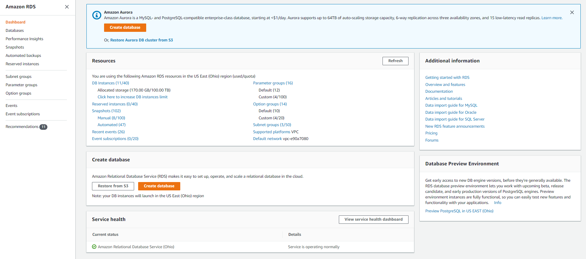{#fig:aws-aurora-rdshome}

### Step 3: Select Amazon Aurora Engine

Create Database section lists all RDS database flavors available.
Choose Amazon Aurora database on the list.  After choosing Amazon
Aurora, AWS will display list of available editions within MySQL and
PostgreSQL engines.  At the time of writing this page,
MySQL 5.6-compatible is comes with Serverless and Parallel Query
capabilities, hence we will go with this option (see
@fig:aws-aurora-MySQL).


{#fig:aws-aurora-MySQL}

### Step 4: Aurora Configuration and Settings

Once we select the engine, next step is to select the Configuration
and Setting (see @fig:aws-aurora-config).


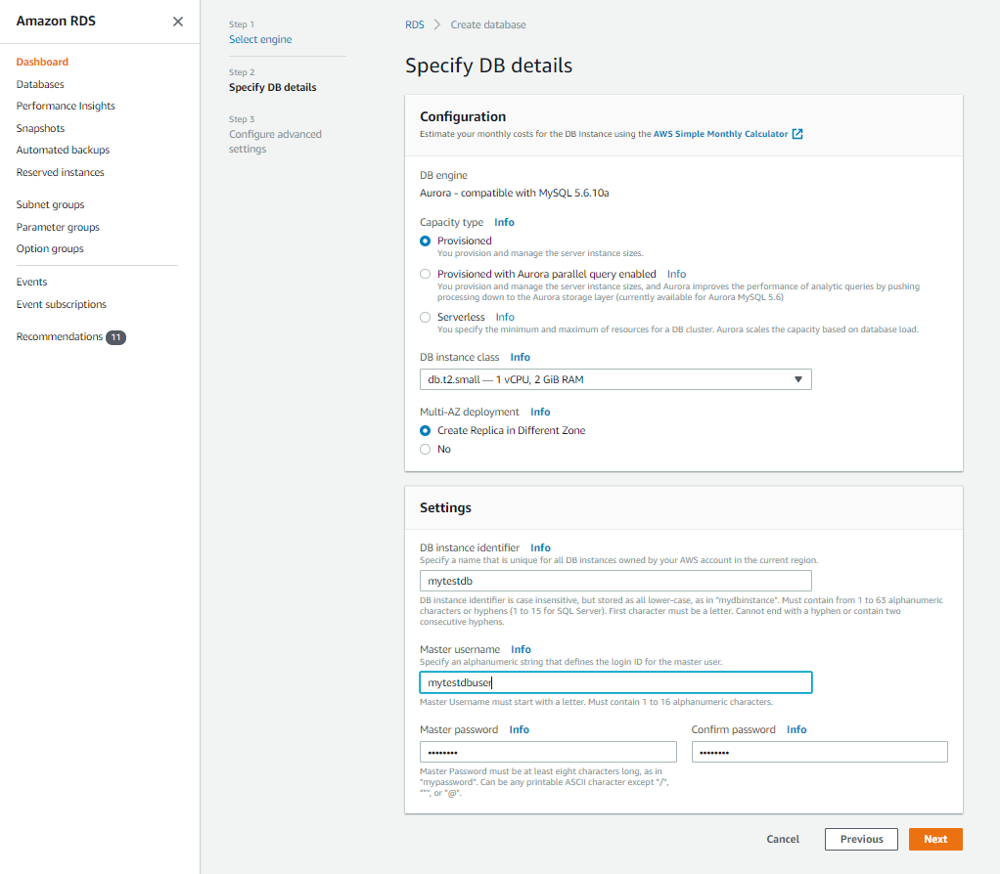{#fig:aws-aurora-config}

#### Configuration

Capacity Type: This attribute allows us to select between Provisioned,
Provisioned (with Parallel Query Feature) and Serverless offerings. We
will go with provisioned option in this example.

DB Instance Class: This attribute allows to select the type of
instance based on the need like small, medium or large. It defines the
number of CPUs and RAM available to the DB server.

Multi AZ - Deployment: Selecting this option means that Aurora will
create a Read Replica in the a different availability zone. This can
be used as a reader node for faster read performance and as a standy
by in case the primary DB server becomes unavailable due to some
issue.

#### Settings

DB Instance Identifier: This will be a unique name that will be used
for the writer DB node.

Master UserName and Password: These attribute define the master user
and password for the DB that can be used to manage the database once
created.

#### Step 5: Configure Advance Settings - Network and Security

This page will help configure some additional settings for the
database. We will cover them in the next few steps (see
@fig:aws-aurora-advconfig-1).

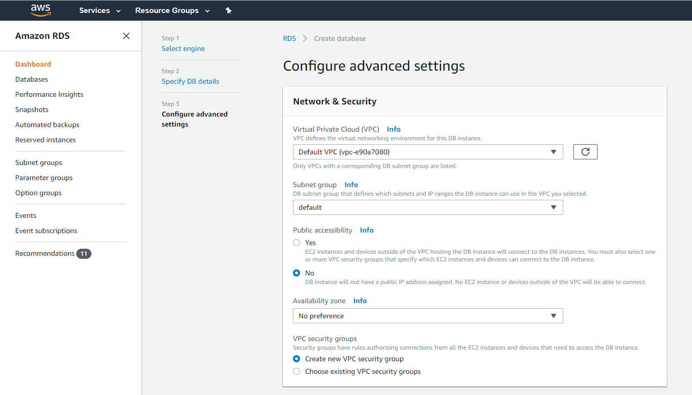{#fig:aws-aurora-advconfig-1}

##### Network and Security

Virtual Private Cloud (VPC): This attribute defines the virtual data
center under which we want to create the database. Typically an
organisation will create its own VPC under which it will deploy its
database and application servers. In this example we will proceed with
the default VPC from AWS.

Subnet Groups: Subnets define the IP ranges to be used the DB.  There
can be broadly 2 types of subnets that can be created - private and
public. Private subnets cannot be accessed from outside the
organization network. Public subnets on the other hand have internet
connectvity and can be accessed from out side the organization
network.

Availaiblity zone: Having the servers across multiple availability
zones with a region help prevent against localized issues and
failures. AWS allows to select a preference for an availabiblity zone
within the region. We dont have a specific preference for this
example.

#### Step 6: Configure Advance Settings - Database Options

In this section we can specify the database cluster, database name,
port and parameter groups (see @fig:aws-aurora-advconfig-2).

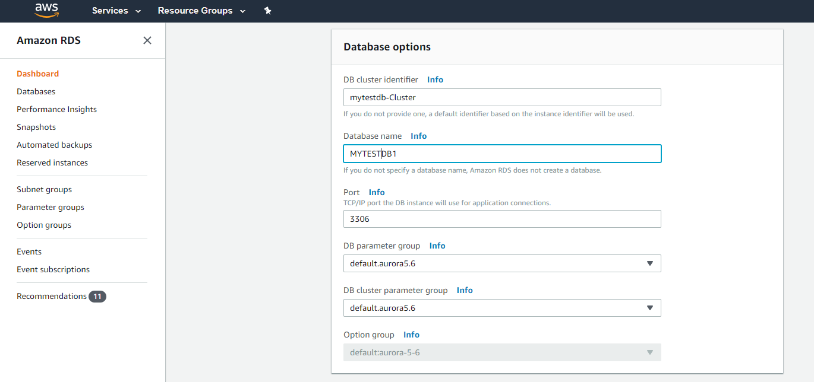{#fig:aws-aurora-advconfig-2}

#### Step 7: Configure Advance Settings - Encryption and Failover

Aurora database has options to configure encryption and failover
policies to keep the data safe and highly available.
These options are explained in the next few steps(see 
@fig:aws-aurora-advconfig-3).

{#fig:aws-aurora-advconfig-3}

##### Encryption

Encryption on the database can be enabled only at the time of DB
creation. Once enabled the database, associated replicas and snapshots
are all encrypted. One can either use the default KMS encryption keys
provided by AWS or use their own encryption keys.

##### Failover 

This defines the the failure over priority order with which a read
replica can be promoted as the primary node incase of a failure on the
current writer.

#### Step 8: Configure Advance Settings - Backtrack and Monitoring

We can also configure settings for Backtrack and 
Monitoring of the database.
These options are explained in the next few steps (see 
@fig:aws-aurora-advconfig-4).

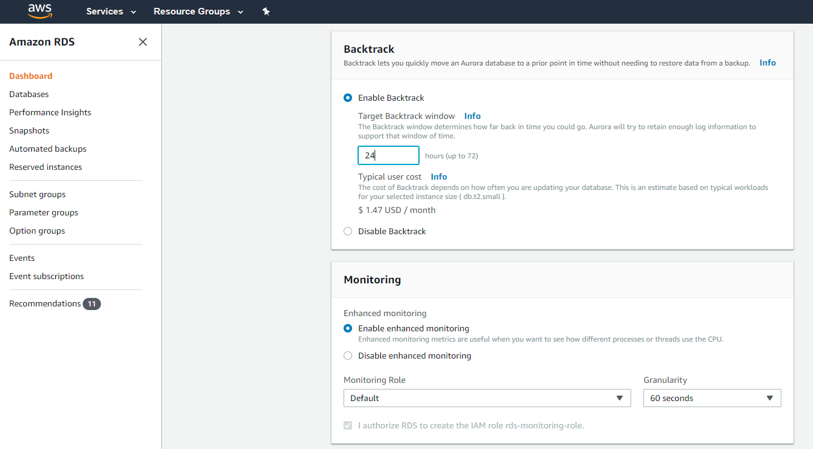{#fig:aws-aurora-advconfig-4}

##### Backtrack

Enabling this feature allows us to define a backtrack window in hours
up to which one can do a point in time recovery in case of any failure.
Number of hours of backtrack define the additional charges that we
levied for the database.

##### Enhanced Monitoring 

Enabling enhanced monitoring allows to define the granularity and time
frequency at which AWS will monitoring the database for different
metrics like performance, active sessions, CPU utilization, storage
used etc for reporting.

#### Step 9: Configure Advance Settings - Log Exports and Maintenance

Options for exporting logs and maintenance of the database can be 
configure as well. 
These options are explained in the next few steps (see 
@fig:aws-aurora-advconfig-5).

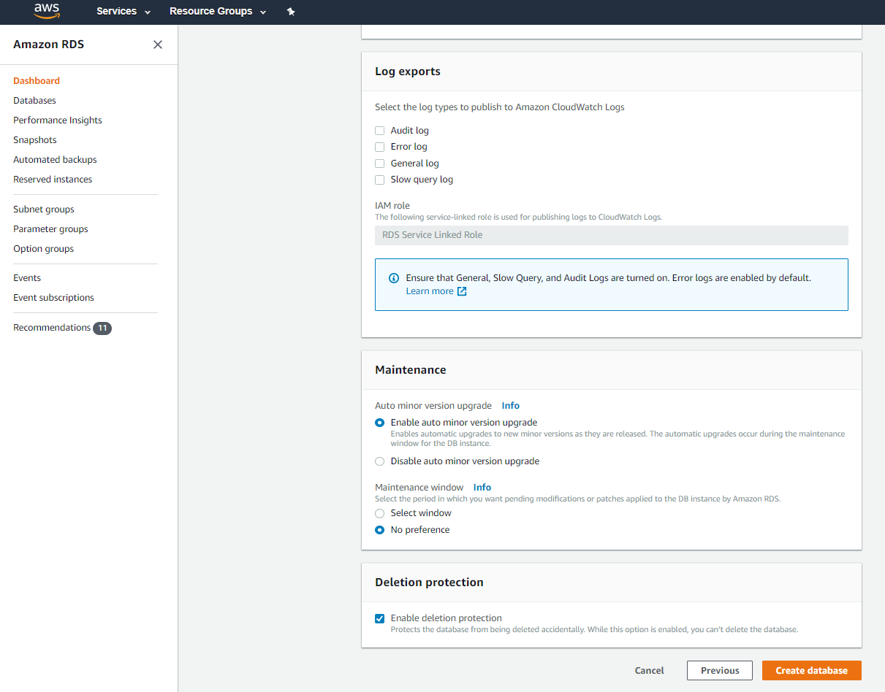{#fig:aws-aurora-advconfig-5}

##### Log Exports

User can define which types of logs (Audit, Error,
General, Slow Query) AWS will export. The selected logs options are
exported to AWS S3 buckets and can retrieved at a later point of time
analysis.

##### Maintenance 

Maintenance section gives options to enable and disable auto minor 
version upgrades to the database. No need to worry updating minor 
software packages. One can also define a preferred window for upgrades.

##### Deletion protection

Selecting this option helps prevent against accidental deletion. This
option needs to be disabled first before the database can be deleted.

#### Step 10: Submit Advance Settings Page

Click on submit once the advance config page is completed.
To view the instance creation status, click on View DB Instance button
(see @fig:aws-aurora-advconfig-submit).

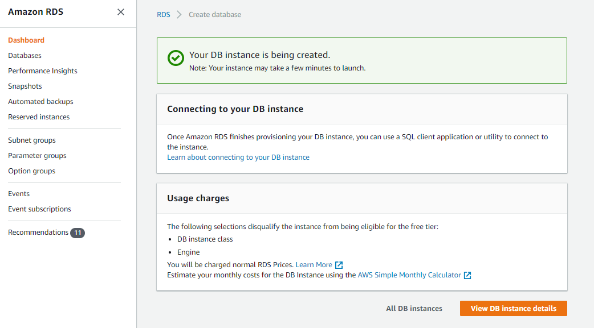{#fig:aws-aurora-advconfig-submit}

### Step 11: Wait for DB creation to complete

Search using the db identifier entered earlier.
The writer and reader db nodes will be created under a single cluster.
It takes around 20-25 minutes for the servers to be available for use
(see @fig:aws-aurora-submit).

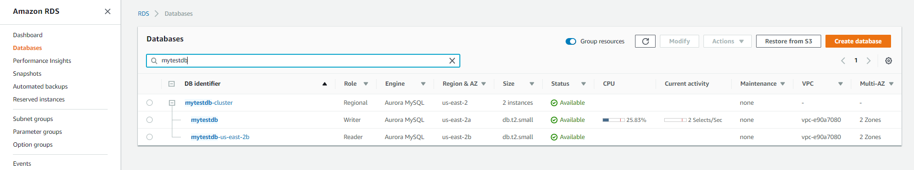{#fig:aws-aurora-submit}

## How to retrieve Aurora database connection details

The provisioned Aurora Database will give a writer and reader node.
Writer node can be used to insert, update, or delete data into the
database.  Reader node(s) replicate the data from the writer with a
very small latency (in microseconds) and can be used to serve as the
standalone node to run parallel queries for analysis without putting
any additional load on the primary writer node.

The endpoint url, port needed to connect to the database can be
retrieved by checking the Connectivity and Security tab (see
@fig:aws-aurora-connection-1).

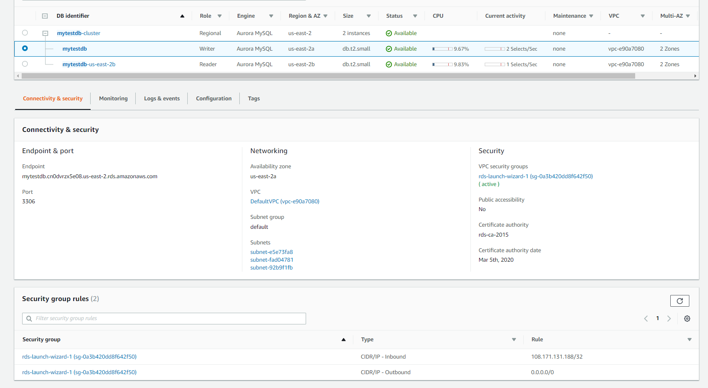{#fig:aws-aurora-connection-1}

## Other details available in Aurora DB Console

###  Monitoring

The Monitoring tab provides different visualization based 
metrics like CPU Utilization, Active DB Connections, Network Throughput etc
that help in the tracking database health and usage.

{#fig:aws-aurora-connection-2}

###  Logs and Events

The Logs and Events tab provides logs and event details for errors, slow 
running queries, long waits which can be used for debugging.

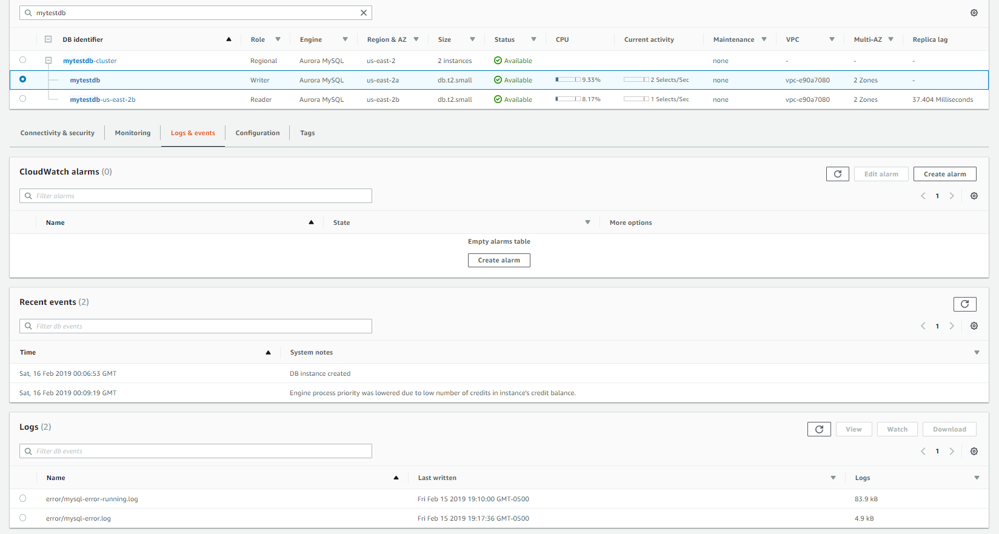{#fig:aws-aurora-logs}

###  Configuration

The Configuration tab lists all different DB attribute values for quick 
reference. 

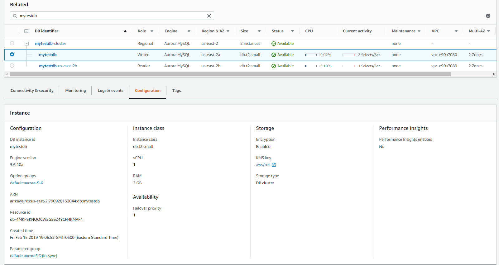{#fig:aws-aurora-config-details}

###  Tag

The Tags tab lists all tags associated with the database.
Tags are often used to apply labels as key and value pairs and allow to
organize the resources together logically for cost and tracking.

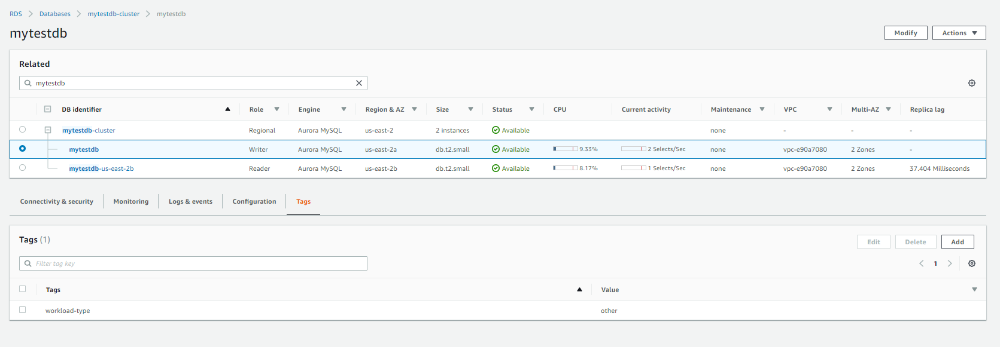{#fig:aws-aurora-tag-details}

## Update Aurora DB

Next we will discuss the different actions that can be taken on the Aurora
database.

{#fig:aws-aurora-updates}

### Modify

A database instance can be modifed by clicking the `Modify` button on the
top right corner. 

This action allows to update the following list of attributes of Aurora DB:

* DB Instance Class
* DB Master Password
* Security Groups and Certificates
* Failover priority
* DB Port
* Backup retention period and backup window
* Backtrack Window
* Monitoring Options
* Log Export Options
* Maintenance Window

### Reboot

This action will kill all active sessions on the database and restart
the servers.  All uncommitted transactions will be lost

### Delete

This action will delete the database. One can optionally take a snapshot of the data 
as a back pn AWS S3. 

### Failover

This action will make the next reader node as per the failover priority as the primary
writer node.

### Take Snapshot

This action allows to take a back up of the database and store to S3 use for restore 
for point in time recovery.

## Example

Once the database is set up and running, next step is to be able to connect and execute
database queries.

Following is an example describing how to connect to AuororaDB using python.

Install MySQL driver using pip

	$ pip install mysql-connector
	
Once the python package is installed, the below python script can be used to connect to
the database, create a table and list the tables in the database.

```python
import mysql.connector

mysqlHostName = '<Database server>'
mysqlUser = '<Database User>'
mysqlPassword = '<Database User Password>'
mysqlDatabase = '<Database Name>'
mysqlPort = <Database Port>

mydb = mysql.connector.connect(
  host=mysqlHostName,
  user=mysqlUser,
  passwd=mysqlPassword,
  database=mysqlDatabase,
  port=mysqlPort
)


mycursor = mydb.cursor()

mycursor.execute("CREATE TABLE my_user_table (name VARCHAR(255), address VARCHAR(255))")

mycursor.execute("SHOW TABLES")

for x in mycursor:
  print(x)
```


## Exercises

AuroraDB.1:

> Follow the steps defined in the sections above to create an AuroraDB instance
> with a read replica in a different availabiblity zone. Once the main writer
> instance and the read replica are available, check if you can connect to both 
> writer and reader nodes using the respective end-points.

AuroraDB.2:

> Once you are able to connect to both writer and reader nodes using the 
> end-points, create a table in the writer node and insert some data into it.
> Now connect to the reader node and check if you can access the same table 
> and read the data in it.

AuroraDB.3:

> Now stop the writer node on the AuroraDB. 
> Wait for sometime and validate that the reader node is promoted as the writer
> node. Once the promotion is complete, connect to the new writer node and confirm 
> if you are able to write data into the database tables.


## References

* <https://aws.amazon.com/rds/aurora/> [@www-aws-auroradb]
