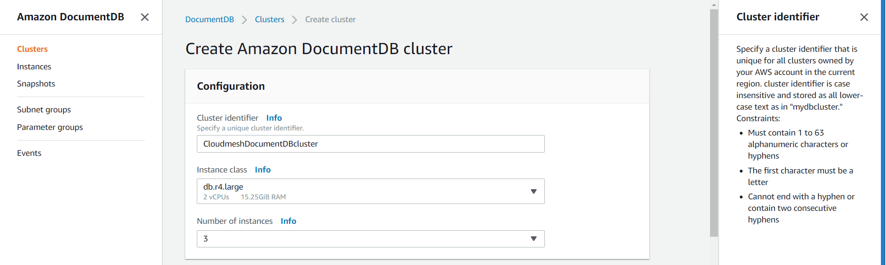

# AWS DocumentDB

---

 **Learning Objectives**

* Learn about AWS Document DB
* Components
* Features and Benefits
* Pricing
* How to provision Document database
* How to connect to Document Database

---

AWS Document DB is a fully managed service with compatibility with
Mongo DB. Mongo DB application code can be run here with same drivers
and tools. A cluster needs to be created for using AWS document DB. It
can contain zero or more databases instances and a attached volume for
managing data for the cluster. The storage is replicated to multiple
availablity zones with each having its own copy.

Components:

1. Instances - There could be upto 16 instances which do the reading
   and writing data from storage volume. Primary and Replica are the
   two types of instances. Only one Primary instances is permitted
   which is used to read and write to the volume. Replica is used only
   for read operation and can be used to placed in multiple availbaility
   zones to increase the cluster availibility. Instances can be bought up
   and terminated as desired. Compute capacity can be scaled independent
   of storage.

2. Cluster Volumes - Volume can store upto 64 TB of data replicated
   across availability zones.

## Amazon DocumentDB Features and Benefits

* *MongoDB-compatible*: Implemented using the Apache 2.0 open source
  MongoDB 3.6 API by emulating the responses that a MongoDB client
  expects from a MongoDB server. This allows you to use your existing
  MongoDB drivers and tools with Amazon DocumentDB.

* *Highly available*: Designed for 99.99% availability with six copies
  of data across three AWS Availability Zones (AZs). Switchs to read
  replica in the event of a failure–typically in less than 30 seconds.
  Data is automatically backed up in S3 for 35 days.

* *Performance at scale*: It uses a distributed, fault-tolerant,
  self-healing storage system that auto-scales up to 64 TB per database
  cluster. Reduces database I/O by writing only database changes to
  the storage layer

* *Highly secure*: Provides multiple levels of security for your database,
  including network isolation using Amazon VPC, encryption at rest using
  keys you create and control through AWS Key Management Service (KMS),
  and encryption-in-transit using Transport Layer Security (TLS).

* *Fully managed*: Automatically and continuously monitors and backs up
   your database to Amazon S3, enabling point-in-time recovery
   (up to the second for the last 35 days). Integrates with Amazon CloudWatch,
   so you can monitor over 20 key operational metrics for your database
   instances via the AWS Management Console.

##  AWS Document database Pricing

* *On-Demand Instance Pricing*: No commitments and pay by hour
* *Database Storage and IOs* : Storage is billed in per GB-month increments and IOs are billed in per million request increments.
* *Backup Storage* : Cost associated with cluster backups and any customer-initiated cluster snapshots.

## How to provision Document database

User needs to have a AWS account to use the Document DB service. First step is to create a AWS account. Once created login to the account.

An AWS account can be created using the link below

[AWS account creation URL](https://portal.aws.amazon.com/billing/signup?redirect_url=https%3A%2F%2Faws.amazon.com%2Fregistration-confirmation#/start)

### Step 1: Login to the AWS console.

Login to the AWS account using the link below.

[AWS Console URL](https://aws.amazon.com/console/).

Upon successful login, select Document DB from the Database section or
alternatively, you can type DocumentDB in the search bar to look up.

{#fig:aws-DocumentDB-console}

### Step 2: Click on Create Amazon DocumentDB cluster button.

{#fig:aws-DocumentDB-home}

### Step 3: Create the required configuration.

1. Specify a unique cluster identifier
2. Specify the compute and memory capacity of the instance.
3. Select the number of instances to be deployed in your cluster.

{#fig:aws-create cluster page}

Enter Authentication information if required.

{#fig:aws-create cluster authentication section}

Once done click the create cluster button

### Step 3: Cluster creation process

Once all the required configuration has been entered and create cluster is clicked. Document DB
creates the clusters with the number of instance that was provided as part of cluster configuration.
It takes sometime depending on the number of instances in the cluster.

You will see a Cluster being created message

{#fig:aws-cluster creation}

Once the cluster is created , you can see the status as available.

{#fig:aws-cluster available}

All the cluster instances that got created in the process as per configuration can be seen in the details.

{#fig:aws-cluster Instances}

### Step 4: Cluster summary and connection information from Mongo and Application.

Cluster Information along with the required connection information from Mongo and for
application is available to connect.

{#fig:aws-cluster connection Information}

### Step 5: Cluster Details.

Cluster configuration and status along with backup , maintenance details and security network information can be viewed in cluster details section

{#fig:aws-cluster details}

### Step 6: Cloudwatch Information on the clusters.

Cloudwatch provides differnt type of metrics to keep a tab on the clusters

{#fig:aws-cluster cloudwatch}

## How to connect to Document Database

TLS is enabled on Amazon DocumentDB clusters by default. We can connect to Document DB in both cases where in the TLS is enabled or not.
To connect to Document DB with TLS enabled , following steps needs to be taken programatically in python

```python
import pymongo
import sys

# Create a MongoDB client and open connection to Amazon DocumentDB
client = pymongo.MongoClient('mongodb://<dbusername>:<dbpassword>@mycluster.node.us-east-1.docdb.amazonaws.com:27017/?ssl=true&ssl_ca_certs=rds-combined-ca-bundle.pem&replicaSet=rs0')

# Specify the database to be used
db = client.test

# Specify the collection to be used
col = db.myTestCollection

# Insert a single document
col.insert_one({'hello':'Amazon DocumentDB'})

# Find the document that was previously written
x = col.find_one({'hello':'Amazon DocumentDB'})

# Print the result to the screen
print(x)

# Close the connection
client.close()
```

Similarly to connect to the cluster with TLS disabled, following code can be used.

```python

# Create a MongoDB client and open connection to Amazon DocumentDB
client = pymongo.MongoClient('mongodb://<dbusername>:<dbpassword>@mycluster.node.us-east-1.docdb.amazonaws.com:27017/?replicaSet=rs0')

# Specify the database to be used
db = client.test

# Specify the collection to be used
col = db.myTestCollection

# Insert a single document
col.insert_one({'hello':'Amazon DocumentDB'})

# Find the document that was previously written
x = col.find_one({'hello':'Amazon DocumentDB'})

# Print the result to the screen
print(x)

# Close the connection
client.close()

```
