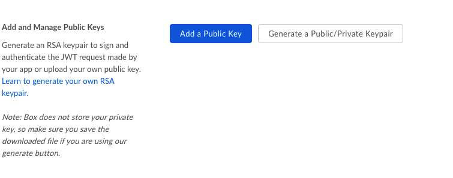

# Box :o: :question:

## About 

Box is cloud storage service that allows users to store, access, collaborate, and share files, similar to DropBox. However, while DropBox started out as a service for storing personal files, Box is geared more towards business applications. Box also has its own platform offering APIs in multiple languages and an SDK for the development of custom applications and integrations, as well as many pre-built apps for integrating Box into various other tools and platforms. It has some limited project management tools in addition to its storage capabilities, including task and workflow management. Box offers free and paid versions for individual accounts and multiple types of business accounts that are charged on a per user basis. Finally, Box has just released Box Skills, a machine learning tool for automatically processing files uploaded to Box. 

## Limitations: 

- While Box offers unlimited storage, it's biggest business account has a 5GB file size limit with a 2GB limit on the smallest business plan and 250MB on the unpaid personal plan. Other services have no individual file size limit. 
- Using Box Sync grants the user full access to the data in the sync, including the ability to delete the data. Restoring data yourself only restores flat-folders and not nested ones, in order to fully restore everything Box must do the restoration. 
- Problems can occur when two users edit the same file at the same time, unlike other collaboration tools
- While there is no official limit on the number of files uploaded at one time, Box itself recommends users not exceed 100,000 files at a time
- Deleting a user's account also deletes all the information they own, which can be problematic for users leaving a company
- While Box has a collections feature, the only collection supported is the 'Favorites' collection, users are not able to make their own

REST:

https://developer.box.com/reference

Installation:

    pip install boxsdk
    
If you will be using JWT authentication for you app, you'll want to install its dependencies:

    pip install "boxsdk[JWT]"

## Creating an app:

Once you have created a Box account, go to the Developer Console and select 'Create New App'. 
You will need to select what type of application you are building and an authentication method for your app and then enter an app name (you can change this later). Once your app has been created, click View App. You will then need to click the profile button in the top right corner of the page, and go to 'Account Settings'. Scroll down to the Authentication section and click 'Require 2-step verification for unrecognized logins', then follow the prompts. 

The following examples have been adapted from https://developer.box.com/reference.

### Authentication with JWT:

In the Configuration panel of the Developer Console, scroll down to the section titled 'Add and Manage Public Keys' and click 'Generate a Public/Private Keypair':

Once you have generated a keypair, a config.json file will automatically download. Save this file in a secure location as you will need it for authentication purposes. Finally, you will need to read in this config file into your app:

    from boxsdk import JWTAuth
    from boxsdk import Client
    
    sdk = JWTAuth.from_settings_file(<path to config.json>)
    client = Client(sdk)

## Box Methods

The Python SDK has several methods for creating objects and endpoints which you can then perform operations on. 

### Get information about a Box object

    # Get information about the logged in user (that's whoever owns the developer token):
    user = client.user().get()
    print(user.name)
    print(user.login)
    print(user.avatar_url)
    
    # Get information about the root folder (referenced by id '0'):
    folder = client.folder('0').get()
    print(folder.name)
    print(folder.item_status)

    # Get specific fields in one call:
    folder = client.folder(<folder id>).get(fields = ['created_at', 'size'])
    print(folder)

### Folders

    # Create a new folder:
    subfolder = client.folder(<folder id>).create_subfolder(<subfolder name>)
    
     # Delete a folder:
     client.folder(<folder id>).delete()
     
     # Copy a folder: 
     folder = client.folder(folder_id=<folder id>)
     destination = client.folder(<destination folder id>)
     copy_of_folder = folder.copy(destination)
     
     # Update a folder:
     folder = client.folder(folder_id=<folder id>).update_info({'name':'Updated name', 'description':'This has now been updated."})
     
     # Get all items in a folder:
     items = client.folder(folder_id=<folder id>).get_items()
     for item in items:
        print(item.id)

### Uploading files
    
    # Upload a file to a Box folder:
    test_file = client.folder(folder_id=<folder id>).upload(<path to file>, <file name>)
    print(test_file.name)
    
    # Upload a stream to a Box folder:
    from io import StringIO
    stream = StringIO()
    stream.write("Test stream")
    stream.seek(0)
    stream_file = client.folder('0').upload_stream(stream, 'Stream File')
    print(stream_file.name)
    print(stream_file.content())
    
    # Upload a new version of a file:
    client.file(<file id>).update_contents(<path to file>)
    
### File upload errors
A file upload will fail if there is already a file in the folder with the same name, if the file is too big, or if there is not enough storage. To avoid errors, Box has an exception API that will check if a file will be accepted before sending it to Box: 
    
    # Enable preflight checks:
    file = 'test.txt'
    try:
        test_file = client.folder('0').upload('test.txt', 'Test File', preflight_check=True)
        print(test_file.name)
        print(test_file.content())
    except BoxAPIException:
        pass
        
Which will return the following:

    "OPTIONS https://api.box.com/2.0/files/content" 409 466
    {'Date': 'Thu, 24 Jan 2019 16:30:46 GMT', 'Content-Type': 'application/json', 'Transfer-Encoding': 'chunked', 'Connection': 'keep-alive', 'Strict-Transport-Security': 'max-age=31536000', 'Cache-Control': 'no-cache, no-store', 'Content-Encoding': 'gzip', 'Vary': 'Accept-Encoding', 'BOX-REQUEST-ID': '0rgjouev2logn8gqcn1fauco84o', 'Age': '0'}
    {'code': '---_use',
     'context_info': {'conflicts': {'etag': '0',
                                    'file_version': {'id': '411411432162',
                                                     'sha1': '02d92c580d4ede6c80a878bdd9f3142d8f757be8',
                                                     'type': 'file_version'},
                                    'id': '389113382562',
                                    'name': 'Test File',
                                    'sequence_id': '0',
                                    'sha1': '02d92c580d4ede6c80a878bdd9f3142d8f757be8',
                                    'type': 'file'}},
     'help_url': 'http://developers.box.com/docs/#errors',
     'message': 'Item with the same name already exists',
     'request_id': 'slj5jkfzi55kba81',
     'status': 409,
     'type': 'error'}
        
 ### Deleting, copying, and downloading files
 
    # Delete a file:
    client.file(file_id=<file id>).delete()
    
    # Copy a file: 
    file = client.file(file_id=<file id>)
    destination = client.folder(folder_id=<folder id>)
    copy_of_file = file.copy(destination)
    
    # Download a file:
    file_to_download = client.file(file_id=<file id>).get()
    output = open(file_to_download.name, 'wb')
    file_to_download.download_to(output)
    
### Searching
The query string used in a search can include object names, description, text content, or other object data. 

    items = client.search().query(<query string>, file_extensions = ['png', 'txt'], fields = ['name', 'description'])
    for item in items:
        print(item.name)
        
### Shared links
Shared links give read-only access to a file through a URL. Specifying the access level of a shared link determines whether users will need to authenticate with Box in order to view the file. 

    # Creating a shared link:
    url = client.file(file_id=<file id>).get_shared_link()
    
    # Retrieving a shared link that has already been created:
    url = client.file(file_id=<file id>).shared_link['url']
    
## Project management 
Box offers some limited project management tools, including groups, collaborations, and tasks. 

### Collaborations
A collaboration object gives a user specified permissions for the defined files and folders. The collaboration object itself returns information about the users, files, and roles of the collaboration. 

    collaboration = client.collaboration(collab_id=<collab id>).get()
        {
            "type": "collaboration",
            "id": "791293",
            "created_by": {
                "type": "user",
                "id": "17738362",
                "name": "sean rose",
                "login": "sean@box.com"
            },
            "created_at": "2012-12-12T10:54:37-08:00",
            "modified_at": "2012-12-12T11:30:43-08:00",
            "expires_at": null,
            "status": "accepted",
            "accessible_by": {
                "type": "user",
                "id": "18203124",
                "name": "sean",
                "login": "sean+test@box.com"
            },
            "role": "editor",
            "acknowledged_at": "2012-12-12T11:30:43-08:00",
            "item": {
                "type": "folder",
                "id": "11446500",
                "sequence_id": "0",
                "etag": "0",
                "name": "Shared Pictures"
            }
        }
    
Roles include editor, viewer, previewer, uploader, previewer uploader, viewer uploader, or co-owner. Updating and deleting a collaboration is similar to other box objects. 

    # Create a new collaboration
    from boxsdk.object.collaboration import CollaborationRole
    user = client.user(user_id=<user id>)
    collab = client.folder(folder_id=<folder id>).collaborate(user, CollaborationRole.VIEWER) 
    
    # Update a collaboration
    from boxsdk.object.collaboration import CollaborationRole
    collaboration = client.collaboration(collab_id=<collaboration id>)
    updated_collaboration = collaboration.update_info(CollaborationRole.EDITOR)
    
    # Delete a collaboration 
    client.collaboration(collab_id=<collaboraiton id>).delete()
    
### Groups
A group object can be used instead of a user in collaborations. The get() call to a group object returns basic information about the group and does not include a member list. To get all members in a group, you must call get_memberships(): 

    group = client.group(group_id=<group id>).get() 
        {
        "type": "group",
        "id": "255224",
        "name": "Everyone",
        "created_at": "2014-09-15T13:15:35-07:00",
        "modified_at": "2014-09-15T13:15:35-07:00"
        }
        
    memberships = client.group(group_id = <group id>).get_memberships()
    for member in memberships:
        print(member.name)
        
    # Create, update, or delete a group
    new_group = client.create_group(name="New Group")
    updated_group = client.group(group_id=<group id>).update_info({'key':'value'})
    client.group(group_id=<group id>).delete()
    
    # Add a member to a group
    user = client.user(user_id=<user id>)
    member = client.group(group_id=<group id>).add_member(user)
           
Once a member has been added to the group, a membership object is created which controls the relationship after creation. 

    # Get, update, and delete membership:
    membership = client.group_membership(<membership id>).get()
    print(membership.user.name)
    updated_membership = client.group_membership(<membership id>).update_info({'key':'value'})
    client.group_membership(<membership id>).delete()
    
You can see all groups a user is a member of with by calling get_group_memberhsips on a user object:

    memberships = client.user(user_id=<user id>).get_group_memberships()
    for m in memberships:
        print(m.group.name)

 You can see all collaboration objects a group has by calling get_collaborations on a group object:
 
    collaborations = client.group(group_id = <group id>).get_collaborations()
    for collab in collaborations:
        print(collab.item.name)

### Tasks
Tasks are attached to file objects and can be assigned to specific users by creating a task assignment. 

    # Create a new task
    task = client.file(file_id=<file id>).create_task(<due date>)
    
Tasks can be updated, deleted with calls to update() and delete(). Calling get() will return general info about the task. Tasks can be assigned to a user by calling assign() which will create a task assignment object.

    user = client.user(user_id=<user id>)
    assignment = client.task(<task id>).assign(user)
        print(assignment.id)
        
You can get all users a task has been assigned to by calling get assignments on a task object:

    assignments = client.task(<task id>).get_assignments()
    for a in assignments:
        print(a.assigned_to.name)

## Webhooks
Webhooks are a convenient way of tracking events, such as file downloads, deletions, comments, and other actions. Webhooks send notifications about these events to a URL of your choosing. Events that can have webhooks include the following among others: 

|Event|
|-----------|
|FILE.UPLOADED|
|FILE.PREVIEWED|
|FILE.DOWNLOADED|
|FILE.TRASHED|
|FILE.DELETED|
|FILE.RESTORED| 
|FILE.COPIED|
|FILE.MOVED|
|FILE.LOCKED| 
|FILE.UNLOCKED|
|FILE.RENAMED| 
|TASK_ASSIGNMENT.CREATED| 
|TASK_ASSIGNMENT.UPDATED|
|FOLDER.CREATED|
|FOLDER.RENAMED|
|FOLDER.DOWNLOADED|
|FOLDER.RESTORED|
|FOLDER.DELETED|
|FOLDER.COPIED|
|FOLDER.MOVED|
|FOLDER.TRASHED|
|WEBHOOK.DELETED|
|COLLABORATION.CREATED|
|COLLABORATION.ACCEPTED|
|COLLABORATION.REJECTED|
|COLLABORAITON.REMOVED| 
|COLLABORATION.UPDATED|
|SHARED_LINK.CREATED|
|SHARED_LINK.DELETED| 
|SHARED_LINK.UPDATED|

Here is an example of a webhook notification: 

    {"id": "123456789",
     "type": "webhook",
     "target": {"id": "987654321",
                "type": "file"},
     "created_by": {"id": "234567890",
                    "type": "user",
                    "name": "John Q. Developer",
                    "login": "johnq"},
     "created_at": "2016-07-16T11:04:26-08:00",
     "address": "https://dev.name/box-notification",
     "triggers": ["FILE.SHARED","COMMENT.UPDATED"]}

Webhooks are created by specifying the object, trigger, and URL.

    folder = client.folder(folder_id=<folder id>)
    triggers = ['FILE.UPLOADED', 'SHARED_LINK.CREATED'[
    webhook = client.create_webhook(folder, triggers, <url>)
    
You can update a webhook using a dictionary object of the attributes to update:

    updates = { triggers: ['FOLDER.TRASHED'], address: 'http://www.example.com'}
    webhook = client.webhook(webhook_id=<webhook id>).update_info(updates)
    
Calls to delete() and get() are the same as for other objects. 

Pybox
-----
Pybox provides a way to work with Box files from the command line. Documentation on how to set up and use pybox can be found at <https://github.com/hzheng/pybox>
