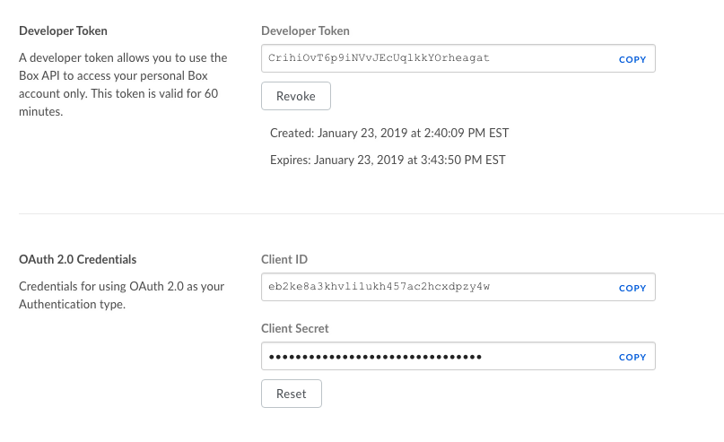

# Box :o: :question:

## About 

Box is cloud service that allows users to store, access, collaborate, and share files. Box also has its own platform offering APIs in multiple languages and an SDK for the development of custom applications and integrations. Box offers free and paid versions for individual accounts and multiple types of business accounts that are charged on a per user basis. 

REST:

https://developer.box.com/reference

Installation:

    pip install boxsdk

## Limitations: 

- While Box offers unlimited storage, it's biggest business account has a 5GB file size limit with a 2GB limit on the smallest business plan and 250MB on the unpaid personal plan. Other services have no individual file size limit. 
- Using Box Sync grants the user full access to the data in the sync, including the ability to delete the data. Restoring data yourself only restores flat-folders and not nested ones, in order to fully restore everything Box must do the restoration. 
- Problems when two users edit the same file at the same time, unlike other collaboration tools
- While there is no official limit on the number of files uploaded at one time, Box itself recommends users not exceed 100,000 files at a time
- Deleting a user's account also deletes all the information they own, which can be problematic for users leaving a company

## Creating an app:

Once you have created a Box account, go to the Developer Console and select 'Create New App'. 
You will need to select what type of application you are building and an authentication method for your app and then enter an app name (you can change this later). Once the app is created you will receive a Developer Token that is valid for 60 minutes. You can implement authentication following the instructions in the Quickstart Guide https://developer.box.com/docs/quickstart-guides or use the Developer Token for temporary purposes. This token can be refreshed in the Configuration panel of the Developer Console. 

### Create an app configuration file:

Find the Developer Token, Client ID, and Client Secret in the Configuration panel on the Developer Console @fig:box-config:

{#fig:box-config}

Make a new file with each of these on a separate line, we have called ours app.cfg. 

### Create an authenticated client:

In your app, read in this configuration file and use it to create an authenticated client: 

    # Import two classes from the boxsdk module - Client and OAuth2
    from boxsdk import Client, OAuth2

    # Define client ID, client secret, and developer token.
    CLIENT_ID = None
    CLIENT_SECRET = None
    ACCESS_TOKEN = None

    # Read app info from text file
    with open('app.cfg', 'r') as app_cfg:
      CLIENT_ID = app_cfg.readline()
      CLIENT_SECRET = app_cfg.readline()
      ACCESS_TOKEN = app_cfg.readline()
      
    #Create OAuth object using Developer Token
    oauth2 = OAuth2(CLIENT_ID, CLIENT_SECRET, access_token=ACCESS_TOKEN)
    
    #Create authenticated client
    client = Client(oauth2)

## Box Methods

The Python SDK has several methods for creating objects and endpoints which you can then perform operations on, including: 
- client.user(user_id)
- client.folder(folder_id)
- client.file(file_id)
- client.search()
- client.events()

### Get information about a Box object:

    # Get information about the logged in user (that's whoever owns the developer token):
    user = client.user().get()
    print(user.name)
    print(user.login)
    print(user.avatar_url)
    
    # Get information about the root folder (referenced by id '0'):
    folder = client.folder('0').get()
    print(folder.name)
    print(folder.item_status)

    # Get specific fields in one call:
    folder = client.folder(<folder id>).get(fields = ['created_at', 'size'])
    print(folder)

### Folders:

    # Create a new folder:
    subfolder = client.folder(<folder id>).create_subfolder(<subfolder name>)
    
     # Delete a folder:
     client.folder(<folder id>).delete()
     
     # Copy a folder: 
     folder = client.folder(folder_id=<folder id>)
     destination = client.folder(<destination folder id>)
     copy_of_folder = folder.copy(destination)
     
     # Update a folder:
     folder = client.folder(folder_id=<folder id>).update_info({'name':'Updated name', 'description':'This has now been updated."})
     
     # Get all items in a folder:
     items = client.folder(folder_id=<folder id>).get_items()
     for entry in items.entries:
        print(entry.name)

### Uploading files:
    
    # Upload a file to a Box folder:
    test_file = client.folder(<folder id>).upload(<path to file>, <file name>)
    print(test_file.name)
    
    # Upload a stream to a Box folder:
    from io import StringIO
    stream = StringIO()
    stream.write("Test stream")
    stream.seek(0)
    stream_file = client.folder('0').upload_stream(stream, 'Stream File')
    print(stream_file.name)
    print(stream_file.content())
    
    # Upload a new version of a file:
    client.file(<file id>).update_contents(<path to file>)
    
### File upload errors
A file upload will fail if there is already a file in the folder with the same name, or if the file is too big or if there is not enough storage. To avoid errors, Box has an exception API that will check if a file will be accepted before sending it to Box: 
    
    # Enable preflight checks:
    file = 'test.txt'
    try:
        test_file = client.folder('0').upload('test.txt', 'Test File', preflight_check=True)
        print(test_file.name)
        print(test_file.content())
    except BoxAPIException:
        pass
        
 ### Deleting, copying, and downloading files:
 
    # Delete a file:
    client.file(<file id>).delete()
    
    # Copy a file: 
    file = client.file(<file id>)
    destination = client.folder(<folder id>)
    copy_of_file = file.copy(destination)
    
    # Download a file:
    file_to_download = client.file(<file id>).get()
    output = open(file_to_download.name, 'wb')
    file_to_download.download_to(output)
    
### Searching:

    # The query string can contain names, descriptions, text contents, or other file or folder data
    items = client.search().query(<query string>, file_extensions = ['png', 'txt'], fields = ['name', 'description'])
    for entry in items.entries:
        print(entry.id)
        

boxpython
---------

* <https://github.com/wesleyfr/boxpython>

```python
    from boxpython import BoxAuthenticateFlow, BoxSession, BoxError

    flow = BoxAuthenticateFlow('\<client_id\>','\<client_secret\>')
    flow.get_authorization_url()
    '<https://www.box.com/api/oauth2/authorize?response_type=code&client_id>=\<client_id\>&state=authenticated'

    access_token, refresh_token =
    flow.get_access_tokens('\<auth_code\>')

    def tokens_changed(refresh_token, access_token): ...
        save_to_file(refresh_token, access_token) ... \>\>\> box =
        BoxSession('\<client_id\>', '\<client_secret\>', refresh_token,
        access_token, tokens_changed)

   box.get_folder_info(0)

   box.download_file(11006194629, '/tmp/test_dl.txt')
```

Pybox
-----

<https://github.com/hzheng/pybox>
